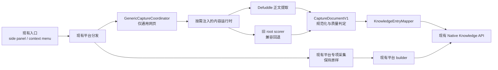

## 执行记录（2026-08-06）

代码、依赖、构建守卫和自动回归已经完成并提交。新链路使用按需
`genericCaptureContent.js`，普通页面质量不足、超时、受限或发生异常时，
由 `background.js` 继续调用原有 MAIN-world `extractCurrentPageLinkPayload`；
公众号也始终保持该旧链路。这样不会在重构中改变已验证的 rich HTML 和图片
本地化行为。

本机的 `pnpm check`、browser-control binding/fault tests 均通过。真实
Chrome → Desktop → Knowledge read-back 仍需在运行中的 Desktop Bridge 上执行：
本次验收时 Bridge descriptor 存在但 Unix socket 拒绝连接，且受控 Chrome 的
安全策略禁止访问 `chrome://extensions` 进行重载。因此该项不是已知功能失败，
但也不能作为已完成的发布验收；发布前必须按第 10.4 节重新加载
`Plugin/dist/extension` 后补跑。

# 浏览器插件通用网页采集增强与安全拆分计划

## 1. 决策摘要

本计划只解决三个关键问题：

1. 提高普通文章、博客、新闻、文档等通用网页的正文保存质量。
2. 建立一个统一、可验证的内部采集契约，同时继续输出当前 Knowledge API 已接受的 payload。
3. 把当前 `background.js` 中重复的通用网页采集逻辑拆成独立模块，降低继续维护和回归的风险。

本计划不修改 MCP、Native Messaging、浏览器控制、站点调研协议和现有平台专项采集逻辑。小红书、抖音、YouTube、知乎、Bilibili、快手、TikTok、Reddit、X、Instagram 的现有保存函数继续作为平台真值，不改调用入口、不改返回结构、不改去重语义。

整个范围必须作为一个完整交付单元实施和验收。允许使用多个 Atomic Commits，但不得发布只有部分链路完成的中间版本。

参考基线为本地 `/Users/Jam/LocalDev/GitHub/obsidian-clipper` 的 `9aa509b8f2801b08d974fb59f026df6f9a12e496`。已复核并引入精确版本 `defuddle 0.19.2`、`dompurify 3.4.12`。为避免在用户每次保存时额外注入约 600 KiB 的 Markdown renderer，当前实现保留内部 Markdown 字段但不生成它；现有 Knowledge endpoint 已以 `content.text` 和安全 HTML 为真值。

## 2. 目标与非目标

### 2.1 目标

- 普通网页优先得到结构清晰的正文、标题、作者、发布时间、描述、站点、封面、图片和安全 HTML。
- 新提取器发生超时、异常或质量不足时，自动回退到当前旧提取器；旧提取器也失败时仍保留“仅保存链接”的既有兜底。
- 页面采集结果先规范化为内部 `CaptureDocumentV1`，再映射回当前 Knowledge ingest payload，不要求数据库迁移。
- 通用采集只在用户明确保存时按需加载，不增加所有网页的常驻解析负担。
- 建立可重复的 fixture、构建和真实 Chrome 验收，证明原有功能没有损坏。

### 2.2 明确不做

- 不实现 Obsidian 式完整模板语言、变量过滤器或模板市场。
- 不实现网页高亮、批注管理或 Reader Mode。
- 不在插件中增加 AI Provider、模型或 API Key 配置。
- 不扩展 Firefox、Safari，也不改变当前 Chrome 权限模型。
- 不重做 side panel、popup、设置页或页面注入按钮。
- 不新增后端数据库实体，不修改现有 Knowledge 条目目录结构。
- 不把平台专项采集改为通用 Defuddle 抽取。
- 不顺便重构浏览器控制、MCP、下载队列或小红书任务队列。

## 3. 当前必须保护的产品契约

| 保护面 | 当前入口或真值 | 实施期间不可改变的内容 | 必须增加的保护证据 |
| --- | --- | --- | --- |
| 右键菜单 | `background.js::ensureContextMenus` | 页面、选区、链接、图片、视频五类入口及菜单文案不变 | 构建产物菜单 ID/contexts 断言 |
| Side panel | `sidepanel.js::getCaptureActionConfig` | 现有页面类型、按钮数量、按钮动作和反馈文案不变 | 配置快照测试 + 最终 JS/CSS/HTML 零可见 diff 检查 |
| 通用网页保存 | `saveCurrentPageLinkFromTab` | 仍返回 `mode=page-link`、`noteId`、`duplicate` | 新旧结果 fixture 对照与 Native Host 接受测试 |
| 选区保存 | `saveSelectedTextFromTab` | 纯文本保存、dedupe key、`kind=text-note` 不变 | 精确 payload 单测 |
| 链接/图片/视频保存 | context menu handlers | 资源 URL、目标库、回退逻辑不变 | handler 级测试和真实右键 smoke |
| 小红书 | `saveXhsNoteFromTab` 及任务队列 | 笔记、评论、博主、下载、JSON 导出、暂停继续均不变 | 现有队列状态测试 + 真实页面验收 |
| 其他平台 | 各 `save*FromTab` | 平台检测、专项字段、媒体、去重与返回 mode 不变 | 每个平台至少一个 payload fixture |
| Knowledge 写入 | `postKnowledge*` 和 Rust `knowledge.rs` | endpoint、kind、source、dedupe、allowUpdate、summarize、transcribe 不变 | Desktop bridge 测试 + 真实 Knowledge read-back |
| 页面观察 | `pageObserver.js` | SPA 路由监听、页面状态、XHS DOM 按钮与无浮层约束不变 | `verify-build.mjs` 现有断言全部保留 |
| 浏览器控制 | `browserControlBackground.js`、`background/*` | 工具列表、schema、lease、CDP、生命周期与错误码不变 | 现有 browser-control tests 全部通过 |
| 更新与发布 | manifest、更新检查、package scripts | extension id、key、版本同步和构建产物结构不变 | `pnpm verify` 和 ZIP 清单检查 |

任何一项保护证据缺失，都不能把实现标记为完成。

## 4. 目标架构



架构边界：

- 平台分发仍由现有 `saveCurrentPageFromTab` 决定，不让通用提取器覆盖专项平台。
- 新模块只接管 `saveCurrentPageLinkFromTab` 内部的通用网页提取与映射。
- `CaptureDocumentV1` 是插件内部传输结构，不是新的数据库实体。
- Native Host、Desktop 和 Knowledge API 第一轮不增加新 endpoint；兼容字段通过当前 `content`、`assets`、`source` 和 `options` 承载。

## 5. 模块拆分方案

### 5.1 新增模块

```text
Plugin/src/
  capture/
    captureDocument.js
    captureQuality.js
    genericCaptureProtocol.js
    knowledgeEntryMapper.js
  background/
    genericCaptureCoordinator.js
  genericCaptureContent.js
```

| 模块 | 单一职责 | 禁止承担的职责 |
| --- | --- | --- |
| `captureDocument.js` | 规范化、限制字段大小、验证 `CaptureDocumentV1` | 不访问 DOM、Chrome API、网络或 Knowledge API |
| `captureQuality.js` | 输出 `complete/partial/link_only/blocked` 与 warnings | 不决定平台路由，不直接丢弃用户内容 |
| `genericCaptureCoordinator.js` | 注入内容运行时、设置 deadline、执行新旧回退、返回最终 document | 不包含网站 selector，不写 Knowledge |
| `knowledgeEntryMapper.js` | 将 document 映射为当前 `buildPageLinkEntry` 等价 payload | 不调用 Native Host，不改变 dedupe 和 options |
| `background.js::extractCurrentPageLinkPayload` | 保持当前 MAIN-world root scorer、公众号 rich HTML 与图片本地化，作为兼容回退和基准 | 不增加新功能，不改变旧阈值 |
| `genericCaptureContent.js` | 在用户触发时读取当前 DOM，运行 Defuddle、清洗 HTML、收集元数据 | 不持久化、不调用 Desktop、不常驻解析 |

`genericCaptureCoordinator.js` 使用 `chrome.scripting.executeScript({ files: ['genericCaptureContent.js'] })` 幂等注入，并通过 typed message 请求 Defuddle。旧 extractor 留在原 MAIN-world 调用点而没有迁入隔离世界：这是为保护公众号的 HTML shell、图片 token 替换和二进制本地化路径所做的最小兼容边界。

### 5.2 现有文件的最小变更

- `Plugin/src/background.js`
  - 保留菜单、消息路由、平台判断和所有平台专项函数。
  - 删除两份重复的通用 `collectLinkArticleData` 实现，改为调用 `genericCaptureCoordinator`。
  - `saveCurrentPageLinkFromTab` 的对外返回结构不变。
  - `buildPageLinkEntry` 在行为等价测试建立后迁入 `knowledgeEntryMapper.js`；原位置只保留兼容导入或调用。
- `Plugin/scripts/build.mjs`
  - 增加 `genericCaptureContent.js` 构建入口。
  - 保持现有其他入口、输出文件名和 IIFE 格式不变。
- `Plugin/scripts/verify-build.mjs`
  - 增加新运行时文件存在、无远程代码、无 ESM 残留和兼容 fallback 字符串断言。
  - 保留现有 extension id、MCP 工具集合、pageObserver 和无浮层断言。
- `Plugin/package.json`、`Plugin/pnpm-lock.yaml`
  - 精确锁定经过审计的 `defuddle` 与 `dompurify` 版本。
  - 不引入模板引擎、React、WXT、Vitest 或新的状态库。
- `Plugin/src/sidepanel.*`、`popup.*`、`settings.*`
  - 本范围不应产生可见变化。

### 5.3 不进行的拆分

不在本次一次性搬迁全部平台函数。平台逻辑复杂且已连接任务队列、下载、评论、媒体和专用 endpoint；在没有完整 characterization tests 前整体搬迁会扩大风险。本次只拆重复且正在被替换的通用网页路径。后续某个平台确有修改需求时，再以该平台为单位做独立 Atomic Commit。

## 6. 内部采集契约

建议的最小结构：

```js
{
  schemaVersion: 1,
  captureMode: 'generic_page',
  source: {
    url,
    canonicalUrl,
    title,
    siteName,
    author,
    publishedAt,
    language,
    capturedAt
  },
  content: {
    text,
    markdown,
    sanitizedHtml,
    excerpt,
    wordCount
  },
  assets: {
    coverUrl,
    imageUrls
  },
  extraction: {
    engine,
    status,
    durationMs,
    confidence,
    warnings,
    contentHash
  }
}
```

兼容要求：

- `knowledgeEntryMapper` 继续产生当前 `kind`、`source`、`content`、`assets`、`options` 五段式 payload。
- `kind` 继续使用 `wechat-article`、`link-article` 或 `webpage`，不新增 kind。
- 继续使用 `page-${hashString(sourceUrl)}` 作为 externalId。
- `allowUpdate=true`、`summarize=false`、`transcribe=false` 保持不变。
- `content.text` 继续作为索引真值；Markdown 和 HTML 只能补充结构，不能替代 text。
- 公众号继续走当前专用 rich HTML 归档，不改模板、不改图片 token 替换。
- 第一轮继续保持通用正文最多 24,000 字符、图片最多 8 张，避免突然扩大 IPC 和 Knowledge 写入体积。

## 7. 通用提取与降级算法

### 7.1 执行顺序

1. 确认页面不属于已有专项保存 action。
2. 按需注入 `genericCaptureContent.js`，不在插件启动和普通浏览时加载 Defuddle。
3. 在隔离世界内从当前页面创建惰性快照；不得修改 live DOM。
4. 使用 Defuddle 提取正文和结构化变量。
5. 使用 DOMPurify 清洗输出 HTML，并把相对 URL 转为绝对 URL。
6. 生成 `CaptureDocumentV1` 并执行大小限制、协议校验和质量判定。
7. 新提取成功且质量不是 `blocked` 时使用新结果。
8. 新提取抛错、超时或为空时执行 `legacyGenericExtractor`。
9. 旧提取仍无有效正文时保留当前页面标题、URL、描述和封面，以 `webpage` 方式仅保存链接。

### 7.2 质量状态

- `complete`：存在来源 URL、标题和主体正文，正文不是挑战页/登录页/导航集合，并有足够的正文结构证据。
- `partial`：有可用正文但字段不全，允许保存并记录 warnings。
- `link_only`：无法可靠提取正文，但 URL 有效；保持当前兜底行为。
- `blocked`：检测到验证码、安全检查或访问拒绝；不得把挑战页正文当文章，自动使用链接兜底。

质量判定不得只依赖一个固定字数。至少组合正文长度、段落/标题结构、正文与页面可见文本比例、Schema 类型、meta 完整度和挑战页信号。所有判定均为本地确定性逻辑，不调用 AI。

### 7.3 安全清洗

- 删除 `script`、`style`、`iframe`、`form`、`input`、`button`、`textarea`、`canvas`、事件属性和 `javascript:` URL。
- 通用 HTML 不保留站点任意 CSS；只保留正文语义标签和安全属性。
- 资源仅接受 `http:`、`https:` 和经过当前规则允许的本地替换 token。
- 不在 Native Messaging payload 中发送 Cookie、Authorization、页面存储或完整网络响应。
- HTML 硬上限为 1 MiB；超过时保留 text/markdown 并记录 `html_truncated`。

## 8. 实施变更计划

以下步骤是一个交付中的有序实现步骤，不是独立发布阶段。

### 步骤 A：冻结基线与 characterization tests

- 为现有 `buildSelectionEntry`、`buildPageLinkEntry` 和各平台 builder 建立精确 JSON fixture。
- 记录所有 `save-*` message type、返回 mode、endpoint 与重要 options。
- 建立普通文章、弱结构文章、导航页、挑战页、公众号文章、SPA 文章六类 HTML fixture。
- 保存当前 `pnpm verify`、`pnpm typecheck`、bridge tests 和 site-research tests 的基线结果。

完成条件：不改生产逻辑，测试能描述当前行为，并能在故意改变 kind、dedupe 或 action 时失败。

### 步骤 B：行为等价地抽离旧通用逻辑

- 将当前通用 Knowledge payload 映射迁入 `knowledgeEntryMapper.js`。
- 保留 self-contained MAIN-world root scorer 作为 byte-compatible legacy fallback；不把公众号的 DOM/网络行为搬入隔离世界。
- `background.js` 改为导入 mapper，旧路径输出必须与基线 fixture 深度相等。

完成条件：所有 fixture 完全等价；构建产物、菜单、side panel 和平台专项文件无可见变化。

### 步骤 C：加入按需通用内容运行时

- 增加 `genericCaptureContent.js` 构建入口和幂等消息监听。
- 集成精确版本的 Defuddle 与 DOMPurify。
- 在内容运行时完成正文抽取、Markdown、HTML 清洗和 meta/Schema 读取。
- 设置 4 秒总 deadline；超时必须返回结构化失败，不得挂住 service worker。

完成条件：没有保存动作时不加载新 bundle；保存动作失败时旧路径正常完成。

### 步骤 D：统一契约、质量判定和回退

- 实现 `captureContract.js` 与 `captureQuality.js`。
- 实现 `genericCaptureCoordinator.js` 的新提取、旧提取、链接兜底顺序。
- 记录本地结构化日志：engine、status、durationMs、fallbackReason、textLength、imageCount；不记录正文。
- 通过 mapper 输出当前 Knowledge payload。

完成条件：每次通用保存都有终态；失败不会阻断保存链接；挑战页不会被保存为完整文章。

### 步骤 E：完整回归与真实链路验收

- 执行本计划第 10 节全部验证。
- 真实 Chrome 中依次验证普通文章、公众号、选区、链接、图片、视频和所有已支持专项平台。
- 对每条保存结果做 Desktop Knowledge read-back，检查正文、来源、媒体、kind 和 dedupe。
- 审阅最终 diff 中所有 HTML、CSS 和可见文案，必须为零未经授权变化。

完成条件：保护矩阵全部通过，且不存在“仅构建成功但未验证真实 Chrome”的遗留项。

## 9. 性能与可靠性预算

- 新解析 bundle 只在通用网页保存时注入，不加入常驻 `pageObserver.js`。
- 单次新提取 deadline：4 秒；达到 deadline 立即进入旧提取器。
- 同一 tab、同一 URL 在 5 秒内重复保存可复用成功快照；SPA route change、tab loading 或 URL 变化必须失效。
- 继续保持正文 24,000 字符和图片 8 张的现有上限。
- HTML 最大 1 MiB；不把图片转为 data URL 塞入通用页面 payload。
- 资源下载继续复用现有 page asset / download runtime，单页并发不在本计划中另起实现。
- 不在 MutationObserver 回调中执行 Defuddle、序列化整页或读取大量布局信息。
- 日志只保存尺寸、耗时、engine 和错误码，避免复制正文造成内存与隐私负担。

性能验收：

- 未触发保存时，新能力不得增加页面持续 CPU 工作、定时器或 MutationObserver。
- 普通 fixture 的提取耗时以本机 p95 小于 800ms 为目标；复杂页面不得超过 4 秒 deadline。
- 构建后 background bundle 不应包含 Defuddle/DOMPurify 代码；依赖只能进入按需内容 bundle。

## 10. 验证清单

### 10.1 静态与构建

- `git diff --check`
- 使用 Node 22，在 `Plugin/` 执行 `pnpm build`
- `pnpm verify`
- `pnpm typecheck`
- 检查构建产物不存在远程脚本、ESM import 和 `redbox-page-overlay-host`
- 检查 manifest 权限、extension key、extension id 和所有旧入口不变

### 10.2 自动测试

- 新的 capture contract、quality、legacy extractor、mapper 单测
- HTML fixture 到 `CaptureDocumentV1` 的 golden tests
- Knowledge payload 与旧输出的深度等价测试
- `pnpm test:desktop-bridge-client`
- `pnpm test:site-research`
- `pnpm test:browser-control-binding`
- `pnpm test:browser-control-faults`

### 10.3 故障注入

- Defuddle 主动抛错：必须回退旧提取。
- Defuddle 超时：必须在 deadline 后回退，不悬挂。
- DOMPurify 返回空 HTML：仍保存 text。
- Native Host 暂时不可用：保持当前错误与重试行为。
- 页面是 challenge/login：保存链接，不保存挑战文本。
- SPA 在提取期间变更 URL：废弃旧快照并重新读取或返回可重试错误。

### 10.4 真实 Chrome 验收矩阵

| 场景 | 关键断言 |
| --- | --- |
| 普通博客/新闻 | 正文无导航污染，标题/作者/日期正确，Knowledge 可读回 |
| 文档/代码文章 | 标题层级、列表、链接、代码块结构保留 |
| 公众号 | 继续使用原 rich HTML 和图片本地化链路 |
| 选区 | 仍为 `text-note`，内容和 dedupe 不变 |
| 链接/图片/视频右键 | 入口、目标库和返回 mode 不变 |
| 小红书笔记/评论/博主 | 保存、任务队列、暂停继续和下载均通过 |
| 抖音/YouTube/知乎 | 继续走专项 extractor，不出现 Defuddle engine |
| Bilibili/快手/TikTok/Reddit/X/Instagram | 专项字段、媒体和 duplicate 行为不变 |
| MCP 浏览器控制 | tools/list、tab.info、page.queryElements 和一次安全交互通过 |
| 未连接 Desktop | side panel 和现有错误反馈不变 |

## 11. 回滚与失败边界

- 新旧提取器在同一版本中保留明确的 fallback seam；回滚新能力不需要恢复被删除的旧算法。
- 新提取器不得写入持久状态后再决定回退，避免一次操作产生两个 Knowledge 条目。
- 只有 mapper 完成最终 payload 后才能调用一次 Knowledge API。
- 若真实 Chrome 的任何专项平台或浏览器控制验收失败，停止发布，修复最低责任边界；不得以“与通用采集无关”为由跳过。
- 如果依赖体积、CSP 或商店审核出现不可接受变化，移除新依赖并保留模块化后的旧 extractor，而不是扩大 manifest 权限。

## 12. Atomic Commits 计划

每个提交只做一件事，最终一起交付：

1. `test(plugin): lock existing capture contracts`
   - 只增加 characterization fixtures 和测试。
2. `refactor(plugin): isolate legacy generic capture`
   - 只做行为等价的模块拆分。
3. `feat(plugin): add on-demand generic content extraction`
   - 只增加依赖、内容运行时和构建入口。
4. `feat(plugin): normalize and qualify generic captures`
   - 只增加内部契约、质量判定和 fallback coordinator。
5. `test(plugin): cover generic capture regressions`
   - 只增加 golden、故障注入和 build guards。
6. `docs(plugin): document generic capture architecture`
   - 只补最接近模块的 README/职责说明。

任何提交都不得混入版本号提升、其他 UI、平台新功能或浏览器控制重构。正式发版版本同步和 release notes 应作为后续独立发布提交处理。

## 13. 完成定义

只有同时满足以下条件才算完成：

- 通用网页默认使用新提取器，失败能够自动回到旧实现和链接兜底。
- 所有现有保存入口、平台专项能力、MCP、Native Host、任务队列和更新机制均通过保护矩阵。
- 没有未经授权的 UI、布局、样式和文案变化。
- 没有数据库迁移、新 Knowledge kind 或新增后端实体。
- 自动测试、构建验证、故障注入和真实 Chrome → Plugin → Desktop → Knowledge read-back 全部完成。
- 最终 diff 已按 Atomic Commits 拆分，且每个提交只包含本任务文件。

## 14. 推荐结论

最优方案不是整体复制 Obsidian Web Clipper，也不是一次性重写当前插件。应当只吸收它最成熟的通用正文提取能力，并把这条新能力包在当前平台路由、Knowledge payload 和旧 extractor 的兼容边界内。

本次必要的代码拆分只覆盖通用网页采集路径。这样既能解决当前最明显的普通网页保存质量问题，又能最大限度保护已经稳定的平台采集、浏览器控制和桌面端知识链路。
