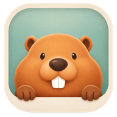
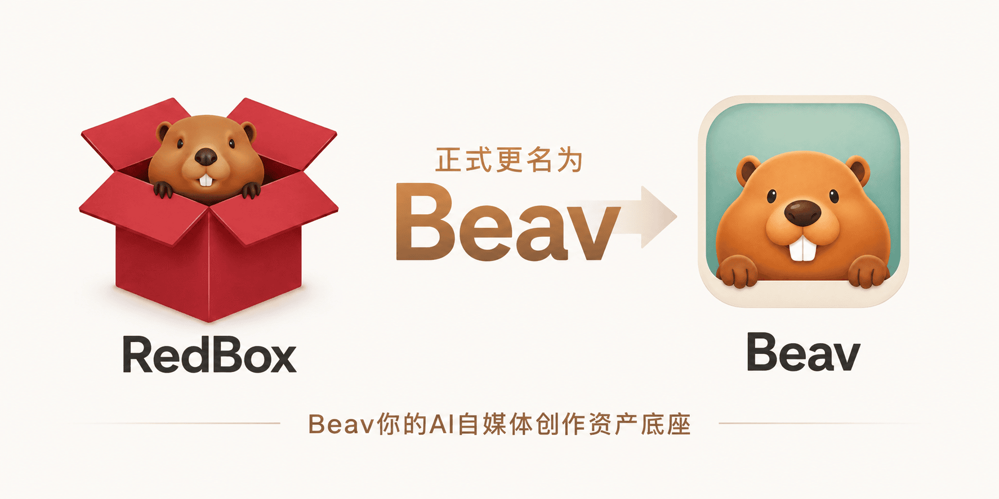
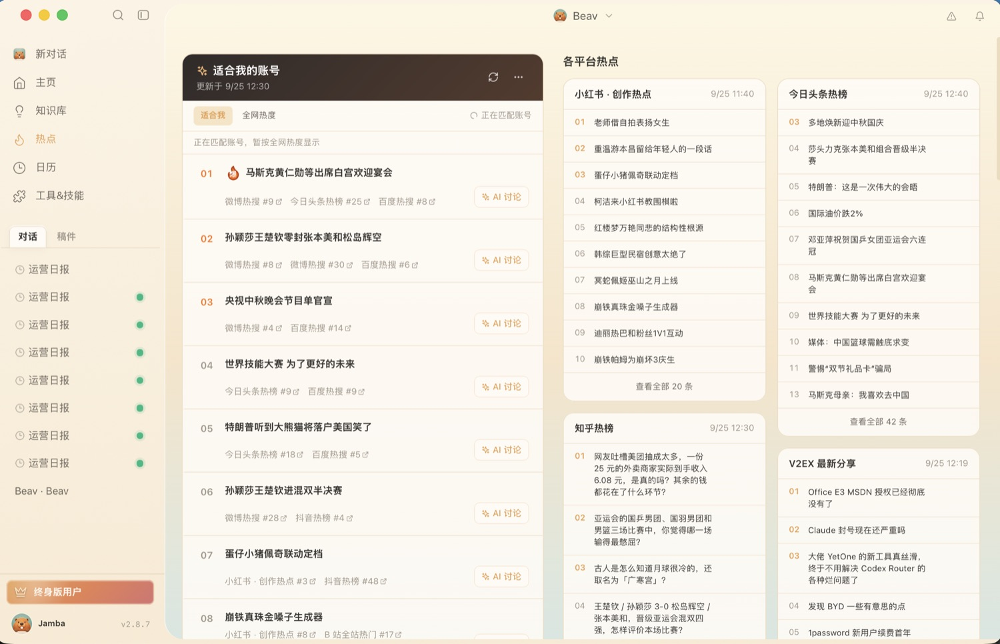

<p align="center">
  
</p>

<h1 align="center">Beav</h1>

<p align="center">
  <strong>AI 自媒体工作台</strong>
</p>

<p align="center">
  <!-- maintenance-days:start -->
  
  <!-- maintenance-days:end -->
</p>

<p align="center">
  <!-- release-stats:start -->
  <a href="https://github.com/Jamailar/Beav/releases"></a>
  <a href="https://github.com/Jamailar/Beav/releases"></a>
  <!-- release-stats:end -->
</p>

<p align="center">从资讯与选题，到图文创作、口播剪辑和持续运营的一站式 AI 工作空间。</p>

<p align="center">本地优先 · 账号长期记忆 · AI 图片与视频剪辑 · macOS / Windows / Linux</p>

<p align="center">
  <a href="https://github.com/Jamailar/Beav/releases/latest"></a>
  <a href="https://github.com/Jamailar/Beav"></a>
  <a href="https://github.com/Jamailar/Beav/releases"></a>
  <a href="https://github.com/Jamailar/Beav/releases/latest"></a>
  <a href="./LICENSE"></a>
  <a href="https://redbox.ziz.hk/download"></a>
</p>

<p align="center">
  <a href="https://redbox.ziz.hk/download"><strong><big>官网高速下载（中国大陆网络推荐）</big></strong></a>
</p>

<p align="center">
  <a href="https://www.bilibili.com/video/BV12LNn6nEem/">视频教程</a>
</p>

<p align="center">
  
</p>

> RedBox 已更名为 **Beav**；原有本地数据和工作空间不受影响。

<p align="center"><strong>加入讨论群</strong></p>

<p align="center">
  
</p>

## 为什么需要这个项目？

- **运营时间被素材吞噬**：内容运营每天都要审阅大量素材、追踪热点、寻找灵感。AI 已能显著加速这些高频工作，但缺少把采集、选题和创作串起来的专用工具。
- **通用 AI 不懂内容资产**：Codex、Workbody 等工具主要面向程序员或通用办公，并非为自媒体工作者设计，难以同时承担长期素材库与持续创作工作台。

Beav 因此而生：把 AI 变成自媒体工作者真正可持续使用的素材库和运营工作台。

## 工作流

| 运营动作 | 使用入口 |
| --- | --- |
| **采集与调研**：保存网页、社媒内容和评论，让 AI 检索公开资料 | Chrome / Edge 插件、对话、知识库 |
| **关注与选题**：阅读运营日报，结合热点、订阅和已有资料寻找方向 | 主页“从选题开始”、日报 |
| **维护账号规划**：整理定位、受众、内容方向和更新节奏 | 主页小工具“账号运营规划” |
| **写稿与改稿**：从目标和参考资料形成图文稿、脚本与口播稿 | 对话、稿件 |
| **制作图片**：填写模板变量、上传参考图，生成并复用视觉素材 | 媒体工坊、图片模板、资产库 |
| **剪辑口播**：分析删减、编辑字幕、补充画中画与动画、导出成片 | 媒体工坊“智能剪口播”、视频编辑器 |
| **安排运营任务**：设置计划，查看执行状态并继续处理结果 | 运营日历、对话 |

## 2.8 创作体验

以下介绍当前 2.8 代码中的主要能力；安装包与公开源码的更新进度可能不同，请以所安装版本的实际入口为准。完整版本变化见[更新日志](./CHANGELOG.md)。

### 媒体工坊与智能口播剪辑

导入口播视频后，Beav 结合逐词转录、语义和声音停顿分析冗余片段，辅助处理重说、口头语和接缝。基础剪辑可应用到时间线，随后检查剪辑记录、直接修改字幕，并补充画中画、花字与镜头动效。可选人声降噪支持开关，方便比较处理前后的声音。

视频工程在独立窗口中编辑，提供多轨时间线、画布变换、关键帧、转场、调色、蒙版和音频调整。右侧 AI 助手可结合当前工程继续修改，操作进入撤销历史。导出时可选择目标目录，查看渲染进度和失败原因，也可单独导出 SRT / WebVTT 字幕。

画中画占位表示待补素材；动画方案需要确认制作，不能把方案当作已经完成的画面。查看时间线、播放效果与实际导出文件后，再使用成片。

### 内置动画与独立特效轨道

使用重点大字、人物介绍、一问一答、数字强调、章节标题等口播叠加预设，填写短文案、主题色和时长后加入时间线；也可添加箭头、圈画等图形装饰与推近、呼吸等镜头动效。内置预设可离线使用。

画面特效拥有独立轨道，可以拖动位置、调整生效范围，并指定作用片段。AI 动画助手可按讲述内容安排辅助画面，后续仍可在编辑器中调整。

### 图片创作与可复用模板

在图片创作工作区管理参考图、画幅、生成进度和结果。模板支持可编辑文字变量与指定参考图；也可以上传图片，让 AI 拆解并保存为自己的模板，再用于不同主题的创作。创建模板和提交图片生成是两个独立操作，在线生成取决于账号权限与模型配置。

### 运营日报与账号长期规划

主页日报结合当前账号方向整理新闻、热点和可借鉴内容，附带来源链接，支持按周翻阅、未读标记和来源预览。可以从日报加入选题、继续创作，或直接讨论本期内容。关注清单可手动编辑，后续生成会结合运营规划、已保存的长期兴趣和反馈调整。

“账号运营规划”小工具用于阅读与编辑定位、受众、栏目方向和更新节奏，保留未保存草稿，并在 AI 同时更新时提供对照合并。长期偏好按通用、平台与账号范围使用，让后续任务能延续适用的创作要求。

### 热点

热点页面把适合当前账号的内容与各平台热榜放在一起查看。账号热点会展示匹配账号方向的内容，并标出来源平台和榜单位置；平台热榜按来源分栏呈现，方便横向浏览小红书、知乎、V2EX 等平台的热门话题。遇到值得跟进的内容，可以直接发起 AI 讨论，将热点继续转成选题或创作思路。

<p align="center">
  
</p>

### 随手可用的小工具

- **字幕提取器**：提取字幕，在工具中查看结果并继续处理。
- **图片去 AI 元数据**：查看并清理 PNG、JPEG、WebP 的可移除文件元数据，保留原图并输出独立副本；不处理画面中的 Logo 或像素水印。
- **图片转 Live 图**：选择图片与轻微推拉、平移动效，生成配对照片和视频。当前源码支持 macOS 与 Windows，Linux 暂不支持；Windows 实机与手机导入仍待验收，传输时需同时保留配对文件。
- **账号运营规划**：在当前账号空间中持续维护同一份规划。

小工具从主页打开，按需授权；图片工具支持从素材库选择或从电脑导入。

### 边聊边用的工作区

聊天右侧可用标签页打开浏览器、知识库、资产和文件详情，并调整侧栏宽度。把知识或素材拖入输入框即可作为引用或附件继续讨论。页面返回时优先显示当前空间已有内容，再后台刷新；长任务也改进了上下文衔接、工具结果保存和停止处理。

## 自动社媒调研

围绕你的账号定位、选题目标和已有素材，Beav 会自主检索多个社交平台的公开内容，先筛选候选素材，再深读高价值内容。调研结果可直接沉淀到知识库，成为后续选题、写稿和创作时可检索、可复用的依据。


## 跨平台博主订阅

订阅受支持平台的博主或创作者主页，Beav 可每日自动刷新最新内容，并保存到知识库；可用平台与抓取结果取决于当前数据来源和配置。你可以像追踪一个持续更新的素材源一样，随时检索、筛选和复用这些内容，不必反复手动打开各个平台查看更新。


## 精选自媒体技能市场

在精选自媒体技能市场中，按调研与选题、文案风格、脚本优化、图片制作、视频制作等方向搜索和筛选技能；找到合适的能力后一键安装，直接用于你的内容创作工作流。每个技能都清楚标注用途与分类，让 AI 更贴近具体的运营任务。


## 适合怎样的创作任务

- **持续运营一个账号**：把定位、参考内容、日报与稿件放在同一空间，持续积累可复用的资料和偏好。
- **制作一条口播视频**：从原片分析、删减和字幕出发，补充画面与动画，再检查和导出成片。
- **批量复用视觉风格**：将参考图片沉淀为模板，替换文字和素材制作不同主题。
- **减少资料来回搬运**：在对话旁阅读知识和素材，直接引用到当前任务，并保留产物供下次使用。

## 功能矩阵

主要能力按当前产品入口归纳；在线服务、外部平台及部分媒体格式受账号配置和操作系统支持范围影响。

| 采集与知识 | 选题与运营 | 写作与协作 | 图片与小工具 | 视频剪辑 |
| --- | --- | --- | --- | --- |
| 网页、社媒与评论采集 | 首页选题与灵感 | 图文稿、脚本与口播稿 | AI 图片创作 | 智能口播分析与剪辑 |
| 公开社媒调研 | 运营日报与来源预览 | 可编辑稿件 | 文字变量与参考图模板 | 字幕编辑与样式同步 |
| 博主订阅与每日刷新 | 关注清单与反馈 | 账号规划与长期偏好 | 从图片创建模板 | 画中画与口播叠加动画 |
| 本地文件、文件夹、Obsidian | 运营日历与定时任务 | 多标签侧栏与拖入引用 | 图片元数据清理 | 独立特效轨道与关键帧 |
| 检索与来源引用 | 历史日报与执行记录 | 技能市场与子任务协作 | Live Photo（macOS / Windows） | 人声降噪、转场与音频调整 |
| 素材与资产复用 | 从资讯继续创作 | 外部 Agent 接入 | 字幕提取器 | 成片、字幕与便携工程导出 |

## 合作伙伴

### 商务合作

如有品牌合作、行业方案、产品集成或其他商务合作意向，欢迎发送邮件至 [huaqiang1121@gmail.com](mailto:huaqiang1121@gmail.com)。

### 经销代理

如希望成为 Beav 的经销或代理合作伙伴，请填写 [Beav 经销代理合作申请表](https://my.feishu.cn/share/base/form/shrcnYe6rZBbfQNvgeDIEHClWUc)。

## 友情赞助

<p>
  <a href="https://www.ipwo.net/?ref=githubJamailar">
    
  </a>
</p>

<p><small>
IPWO 提供全球住宅IP资源，支持多地区 IP 环境访问，为自动化任务执行、海外服务测试等场景提供灵活的网络支持。<br>
浏览器自动化与智能应用开发场景中，不同地区的网络环境适配是开发测试过程中的常见需求，IPWO全球代理支持免费测试，9折优惠码“0203”<br>
<a href="https://www.ipwo.net/?ref=githubJamailar">访问IPWO入口</a>
</small></p>

## 产品截图

### 浏览器采集


### 知识库


### 评论区洞察


## 快速开始

1. 前往 [下载页](https://redbox.ziz.hk/download) 安装 Beav。
2. 为一个账号或品牌创建一个工作空间。
3. 在 `设置 → AI` 使用官方 AI，或配置自己的 Endpoint、API Key 和模型。
4. 如需网页采集，从 [最新 Release](https://github.com/Jamailar/Beav/releases/latest) 获取 Chrome / Edge 扩展。
5. 从主页选题或日报开始创作；已有视频可进入媒体工坊进行剪辑，图片处理和账号规划从主页小工具打开。

不确定某个功能怎么用时，可在对话中让 Beav 查询内置使用指南，再按当前版本的入口操作。

## 信任与边界

- **本地优先**：素材、稿件和项目以本地工作空间为核心组织。
- **模型可选**：支持官方 AI 和 OpenAI-compatible 模型服务。
- **发布透明**：安装包、扩展、更新资产和签名均通过 GitHub Releases 发布。
- **边界公开**：许可证、[更新日志](./CHANGELOG.md)、[路线图](./ROADMAP.md) 和 [Issues](https://github.com/Jamailar/Beav/issues) 均可查。

## Agent 插件

Beav Creator 插件让 Codex Desktop 或 WorkBuddy 通过 MCP 连接本机 Beav，把创作任务交给 Beav 内部 Agent；用户仍在 Beav UI 中查看、审批和编辑结果。

先安装并启动 Beav（CLI 用户运行 `beav open`），再把对应指令发给宿主 Agent：

**Codex**

```text
/goal Read https://beav.ziz.hk/agent to install the Beav Creator plugin and set up a new task for me.
```

**WorkBuddy**

```text
Read https://beav.ziz.hk/workbuddy to install the Beav Creator plugin and connect it to my local Beav workspace.
```

安装完成后，直接在 Codex 或 WorkBuddy 中描述任务即可；浏览器 UI 只供用户操作，不作为 Agent 控制通道。

## 社区

- [官网与下载](https://beav.me/)
- [GitHub Releases](https://github.com/Jamailar/Beav/releases)
- [问题反馈](https://github.com/Jamailar/Beav/issues)
- [Bilibili 视频教程](https://www.bilibili.com/video/BV12LNn6nEem/)

Beav 由 [JambaHailar](https://x.com/JambaHailar) 独立开发和维护。

## 开源版本说明

Beav 的公开开源版本目前停留在 **2.5.0**，基于 **Electron** 构建。该版本保留了当时产品的主要功能与实现，可用于学习、研究和技术交流；对应源码和历史版本请以本仓库的 Git 历史及 Releases 为准。

面向实际用户持续维护的正式版本已经迁移到 **Tauri + Rust** 技术栈，并在独立的代码基础上继续迭代。它与 2.5.0 的 Electron 开源版本在底层实现和版本进度上并不相同，正式版本也可能包含开源版本没有的功能、性能改进和平台适配。因此，开源版本不是当前正式版的完整或即时镜像；如需使用最新正式版本，请从[官网下载安装](https://beav.me/)。

## 许可证

[MIT License – Non-Commercial Use Only](./LICENSE)。商业使用需事先获得作者书面许可。

## 友情链接

- [Linux.do](https://linux.do/)
