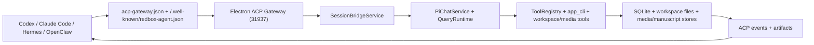

# Electron Open Source 2.5.0 Parity Plan

目标：把公开仓库实际同步出去的 Electron 版 `archive/desktop-electron` 维护到正式版 2.5.0 的产品水平。公开仓库的 `desktop/` 由 `.github/workflows/sync-public-assets.yml` 从本目录同步，因此本目录是开源 Electron 版的真实维护面。

同步口径：`.github/workflows/sync-public-assets.yml` 在任意分支 push 或手动触发时运行，目标仓库固定为 `Jamailar/RedBox` 的 `main` 分支；`archive/desktop-electron/` 会用 `rsync --delete` 同步到公开仓库 `desktop/`，但排除 `dist/`、`dist-electron/`、`release/`、`node_modules/`、`.private-runtime/` 和 `.plugin-runtime/`。

## 1. 目标版本口径

正式版 2.5.0 的核心能力不是单个页面，而是“Agent 友好的本地自媒体创作资源层”：

- ACP Agent Gateway：外部 Agent 可以发现本机 RedBox/Beav、读取 manifest/guide、创建或复用会话、提交 run、轮询事件和产物。
- 创作资产工作区：知识库、媒体库、稿件、封面、视频生成、RedClaw 工作流都能被 Agent 作为上下文或工具使用。
- 本地优先：真实素材、向量索引、运行时事件、会话记录、生成产物都保留在用户本机。
- 兼容命名：开源 Electron 版继续保留 RedBox 包名和路径，ACP discovery 也继续写 `RedBox/acp-gateway.json`。

## 2. 当前 Electron 底座

Electron 版已经具备以下可复用基础：

| 能力 | 当前实现 | 迁移策略 |
| --- | --- | --- |
| 主进程 HTTP | `electron/core/assistantDaemonService.ts` | 复用 31937，本轮新增 ACP 路由适配层 |
| 外部会话桥 | `electron/core/sessionBridgeService.ts` | 复用 create session / send message / snapshot / stream |
| AI runtime | `electron/pi/PiChatService.ts` + `electron/core/queryRuntime.ts` | 继续用现有 pi-agent-core + QueryRuntime，不重写 agent loop |
| 工具系统 | `electron/core/toolRegistry.ts` + `electron/core/tools/*` | 继续走 small structured tools；不新增 God tool |
| 后台任务 | `electron/core/backgroundTaskRegistry.ts` | ACP run 后续应挂接后台任务状态 |
| 素材/稿件/媒体 | `electron/core/*Store.ts` + `electron/main.ts` IPC | 保留现有 store，逐步补齐对 ACP artifact 的结构化投影 |
| 视频处理 | Remotion、mediabunny、ffmpeg-static | 必须用现成库；只自研项目 schema、素材编排、导出 glue code |

## 3. 第一批已落地

本轮先落 ACP 协议入口，避免后续迁移继续停在 UI 或文档层：

- 新增 `electron/core/acpGatewayService.ts`
  - `GET /.well-known/redbox-agent.json`
  - `GET /acp/v1` / `GET /acp/v1/manifest`
  - `GET /acp/v1/guide`
  - `POST /acp/v1/sessions`
  - `GET /acp/v1/sessions/{session_id}`
  - `POST /acp/v1/sessions/{session_id}/messages`
  - `POST /acp/v1/runs`
  - `GET /acp/v1/runs/{run_id}`
  - `GET /acp/v1/runs/{run_id}/events`
  - `POST /acp/v1/runs/{run_id}/cancel`
  - `GET /acp/v1/artifacts/{artifact_id}`
- `SessionBridgeService` 广播时 emit 内部 `session-message` 事件，ACP run 可从 `chat:response-end` / `chat:error` 判断完成或失败。
- `AssistantDaemonService` 在 webhook/relay 分发前优先处理 ACP 路由，并在启动/停止时刷新 discovery 文件。

当前边界：ACP run/artifact 先是内存态，已经能服务单次外部 Agent 会话；后续必须持久化到 SQLite，才能达到正式版可恢复水平。

## 3.1 UI 对齐批次

按“优先对齐 UI 层面的功能”的当前口径，Electron 归档版先补正式版 2.5.0 的 shell 和页面入口，不迁移商业会员、登录门禁、Tauri window API 等不适合开源 Electron 壳的能力：

- 侧边栏对齐正式版主导航：`新对话`、`搜索`、`资产`、`自动化`、`自由创作`、`漫步`。
- 默认首页切到 RedClaw，对齐正式版以 Agent 对话为主入口的产品结构。
- 自动化页从正式版移植到 Electron 壳，复用现有 RedClaw runner task bridge。
- 审批页使用 Electron 现有 `sessionBridge.listPermissions()` / `resolvePermission()` 做轻量实现，并在侧边栏 footer 只在有待审批时显示入口。
- 审批入口补 request 定位：侧边栏审批按钮会带第一个待审批 requestId 打开审批页，通知/导航 payload 也可携带 `requestId` 直接选中目标审批。
- 全局搜索入口接入知识库：侧边栏 `搜索` 和 `Cmd/Ctrl+F` 打开 overlay，提交后落到知识库筛选态。
- 剪贴板采集弹窗对齐正式版同类结构：从 App 内联 JSX 抽成 `ClipboardCapturePrompt`，使用统一 header、链接块、状态提示和确认动作布局；Electron 版当前仍只启用 YouTube 本地采集，不把小红书/抖音服务端采集半成品暴露到 UI。
- 知识库顶部补正式版同类的采集状态条：基于已有 YouTube `processing` 状态展示“采集中/采集队列”，点击可查看当前处理中的 YouTube 任务，不新增队列后端。
- 知识库顶部索引状态补正式版同类低打扰展示：仅在索引、重建、迁移或失败时显示，并展示重建进度、迁移状态和重建原因等扩展字段。
- 知识库顶部补正式版同类排序控件：支持 `最新采集 / 笔记时间 / 标题 A-Z`，`knowledge:list-page` 同步尊重 sort 参数，避免分页加载和本地筛选排序不一致。
- 知识库嵌入排序补正式版同类稳定刷新：参考内容变化并重新计算向量相似度时保留上一轮排序，仅显示加载状态，避免嵌入稿件/RedClaw 场景下列表突变。
- 知识库补正式版同类多选删除：卡片可选择，顶部可选择当前可见项并一次确认后删除；Electron 版新增 `knowledge:delete-batch` 兼容正式版 bridge，并在主进程内复用 note / YouTube / document source 的既有删除路径。
- 知识库文档源补正式版同类详情弹层：点击文档源卡可查看路径、索引状态、样例文件，并可直接在目录中查看或移除文档源。
- 知识库文档源继续补正式版同类视觉索引 UI：卡片标识视觉样例文件，详情兼容可选 `visualBlocks`，展示 Semantic Blocks 计数、语义块摘要、来源路径和 bbox 预览。
- 知识库空状态补正式版同类 onboarding：当库为空时展示插件下载、添加文件、添加文件夹、绑定 Obsidian 和安装步骤；筛选无结果时只显示无匹配提示。
- 知识库作者入口补正式版同类作者视图：基于现有 `note.author` 聚合同作者已采集笔记，卡片和详情里的作者文本可打开作者弹层，不改后端 schema。
- 知识库作者弹层和详情入口继续对齐正式版：如果笔记详情已有作者头像、原始主页、简介和作者 ID，详情顶部作者入口优先显示头像，作者弹层会展示头像 / 主页入口 / 简介，并优先用作者 ID 聚合同作者笔记，缺字段时继续按名称兜底。
- 知识库笔记详情补正式版同类评论区：`knowledge:get-item-detail` 读取既有 `meta.json` 的 `commentsSnapshot` / `stats.comments`，详情页展示已采集评论和评论数，不新增评论采集链路。
- 知识库笔记详情补正式版同类转录复制：视频转录文本标题栏提供复制按钮，并用 `Check` 状态短暂反馈复制成功。
- 知识库详情的聊天入口补正式版同类 RedClaw 草稿流：笔记 / YouTube 视频详情点击聊天按钮时不再打开旧内嵌 modal，而是携带 `knowledgeReferences` 进入 RedClaw 当前会话的 composer，显示 `#知识库` chip 后由用户继续输入并发送；无 RedClaw handler 时回退到普通 Chat 草稿。
- 旧 `KnowledgeChatModal` 已删除；知识库不再维护独立内嵌 Chat 弹层，避免和正式版 RedClaw 草稿流入口并存。
- 知识库带入 RedClaw 的引用元数据继续对齐正式版：列表 catalog 的 `updatedAt` 会进入笔记 / YouTube 引用 payload，缺失时才兜底创建时间，便于 RedClaw 上下文显示更接近真实更新时间。
- Chat 空会话附件体验补正式版同类的动作覆盖层：用户上传图片/视频/文件后先展示“生成封面图 / 爆款拆解 / 总结内容”等快捷工作流；动作复用现有 `sendMessage` 路径，关闭后回到输入框自定义提示。
- Chat 附件动作覆盖层补正式版同类视觉系统：动作卡片按封面、同款、字幕、爆款、剪辑等语义展示差异化图标、色调、说明和 preview header；当前发送路径已升级为 `attachments[]`。
- Chat 拖拽附件体验补正式版同类 drop overlay：拖入文件时显示“拖入素材”覆盖层，松开后通过附件 hook 写入既有 uploads 暂存目录并进入 composer；保留 Electron HTML5 drag/drop，不迁 Tauri drag/drop。
- Chat 粘贴图片体验补正式版同类入口：`ChatComposer` 识别剪贴板图片文件并通过现有 `attachFiles` / `chat.createInlineAttachment` 暂存为附件，同时补正式版附件字段、`inlineDataUrl` / `thumbnailUrl` 来源兼容和文档类型识别；仍不启用正式版 contenteditable token 输入模型。
- Chat 附件上传状态补正式版同类反馈：粘贴、拖拽或选择文件时 `ChatComposer` 展示上传中 / 已添加状态，上传中禁用提交和移除，并暂不展示附件快捷工作流动作层，避免大文件处理没有可见反馈。
- Chat composer 补正式版同类最近视频复用：当前没有新附件时，会从最近一条带视频附件的用户消息恢复视频工作流快捷按钮，点击后复用该视频附件触发爆款分析、字幕提取或剪辑切片；多附件发送路径仍兼容单视频复用。
- RedClaw Chat 输入框补正式版同类紧凑附件状态：`attachmentPreviewMode="compact-status"` 下以小状态条展示已添加附件，减少主工作台输入区占位；普通 Chat 仍保留大预览。
- RedClaw Chat 输入框补正式版同类创作目标 placeholder：RedClaw 使用“描述创作目标，使用 # 调用知识库”，普通 Chat 保留通用问答提示。
- RedClaw Chat 输入框补正式版同类持续输入模式：`keepComposerInputActive` 下任务执行中不再自动压制输入框焦点，允许继续编辑下一条指令；普通 Chat 默认仍保持完成后低打扰收起输入焦点。
- Chat 消息列表补正式版同类 `messageListHeader` 插槽，为 RedClaw 后续图片生成进度、任务状态等内嵌 UI 提供稳定挂载点。
- Chat 消息渲染继续对齐正式版：`MessageItem` 补正式版视频播放器尺寸 / poster 处理、uploaded-file 视频附件识别、多附件卡片渲染、`inlineDataUrl` / `thumbnailUrl` 字段兼容，以及 AI 正文内部协议块和 timeline commentary 去重过滤；`ProcessTimeline` 同步正式版低噪音状态行、品牌化 RedClaw 文案和账号异常跳设置入口；`runtimeEventStream` / `Chat` 透传 `messagePhase=commentary` 并写入 timeline。
- Chat 消息工作流展示继续对齐正式版：`MessageItem` 默认把 workflow 放在消息底部，流式 `thinking` 会作为 fallback thought 合并进 timeline，并把 thought/commentary 用 markdown 气泡渲染；用户消息补正式版同类 hover 复制按钮和附件名 fallback，同时保留 Electron 已有 `#知识库`、`@资产`、`@Skill` chip 展示。
- 知识库页面源码同步正式版：`Knowledge.tsx` 已直接复制正式版页面，使用共享 `features/knowledge/knowledgeModel`、正式版视觉索引状态、分页 / 批量删除 / titlebar 回调 / 可见文字提取复制 / 品牌化下载入口；Electron bridge 已覆盖页面使用的 `knowledge`、`embedding`、`similarity`、`cover.templates`、`files.showInFolder` 和设置读写调用面。
- App shell 接入知识库 titlebar 回调：`KnowledgePage` 传入 `onTitleBarContentChange` 并由 `Layout.renderTitleBarContent` 渲染，保持和正式版页面契约一致；Wander 的 titlebar 回调等后续页面同步时再接入。
- Chat 欢迎区补正式版同类 `welcomeIconAccessory` 插槽，RedClaw 可在主图标下挂载低打扰的成员快捷条。
- RedClaw 欢迎区补正式版同类 AI/成员快捷条：展示 RedClaw 和最多 6 个成员头像，点击成员会在 RedClaw 内切到该成员独立 advisor 会话；加号复用现有成员创建弹层，创建成功后自动切到新成员。
- RedClaw AI/成员 surface 补正式版同类本地记忆：用户上次停留在成员 surface 时会写入 localStorage，下次进入自动恢复；成员列表加载后自动选择第一个可见成员，外部创作任务进入时强制回到 RedClaw surface。
- RedClaw advisor 会话补正式版同类固定成员提示：成员 surface 下 Chat 输入框展示当前成员，发送的用户消息和 AI 占位回复带成员标识，并把 `memberMention` 传入发送 payload，为后续持久化 metadata 对齐留接口。
- RedClaw 消息列表补正式版同类图片生成进度面板：复用 Electron 现有 media-jobs store 和订阅，按当前会话展示未完成图片任务的占位缩略图、完成数和进度。
- RedClaw 消息工作流展示补正式版同类低打扰模式：完成后自动隐藏流程时间线，失败计数在 RedClaw 中使用中性 tone；普通 Chat 默认仍保留原危险失败提示。
- RedClaw 消息链接补正式版同类预览卡片和右侧预览面板：AI 回复中的本地文件、媒体、稿件和网页链接可渲染为卡片；点击后打开右侧预览，面板内提供打开、复制路径和定位文件操作。
- RedClaw 右侧预览面板补正式版同类关闭动画：关闭时先播放 sidebar out 动画再卸载，并兼容 reduced-motion，避免预览面板瞬间消失。
- RedClaw 右侧预览打开时补正式版同类内容宽度切换：左侧 Chat 从窄宽切到 default 宽度，减少预览分栏下消息内容拥挤。
- RedClaw 右侧预览补正式版同类折叠行为：`RedClawFilePreviewPane` 已同步正式版源码，折叠 / 展开入口统一挂到 App titlebar action slot；Chat 折叠后恢复全宽，切换会话或空间时自动清理旧预览状态。
- RedClaw Chat 模型选择补正式版同类状态提升：模型 key 由 RedClaw 持有并传入嵌入 Chat，切换 RedClaw / 成员 surface 不丢选择；新建、切换和删除后重建会话时清空旧会话模型 key。
- Chat 模型选择补正式版同类默认解析：模型列表刷新时保留手动选择，否则落到默认 / 首个模型，并用 ref 兜底发送前的即时配置读取，避免 UI 显示默认模型但 payload 未带模型配置。
- Chat 输入框补正式版同类 `@成员` 基础提及：textarea 版输入 `@` 时展示成员候选，支持键盘选择、插入 `@成员名`、显示目标成员 chip，并复用现有 `memberMention` payload；暂不搬 contenteditable token、知识库 / 素材 / skill 多路 mention。
- Chat 输入框补正式版同类 `#知识库` 基础提及：textarea 版输入 `#` 时展示知识库候选，支持多选、键盘选择、chip 展示、知识引用随用户消息展示并进入 `knowledgeReferences` payload。
- Chat 输入框继续补正式版同类 `@资产 / @Skill` 基础提及：textarea 版 `@` 候选按资产、成员、Skills 分组展示，选中后用 chip 保留上下文；Skill 进入 typed `taskHints.activeSkills` 并由主进程合并到 forced skills，资产进入 `assetReferences` payload。
- Chat 提及上下文补正式版同类历史恢复：`chat_messages.metadata` 持久化 `explicitKnowledgeRefs`、`explicitAssetRefs`、`activeSkills` 和 `replyActor`，刷新 / 重载会话后用户消息继续显示知识库、资产、Skill 和成员 chip；AI 回复会沿用上一条用户消息的成员目标显示。
- Chat 附件动作补正式版 RedClaw 工作流：图片 / 视频 / 文件快捷动作改用正式版 `redclawAttachmentActions`，覆盖电商套图、封面、同款、卖点、爆款分析、字幕提取、剪辑切片和文档卡片等完整提示词；发送后聊天气泡只显示动作短文案。
- 技能库补正式版同类市场入口：左侧工具栏新增 `技能市场`，复用现有 ClawHub `skills:market-search` / `skills:market-install` IPC，支持搜索、刷新、slug / 链接直装、安装状态和安装后自动刷新本地技能列表；不新增后端协议。
- RedClaw 技能面板继续收敛正式版组件：抽屉组件同步正式版源码，移除内部重复的悬浮 `技能` 按钮和底部 `管理技能` 按钮；技能面板仍从 RedClaw 常驻侧栏打开，完整技能市场 / 编辑能力交给主导航 `技能市场` 入口承载。
- 侧栏主导航继续对齐正式版：在 Skills 页和 ClawHub 市场流程已具备后，`Layout` 新增 `技能市场` 主入口并补 `nav.skills` i18n key；不新增插件市场、会员 gate 或远程 connector 能力。
- 侧栏导航文案继续对齐正式版：`Layout` 的 `NAV_ITEMS` 改为 `labelKey` + `useI18n().t()` 渲染，复用 `nav.*` key；保留 Electron 版 `id` 导航和归档版 RedClaw new-chat action。
- 侧栏 footer 文案继续对齐正式版：折叠/展开、设置、通知中心、主题、空间菜单和更新入口复用既有 `layout.*` / `nav.settings` key；归档版独有反馈和审批按钮暂保留本地中文，不新增正式版没有的文案协议。
- Shell 视图补正式版同类 last-view 恢复和设置页 `返回应用` 入口：重启后恢复上次主工作台视图；进入设置页时隐藏全局侧栏，从设置页返回最近一个非设置视图，不改变 Settings 内部表单结构。
- 设置页补正式版同类技能面板：左侧新增 `技能` tab，直接展示本地技能列表，内置技能折叠展示，用户 / 工作区技能可在设置页启停；技能市场和完整编辑器仍复用既有 Skills 页面入口，避免把编辑器重复嵌进 Settings 保存表单。
- 设置页补正式版同类 MCP 独立入口：左侧新增 `MCP` tab，复用既有 MCP Server 管理 UI、运行时 session 状态、导入、测试和保存逻辑；工具管理页收敛为 CLI / 插件 / 诊断，不再混放 MCP 配置。
- 设置页 MCP 操作行为补正式版同类安全性：删除 MCP Server 前会展示危险确认弹窗，启停开关会立即保存并在失败时回滚，避免在 Electron 版现有列表编辑 UI 中误点或忘记保存；完整草稿编辑页后续再迁移。
- 设置页左侧信息架构继续对齐正式版：tab 顺序收敛为 `AI / 常规 / 团队 / 电商平台 / 技能 / MCP / 远程 API / 创作档案 / 工具管理 / 实验功能`，Electron 版独有 `记忆` 保留在创作档案后。
- 设置页补正式版同类团队面板：左侧新增 `团队` tab，直接展示成员列表，支持刷新、展示/隐藏和拖拽排序；新增成员会打开 Electron 既有 Team 页面并触发成员创建流程，深度编辑仍预选成员管理视图，不迁移完整成员编辑 runtime。
- 团队页切到正式版 team workbench：复制 `pages/team-workbench/*` 并用正式版 `pages/Team.tsx` 替换归档版旧 CreativeChat 房间页；Electron 版复用 `teamRuntime` / `collab` bridge，不新增协作后端。
- 旧 `pages/CreativeChat.tsx` 已删除；`creative-chat:*` runtime 事件只作为历史兼容保留，不再维护正式版没有的独立房间页 UI。
- 设置页补正式版同类电商平台入口：左侧新增 `电商平台` tab，复用正式版平台 catalog 和图标资产，支持按地区查看平台并开关目标平台候选范围；配置进入 Electron settings 持久化字段，不新增独立运行时。
- 设置页补记忆管理入口：左侧新增 `记忆` tab，复用归档版已有 `memory:*` IPC 和 `MemorySettingsSection`，可查看当前 / 归档记忆、历史轨迹、搜索、手动添加、删除和触发后台整理，不新增后端协议。
- 设置页常规区文件索引卡对齐正式版低打扰展示：默认只显示文件索引摘要和刷新按钮，点击标题区展开 lanes / scopes 明细；索引状态和 scope 文案同步收敛为正式版短标签，避免常规设置页被索引表格长期占据。
- 团队页新建菜单补 UI 去重：移除重复的“添加成员”文字，并整理侧栏数据加载函数缩进，避免从设置团队入口打开后新建菜单出现重复操作文案。
- 自由创作页新增低打扰 `资产库` 入口，用 modal 方式复用主体库，不改变生成逻辑。
- 自由创作页补正式版同类来源标签兼容：Generation intent / feed source 识别 `generation_studio`、`cover_studio`、`tool`、`redclaw` 等正式版别名，feed 元信息显示使用同类 fallback，避免外部导航或持久化记录出现空来源。
- 资产页从旧 `主体库画廊` 调整为 `资产库`，补 `媒体 / 资产` 双 tab；媒体 tab 复用 Electron 现有 `media:list` 只读展示最近素材。
- 资产库媒体 tab 补正式版同类预览体验：点击媒体卡可查看图片 / 视频 / 音频详情，弹层复用现有 `media:open` 打开源文件，不新增媒体存储能力。
- 资产库媒体 tab 补导入入口：顶部 `导入` 复用现有 `media:import-files`，导入完成后刷新媒体列表。
- 资产库媒体 tab 补正式版同类分页加载：复用 `media:list` 的 `cursor/nextCursor`，媒体网格底部可继续加载更多素材。
- 资产库媒体 tab 补正式版同类字段和缩略图兼容：`media:list` 返回的 `mime_type`、`relative_path`、`preview_url`、`thumbnail_url` 会规范到 renderer 字段；视频卡片优先显示缩略图，预览播放使用真实源文件，避免把缩略图误当 video/audio 源。
- 资产库媒体 tab 补正式版同类右键菜单：媒体卡片支持右键 `文件夹中打开 / 删除`，删除成功后会关闭同一素材预览并在刷新 / 分页加载中屏蔽已删除 ID，避免刚删除的素材回弹。
- 资产库媒体 tab 展示形态对齐正式版：媒体列表从固定信息卡网格收敛为 masonry 缩略图流，卡片只展示素材本身，点击预览、右键操作和键盘 Enter / Space 打开预览保持可用，减少媒体 tab 的说明文字和信息噪音。
- 资产库媒体 tab 搜索补正式版同类范围：媒体搜索覆盖标题、提示词、项目 ID、绑定稿件、路径、模型、尺寸、质量和来源；兼容 `project_id`、`bound_manuscript_path`、`aspect_ratio` 等 snake_case 字段，搜索框文案同步为“标题、项目、稿件、路径”。
- 资产库媒体预览弹层补正式版同类文件操作：可打开源文件、在系统文件夹中定位素材，或直接删除媒体资产。
- 媒体预览弹层补正式版同类尺寸约束：预览容器使用 `min-h-0` / `overflow-hidden`，图片和视频按容器 `max-h-full max-w-full` 缩放，避免大素材在弹层中溢出。
- 媒体库补正式版同类音频素材展示：音频文件在瀑布流、最新生成结果和预览弹层中使用音频封面与播放器；voice/TTS 素材显示声音合成标识，不再误落到图片预览兜底。
- 媒体库音频缺失态补正式版同类图标化卡片：音频素材文件不可用时显示音频封面式缺失状态，不再和图片 / 视频共用普通文字占位。
- 媒体库最新生成结果区同步音频缺失态：生图 / 生视频结果列表里的音频素材也使用同一套音频图标缺失卡，避免生成后和媒体瀑布流展示不一致。
- 媒体库音频识别补正式版同类 webm 兼容：主网格和预览弹层的音频扩展名兜底包含 `.webm`，避免 voice/TTS webm 素材误落到视频或图片不可用状态。
- 媒体库音频封面标签对齐正式版：主瀑布流普通音频显示 `音频`，voice/TTS 素材显示 `声音合成`；最新生成结果里的音频结果也统一使用 `音频`，不再把素材标题塞进封面标签位。
- 媒体库补正式版同类视频缩略图：兼容 `thumbnailUrl` / `thumbnail_url` 并作为 video poster 显示，避免可用缩略图被归档版 UI 忽略。
- 媒体库主网格视频展示补正式版同类缩略图策略：视频素材卡片优先显示缩略图，无缩略图时显示 Clapperboard 占位，避免在瀑布流内直接嵌入多个 video 播放器。
- 媒体库最新生成结果区补正式版同类视频缩略图展示：生图 / 生视频结果中的视频素材优先显示缩略图，无缩略图时显示 Clapperboard 占位，不在网格里直接嵌入多个 video 播放器。
- 媒体库预览源选择继续对齐正式版：图片卡片和预览优先使用 poster/thumbnail 兼容源，视频 / 音频点击预览仍走真实可播放文件源；视频无缩略图时只显示 Clapperboard 占位，不把原视频路径塞给 img。
- 媒体库最新生成结果区补正式版同类字段兼容：生成接口返回的 `mime_type`、`relative_path`、`preview_url`、`thumbnail_url` 会规范到 renderer 使用的 camelCase 字段，避免新结果卡片丢缩略图或路径。
- 媒体库补正式版同类分页加载：`media:list` 兼容 `cursor/nextCursor/total`，当前页面源码与正式版一致，首屏和继续加载均按正式版 `limit=500` 请求；total 仍由顶部 `总资产` 统计承载，筛选条只展示当前结果数，减少重复计数噪音。
- 媒体库页面调用面已核对正式版：`media.*`、`imageGeneration.generate`、`videoGeneration.generate`、`manuscripts.list` 和 `files.showInFolder` 与 Electron bridge 当前一致；`MediaLibrary.tsx` 和 `MediaAssetPreviewOverlay.tsx` 已同步正式版源码，缩略图 / poster / snake_case 字段兼容继续保留在主页面数据规范化和卡片展示层。
- App shell 对媒体库承载继续对齐正式版：`media-library` 页面容器使用正式版 `min-h-full bg-background flex flex-col`，全局页面加载 fallback 改走 `app.loadingPage` i18n key；不迁移正式版登录 gate、analytics 和 Tauri updater 生命周期。
- App shell 的稿件编辑器承载补正式版同类沉浸态处理：打开稿件编辑器时强制使用非沉浸布局，避免上一页面留下的 immersive state 隐藏编辑器所需的全局导航 / 标题栏控制。
- 智囊团页面继续对齐正式版低风险 UI：会话创建写入成员 metadata / active skill hint，历史抽屉展示 ACP 来源标签，聊天区域不再默认折叠，页脚品牌名改走 `APP_BRAND`；创建成员后的角色设定生成改为异步刷新，避免阻塞资料导入成功态。Electron 版保留 `modalOnly`、YouTube 导入和本地视频管理，不迁移正式版成员技能候选 / 发布 / 回滚操作区，因为主进程当前只提供明确 unavailable handler。
- 媒体库内生图质量选项对齐正式版：默认质量从旧 `auto` 收敛为 `medium`，下拉只暴露 `low / medium / high`，旧设置值会稳定兜底到 `medium`。
- 独立 `ImageGen` 页面质量控件对齐正式版：默认值和提交 fallback 均使用 `medium`，下拉收敛为 `low / medium / high`；Electron bridge 的泛型返回类型保留，避免削弱归档版 IPC 类型适配。
- 媒体库右键菜单补正式版同类文件操作：素材卡片右键菜单收敛为“文件夹中打开 / 删除”，复用现有 `file:show-in-folder` 和 `media:delete`，不再暴露旧的行内编辑入口。
- 媒体库删除行为补正式版同类前端状态收敛：删除成功后立即从瀑布流移除素材，关闭同一素材预览，清理草稿 / 绑定 / 高度缓存，并在后续刷新和分页加载中屏蔽已删除 ID，避免刷新竞态把刚删素材带回 UI。
- 资产 tab 补正式版同类的 `网格 / 列表` 视图切换，列表保留主体缩略图、分类、描述、标签和资源统计。
- 资产库 modal 继续对齐正式版 shell 行为：`AppSubjectsModal` 和 `useSubjectsModal` 已同步正式版源码，modal 打开时侧边栏资产入口保持 active，按 Escape 可关闭；关闭时直接按正式版状态卸载，不再保留归档版额外关闭动画协议。
- 资产 tab 补正式版同类的主资产类型导航：`品牌 / 角色 / 物品 / 场景` 作为一级 tab；`商品 / 人物` 不再作为顶层 tab 直出，避免和正式版资产库信息架构冲突。
- 资产编辑弹层补正式版同类主体图片预览：点击已上传图片缩略图打开大图 overlay，支持点击遮罩或关闭按钮退出，关闭编辑弹层时同步清理预览状态。
- 资产编辑弹层补正式版同类类型感知文案：标题、名称/描述/图片字段、保存/删除确认和错误提示会随当前分类显示为 `角色 / 品牌 / 物品 / 场景 / 资产`；描述输入限制到 200 字并显示计数，减少泛化“主体”文案。
- 角色资产编辑补正式版同类快捷字段：当分类为 `角色 / 人物` 时，将 `性别` 和 `年龄` 从通用 attributes 提升为独立表单项，仍复用 attributes 持久化；通用扩展属性列表会隐藏这两个快捷字段，避免重复编辑。
- 资产编辑弹层分类选择补正式版同类收敛：普通资产编辑时不再把 `品牌 / 商品` 暴露为可随意切换的分类；只有当前资产已经属于这些分类时才保留当前选项，避免破坏品牌/商品专属信息架构。
- 资产库残留旧主体文案收敛：分类弹层、列表空态、导入 / 删除 / 加载错误等用户可见文案从“主体 / 主体库”调整为“资产 / 资产库”，编辑弹层继续使用类型感知文案。
- Electron 主进程主体库的内置分类对齐正式版：`品牌 / 角色 / 物品 / 商品 / 场景`。读取旧数据时会把旧 `人物` 规范到 `角色`，并把重复的内置命名分类 subject 引用迁移到稳定内置 ID。
- 角色资产补正式版同类的视频参考：Electron 主进程主体库 now stores `videoPath` in the subject folder, renderer 可上传、预览和删除角色视频，避免只有前端入口但无法保存。
- 角色资产视频参考状态补 UI 展示：资产列表、网格卡片和编辑摘要会在角色分类下显示 `视频参考 / 无视频` 状态，和声音参考一起成为数字人素材可见检查项。
- 角色资产补正式版同名 `generateCharacterCard` 能力：Electron 主进程用现有 `imageGenerationService` 生成 16:9 角色卡，复制回 subject 图片目录并更新主体图片集；bridge / types 暴露 `subjects.generateCharacterCard`，支撑后续直接复制正式版 Subjects 的角色卡按钮。
- 资产网格卡片比例对齐正式版：资产 tab 的网格列数收敛为 `xl=4 / 2xl=5`，缩略图从偏竖版改为 `aspect-video`，让角色视频、品牌和场景资产预览更接近正式版扫描密度。
- 资产库空态对齐正式版：媒体 tab 无结果时使用 Clapperboard 空态，资产 tab 无结果时使用 CalendarClock 空态并显示 `已加载全部`，替换旧虚线说明框。
- 资产库加载态继续对齐正式版：媒体 tab 和资产 tab 分别按自身数据展示 `媒体加载中...` / `资产库加载中...`，避免媒体仍在加载时因为资产分类已有数据而提前进入空态。
- 资产库分类栏补正式版同类排序提示：资产 tab 的分类导航右侧显示 `按时间倒序展示` 状态，和当前按更新时间/创建时间倒序的列表语义保持一致。
- 资产库分类新建入口图标对齐正式版：分类栏的“新建分类”按钮从 FolderPlus 收敛为通用 Plus，和正式版分类 / 新建资产操作的图标语言一致。
- 档案页补正式版同类创作档案状态区：在样本库上方展示 RedClaw 长期创作档案完整度、初始化状态和本地 profile 目录，并提供刷新和跳转设置页用户档案入口；Electron 版复用 `redclawProfile.getBundle()`，不迁移正式版 `accounts:*` 绑定账号后端。
- 档案页继续补正式版 `CreatorProfiles` 同类只读摘要：长期创作档案状态区直接展示 `user.md` 和 `CreatorProfile.md` 的截断内容，编辑仍跳设置页；Electron 版不新增正式版账号绑定 / 内容画廊后端。
- 设置页用户档案区 UI 口径对齐正式版：左侧 tab 和主标题都收敛为“创作档案”，空间 badge 使用 `spaces.list()` 展示空间名，失败时才兜底内部 space id；Electron 版仍保留 `user.md` / `CreatorProfile.md` 双文档编辑契约。
- 设置页的远程 API 区补只读 ACP 状态卡片，展示 manifest、guide、endpoint、discovery 路径，并提供 Codex / Hermes / OpenClaw 复制入口。
- 设置页补 `远程 API` 左侧入口，并接入 shell 级 `settingsTab` 导航目标，外部通知或页面动作可以直达远程 API / AI 登录子页。
- 自由创作页把封面提升为主模式入口：toolbar 对齐为 `生图 / 做封面 / 生视频`，其中 `做封面` 直接打开 Electron 已有 `CoverStudio`，先接通正式版封面创作的主工作流入口，不新增半成品 composer。
- 自由创作页补正式版同类的一键清空生成记录入口；只清本页 feed/预览状态，不删除已入库媒体文件。
- 自由创作页生图默认质量对齐正式版：提交图片生成时使用 `medium` 作为默认质量，旧 `auto / standard` 设置不会继续透传到新请求。
- 自由创作页生图清晰度控件对齐正式版：图片工具栏从旧 `图片尺寸` 下拉收敛为 `清晰度`，提供 `1K / 2K / 4K`，并把 resolution 写入 feed request、重新编辑和重新生成路径；旧 size 字段仅保留为兼容 payload。
- 自由创作页 Agent 工作流展示位置对齐正式版：内嵌 Chat 的 workflow 摘要从消息顶部移到消息底部，减少回复正文前的视觉打断。
- 自由创作页生成结果预览补正式版同类音频支持：生成结果卡片和大预览弹层会识别音频素材并显示播放器，不再把音频结果误当图片预览。
- 自由创作页生成记录补正式版同类参考素材横条：feed 条目会展示参考图、起始视频和驱动音频等输入素材缩略图，音频 / 视频以图标占位，便于回看生成上下文。
- 自由创作页生成记录补正式版同类单条删除入口：每条生成记录正文旁提供图标化删除按钮，复用现有 feed 状态删除逻辑；空 prompt 记录不再渲染空正文块。
- 自由创作页生成结果右键菜单收敛到正式版同类操作面：仅保留“在文件夹中打开 / 另存为”，删除记录改由条目图标按钮承载，避免复制 / 编辑等旧入口和正式版不一致。
- 自由创作页生成进度条样式对齐正式版：运行中状态从大边框卡片收敛为轻量进度行，宽度和条高与正式版一致，减少 feed 中的视觉重量。
- 自由创作页运行中占位卡片对齐正式版：placeholder 网格间距从 `gap-4` 收敛为 `gap-3`，卡片圆角从 `16px` 收敛为 `14px`，和正式版生成中反馈保持一致。
- 自由创作页和资产库补正式版同类返回主页入口：独立页面挂载时显示图标化返回按钮并回到 `自由创作`，资产库 modal 仍只显示关闭按钮，避免重复导航。
- 漫步页 `AI创作` 按钮状态补正式版同类校验门禁：解析失败或存在选题校验问题时按钮保持 disabled，原因继续由现有错误面板展示，避免把不完整选题直接送入 RedClaw。
- 漫步页入口补正式版同类 `随机选题 / 按方向选题` 模式：空态可切换到按方向输入主题，按钮在主题为空时 disabled；Electron 版暂不迁移正式版 `wander:get-guided-items` 检索后端，运行时先复用现有随机素材池，并把 `sourceMode=guided` / `guidedTopic` 写入 brainstorm options 和 Agent prompt 作为收敛约束。
- 漫步页按方向选题补锚点选择 UI：在不迁移正式版 topic center 后端的前提下，复用 `knowledge:list-page` 展示可搜索知识库锚点，选中后把锚点标题和摘要拼入 `guidedTopic` 约束，避免只补不可用的“选择锚点”按钮。
- 漫步历史补正式版同类选题放弃状态：`wander_history` 增加 `status / abandoned_at` 兼容列，结果卡片可放弃当前选题，历史弹窗默认隐藏已放弃并提供 `展示已放弃 / 隐藏已放弃` 切换；不迁移正式版完整 topic_center store。
- 漫步选题来源标签补正式版同类兼容：`Wander` 结果解析保留 `method / created_by / createdBy`，当前选题和历史弹窗按字段或素材 metadata 显示 `灵感漫步 / AI创作 / 评论洞察`；缺字段时继续落到旧随机选题体验，不打开正式版 topic center 后端入口。
- 漫步进入 RedClaw 创作的 payload 继续对齐正式版：`redclawAuthoring` 补 Task Brief typed model、`artifact-authoring` hints 和 required skills，Wander 的 `AI创作` 会带结构化 brief、知识引用、`writing-style / xhs-title` 技能约束和 forbidden phrases；Electron 版仍使用可用的 `app_cli` 保存规则，不切到缺失的正式版 Tauri/Operate 独占路径。
- 封面工坊补正式版同类的执行状态持久挂载：生成任务在后台进行时切页不会卸载工坊，返回后仍能看到任务状态和结果。
- 封面工坊头部和素材上传文案对齐正式版：返回按钮文案收敛为“返回主页”，模板上传区标题从“图1 模板图（必填）”收敛为“模板图”，底图标题从“图2 底图（必填）”收敛为“底图”，减少独立工坊和正式版同页视觉差异。
- 封面工坊生成工作流继续对齐正式版：前端不再强制模板图 / 底图必填，默认质量收敛为 `medium`，空间显示使用空间名；Electron `cover:generate` 和封面生成服务同步兼容 `titlePrompt/titleMode`、可选 `templateImage/baseImage` 和 `referenceImages`，按 0/1/2+ 张参考图选择文本生图、参考图引导或图生图，避免 UI 放开后后台仍按旧双图模式失败。
- 侧边栏 `新对话` 补 RedClaw navigation action，不再只是跳转页面，而是触发现有 RedClaw 新建对话流程。
- RedClaw 历史抽屉补正式版同类 `会话 / 稿件` 分段：稿件 tab 复用现有 `manuscripts:list` 展示稿件树，点击稿件打开正式版同构的沉浸稿件编辑器，并可一键创建根目录 Markdown 草稿；暂不搬运正式版团队历史和右键菜单复杂度。
- RedClaw 历史抽屉的会话 tab 补正式版同类置顶、重命名和右键菜单入口：置顶状态写入本地 `redbox:redclaw:pinned-session-ids:v1`，和常驻侧栏共享排序；重命名复用父级现有弹窗；右键菜单仅承载归档版已支持的置顶 / 重命名 / 删除，不搬运正式版归档和未读后台能力。
- RedClaw 历史抽屉的稿件 tab 补正式版同类基础管理：可在根目录和文件夹内新建稿件，可新建文件夹、在文件夹内新建子文件夹、重命名稿件 / 文件夹、删除稿件 / 文件夹；右键菜单承载归档版已支持的打开 / 新建 / 重命名 / 删除动作，继续复用现有 manuscripts IPC。
- RedClaw 历史抽屉的稿件树行内操作补正式版同类低噪音入口：文件夹和稿件 hover 时只显示一个“更多”按钮，点击打开同一套稿件菜单，不再把新建 / 重命名 / 删除按钮全部铺在行内。
- RedClaw 历史抽屉的稿件树补正式版同类排序和首次展开：文件夹排在文件前，文件按更新时间优先、名称兜底排序；首次加载自动展开前几个顶层文件夹，减少进入稿件库后的空层级点击。
- RedClaw 历史抽屉的稿件树补正式版同类刷新节奏：打开稿件 tab 后每 5 秒轻量刷新一次，并用 request id 防止旧请求覆盖新树，刷新失败保留已有稿件树。
- RedClaw 历史抽屉的稿件树补正式版同类双击重命名：文件夹和稿件主行单击动作延迟 180ms，双击时取消单击并打开现有重命名弹窗，避免误打开稿件或误折叠文件夹。
- RedClaw 历史抽屉的稿件树补正式版同类拖拽移动：稿件 / 文件夹可拖到其他文件夹或根目录，复用 `manuscripts:move`，并阻止移动到自身、子目录或原父目录。
- RedClaw 历史抽屉补正式版同类低打扰滚动条：历史列表使用 `redclaw-history-scroll` 局部样式，细滚动条、透明轨道和弱化 hover，避免全局滚动条在工作台侧栏里过重。
- Shell 侧栏补正式版同类 `globalSidebarContent` 插槽，并让 RedClaw 输出常驻历史区：主工作台在全局侧栏内提供 `会话 / 稿件` 分段、最近会话列表、轻量稿件树、新建对话和技能面板入口；会话切换 / 置顶 / 重命名 / 删除与稿件打开复用现有 handler，当前稿件会在常驻侧栏和完整抽屉中高亮，完整稿件管理仍由现有抽屉承载。
- RedClaw 常驻侧栏稿件树同步完整抽屉的排序和刷新节奏：文件夹优先、文件按更新时间 / 名称排序，打开稿件 tab 时每 5 秒刷新一次，减少两个入口展示顺序不一致。
- 侧边栏空间菜单补正式版同类的删除空间入口：默认空间不可删除；删除当前空间后回到默认空间并刷新上下文。
- 侧边栏空间菜单补正式版同类的折叠行为：侧边栏切到仅图标状态时自动关闭空间菜单；空间新建/重命名弹窗抽成 `AppSpaceRenameDialog`，方便继续对齐正式版壳层。
- 侧边栏尺寸策略对齐正式版：`useLayoutSidebar` 默认宽度 / 最小宽度 / 最大宽度改为 `320 / 240 / 460`，折叠内容动画改为 280ms，并补 `isSidebarCollapsed` 返回值；Electron 壳层继续使用现有导航和可拖拽 resize。
- 侧边栏补正式版同类拖拽调宽：展开态右侧提供 resize handle，宽度写入 localStorage；归档版默认仍保持现有 9rem 密度，避免把开源 Electron 壳强行放大成正式版 Tauri 标题栏布局。
- 侧边栏导航视觉 surface 继续对齐正式版：`Layout` 的主导航改用 `app-sidebar-nav*` 类名，`index.css` 补正式版同名 sidebar token 和 nav item 动效；只迁 UI class/tokens，不引入正式版会员 / 赞助按钮或支付入口。
- App shell 外层视觉 surface 继续对齐正式版：`Layout` 外层、侧栏和主内容区接入 `app-layout-shell--layered`、`app-sidebar-shell--expanded/collapsed` 和 `app-main-shell--layered`，宽度改由 `--app-sidebar-expanded-width` 驱动；Electron 仍保留现有 footer 控制、空间菜单和审批入口。
- RedBox 侧栏品牌覆盖继续对齐正式版：`Layout` 空间菜单补 `app-space-menu` class，`index.css` 补 RedBox sidebar 局部色板、空间菜单覆盖、暗色 active 文本色和 active nav 兼容 selector；不迁移正式版会员 / 赞助入口。
- App titlebar 预览按钮动效继续对齐正式版：RedClaw 右侧预览折叠按钮的 `data-preview-sidebar-state` 现在会驱动图标翻转，和正式版预览面板折叠反馈一致。
- App titlebar 细节继续对齐正式版：补 `app-titlebar--dark`、Windows 透明背景和 Windows actions gap，保持自定义标题栏在深色 / Windows frame 下的视觉一致性。
- 全局搜索 overlay 视觉继续对齐正式版：`index.css` 补 accent 搜索框高亮、输入 caret、结果 icon transition、backdrop blur/saturate 和 reduced-motion 兜底；组件和知识库 bridge 不变。
- 侧边栏 footer meta 动效继续对齐正式版：Electron footer 版本/快捷图标组补 `app-sidebar-footer-meta` class 和同名 timing，剩余未迁 CSS 只保留正式版会员 / 创始赞助 / 登录 gate 相关样式。
- Branding 静态资源继续对齐正式版：`public/branding/app-icon.png`、`logo.png` 和 `developer-wechat-qr.jpg` 已复制到 Electron 归档版，修复 `brand.generated.json` 中 `/branding/*` 引用断图；仍不启用正式版登录 gate / 会员 UI。
- ImageGen 参数 UI 继续对齐正式版：尺寸下拉补 `1536x2048`、`2048x1536`、`1152x2048`、`2048x1152`，仍走 Electron 现有 `imageGeneration.generate` bridge。
- 旧 Workboard 页面从 App 路由、视图类型和通知导航类型中移除，并删除 `pages/Workboard.tsx`；正式版没有该页面，Electron 侧边栏也没有入口，保留只会扩大旧 UI 表面。
- 自动化页列表布局继续对齐正式版：移除归档版额外大标题，并把 `automation-content` padding / `automation-section` margin 收敛回正式版密度。
- 侧边栏折叠态补正式版同类 footer 快捷入口：Electron 无 Tauri 标题栏兜底时，设置、反馈、通知、待审批和主题切换在仅图标模式仍可达。
- 更新提示弹窗抽成 `AppUpdateNoticeModal`，和正式版壳层组件边界对齐；Electron 版保留“打开下载页 / 手动安装”路径，不引入 Tauri updater 的下载和安装状态。
- 通知策略继续对齐正式版低打扰口径：运行时、生成和 RedClaw 的完成事件不再进入通知中心或播放成功音，只保留失败和审批类通知；Electron 额外保留 `requestId` 以便审批页精准定位。
- App event 订阅继续对齐正式版 helper 形态：`settings/data/app-update/youtube fetch-info` 走显式 `window.ipcRenderer.*` helper，Electron 独有 `youtube:install-progress` 继续保留通用 on/off 适配。
- 侧边栏品牌和入口细节继续对齐正式版：主 logo 改走 `APP_BRAND.logoSrc`，技能入口图标从商店图标收敛为插件图标；不引入正式版会员 / 创始赞助入口。
- 更新提示弹窗继续补 Electron 模式 UI 细节：`mode: current` 的当前版本更新说明不再显示“发现新版本 / 手动安装 / 稍后”，改为当前版本说明、关闭和打开 Release；新版本提醒仍保留手动下载安装路径。
- 启动迁移弹窗同步正式版稿件升级文案：旧 Markdown 迁移显示为“稿件文件夹”，避免继续暴露旧 `.redpost` 实现名。
- 启动迁移弹窗统计文案继续对齐正式版：`wanderHistory` 统计显示为“选题历史”，和正式版 topic / wander 口径一致。
- 反馈问题弹窗补正式版同名 `redbox:open-feedback-report` 事件：Chat 错误提示和设置诊断区可打开反馈弹窗；Electron 版将反馈保存为本机待发送诊断报告，可在设置页导出或删除，不引入正式版远程上传服务。
- 侧边栏 footer 补正式版同类全局反馈入口：Electron 没有 Tauri 标题栏时，把 `反馈问题` 图标放在壳层 footer 控制组，点击打开同一个反馈弹窗并带上当前页面上下文。
- 通知中心抽屉补正式版同类的开合动画和 reduced-motion 兜底，关闭时等待动画结束再卸载。
- 自动化页 `立即运行` 返回 sessionId 时直达对应 RedClaw 会话，避免只跳 RedClaw 首页丢失运行上下文。
- Shell 导航事件补正式版 typed intent 兼容：除了旧 `view` payload，也能处理 `settings.open`、`redclaw.open`、`generation.open`、`approval.open` 和 `manuscript.open`，旧式 `{ view: 'generation-studio', intent }` 会归一成 typed generation intent，旧式 `manuscriptPath` payload 会归一成 typed manuscript intent，旧式 `{ view: 'skills', action: 'open-market' }` 会归一成 Skills 市场动作，为媒体/稿件/通知跳转自由创作、稿件沉浸编辑器和技能市场留统一入口。
- Shell typed intent 边界收敛到 `features/app-shell/types.ts`：`AppIntent` / `AppNavigateEventDetail` / `GenerationIntent` 由 app-shell 统一导出，`dispatchAppIntent` 调用点获得类型检查，`App.tsx` 保留旧的 `GenerationIntent` re-export 兼容页面导入。
- Shell view 类型也收敛到 `features/app-shell/types.ts`：`ViewType` 由 app-shell 统一导出，`App.tsx` 只 re-export 兼容旧页面导入；全局搜索和反馈弹窗 hook 不再反向依赖 App 根组件。
- 跨页面创作 payload 继续收敛到 app-shell types：`PendingChatMessage` 从 `App.tsx` 迁到 `features/app-shell/types.ts`，Chat / RedClaw / Knowledge / Wander / Manuscripts / GenerationStudio 改为直接引用 app-shell 类型，App 仅 re-export 兼容旧入口。
- `ImmersiveMode` / `TeamSection` 也收敛到 app-shell types，Layout、Manuscripts、Team、启动引导配置等 UI 层不再从 App 根组件反向导入壳层类型；App 仅保留 re-export 兼容面。
- 侧栏 `新对话` 和待审批定位入口同步切到 `dispatchAppIntent` typed intent，不再在壳层手写旧导航事件 payload；旧 payload 仍保留兼容外部通知和历史入口。
- 资产库 modal 状态抽到 app-shell `useSubjectsModal` hook：`App.tsx` 只负责接线，打开 / 关闭 / Escape 由 hook 管理；当前 hook 和 modal 组件已回到正式版源码形态，减少后续复制 App shell 时的状态分叉。
- 全局侧栏折叠和拖拽状态抽到 app-shell `useLayoutSidebar` hook：`Layout.tsx` 只保留渲染和空间菜单接线；Electron 版沿用现有 144-280px 宽度和 170ms 动画，避免用正式版桌面壳的宽侧栏参数改变归档版 UI 密度。
- 壳层主题状态抽到 app-shell `useLayoutTheme` hook：`Layout.tsx` 的日夜切换按钮只处理用户操作，DOM `data-theme` / `dark` class / 本地偏好写入统一由 hook 维护；主题算法继续迁入正式版 `config/theme.ts`，支持品牌 token、系统深浅色和自定义强调色事件，但 Electron 版不接正式版 Tauri window theme API。
- Shell 视图导航状态抽到 app-shell `useViewNavigation` hook：当前视图、上次视图恢复、mounted/persistent view 管理、稿件沉浸模式退出和设置页返回逻辑从 `App.tsx` 移出；Electron 版保留现有可恢复视图白名单，避免把临时 chat/team/manuscripts 入口写入启动恢复状态。
- App shell 视图导航 hook 继续兼容正式版返回面：`useViewNavigation` 在保留 Electron 扩展视图、restorable view 白名单和不缓存策略的同时补 `navigateToView(view)`，后续直接复制正式版 `Layout` 时可复用同名调用；调用时会退出沉浸模式但不引入正式版 Tauri 页面宿主。
- App shell 稿件编辑状态继续对齐正式版：`activeManuscriptEditorFile` 收敛进 `useViewNavigation`，导航切页时统一清空；RedClaw 高亮也直接使用同一状态，避免和旧 `activeManuscriptPath` 双写不同步。
- App 主导航调用面继续贴近正式版：`App.tsx` 的 `Layout.onNavigate`、全局 intent router 和 Chat / Team 跳转入口改用 `navigateToView`，保留 Electron 内部 hook 仍可直接持有 `setCurrentView`；视图恢复和不缓存策略仍由 `useViewNavigation` 控制。
- Shell 空间列表加载继续按正式版 UX 规则收敛：`useLayoutSpaces` 刷新失败时保留上一轮成功的 spaces / activeSpace，不把侧栏清空成“暂无空间”；空间切换成功后先同步 active id 再按现有 Electron 流程 reload。
- Shell 空间 hook 文案继续对齐正式版 i18n：`useLayoutSpaces` 的默认空间名、切换 / 创建 / 重命名 / 删除错误和删除确认改走 `layout.*` 文案 key；后续已通过 Electron bridge adapter 把创建空间调用收敛到正式版 `spaces.create({ name })` 形态，不引入正式版会员创建权限 gate。
- 全局导航事件路由抽到 app-shell `useGlobalIntentRouter` hook：`App.tsx` 不再直接监听 `redbox:navigate`；typed intent 和旧 payload 在 hook 内归一化，并修正 `settings.open` typed intent 使用 `tab` 字段而不是旧 `settingsTab` 字段。
- 全局导航 hook 继续兼容正式版调用面：`useGlobalIntentRouter` 现在可接收 `navigateToView`，内部优先用它执行 view 切换，未传时回退 Electron 现有 `setCurrentView`；路由归一化、Approval requestId、Skills market action 和 RedClaw open-session 兼容逻辑不变。
- RedClaw 壳层导航状态抽到 Electron 版 `useRedClawShellNavigation` hook：onboarding modal、pending message、会话打开 action、稿件沉浸编辑器和活跃稿件路径从 `App.tsx` 移出；保留 Electron onboarding modal，不引入正式版 `redclawProfile.startStyleDefinition` 后端调用。
- 自由创作壳层导航状态抽到 `useGenerationShellNavigation` hook：pending generation intent、跳转自由创作、打开封面工作台和从封面页返回自由创作统一在 hook 内管理。
- Generation intent 继续兼容正式版封面入口：`GenerationIntent.mode` 接受 `cover`，但 shell 会直接跳 Electron 已有 `CoverStudio`，`GenerationStudio` 也防御性忽略误传的 cover intent；仍不把正式版生音频 / 数字人入口暴露给开源 Electron UI。
- 执行中页面持久挂载逻辑抽到 `useExecutionPersistence` hook：正式版同类 wander/redclaw/generation/cover handler 已对齐，Electron 版额外保留 chat/team 的执行保持入口。
- 官方登录失效提示状态抽到 `useOfficialAuthNotice` hook：`App.tsx` 不再直接监听 auth 状态；Electron 版继续沿用当前默认不展示全局 auth notice 的策略，只保留旧快照清理和状态复位。
- 更新提示弹窗状态抽到 Electron 版 `useAppUpdateNotice` hook：`Layout.tsx` 只负责传值给 `AppUpdateNoticeModal`；Electron 版保留 `app:update-available`、Escape 关闭和打开 Release 下载页，不引入正式版 Tauri updater 安装进度。
- 更新提示弹窗文案继续对齐正式版 i18n：`AppUpdateNoticeModal` 复用 `layout.softwareUpdate`、版本、发布时间、Release Notes 等文案 key，并补 Electron 专用的手动安装 / 打开 Release / 稍后说明；行为仍是打开 GitHub Release 手动安装，不启用 Tauri updater。
- 空间菜单和空间弹窗状态抽到 Electron 版 `useLayoutSpaces` hook：`Layout.tsx` 只保留渲染，空间列表加载、切换、创建、重命名、删除、点击外部关闭和折叠侧栏时收起菜单统一由 hook 管理；保留当前 Electron IPC 入参，不引入正式版会员创建权限逻辑。
- 启动迁移弹窗抽到 Electron 版 `StartupMigrationGate`：`App.tsx` 不再维护迁移状态、busy、dismissed 和 `app:startup-migration-status` 监听；迁移状态类型收敛到 app-shell `StartupMigrationState`，Modal / Gate 共享同一类型定义。
- 剪贴板采集提示对齐正式版自持结构：`ClipboardCapturePrompt` 不再由 `App.tsx` 传入候选链接 / 状态 / handler，而是内部调用 Electron 版 `useClipboardCapturePrompt`；当前仍只启用 YouTube 链接检测和 `youtube:save-note`，不引入正式版服务端采集队列。
- 剪贴板采集前端能力继续靠近正式版：补入 `clipboardUrlExtractor`、`clipboardDetector`、`captureDedupeStore` 和 YouTube detector，支持裸域名提取、paste 触发、焦点 / 可见性驱动的退避轮询、localStorage TTL 去重；Electron 归档版仍只暴露 YouTube 本地保存链路，不启用小红书 / 抖音服务端采集。
- 剪贴板采集 detector 边界继续对齐正式版：补入小红书和抖音纯 URL detector 文件与类型枚举 / label 兼容，但 `clipboardDetector` registry 仍只注册 YouTube；等 Electron 版有服务端采集 adapter 后再打开新平台，避免现在出现可检测但不可用的采集弹窗。
- 剪贴板采集弹窗继续收敛正式版低噪音 UI：候选卡只展示平台、说明和原始链接，不再把 YouTube `videoId` 调试字段直接暴露给用户；后台仍使用 `externalId` 执行去重和入库。
- 剪贴板采集弹窗补正式版同类日志区：`useClipboardCapturePrompt` 订阅现有 `clipboardCaptureQueue` 的 active / queued / recent task，弹窗在保存中或失败时展示采集日志和 debugDetails；执行逻辑仍只走 YouTube 本地保存，不打开小红书 / 抖音服务端采集入口。
- 剪贴板采集弹窗视觉细节继续对齐正式版：平台图标补小红书 / 抖音资产兜底，描述、取消和确认按钮改走 `useI18n` 文案；`clipboardDetector` 仍只注册 YouTube，当前不会因此暴露未迁移平台入口。
- App shell 边界补文档：新增归档版 `features/app-shell/README.md`，明确 `App.tsx` 只做路由组合，已迁移全局搜索 / 更新提示 / 资产弹层 / 空间重命名等纯 UI shell 能力；`AppTitleBar` / `OfficialLoginGate` 后续已补为 Electron compatibility 文件，登录 gate 仍不拦截，标题栏只接 Electron compatibility bridge。
- 法务文档弹窗补正式版同类入口：新增归档版 `features/legal`，官方登录面板的 `用户协议 / 隐私政策` 按钮打开 `LegalDocumentDialog`；文档内容按开源 Electron 版和官方 AI / 积分链路调整，不迁移正式版会员门禁。
- 官方 AI 面板调用记录补正式版同类展示：调用记录区改为可折叠明细面板，表格容器 / 表头 / 行密度收敛到正式版同类 UI，API key / endpoint 映射为抖音、小红书、YouTube、TikHub 等人可读名称，并标记知识库图像索引用途；不迁移正式版会员和区服切换逻辑。
- 官方 AI 面板账号名展示补正式版同类清洗：用户摘要优先读取 displayName / nickname / username / email / phone，并过滤 UUID 形态机器 ID，避免把后端 user id 直接当昵称显示。
- 官方 AI 面板账号摘要补正式版同类头像体验：积分卡内展示账号头像 URL 或首字母 fallback，以及官方源连接状态；Electron 版不展示正式版创始会员 badge。
- 设置页官方 AI 入口命名对齐正式版：`features/official` 的默认 tabLabel 和面板导出文案从泛化“登录”收敛为“官方账号”，设置页子 tab / loading 文案同步调整。
- 设置页 AI 配置口径继续对齐正式版：用户可见的“AI 源 / 模型源 / 默认源 / 官方源”收敛为“供应商 / 默认供应商 / 官方供应商”，`AiSourceSelect`、新建供应商弹窗、模型添加弹窗和能力选择区同步调整；Electron 版继续保留现有默认供应商、模型拉取和本地 endpoint 兼容逻辑，不引入正式版会员或远程托管 gate。
- 官方 AI 面板登录区文案继续对齐正式版：微信 / 短信 tab 调整为“微信扫码登录 / 短信极速登录”，二维码空态、刷新按钮、状态色和扫码异常链接文案同步收敛；不改 Electron 现有登录 IPC。
- 官方 AI 面板短信登录区继续补正式版同类 UI：输入框、验证码按钮、登录 / 注册按钮和右侧等待卡片改为正式版同类密度与文案；不迁移正式版区服切换、会员 gate 或全局登录拦截。
- 官方 AI 面板已登录态继续补正式版同类 UI：账号摘要拆成独立头像卡，积分余额 / 充值套餐 / 到账预估 / 安全支付说明改为正式版同类结构；保留 Electron 现有充值 IPC，不迁移创始赞助会员购买能力。
- 官方 AI 面板源码改为自包含迁移：`generatedOfficialAiPanel.tsx` 不再 re-export `private/renderer/OfficialAiPanel`，而是直接复制正式版面板并按 Electron 开源边界移除创始赞助会员状态、购买卡片和轮询逻辑；保留官方账号登录、积分余额、充值、调用记录、定价入口和法务弹窗。
- 开源版会员边界继续收敛：删除 `i18n.tsx` 中正式版创始赞助会员购买文案，`utils/membership.ts` 改为轻量兼容实现，entitlement gate 默认不拦截但不识别 / 不展示 founder sponsor 状态；归档版只保留官方账号和积分服务入口。
- 低后端依赖小模块继续直接同步正式版：`useGlobalKnowledgeSearch`、`useViewNavigation`、`StartupMigrationModal`、`ImageGen` 和 settings README 已回到正式版源码形态；保留的差异只用于 Electron 本地反馈、手动更新、未迁移采集平台和未启用会员 gate。
- 自由创作页生成结果素材识别继续对齐正式版：视频判断从只看 `relativePath` 扩展到真实 source URL / 绝对路径，音频导出扩展名从旧 `png` 兜底修正为 `mp3`，避免音频 / webm 结果在预览或另存为时落到图片兜底。
- 自由创作页附件预览源补正式版同类兼容：`attachmentPreviewSrc` 现在优先兼容 `inlineDataUrl`，避免 Chat / RedClaw 跳入自由创作时只有内联素材而没有本地 URL 的附件预览丢失。
- 自由创作页启动正式版模块复制路线：新增归档版 `features/media-generation`，直接复制正式版的 feed model、asset display、reference、payload、submitter、pricing、audio/digital-human 前端模型等模块；`GenerationStudio` 先把展示摘要、模式标签、支持文案、比例解析、质量归一、占位网格和相对时间委托到该模块，保留 Electron 现有 image/video UI 和 IPC，不提前暴露缺后端的生音频 / 数字人入口。
- Electron bridge 兼容正式版 domain 形态：`ipcRenderer` 补 `media`、`imageGeneration`、`videoGeneration`、`cover.list/generate/open/openRoot` 和正式版 `generation` 兼容入口，内部继续映射现有 Electron IPC channel；`CoverStudio`、`MediaLibrary`、`Subjects`、`ImageGen`、`Manuscripts` 的媒体 / 封面 / 生成调用收敛到 domain 方法，便于后续继续直接复制正式版 UI 文件后做最小适配。
- Electron bridge 补正式版远程 API 兼容面：`assistantDaemon` domain 增加 `createAcpClient` / `revokeAcpClient` 同名方法和 `acpGateway` 配置类型；当前 Electron 后端还没有 ACP token/client 存储，因此方法返回明确 unavailable fallback，不在 UI 暴露不可用入口。
- Electron bridge 继续补正式版低后端依赖 domain：新增 `archives`、`wander`、`manuscripts`、`memory` 和扩展版 `skills` adapter；`Wander`、`Skills`、`Archives`、`Settings` 记忆区和消息图片文件操作改为 domain 调用，减少页面内字符串 IPC，为后续复制正式版 Knowledge / RedClaw / Settings 页面结构留更稳定的兼容面。
- Chat context session bridge 继续对齐正式版：`chat` domain 补 `listContextSessionsGuarded` / `createContextSessionGuarded`，RedClaw 和 Advisors 的上下文会话创建 / 列表加载改走 domain 方法；页面层不再直接持有 `chat:list-context-sessions` / `chat:create-context-session` 字符串 channel。
- RedClaw 页面旧 guarded IPC 继续收敛：自动化状态加载改走 `redclawRunner.getStatus()`，技能加载改走 `listSkillsGuarded()`，页面层不再直接调用 `redclaw:runner-status` / `skills:list` 字符串 channel。
- Team runtime / task panel bridge 补正式版同名调用面：`ipcRenderer.teamRuntime` / `collab` 和 `taskPanel.list` 接入兼容层；Electron 版复用现有 team runtime / review docket IPC，并保留 `runExternalMember` 扩展，未迁移的工具列表等能力继续返回稳定空态。
- 文件操作 bridge 继续补正式版调用面：`ipcRenderer.files` 增加 `saveAs` 类型、`saveZip` 和 `resolvePreview`；当前缺后端时统一走明确失败 fallback，支撑后续直接复制正式版 Subjects / MessageItem / RedClaw 文件预览与批量导出 UI，不伪装已实现打包导出能力。
- Chat 消息媒体右键菜单继续对齐正式版：`MessageItem` 的图片 / 媒体上下文菜单从“复制图片 / 打开文件夹”收敛为“在文件夹中打开 / 另存为”，另存为走 `ipcRenderer.files.saveAs`；Electron 主进程新增 `file:save-as`，仅复制 allowed roots 内的本地文件 / 受信资源，不做远程下载，不新增额外解释性弹窗。
- RedClaw 文件预览继续对齐正式版：点击消息里的本地文件 / 稿件链接时，预览侧栏会通过 `ipcRenderer.files.resolvePreview` 补 resolvedUrl、kind、extension、mime、size、previewText 和文件存在状态；Electron 主进程新增 `file:preview-resolve`，支持 http(s)、本地路径、`local-file://` 和 `redbox-asset://`，并按 allowed roots 校验本地文件访问。
- 批量文件导出继续补正式版基础能力：Electron 主进程新增 `file:save-zip`，使用直接依赖 `archiver` 生成 ZIP，按 allowed roots 校验本地文件，只打包文件、不下载远程资源；支撑正式版 Subjects / 商品详情图等批量下载 UI 后续复制。
- Subjects 品牌 / 商品工作区先补页面级兼容 adapter：`ipcRenderer.brandWorkspace` 现在提供正式版同名方法面，`list()` 返回稳定空态，保存品牌、商品、SKU、详情页和重建 AI 索引返回明确不可用；后续可复制正式版 Subjects 结构而不让页面加载失败，但不提前暴露可写品牌工作区能力。
- Subjects 正式版的商品详情图、声音克隆和品牌工作区写入仍属于高后端依赖；在 Electron 后端迁移前只保留明确不可用 fallback，不把入口直接塞进开源版 UI。
- Settings 运行时工具区继续补正式版兼容面：background tasks / worker pool 增加稳定空态 fallback，MCP bridge 补 `add/get/remove/enable/disable` 同名方法并为 list、sessions、OAuth、资源列表、导入 / 测试 / 保存等通道提供结构化空态或明确失败；后续复制正式版 Settings 工具区不会因缺 channel 崩溃。
- 系统 action bridge 继续补正式版基础语义：Electron 主进程新增 `app:open-external-url`，`app:open-path` 兼容 http(s) 外链，`clipboard:write-html` 允许纯文本写入；正式版 UI 复制过来后，外链、路径打开和复制文本按钮不再落到 unavailable fallback。
- 官方 auth / readiness bridge 补正式版方法面和稳定匿名 fallback：`officialAuth` 补 `getConfig`、积分、商品、短信 / 微信、订单、定价等同名方法，`llmReadiness` 补 `getState/refresh/configureCustomSource`，缺后端时返回结构化匿名 / 不可用状态；支撑通知、官方账号提示、Chat 模型刷新和正式版官方面板 UI 依赖，但不启用正式版登录 gate、会员或购买入口。
- RedClaw / 稿件 / 团队桥接继续收敛：`MediaLibrary`、`RedClaw`、`RedClawHistoryDrawer` 和 `Manuscripts` 中正式版已有的稿件基础动作切到 `ipcRenderer.manuscripts`；归档版团队旧域新增 `chatrooms` adapter，并让 `Chat`、`Team` 使用 domain 方法，保留 Electron 独有富文本 / 时间线编辑 channel 作为后续专项迁移。
- IPC 尾部收敛继续推进：`app:open-path`、`clipboard:read-text`、`youtube:save-note`、`wander:brainstorm`、`chat:bind-editor-session` 和设置页技能启停已改为 bridge domain 方法；归档版 renderer 当前不再直接调用 `window.ipcRenderer.invoke/send`，剩余字符串 channel 集中在 bridge adapter 内部和 Electron 独有稿件富文本 / 分页 / 轨道编辑 channel，后续应按编辑器专项 adapter 处理，而不是混入正式版基础 bridge。
- 稿件编辑器专项 adapter 已补齐：`ipcRenderer.manuscripts` 覆盖富文本卡片预览、图文分页、图文主题、长文布局、Remotion 导出、编辑器运行态、音视频轨道 / 片段操作和富文本主题导出等 Electron 独有 channel；归档版 `src/pages`、`src/components`、`src/features` 中已不再直接使用 `window.ipcRenderer.invoke/send('...')` 字符串 IPC。
- 稿件工作台 IPC 尾部继续收敛：`Manuscripts`、`WritingDraftWorkbench`、`AudioDraftWorkbench`、`VideoDraftWorkbench`、`EditableTrackTimeline`、`VendoredFreecutTimeline` 和 `richpostPaginationGuard` 的 editor runtime、package state、图文主题 / 分页 / 导出、轨道和片段操作全部改走 `ipcRenderer.manuscripts` domain；页面层已清理 `window.ipcRenderer.invoke/send(...)` 和真实 `await ({ ... })` / `void ({ ... })` no-op 占位，避免正式版稿件 UI 迁入后出现按钮可见但不执行的假交互。
- 稿件新建弹层继续按正式版 UI 口径收敛：归档版当前只保留真实可创建的 `图文` 入口，移除 `长文 / 视频 / 音频` disabled 卡片和 hover 说明，避免在缺后端或未开放能力上暴露“有按钮但不能用”的入口。
- 稿件 CodeMirror 编辑器控件继续对齐正式版：`CodeMirrorEditor` 同步 inline diff、复制 / 粘贴事件隔离、全选处理和大 diff 折叠能力，并补 `@codemirror/merge` 依赖；归档版写作工作台当前仍保留现有写作提案面板，不在本轮重排稿件编辑器宿主。
- 稿件视频编辑旧孤立组件清理：删除未被任何页面引用的 `ExperimentalTimeline` 和 `VideoEditorPreviewStage`，保留仍由 `Manuscripts` 工作台调用的音视频 / timeline 组件作为后续专项迁移面。
- 旧 standalone `Manuscripts` 页面收敛到正式版 `ManuscriptEditorHost` 路径：App 路由、`ViewType`、pending manuscript file 状态和 Layout 的固定视图特殊分支已删除；旧页面独占的音频 / 视频实验 workbench、timeline shell、video-editor store、Remotion 预览控件和 preset 目录同步移除。保留 `VideoMotionComposition` / `types` 供 Remotion render 根入口使用，保留 `freecutTimelineCapabilities.ts` 供 vendored FreeCut 兼容导入。
- 旧 standalone `Chat` / `Team` 页面路由继续收敛到正式版壳层：App 不再挂载 `chat` 和 `team` view，`ViewType` / 执行持久化移除这两个旧表面；知识库聊天入口只进入 RedClaw 草稿流，设置页和 RedClaw 的成员管理入口改为打开 Settings 的团队 tab。
- RedClaw onboarding 入口继续收敛到正式版：移除 Electron 旧的多步 onboarding 弹窗和 draft 状态读取，`openRedClawOnboarding` 改为调用 `redclawProfile.startStyleDefinition` 并进入 RedClaw 草稿会话；后端不可用时 bridge fallback 仍会给出不可用结果，但 UI 不再暴露正式版没有的旧弹窗。
- RedClaw 页面导航接口继续对齐正式版：App 传入 `onOpenChatSurface` / `onOpenManuscriptEditor`，切换或新建会话时会关闭外层稿件编辑态；旧 `onOpenManuscript` 仅作为归档版内部兼容回调保留。
- 启动迁移事件监听收敛到 domain bridge：`StartupMigrationGate` 改用 `startupMigration.onStatus/offStatus` 订阅 `app:startup-migration-status`，页面层不再直接绑定该字符串 channel，保留 Electron 现有迁移状态 payload 和 fallback 行为。
- 空间变更事件监听对齐正式版 bridge：`spaces` domain 补 `onChanged/offChanged`，App shell、Chat、RedClaw、Settings 和 RedClaw onboarding flow 的 `space:changed` 订阅改走同名 domain 方法，后续正式版页面复制时不再需要页面内字符串 channel 适配。
- 成员变更事件监听对齐正式版 bridge：`advisors` domain 补 `onChanged/offChanged`，RedClaw、Team 和 Chat 成员提及刷新改走 domain 方法，保留 Electron 现有 `advisors:changed` 事件源。
- 知识库事件监听对齐正式版 bridge：`knowledge` domain 补 changed、catalog、YouTube、docs、note 和 file-index 事件订阅方法，Knowledge、Chat 和 Settings 的刷新监听改走 domain 方法，页面层继续减少字符串 channel。
- 设置刷新订阅对齐正式版 helper：Wander、Chat、Settings 和通用 `usePageRefresh` 改用 `subscribeSettingsUpdated` / `subscribeDataChanged`，`usePageRefresh` 的空间刷新同步改走 `spaces.onChanged/offChanged`，保留现有刷新时机和 debounce 逻辑。
- 页面刷新调度继续对齐正式版：`usePageRefresh` 同步前台 focus / visibility / settings / data changed 的短延迟合并调度、data scopes ref 缓存和卸载清理，减少归档 Electron 页面切回前台时的重复刷新和列表抖动。
- 官方账号数据刷新继续收敛：补普通 `auth` domain 类型，Chat 模型列表刷新从直接监听 `auth:data-changed` 改为 `auth.onDataChanged/offDataChanged`，调用面与正式版一致。
- 运行进度类事件继续收敛：Wander 进度 / 结果、RedClaw runner 状态、顾问知识下载进度和 YouTube 信息拉取进度改走正式版同名 domain 方法；Electron bridge 补齐 `redclawRunner.onStatus/offStatus`、`advisors.onDownloadProgress/offDownloadProgress` 和 `onFetchYoutubeInfoProgress/offFetchYoutubeInfoProgress`。
- 通用数据变更订阅继续收敛：Chat 资产提及刷新和 Manuscripts 树 / 媒体刷新改用 `subscribeDataChanged`；Chat 资产刷新改为读取 `data:changed` payload 的 `scope`，避免把底层 event envelope 当业务 payload。
- Chat 会话标题事件对齐正式版 bridge：`chat` domain 补 `onSessionTitleUpdated/offSessionTitleUpdated`，RedClaw 会话列表标题同步不再直接监听 `chat:session-title-updated` 字符串 channel。
- Settings / Manuscripts 专项事件继续收敛：`runtime.onEvent/offEvent`、`backgroundTasks.onUpdated/offUpdated`、`assistantDaemon.onStatus/onLog` 补齐正式版同名事件面；Settings 的 runtime / background / daemon 刷新和 Manuscripts 的 render-progress / write-proposal 订阅改走 domain 方法。Electron 独有 `youtube:install-progress` 收到 `subscribeYoutubeInstallProgress` helper，页面层不再直接监听字符串 channel。
- Settings bridge 继续补正式版管理调用面：`cliRuntime.diagnose` 复用现有 detect / inspect 组合返回诊断摘要；`advisors.distillMemberSkill`、候选发布 / 丢弃和版本回滚补同名 bridge 与主进程明确不可用返回，后续复制正式版团队成员技能 UI 时不会因缺 handler 崩溃，也不会伪装后端已迁移。
- Settings MCP 共享模型继续对齐正式版：`McpServerConfig`、默认 MCP Server 和解析逻辑补 `cwd`、`oauth.redbox` approval / timeout / tool allowlist / env passthrough 字段，匹配现有 `features/settings/settingsModel.ts` 草稿转换；暂不移除 Electron Settings 仍在使用的图像模型拉取 helper、`chatroom` benchmark 模式和“设为默认供应商”草稿字段。
- Settings 模型选择 badge 类型继续对齐正式版：`AiModelOption.badgeTone` 和 `buildModelCapabilityBadges` 收敛为 neutral-only badge，移除归档版已无实际效果的 recommended 参数调用，避免后续复制正式版设置面板时继续保留死参数。
- 全局入口和 runtime 事件流继续收敛到 domain bridge：`main.tsx` 的诊断报告提示改走 `logs.onReportPending`，`runtimeEventStream` 改走 `runtime.onEvent/offEvent`；`logs.onReportPending` adapter 会把 Electron event 参数剥离成正式版 payload-only 回调，因此 `main.tsx` 已可直接保持正式版源码形态；除 bridge adapter 外，renderer 不再直接订阅字符串 IPC channel。
- Runtime 事件流源码同步正式版：`runtimeEventStream.ts` 支持 collab / ACP 会话事件、CLI escalation docket id、JSON summary checkpoint 规范化和 checkpoint type 预过滤；旧 `creative_chat.*` 回调在 Electron 前端已无引用，继续由 Team/ACP/Chat 的统一事件面承接。
- RedClaw 历史会话操作继续补正式版 bridge：`chat.setSessionStarred`、`chat.setSessionUnread`、`chat.archiveSession`、`chat.unarchiveSession` 和 `chat.listArchivedSessions` 接入 Electron 主进程，状态写入会话 metadata，并让普通会话列表默认排除已归档项；为后续直接迁移正式版历史抽屉菜单保留同名能力。
- RedClaw 成员创建相关类型继续对齐正式版：`advisors.create`、`advisors.uploadKnowledge` 和 `sessions.list` 的 Electron 运行时已存在，本轮把 `uploadKnowledge({ advisorId, filePaths })` 对象 payload 写入全局类型，避免复制正式版成员创建 UI 后出现类型契约漂移。
- 外部 Agent 会话列表继续对齐正式版：`sessions.list` 返回项补 `metadata`、`archived`、`starred`、`unread` 和规范化 `chatSession`，让正式版 RedClaw 能按 `metadata.source === 'acp'` 识别 ACP 会话，不再依赖原始 SQLite metadata 字符串。
- RedClaw 历史 UI 接入外部 Agent 会话：归档版常驻侧栏和完整历史抽屉改用 unified history list，把 `sessions.list` 中的 ACP 会话与 RedClaw 会话合并展示；外部会话显示 `External Agent` 来源标签，不提供置顶 / 重命名，只保留归档动作并写入本地 hidden 列表，避免刷新后回弹。
- RedClaw 历史状态继续对齐正式版：页面订阅 `runtimeEventStream` 的运行、工具、任务、CLI 和 chat 完成 / 取消 / 错误事件，常驻侧栏和完整历史抽屉展示运行 spinner 与完成未读点；当前打开会话会自动清理 activity 并通过 `chat.setSessionUnread` 清除 unread metadata。
- RedClaw 历史抽屉菜单补正式版同类未读管理：会话右键菜单可 `标记为未读 / 标记为已读`，复用页面层 `setHistorySessionUnread` 和 Electron `chat.setSessionUnread`，不新增额外后端状态。
- RedClaw 历史抽屉菜单补工作目录动作：当会话 item 或 metadata 带 `workingDirectory` 时，右键菜单显示 `在 Finder 中显示 / 在文件资源管理器中显示` 和 `复制工作目录`，复用 Electron `files.showInFolder` 与 `clipboardWriteText`。
- RedClaw 历史抽屉继续补外部 Agent 识别细节：ACP 会话标题前展示 `sourceLabel / externalClientName` 来源标签，右键菜单支持 `复制会话 ID`，便于外部 Agent 会话排查和跨入口定位。
- RedClaw 历史标题继续补正式版同类标识：RedClaw 会话标题渲染时替换旧 `RedClaw` 前缀为当前 `REDCLAW_DISPLAY_NAME`，自动化 / 定时会话在标题前显示时钟图标，帮助用户区分后台任务会话。
- RedClaw 常驻侧栏继续补历史抽屉同类显示：同样替换旧 `RedClaw` 标题前缀、识别自动化 / 定时会话并显示时钟图标，同时读取 session `starred` metadata 参与置顶判断，避免两个历史入口展示不一致。
- Renderer 入口基础层继续对齐正式版：新增 `i18n.tsx` 并在 `main.tsx` 包裹 `I18nProvider`，为后续直接复制正式版 UI 文件提供 `useI18n` / `SUPPORTED_LANGUAGES` 兼容面；当前不主动新增语言设置入口，也不改变归档版现有中文默认 UI。
- 设置页语言选择补正式版同类入口：`GeneralSettingsSection` 增加轻量语言卡片，复用 `SelectMenu`、`SUPPORTED_LANGUAGES` 和 `useI18n`，偏好写入 renderer localStorage；这是纯前端 UI parity，不接正式版账号、会员或远程配置。
- App shell 小弹窗继续对齐正式版 i18n 调用面：`AppSpaceRenameDialog` 和 `useOfficialAuthNotice` 同步正式版 `useI18n` 文案读取方式，但保持官方账号通知禁用常量，不打开正式版登录 gate。
- Renderer 启动主题继续对齐正式版：`main.tsx` 改用 `config/theme.ts` 的 `readThemePreference` / `resolveThemeMode` / `applyAppTheme` 初始化 DOM theme，并用 `APP_BRAND.htmlTitle` 设置窗口标题；只统一品牌 token 和启动主题，不引入 Tauri window theme API。
- App shell 主题 hook 兼容正式版返回面：`useLayoutTheme` 只返回正式版同名 `setManualThemeMode`，旧 `setThemeMode` alias 已移除；Electron 版仍只应用 DOM theme，不调用 Tauri window theme API。
- Layout 主题切换调用面继续对齐正式版：归档版 `Layout.tsx` 的日夜切换按钮使用 `setManualThemeMode`，主题偏好、系统深浅色和自定义强调色仍由 `config/theme.ts` 统一处理；不新增 Tauri window theme 或系统标题栏逻辑。
- Renderer 诊断继续对齐正式版：`logging/client.ts` 同步自动错误报告、窗口 error / unhandledrejection trigger 和 event-loop stall 探测；Electron bridge / 主进程补 `logs.createAutoReport` / `logs:create-auto-report`，内部落到本地 pending diagnostic report，不配置上传服务也不改变开源版隐私边界。
- Electron bridge transport 继续向正式版兼容层收敛：`bridge/ipcRenderer.ts` 取消 renderer 侧 Tauri `invoke/listen` 依赖，统一优先走 preload 暴露的 `__RED_ELECTRON_IPC__`；`command()` 将正式版 command 名映射回 Electron 既有 channel，事件 listener 包装为 `{ __electron, channel } + payload`，保持复制正式版 UI 时的 `window.ipcRenderer.*` 调用面稳定。
- Electron bridge 结构继续向正式版拆分：新增 `bridge/core.ts`、`bridge/fallbacks.ts`，并补齐 `BridgeCore` 公共类型；当前 `ipcRenderer.ts` 仍保留既有 facade，后续可以按 domain 逐步复制正式版 `domains/*Bridge.ts` 并替换底层 core，而不是一次覆盖整条 renderer bridge。
- Electron bridge 首个 domain facade 落地：新增 `bridge/domains/spacesBridge.ts` 并由 `ipcRenderer.ts` 组合导出，接口对齐正式版 `spaces.create({ name })`、`spaces.list/switch/rename/delete/onChanged`；内部仍把 create payload 转成 Electron 主进程现有字符串参数，`useLayoutSpaces` 同步改用正式版 payload 形态。
- Electron bridge analytics domain 落地：新增 `bridge/domains/analyticsBridge.ts` 并由 `ipcRenderer.ts` 组合导出，方法名对齐正式版 `analytics.getStatus/setConsent/track/flush/clearQueue`；开源 Electron 版保持默认禁用 no-op，不新增远端 analytics handler、队列或联网行为。
- Electron bridge windowControls domain 落地：新增 `bridge/domains/windowControlsBridge.ts` 并由 `ipcRenderer.ts` 组合导出，主进程补 `window:minimize`、`window:toggle-maximize`、`window:close` handler；`startDragging` 保持 no-op fallback，`AppTitleBar` 通过 Electron CSS drag region 和现有窗口控制 handler 接入，不启用 Tauri window API。
- Electron bridge files domain 落地：新增 `bridge/domains/filesBridge.ts` 并由 `ipcRenderer.ts` 组合导出，复用现有 `file:show-in-folder`、`file:copy-image`、`file:save-as`、`file:save-zip`、`file:preview-resolve` handler；只拆分 facade，不新增文件访问权限或新的宿主能力。
- Electron bridge notifications domain 落地：新增 `bridge/domains/notificationsBridge.ts` 并由 `ipcRenderer.ts` 组合导出，方法名对齐正式版 `notifications.*`；开源 Electron 版当前返回系统通知不可用和远端通知空集合，不新增远端通知服务、账号消息同步或系统通知主进程 handler。
- Electron bridge settings domain 落地：新增 `bridge/domains/settingsBridge.ts` 并由 `ipcRenderer.ts` 组合导出，方法名对齐正式版 `getSettings/saveSettings/pickWorkspaceDir/onSettingsUpdated/onDataChanged`；复用现有 `db:*` 和 `settings:*` IPC，不改设置存储结构或新增配置后端。
- Electron bridge app/system domain 落地：新增 `bridge/domains/appBridge.ts` 并由 `ipcRenderer.ts` 组合导出，集中承载 `getAppVersion`、onboarding、release notes、更新检查、打开路径 / 外链、剪贴板和知识库 API 文档入口；Electron 版 onboarding 继续使用 localStorage，`installAppUpdate` 明确返回 unavailable fallback，不迁移 Tauri updater 安装流。
- Electron bridge capture domain 落地：新增 `bridge/domains/captureBridge.ts` 并由 `ipcRenderer.ts` 组合导出，集中承载正式版 `capture.saveYoutubeNote/createServerJob/getServerJob/listServerJobs` 调用面；YouTube 本地保存继续复用现有 IPC，服务端采集仍由 Electron fallback 返回 unavailable / 空列表，不暴露未迁移的小红书 / 抖音采集后端。
- Electron bridge chat domain 落地：新增 `bridge/domains/chatBridge.ts` 并由 `ipcRenderer.ts` 组合导出，方法名覆盖正式版 `chat` 附件、上下文会话、消息和旧 `startChat/cancelChat/confirmTool` 顶层入口，同时保留归档版 `chatrooms`；正式版 `sessions/sessionBridge` 仍由 `sessionsBridge` 管理，避免覆盖归档版会话审计和外部会话兼容能力。
- Electron bridge accounts domain 落地：新增 `bridge/domains/accountsBridge.ts` 并由 `ipcRenderer.ts` 组合导出，方法名对齐正式版 `accounts.list/get`；Electron 开源版继续返回空账号列表或明确 unavailable，用于支撑复制 CreatorProfiles / Archives 类 UI 文件时的调用面稳定，不启用正式版账号学习后端。
- Electron bridge advisors domain 落地：新增 `bridge/domains/advisorsBridge.ts` 并由 `ipcRenderer.ts` 组合导出，方法名对齐正式版 `advisors.*` 与归档版旧顶层 YouTube helper；Electron 版复用现有顾问、知识文件、YouTube 字幕和后台 runner IPC，`distillMemberSkill` 保持接旧版 unavailable handler，未迁移的会员技能检查 / 文件夹选择只返回明确 fallback。
- Electron bridge AI 配置 domain 落地：新增 `bridge/domains/aiConfigBridge.ts` 并由 `ipcRenderer.ts` 组合导出，方法名对齐正式版 `aiRoles.list`、`detectAiProtocol` 和 `testAiConnection`，同时保留 Electron 设置页已有 `fetchModels` 入口；后续复制正式版 Settings AI 区时可复用同名方法，不改 AI source 后端。
- Electron bridge audio/voice domain 落地：新增 `bridge/domains/audioVoiceBridge.ts` 并由 `ipcRenderer.ts` 组合导出，`audio.*` 继续复用现有录音输入 IPC；`voice.*` 只提供正式版同名调用面的空态 / unavailable fallback，不迁移正式版音色克隆、TTS 或数字人后端，也不新增对应 UI 入口。
- Electron bridge assistant control domain 落地：新增 `bridge/domains/assistantControlBridge.ts` 并由 `ipcRenderer.ts` 组合导出，方法名对齐正式版 `assistantDaemon` 和 `wechatOfficial`；Electron 版继续复用现有 assistant daemon、ACP client、微信登录等待和公众号草稿 IPC，不把归档版额外 `sessionBridge` 混入该 domain。
- Electron bridge CLI runtime domain 落地：新增 `bridge/domains/cliRuntimeBridge.ts` 并由 `ipcRenderer.ts` 组合导出，方法名对齐正式版 `cliRuntime.*`；Electron 版当前主要依赖既有 fallback 返回空工具 / 不可用动作，`diagnose` 保留原 renderer 侧 detect + inspect 组合摘要，不新增 CLI sandbox、安装或执行后端。
- Electron bridge runtime domain 落地：新增 `bridge/domains/runtimeBridge.ts` 并由 `ipcRenderer.ts` 组合导出，集中承载正式版 `runtime`、`taskPanel`、`backgroundTasks`、`backgroundWorkers`、`tasks` 和 `work` 调用面；Electron 版继续复用现有 query / trace / task / work IPC，正式版新增的 session export/import、runtime events 和 model config 先返回稳定 fallback，不新增未迁移后端。
- Electron bridge tools domain 落地：新增 `bridge/domains/toolsBridge.ts` 并由 `ipcRenderer.ts` 组合导出，方法名对齐正式版 `toolHooks` 和 `toolDiagnostics`；Electron 版复用现有 `tools:hooks:*` 和 `tools:diagnostics:*` handler，支撑 Settings 工具管理 / 诊断 UI 继续按正式版调用面迁移。
- Electron bridge RedClaw domain 落地：新增 `bridge/domains/redclawBridge.ts` 并由 `ipcRenderer.ts` 组合导出，方法名对齐正式版 `redclawRunner`、`redclawProfile`、`redclawProjects` 和 `redclawOrchestration`；Electron 版 runner / profile 继续复用现有自动化和创作档案 IPC，正式版项目编排、导出和风格定义未迁移能力返回明确 fallback，不新增半成品 RedClaw 后端入口。
- Electron bridge team runtime domain 落地：新增 `bridge/domains/teamRuntimeBridge.ts` 并由 `ipcRenderer.ts` 组合导出，正式版 `teamRuntime` / `collab` 调用面从入口文件抽离；Electron 版保留已有 `runExternalMember` 扩展，继续复用现有 team runtime / review docket IPC，不新增协作后端。
- Electron bridge system domain 落地：新增 `bridge/domains/systemBridge.ts` 并由 `ipcRenderer.ts` 组合导出，收敛归档版剩余 `debug`、`logs`、`startupMigration`、浏览器插件、富文本主题指南和旧 YouTube 工具入口；正式版宽 `systemBridge` 中的 app / files / settings / notifications / window controls 已由独立 Electron domain 承载，避免同名 facade 互相覆盖。
- Electron bridge subjects domain 落地：新增 `bridge/domains/subjectsBridge.ts` 并由 `ipcRenderer.ts` 组合导出，方法名对齐正式版 `subjects` 和 `brandWorkspace`；Electron 版 `subjects` 继续复用现有主体库 / 分类 / 角色卡生成 IPC，`brandWorkspace` 只返回空品牌列表或明确 unavailable，不迁移正式版品牌工作区后端。
- Electron bridge archives domain 落地：新增 `bridge/domains/archivesBridge.ts` 并由 `ipcRenderer.ts` 组合导出，方法名对齐正式版 `archives` 和 `archives.samples`；Electron 版复用现有创作档案 / 样本库 IPC 与 `archives:sample-created` 事件，支撑档案页和设置页创作档案 UI 继续按正式版调用面迁移。
- Electron bridge wander domain 落地：新增 `bridge/domains/wanderBridge.ts` 并由 `ipcRenderer.ts` 组合导出，方法名对齐正式版 `wander`；Electron 版复用现有随机选题、历史、brainstorm、进度和结果事件，正式版 guided/comment candidates 当前继续走 fallback，不迁移 topic center 后端。
- Electron bridge topic center domain 落地：新增 `bridge/domains/topicCenterBridge.ts` 并由 `ipcRenderer.ts` 组合导出，方法名对齐正式版 `topicCenter`；Electron 版当前只返回空列表或明确 unavailable，用作复制正式版 Wander / 选题相关 UI 时的兼容层，不新增正式版 topic center 后端，也不暴露不可用入口。
- Electron bridge media / cover domain 落地：新增 `bridge/domains/mediaBridge.ts` 和 `bridge/domains/coverBridge.ts` 并由 `ipcRenderer.ts` 组合导出，方法名对齐正式版 `media`、`imageGeneration`、`videoGeneration` 和 `cover`；Electron 版复用现有媒体库、生图、生视频和封面 IPC，`cover.generate` 继续保留素材 preflight，便于后续 MediaLibrary / GenerationStudio / CoverStudio UI 直接迁移。
- Electron bridge generation domain 落地：新增 `bridge/domains/generationBridge.ts` 并由 `ipcRenderer.ts` 组合导出，方法名对齐正式版 `generation.*`；Electron 版图片 / 视频提交继续走素材 preflight，生成任务列表 / 状态继续复用现有 fallback，音频、voice clone、retalk 等后端未迁移能力不新增 UI 入口。
- Electron bridge knowledge domain 落地：新增 `bridge/domains/knowledgeBridge.ts` 并由 `ipcRenderer.ts` 组合导出，方法名对齐正式版 `knowledge`、`embedding` 和 `similarity`；Electron 版保留更完整的文件索引 dashboard / scope status、视觉索引状态、`memory` facade 和旧顶层 `readYoutubeSubtitle` 兼容入口，便于继续复制正式版 Knowledge / RedClaw 引用 UI 时减少改动。
- Electron bridge manuscripts domain 落地：新增 `bridge/domains/manuscriptsBridge.ts` 并由 `ipcRenderer.ts` 组合导出，方法名覆盖正式版 `manuscripts` 基础稿件 / Remotion / write proposal 调用面，同时保留 Electron 版已有富文本卡片、包稿、时间线、主题预览和导出扩展方法，避免复制正式版 UI 时削弱归档版现有编辑能力。
- Electron bridge MCP domain 落地：新增 `bridge/domains/mcpBridge.ts` 并由 `ipcRenderer.ts` 组合导出，方法名对齐正式版 `mcp.*`；Electron 版复用现有 MCP 配置保存、测试、导入和 OAuth 状态 IPC，session / tool / resource 查询继续走现有空态 fallback，支撑 Settings MCP 面板迁移。
- Electron bridge plugins / skills domain 落地：新增 `bridge/domains/pluginsBridge.ts` 和 `bridge/domains/skillsBridge.ts` 并由 `ipcRenderer.ts` 组合导出，方法名对齐正式版 `plugins`、`listSkills` 和 `skills.*`；Electron 版插件市场 / 安装 / 数据读取继续返回空态或 unavailable，技能域复用现有本地技能、启停、保存和市场搜索 IPC，并保留归档版现有 `skills.marketSearch` 兼容方法。
- Electron bridge auth domain 落地：新增 `bridge/domains/authBridge.ts` 并由 `ipcRenderer.ts` 组合导出，方法名对齐正式版 `officialAuth`、`llmReadiness` 和 `auth`；Electron 开源版继续返回匿名 / 不可用空态，不启用正式版会员、积分、支付、短信或官方登录 gate，只为复制正式版 UI 保持调用面稳定。
- Electron bridge video editor domain 落地：新增 `bridge/domains/videoEditorBridge.ts` 并由 `ipcRenderer.ts` 组合导出，方法名对齐正式版 `videoEditorV2`；Electron 版复用现有 V2 视频编辑项目、素材导入、字幕、时间线、自动剪辑和渲染 IPC，便于后续迁移正式版视频编辑 UI。
- Electron bridge sessions domain 落地：新增 `bridge/domains/sessionsBridge.ts` 并由 `ipcRenderer.ts` 组合导出，收敛归档版 `sessions` 审计 / transcript API 和正式版已有 `sessionBridge` 外部会话 / 审批调用面；Approval、Settings 和 RedClaw 仍复用现有 Electron session bridge 后端。
- 正式版纯 UI model 底座继续迁入归档版：新增 `features/knowledge`、`features/manuscripts`、`features/settings`，复制正式版知识库、稿件、设置的 model/helper 和 README；`Knowledge` 已改用知识库 model 的关键词、哈希、视觉索引和封面排序 helper，`Settings` 已改用设置 model 的 runtime perf、视觉索引 prompt、技能来源和缓存 TTL helper。`Manuscripts` 暂不强行套正式版 editor model，因为归档版仍保留 richpost / video / audio 等 Electron 独有编辑器类型，后续作为稿件编辑器专项收敛。
- 生成任务状态层继续对齐正式版：`features/media-jobs` 三个模块直接同步正式版，补 `queueMode`、归档任务过滤、音频 / voice job kind、timestamp normalizer、visibility/focus 快照刷新和 selector 去重；RedClaw / 自由创作 / 稿件工作台的生成进度 UI 继续复用现有 Electron generation IPC，不新增音频或数字人入口。
- 录音输入能力层继续对齐正式版：`features/audio-input` 三个模块直接同步正式版，补 `capturedDurationMs`、品牌化麦克风权限文案、录音 hook 的 ref 状态防竞态和转写不可用错误降噪；Chat / Subjects 继续复用现有 Electron audio IPC，不新增生音频或数字人入口。
- 采集状态条边界对齐正式版：新增归档版 `features/capture/CaptureJobsBar.tsx` 和 README，把原本内联在 `Knowledge` 页的 YouTube 采集队列 UI 抽成 feature 组件；当前组件按正式版队列结构展示本地队列 / server jobs，并兼容 Electron 现有 YouTube processing 列表。
- 采集队列内部模型继续对齐正式版：新增归档版 `features/capture/captureQueue.ts` 和 `serverCaptureClient.ts`，剪贴板确认后的 YouTube 本地保存会进入本地串行队列；server capture client 已可直接被正式版 UI 调用，但 Electron bridge 仍返回 `unavailable`，不暴露小红书 / 抖音服务端采集。
- 通用控件继续按正式版复制：新增 `components/ui/SelectMenu.tsx`，并把 `Knowledge` 顶部排序从原生 `select` 切到正式版同款 menu 结构；当前只替换排序控件，不改筛选、搜索、分页和 `knowledge:list-page` 数据流。
- 首启引导体验对齐正式版：`components/AppOnboarding/AppOnboarding.tsx` 已同步正式版源码，`public/onboarding/*` 和 `config/brand` 已迁入，`App.tsx` 首次启动时展示正式版全屏 onboarding；归档版 bridge 补 `getAppOnboardingStatus` / `markAppOnboardingSeen` / `analytics` / `windowControls` 兼容面，其中 onboarding 状态先落 localStorage、analytics 是禁用态 no-op，不新增正式版账号、会员或远程埋点后端。旧 `FirstRunTour` 已不再挂载，首启不再出现正式版没有的第二层版本引导。
- Chat 附件 hook 边界对齐正式版：新增归档版 `pages/chat/useChatAttachments.ts`，把文件选择、HTML5 拖拽、inline attachment 上传、草稿恢复和视频缩略图 fallback 从 `Chat.tsx` 抽出；不迁 Tauri drag/drop。Electron File 带真实路径时优先走 `chat.createPathAttachment`，清除 / 移除暂存附件时调用 `chat.discardAttachments`，视频缩略图优先尝试 `chat.createVideoThumbnail`，失败再退回 renderer 侧预览。
- Chat 附件 bridge 继续对齐正式版：Electron bridge 补 `chat.createPathAttachment`、`chat.createVideoThumbnail` 和 `chat.discardAttachments` 同名方法；主进程已支持从本地路径复制到 RedClaw uploads 暂存区并安全清理 staged 附件，视频缩略图保持 renderer 侧 fallback，便于后续复制正式版多附件 UI 时少改调用面。
- Chat 多附件 UI / 发送闭环继续对齐正式版：`ChatComposer` 接入 `attachments[]` 和逐项移除，`Chat.tsx` 的普通发送、快捷动作、附件动作 overlay 和 pending message 路径都按附件数组构造 delivery plan、阻断不可读附件并把 `attachments` 传给 `chat.send`；附件动作 overlay 显示真实附件数量，dismiss key 按整组附件生成，最近视频复用也能读取旧消息的 `attachments[]`；`MessageItem` 优先渲染 `msg.attachments[]`，旧 `attachment` 继续兼容。当前仍保留 textarea 版 composer，不迁正式版 contentEditable token 编辑器。
- Chat 主进程 adapter 补多附件消费：`chat:send-message` 现在会归一化 `attachments[]`，首个 uploaded-file 继续写旧 `attachment` 字段，完整附件数组写入 message metadata，并把所有附件的路径 / 摘要加入 runtime 文本上下文；支持直传的图片会合并成多模态 `image_url` parts，不支持直传的文件继续通过工作区路径让工具读取。
- Chat 历史恢复继续补多附件：`Chat.tsx` 读取历史消息时会从 `metadata.uploadedAttachments` 还原 `msg.attachments[]`，旧消息仍回退到单个 `attachment` 字段；刷新 / 切换会话后用户气泡不会退回只显示首个附件。
- Chat runtime 压缩上下文继续补多附件：`queryRuntime` 的 recent attachment summaries 现在优先读取 `metadata.uploadedAttachments`，并按 `attachment1` / `attachment2` 展开多附件摘要；旧单附件消息仍按 `attachment` 字段回退。
- Chat 长任务 coordinator 继续补多附件：`longTaskCoordinator` 构造 source context 时会从 `metadata.uploadedAttachments` 读取整组上传文件，输出多个文件的 name / path / toolPath / kind / summary；`wander-references` 的单附件角色批次判断保持旧逻辑。
- RedClaw feature 边界同步正式版：补 `features/redclaw/README.md`，明确 RedClaw 共享 helper、runner bridge 和 runtime metadata 规则；当前只同步模块边界文档，不新增 RedClaw 后端能力。
- Capture 兼容边界继续对齐正式版：新增 `features/capture/youtubeClipboard.ts`，为旧 YouTube-only 调用提供正式版同名 wrapper；`useClipboardCapturePrompt` 同步正式版输入框编辑中不轮询弹窗的行为，归档版仍只检测 YouTube，不暴露小红书 / 抖音服务端采集入口。
- Capture URL 解析底座继续对齐正式版：`clipboardUrlExtractor` 同步支持小红书 / rednote / 抖音 / iesdouyin / 短链裸 URL 的抽取，并补 `normalizedHostname` helper；归档版 `clipboardDetector` 仍只启用 YouTube detector，小红书 / 抖音 server capture adapter 未迁入前不显示可用入口。
- Chat 输入框视觉 token 对齐正式版：`ChatComposerFrame` 从硬编码浅色 / 深色背景和按钮色，切到正式版 `--color-*` 主题变量，保持 Electron 现有 composer 结构和交互不变。
- Chat 消息气泡视觉 token 继续对齐正式版：`chat-message.css` 的用户消息气泡从旧 `--accent-primary` 兜底切到 `--color-primary` / `--color-primary-hover` / `--color-primary-text`，配合已迁入的品牌主题管线统一用户消息配色。
- AI source 配置继续对齐正式版：`config/aiSources.ts` 同步官方 source canonical id、legacy id 兼容、品牌化显示名和 `createOfficialAiSource` helper；`pages/settings/shared.tsx` 的官方源 logo / parse 逻辑同步改用这些 helper，设置页 / settings model 可复用正式版路由归一化逻辑，当前不新增官方账号或会员 gate 后端入口。
- 设置页选择器浮层继续对齐正式版：`AiPresetSelect`、`AiSourceSelect`、`AiModelSelect` 改用 portal dropdown layer，按 viewport 计算上下展开和最大高度，避免 AI 源 / 模型菜单被设置页滚动容器裁切；保留 Electron 当前推荐 badge 和模型输入图标展示。
- 模型能力共享层继续对齐正式版：`shared/modelCapabilities.ts` / `modelProfiles.json` 同步 `tts` / `voice_clone` 能力、DeepSeek V4 / OpenAI image family profile、未知聊天模型默认图片 / 文件输入能力、omni 视频输入策略和 capability policy；`pages/settings/shared.tsx` 的模型 descriptor / 官方模型过滤、`ChatComposer` 的可聊模型判断同步使用正式版 policy 和 input modality metadata，修正设置页模型 badge、TTS / 音色克隆筛选、附件输入图标和聊天模型列表推断。当前只修正已有设置 / 输入框 UI 的模型识别，不新增生音频 / 数字人生成入口。
- Feature / Settings 文档边界继续对齐正式版：`features/README.md` 补 app-shell / capture 目录职责，`pages/settings/README.md` 补 `features/settings/settingsModel.ts` 作为设置页纯 model/helper 的边界和 ToolRouter 诊断限制。
- App shell 附件类型兼容正式版：`PendingChatMessage` 的 uploaded-file payload 补 `attachmentId`、`inlineDataUrl`、`toolPath`、`intakeStatus`、`deliveryPlan` 和 `attachments[]` 等正式版可选字段，为后续复制 Chat / RedClaw 多附件 UI 降低改动；当前 Electron Chat 已按 `attachments[]` 发送，旧 `attachment` 继续作为首附件 / 非文件附件兼容字段。
- Chat shortcut 类型继续兼容正式版：`ChatShortcut` 补可选 `attachments[]`，执行快捷动作时优先发送数组附件，单 `attachment` 自动包装成数组；这为后续复制正式版多附件快捷动作 provider 降低改动，同时保留旧单附件快捷动作兼容。
- Chat shortcut context 继续收敛正式版契约：`attachment`、`selectedMemberMention` 和 `selectedKnowledgeMentions` 改为必传但可为空的结构，RedClaw 场景化快捷动作直接读取知识库数组长度，减少后续直接复制正式版快捷动作 provider 时的空值分支。
- Chat 附件草稿 store 继续补多附件兼容：保留 `loadAttachmentDraft/saveAttachmentDraft/clearAttachmentDraft` 单附件 API 给旧调用面使用，同时新增 `loadAttachmentDrafts/saveAttachmentDrafts` 供 Chat 的 `attachments[]` 恢复 / 保存；localStorage 旧单附件 JSON 会自动读成数组，单附件写入仍保持旧格式。
- App shell / auth 低层日志继续品牌化：`useOfficialAuthLifecycle` 和 `useGlobalKnowledgeSearch` 改用 `APP_BRAND.displayName` 输出诊断日志；保留归档版导出的全局知识搜索事件常量，避免破坏 Knowledge 页现有联动。
- RedClaw 会话列表 helper 对齐正式版状态层：`helpers.ts` 补数字时间戳解析、createdAt 参与排序、runtime metadata 构造、会话 starred / archived / unread / workingDirectory / metadata 映射；`types.d.ts` 同步补全 `ChatSession` 和 `ContextChatSessionListItem` 可选字段，`config.ts` 只补品牌 display name / logo 和正式版 composer 快捷动作，不引入正式版会员或 team runtime 后端。
- RedClaw composer 快捷动作继续对齐正式版：`Chat` 的 `shortcuts` / `welcomeShortcuts` 支持数组或 context provider，`redclaw/config.ts` 合并正式版附件 / 成员提及 / 知识库引用场景化快捷动作和更明确的默认提示；不新增会员、正式 team runtime 或未迁移后端入口。
- RedClaw 旧长周期任务 UI 残留已清理：`RedClaw.tsx` 删除无 JSX 入口的 long task state / memo / callback，`redclaw/config.ts` 删除 `LONG_TEMPLATES`、`pickLongTemplate`、`longDraftFromTemplate`，`redclaw/types.ts` 删除只服务该旧表单的 `LongTemplate` / `LongDraft`；runner status 中的 `longCycleTasks` 协议字段保留用于兼容旧数据。
- Wander 加载态视觉继续对齐正式版：`WanderLoadingDice` 去掉组件内硬编码颜色，改走 `index.css` 的 `wander-loading-dice` CSS 变量和暗色主题 token；仅影响加载动效外观，不改变 Wander 数据流。
- App shell 审批导航兼容正式版：`approval.open` intent 和旧导航 payload 同时接受 `requestId` / `docketId` / `escalationId`，router 统一落到 Electron 现有 Approval 页 `targetRequestId`，避免后续复制正式版通知 / 审批入口时再改 payload。
- App shell 通用导航继续兼容正式版：`dispatchAppNavigateDetail` 接受普通 object payload，旧 `teamSessionId` 会作为 RedClaw session id 兜底；`RedClawNavigationAction` 接受正式版 `open-team`，但 Electron 端会归一为现有 `open-session` 会话打开流程，不启用正式版 `open-team` runtime。
- App shell 协作会话自动打开继续对齐正式版：监听 `teamRuntime` 的 `runtime:collab-session-changed`，对 `team-guide` / external agent / metadata `autoOpen` 等协作来源只自动打开一次 RedClaw 会话；过滤 archived / completed / RedClaw 自身来源，仍走 Electron 现有 `open-session` 导航，不引入正式版 `open-team` runtime。
- 通知导航 payload 兼容正式版：`NotificationAction.navigate.payload` 补 `docketId` / `escalationId` 可选字段，继续保留 Electron 现有 `requestId` 和本地通知 source，不引入正式版 server notification 同步。
- 通知中心 store/client/Host/UI 继续对齐正式版：复制 `notifications/notificationClient.ts`、`NotificationsHost.tsx` 和正式版 `NotificationCenterDrawer`，`store.ts` 补 remote unread / syncing / error / lastSync 状态，`types.ts` 补 server notification item/state；Electron bridge 补 `notifications.syncRemote/listRemote/markRemoteRead/markAllRemoteRead` 空结果 fallback 和 `redclawRunner.onTaskEvent/offTaskEvent` 监听面。当前远程通知同步跑空结果兼容层，不接真实服务端通知后端。
- 通知成功音效继续对齐正式版：复制 `assets/notifications/runtime-complete.wav`，`notifications/audio.ts` 改用 Vite inline asset，并在音频文件播放失败时回退到合成提示音；不依赖 public 静态路径，打包后更稳。
- 通知策略继续对齐正式版：`notifications/policy.ts` 的生成任务标题补音频 / 音色克隆 kind label，RedClaw 任务通知改用 `APP_BRAND.aiDisplayName`；运行错误里识别余额不足 / 登录失效时直接导航到设置页官方账号入口；CLI escalation 兼容正式版 `reviewDocketId` / `escalationId` / `requestId`，有审批 id 时跳 Electron 现有 Approval 页。保留 Electron 已有 quiet hours、前台成功通知静音和 chat/redclaw 本地路由适配，不启用正式版 review docket 后端或 Tauri 自动更新入口。
- Bridge system / capture 命名面继续对齐正式版：Electron bridge 补 `getAppReleaseNotes`、`installAppUpdate`、`openExternalUrl`、`clipboardWriteText` 和 `capture.saveYoutubeNote` 同名方法；`installAppUpdate` 明确返回 unavailable fallback，更新弹窗仍走 GitHub Release 手动安装，剪贴板采集 hook 改用正式版 `capture.saveYoutubeNote` 路径。
- Capture server bridge 兼容正式版方法名：Electron bridge 补 `capture.createServerJob`、`capture.getServerJob`、`capture.listServerJobs` 和 `knowledge.batchIngest`，当前统一返回 `status: unavailable` / 空列表，不连接正式版服务端采集；正式版 `serverCaptureClient` 已复制进归档版并依赖这些 fallback 保持调用面稳定。
- Accounts bridge 补正式版低风险空态兼容：`ipcRenderer.accounts.list/get` 与正式版同名，当前 `list` 返回空账号列表，`get` 返回明确 unavailable；用于支撑后续 Archives / CreatorProfiles UI 文件复制时的调用面稳定，不启用正式版账号学习后端或新页面入口。
- Plugins bridge 补正式版同名调用面：`ipcRenderer.plugins` 增加 list / connectors / marketplace / codexMarketplace / discoverLocal / install / enable / home 等方法和类型；当前 Electron fallback 对列表类返回空集合，对安装、启停、能力同步和数据读取返回明确 unavailable，不启用正式版插件市场、插件数据源或远程 connector 后端。
- Renderer settings 类型兼容正式版：`types.d.ts` 抽出 `RendererSettingsPayload`，并补视觉索引、视频分析、member runtime flags、analytics、CLI runtime、`ai_model_routes_json` 等正式版可选字段；当前只是 renderer typing，Electron 后端不因此暴露未实现 UI。
- Renderer bridge 全局类型继续收敛正式版：`ipcRenderer.ts` 导出 `IpcRendererBridge`，`electron/global.d.ts` 不再把 `window.ipcRenderer` 声明成 `any`，而是引用完整 bridge facade；`auth.getState` 补结构化匿名状态类型后，`useOfficialAuthState` 可直接保持正式版源码形态。
- 更新提示 hook 返回面继续对齐正式版：`useAppUpdateNotice` 补一次性版本提示、主动检查、当前版本 release notes 事件和 `openInstallableUpdateNotice` / `installUpdate` 返回字段；Electron 的 `installUpdate` 仍退化为打开 GitHub Release，不启用 Tauri updater 自动安装。
- 侧栏更新入口对齐正式版低打扰行为：当 `useAppUpdateNotice` 检测到更新时，Electron 壳层在现有侧栏控制组显示图标化更新入口，点击打开同一个手动下载更新弹窗；没有更新时不占 UI。
- Markdown 与 app events 小工具继续对齐正式版：新增 `utils/markdownRemarkPlugins.ts` 和 `bridge/appEvents.ts` / `bridge/types.ts`，Markdown 渲染统一使用 `SAFE_REMARK_PLUGINS`，订阅 helper 直接映射 Electron 现有事件，便于继续复制正式版 hooks 和弹窗。
- 媒体引用预检工具继续对齐正式版：新增 `utils/mediaReferencePreflight.ts`，并接到 `chat.createInlineAttachment`、`generation.submitImage`、`generation.submitVideo` 和 `cover.generate`；大图 data URL 会在 renderer 侧压缩 / 限边后再进入 Electron IPC，减少聊天附件、自由创作和封面生成的大 payload 卡顿风险，不新增音频 / 数字人后端入口。
- Generation bridge 继续保留正式版 analytics 字段兼容：媒体生成请求仍保留 `media_generation_requested` 属性组装辅助，但 Electron 开源版不再直连 host `analytics:track`；公开 `ipcRenderer.analytics.track` 由 disabled analytics domain 接住，不新增远程埋点、队列或后端依赖。
- 正式版 `features/membership`、`OfficialLoginGate` 和 `AppTitleBar` 已作为 Electron compatibility 文件迁入：membership gate 不拦截，OfficialLoginGate 不提供正式版登录表单，AppTitleBar 已接入 Electron `Layout`；`pages/team-workbench` 已在 `teamRuntime` 兼容层后迁入，`CreatorProfiles` 已作为只读账号档案页迁入并由 accounts 空态兼容层承接。
- 稿件沉浸编辑器改为直接复用正式版 `components/manuscripts/ManuscriptEditorHost.tsx`：从 RedClaw / typed intent 打开具体稿件时进入 `redclaw` surface 的内联编辑器；归档版 `pages/Manuscripts.tsx` 继续作为独立稿件库列表页保留。
- 正式版 `pages/Home.tsx` 已迁入归档版并做 Electron 安全适配：保留统计、最近稿件、审批弹层、插件主页 widget 和 AI 建议 UI；生成快捷入口只保留封面、生图、生视频，移除正式版音频生成按钮；该页当前不接主导航，归档版主入口仍是 RedClaw / 自由创作。
- `useLlmReadinessState` / `useLlmReadinessLifecycle` 已迁入归档版 hooks，并复用 Electron `llmReadiness` bridge 的匿名 / 可配置 fallback；当前只保留兼容能力，不在 App 启用登录前 readiness 拦截。
- `utils/humanApproval.ts` 已迁入归档版，复用现有 `teamRuntime.createReviewDocket`，为后续正式版团队 / 审批 UI 复制提供同名 helper；`utils/membership.ts` 只补自包含解析 helper（founder / entitlement 状态解析），不依赖 `features/membership`，也不启用会员 gate。
- `features/app-shell/AppTitleBar.tsx` 已迁入并接入归档版 `Layout`，复用现有 `windowControls` compatibility bridge、通知中心、主题切换、更新提示和反馈入口；Electron `BrowserWindow` 已为 macOS 配置 `hiddenInset`、为 Windows 配置 frameless，让自定义标题栏成为真实窗口 chrome；稿件沉浸编辑器会在标题栏显示同类“稿件编辑器”标识；RedClaw 文件预览侧栏打开后会把折叠 / 展开按钮挂到标题栏 action slot；标题栏可用时侧栏不再重复显示旧 App Title / 折叠按钮，该区域仅作为无标题栏平台 fallback；Electron `Layout` 仍保留侧栏 footer 的设置、空间和审批入口，不接正式版 Tauri window API / 会员标题栏逻辑。
- `features/app-shell/OfficialLoginGate.tsx` 已迁入为开源兼容 gate：保留正式版导出名和 `checking/login/expired` mode，但只展示本地配置提示，不提供正式版登录表单或强制拦截。
- `features/membership/*` 已迁入为开源兼容层：`ENTITLEMENTS` / model 导出与正式版同名，`MembershipGate` 直接透传 children，`useMembership().can()` 默认返回 true；用于支撑正式版 UI 文件复用，不启用会员 gate、购买入口或商业权限限制。
- 技能来源文案继续向正式版收敛：`settingsModel.formatSettingsSkillSource` 和 Skills 页来源 badge 移除旧 `claude-home` / “Claude 根目录”映射，未知来源继续显示原始 scope，避免保留正式版已去掉的历史入口。
- Chat 附件动作类型导入继续向正式版收敛：`ChatAttachmentActionKind` 统一从 `pages/chat/attachment-actions/types.ts` 导入，`ChatAttachmentActionOverlay` 不再额外 re-export 类型，运行逻辑保持 Electron 版现有多附件 / 本地路径能力不变。
- Automation 页面布局继续对齐正式版：移除归档版额外页面标题，内容区 padding 和 section 间距收敛到正式版；自动化样式已从归档版独立 `Automation.css` 并入 `index.css`，页面文件与正式版保持同构。
- Bridge parity 校验升级为最终 API 路径检查：`scripts/check-bridge-domain-parity.mjs` 现在同时检查正式版 domain 文件覆盖和 `ipcRenderer` 聚合后的 546 个正式版 API 路径；`appBridge` 补 `onAppUpdateAvailable/offAppUpdateAvailable/onAppUpdateInstallProgress/offAppUpdateInstallProgress` 事件监听面，保持更新提示 UI 复用时不因缺方法崩溃，但 Electron 版仍不启用 Tauri updater 自动安装。
- 更新提示 hook / modal 调用面继续对齐正式版：`useAppUpdateNotice.ts` 重新导出 `AppUpdateNoticePayload`、`AppUpdateInstallProgressPayload` 和 `AppUpdateInstallState`，`AppUpdateNoticeModal` 恢复 `installState`、`isInstallingUpdate`、`installUpdate` props；Electron 版 `installUpdate` 仍只打开 GitHub Release / 下载页，不启用 Tauri updater 自动安装。
- UI 源文件和静态资源覆盖补校验：新增 `scripts/check-ui-parity-source.mjs` 和 `pnpm run check:ui-parity`，检查正式版 `desktop/src` 的 UI 源文件在归档版都有对应文件，并校验 `branding`、`channel-logos`、`ecommerce-platform-icons`、`onboarding`、`provider-logos`、`Box.png` 等 public 视觉资源内容一致；当前通过该校验，后续正式版新增 UI 文件或资源时可直接作为同步漏项 gate。
- 最低静态验证门禁恢复：补齐正式版 `shared/videoAutoEdit.ts` 和 `shared/videoAutoEditRemotion.ts` 到 Electron 归档版，修复 video-auto-edit / video-editor-v2 缺共享类型导致的级联隐式 any；新增 `package.json` 的 `check:types` / `check:parity`，其中 `check:parity` 串起 UI 覆盖、bridge API 覆盖和 TypeScript；`./node_modules/.bin/tsc --noEmit --pretty false` 当前已恢复通过。
- 法务弹窗正文继续对齐正式版完整度：`features/legal/legalDocuments.ts` 补回账号安全、积分售后、AI 内容责任、用户行为、第三方服务、知识产权、未成年人、服务变更、责任限制、争议解决、敏感个人信息、存储期限、自动化决策和用户权利等章节；Electron 开源版仍保留开源边界说明，不启用正式版创始赞助会员、购买入口或会员 gate。
- 首启/版本提示体验继续对齐正式版：`App.tsx` 不再挂载归档版旧 `FirstRunTour` 版本引导，首启只保留正式版 `AppOnboarding`、更新提示和 shell 级弹窗；旧 `FirstRunTour`、`startupAnnouncements` 和 `redbox-tour` CSS 已删除，避免 AppOnboarding 之后再弹一层正式版没有的旧 tour。

## 4. 完整产品架构

### 4.1 AI runtime

实现方式：

- 继续使用 `@mariozechner/pi-agent-core`、`@mariozechner/pi-ai` 和现有 `QueryRuntime`。
- ACP 不直接调用 LLM SDK，不直接拼接 prompt；它只把外部 Agent 请求投影到 session bridge。
- 技能、工具和运行时模式仍由 `SkillManager`、`ToolRegistry`、`QueryRuntime` 决定，避免在 ACP 层按自然语言关键词硬编码。

必须使用现成库：

- LLM loop / model adapter：`pi-agent-core`、`pi-ai`。
- JSON schema / validation：现有 zod/ajv 能力。

需要自研：

- ACP run 持久化、事件分页、artifact refs。
- 外部 Agent client identity、权限策略和审计字段。

### 4.2 视频与媒体处理

实现方式：

- 继续用 Remotion 负责可编程视频渲染。
- 继续用 mediabunny 做浏览器侧媒体解析和时间线处理。
- 继续用 ffmpeg-static 做跨平台导出/转码底座。
- Electron 版要把视频项目、素材引用、生成任务统一投影为 ACP artifacts，而不是让外部 Agent 猜本地路径。

必须使用现成库：

- Remotion：视频渲染。
- mediabunny：媒体元数据、片段解析、浏览器侧媒体操作。
- ffmpeg-static：最终转码/封装。

需要自研：

- RedBox video project schema。
- app_cli video action 到 ACP artifact 的结构化返回。
- 对长视频任务的进度事件、失败恢复和文件引用审计。

### 4.3 UI

实现方式：

- 不为 ACP 增加大面积新 UI。优先复用 Settings 里的 assistant daemon 区域，后续只加低打扰的连接状态、复制 discovery 路径、启停入口。
- Chat / RedClaw / Media Library / Manuscripts 的用户可见页面保持现有信息密度，不为外部 Agent 写解释性文案。
- ACP 会话应以 `source=acp`、`sourceLabel=<client.name>` 进入现有 chat list。

必须使用现成库：

- React + Radix + lucide-react。
- 现有 notification/toast system。

需要自研：

- ACP session badge / source label。
- 低打扰的本地 Agent 连接状态。

## 5. 与正式版 2.5.0 的缺口

| 模块 | 当前状态 | 必须补齐 |
| --- | --- | --- |
| ACP manifest/guide | 已补 Electron 适配入口 | 与正式版字段继续对齐，补权限和 client 管理 |
| ACP sessions/runs | 已接 session bridge，run 为内存态 | SQLite 持久化、重启恢复、run repair |
| ACP events | 已从 session bridge 事件投影 | 补 transcript/checkpoint/tool/background task 的完整分页审计 |
| ACP artifacts | 已返回文本响应 artifact | 补媒体、稿件、图片、视频项目、文件包 artifact |
| Discovery | 已写 userData 与 `RedBox/acp-gateway.json` | Settings 显示路径和状态，停止时保留 listening=false |
| 权限 | 当前等同本地无 token | 补 token/client/revoke，默认 local-only |
| 品牌 | Electron 仍是 RedBox | 可保持 RedBox 开源壳；文案逐步说明 Beav/RedBox 关系 |
| 发布 | push 后自动同步到公开 repo | 增加开源 Electron 验证脚本，避免同步坏包 |

## 6. 性能策略

- ACP HTTP 层只做 JSON 解析、路由和轻量对象组装；不得在请求内做索引构建、目录扫描、视频解析或 LLM 等待。
- `POST /runs` 只负责 accepted，真实执行异步进入 session bridge。
- 大文本、tool result、媒体文件只返回 artifact refs；默认不把完整二进制或大文本塞进 run response。
- 事件分页必须有 `cursor` / `limit`，单页默认 100，最大 500。
- 视频处理必须走 Remotion/ffmpeg 任务队列，不在主进程 HTTP handler 同步等待。
- 后续持久化 run 时，写入 SQLite 的是小型状态快照；大产物落 workspace 文件，再由 artifact 引用。

## 7. 方案对比

| 方案 | 做法 | 优点 | 风险 | 结论 |
| --- | --- | --- | --- | --- |
| A. 直接移植 Tauri Rust ACP | 把 Rust ACP 逻辑翻译到 Electron | 字段最接近正式版 | 成本高，容易形成第二套 store/runtime | 不推荐作为第一步 |
| B. ACP 适配现有 SessionBridge | HTTP 协议层复用 Electron session bridge 和 Pi runtime | 最小可用、贴合现有架构、风险低 | 初期 run 事件不如正式版完整 | 推荐，已开始执行 |
| C. 外部 Agent 直接打 SessionBridge | 公开 session bridge API，不做 ACP | 实现最少 | 不符合 2.5.0 对外协议，发现和 guide 缺失 | 不推荐 |

推荐路线：方案 B。先把 ACP 协议面打通，再逐步把事件、权限、artifact 和持久化补齐到正式版水平。

## 8. 验证门槛

每次推进 Electron 2.5.0 parity，至少验证：

- `GET /healthz`
- `GET /.well-known/redbox-agent.json`
- `GET /acp/v1/guide`
- `POST /acp/v1/runs` 返回 `run.status=running`
- `GET /acp/v1/runs/{run_id}/events` 有 `run.created`
- 真实模型配置可用时，run 最终进入 `completed` 并返回 text artifact
- `./node_modules/.bin/tsc --noEmit` 不新增当前改动相关错误

当前静态基线：Electron 子项目全量 `./node_modules/.bin/tsc --noEmit --pretty false` 已通过；后续 UI 迁移不得重新引入 touched-file 类型错误。
