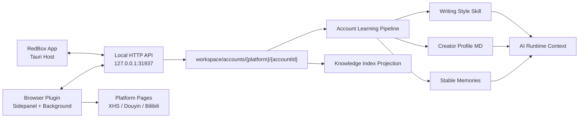

# 账号档案与插件双向通讯实施计划

## 2026-05-01 落地状态

本计划的核心链路已经完成：插件可以读取当前空间健康状态，在 sidepanel 展示空间名和账号绑定提示；用户在账号主页点击绑定后，会复用保存博主流程创建账号导入会话、批量上传历史内容并完成导入。App 会把主数据保存到当前 workspace 的 `accounts/{platform}/{accountId}/`，通过 `profile_learning` 生成 `distillation/` 证据包、统计、AI 蒸馏任务和质量报告，再自动更新 `CreatorProfile.md`、`writing-style-skill/SKILL.md`、`learning-summary.md` 和 `memory-candidates.json`，并把稳定候选同步到现有长期记忆系统。插件已把账号正文、评论快照和媒体元数据分别写入 `posts/`、`comments/`、`media/`。Archives 页面展示当前空间运营账号学习结果，AI runtime 在聊天、稿件编辑和 RedClaw 等创作链路中自动注入当前账号档案、写作风格技能和长期记忆上下文。

## 目标

把 RedBox 的账号档案能力从“知识库采集”升级为“空间绑定运营账号，插件批量导入账号历史，App 存储和学习账号档案”的完整链路。

第一阶段只打通基础链路：

- 插件能识别当前 RedBox 空间、空间内平台账号绑定状态。
- App 有稳定的账号档案 workspace 存储位置。
- 插件能把小红书、抖音、Bilibili 等平台账号内容批量保存到当前空间的账号档案目录。
- App 能向插件暴露任务状态、账号绑定状态和导入任务控制信息。
- 插件 sidepanel 顶部展示当前空间，底部展示当前空间绑定账号。

不把账号历史主数据塞进 `knowledge/`。知识库和索引只是下游投影，用于 AI 检索。

## 推荐总架构



通讯原则：

- 插件永远主动连接 App。本地 App 不直接访问浏览器扩展实例。
- App -> 插件的“反向通讯”通过插件维持长连接、轮询或 SSE 获取 App 下发的任务和状态实现。
- App 负责账号档案、导入状态、学习结果、权限边界。
- 插件负责平台页面识别、账号内容采集、批量上传、任务暂停继续。
- `accounts/` 只做全量主存储；用户可见管理优先融合现有 Archives / 创作档案，不新建孤岛式账号系统。
- 导入完成后的首要价值不是“多保存一些内容”，而是更新写作风格技能、创作档案 MD 和长期记忆，让 Manuscripts、RedClaw 和普通聊天马上能用。

## 文件存储结构

账号档案按当前空间隔离，放在当前空间 workspace 的一级目录 `accounts/` 下。

```text
workspace/
  accounts/
    catalog.json
    xiaohongshu/
      account-{platformUserId-or-urlHash}/
        profile.json
        import-state.json
        learning-summary.md
        CreatorProfile.md
        memory-candidates.json
        distillation/
          evidence-pack.json
          stats.json
          data-draft.md
          ai-distillation-task.md
          quality-report.json
        writing-style-skill/
          SKILL.md
        posts/
          {platformPostId}/
            meta.json
            content.md
            content.html
            comments.json
            comments.md
        media/
          media-{mediaId}.json
    douyin/
      account-{platformUserId-or-urlHash}/
    bilibili/
      account-{platformUserId-or-urlHash}/
```

平台目录使用固定枚举：

```text
xiaohongshu
douyin
bilibili
wechat
youtube
kuaishou
tiktok
instagram
x
```

账号目录规则：

- 能拿到平台用户 ID：`account-{platformUserId}`
- 拿不到平台用户 ID：`account-{hash(homepageUrl)}`
- 不使用用户名做目录名，因为用户名会变化且可能包含不安全字符。

## 数据模型

### `accounts/catalog.json`

用于快速加载账号列表、插件 health、空间绑定状态。首屏只读这个文件，不扫描每个账号的 `posts/`。

```json
{
  "schemaVersion": 1,
  "accounts": [
    {
      "id": "account-123456",
      "platform": "xiaohongshu",
      "platformUserId": "123456",
      "username": "账号名",
      "homepageUrl": "https://www.xiaohongshu.com/user/profile/123456",
      "avatarUrl": "",
      "boundSpaceId": "default",
      "postCount": 128,
      "commentCount": 2048,
      "mediaCount": 512,
      "lastImportedAt": "2026-04-30T12:00:00+08:00",
      "lastLearnedAt": null,
      "createdAt": "2026-04-30T12:00:00+08:00",
      "updatedAt": "2026-04-30T12:00:00+08:00"
    }
  ]
}
```

### `profile.json`

账号档案主数据。

```json
{
  "schemaVersion": 1,
  "id": "account-123456",
  "platform": "xiaohongshu",
  "platformUserId": "123456",
  "username": "账号名",
  "displayName": "账号展示名",
  "homepageUrl": "",
  "avatarUrl": "",
  "bio": "",
  "stats": {
    "followers": 0,
    "following": 0,
    "likesAndCollects": 0
  },
  "positioning": "",
  "audience": "",
  "contentPillars": [],
  "toneTags": [],
  "forbiddenTopics": [],
  "learningSummaryPath": "learning-summary.md",
  "createdAt": "2026-04-30T12:00:00+08:00",
  "updatedAt": "2026-04-30T12:00:00+08:00"
}
```

### `posts/note-*.json`

插件批量导入的历史内容。

```json
{
  "schemaVersion": 1,
  "id": "note-abc",
  "platform": "xiaohongshu",
  "platformPostId": "abc",
  "accountId": "account-123456",
  "title": "",
  "content": "",
  "url": "",
  "publishedAt": "",
  "capturedAt": "2026-04-30T12:00:00+08:00",
  "stats": {
    "liked": 0,
    "collected": 0,
    "commented": 0,
    "shared": 0
  },
  "tags": [],
  "media": [
    {
      "kind": "image",
      "url": "",
      "localPath": null
    }
  ],
  "raw": {}
}
```

### `import-state.json`

当前账号导入任务状态，供 App 和插件恢复断点。

```json
{
  "activeSessionId": "account-import-xxx",
  "sessions": [
    {
      "id": "account-import-xxx",
      "platform": "xiaohongshu",
      "accountId": "account-123456",
      "status": "running",
      "requestedPostLimit": 100,
      "importedPostCount": 42,
      "failedPostCount": 1,
      "cursor": {},
      "startedAt": "2026-04-30T12:00:00+08:00",
      "updatedAt": "2026-04-30T12:05:00+08:00",
      "completedAt": null,
      "lastError": null
    }
  ]
}
```

## App 端模块落点

### Rust Host

新增模块：

```text
desktop/src-tauri/src/accounts.rs
desktop/src-tauri/src/commands/accounts.rs
desktop/src-tauri/src/account_import.rs
desktop/src-tauri/src/account_learning.rs
```

职责：

- `accounts.rs`: 账号档案路径、schema、读写、catalog 更新。
- `commands/accounts.rs`: renderer IPC，如 `accounts:list`、`accounts:bind-space`。
- `account_import.rs`: 本地 HTTP 导入 API、批量 upsert、去重、导入状态。
- `account_learning.rs`: 账号学习后处理任务，负责写作风格技能、创作档案 MD、记忆候选和索引投影。

需要同步：

- `desktop/src-tauri/src/main.rs`: 注册模块和命令。
- `desktop/src-tauri/src/persistence/`: workspace hydrate 增加 accounts summary。
- `desktop/src-tauri/src/workspace_loaders.rs`: 加载 `accounts/catalog.json`，不要首屏扫描 `posts/`。
- `desktop/docs/contracts/workspace-schema.md`: 增加 `accounts/` 目录职责。

### Renderer / Archives 融合

不要优先新增孤立 `Accounts` 页面。第一优先级是改造现有 `Archives`，让它成为账号档案的用户可见入口：

```text
desktop/src/pages/Archives.tsx
desktop/src/components/accounts/AccountList.tsx
desktop/src/components/accounts/AccountOverview.tsx
desktop/src/components/accounts/ImportSessions.tsx
desktop/src/components/accounts/LearningSummary.tsx
```

`Archives` 中的职责重新分层：

- `archive_profiles`: 轻量档案索引、用户编辑字段、精选样本入口。
- `archive_samples`: 精选历史样本、人工标注样本、代表作。
- `accounts/{platform}/{accountId}/profile.json`: 插件导入的完整账号事实。
- `accounts/{platform}/{accountId}/posts/{postId}/meta.json`: 作品结构化元数据。
- `accounts/{platform}/{accountId}/posts/{postId}/content.md`: 作品正文，给 AI 和人类复查读取。
- `accounts/{platform}/{accountId}/posts/{postId}/comments.json`: 当前作品评论区结构化数据。
- `accounts/{platform}/{accountId}/posts/{postId}/comments.md`: 面向搜索、摘要和 AI 上下文的评论区 Markdown 投影。
- `accounts/{platform}/{accountId}/distillation/evidence-pack.json`: 标准证据包，承载历史内容、TOP 内容、观点句候选和证据引用。
- `accounts/{platform}/{accountId}/distillation/stats.json`: 确定性统计，包括标题模式、开头模式、CTA、标签、价值词。
- `accounts/{platform}/{accountId}/distillation/data-draft.md`: 给 AI 和人类复查的蒸馏底稿。
- `accounts/{platform}/{accountId}/distillation/ai-distillation-task.md`: 后续 LLM 深度蒸馏任务说明。
- `accounts/{platform}/{accountId}/distillation/quality-report.json`: 样本量、正文完整率、可运行状态和风险提示。
- `accounts/{platform}/{accountId}/CreatorProfile.md`: 给人和 AI 都可读的创作档案。
- `accounts/{platform}/{accountId}/writing-style-skill/SKILL.md`: 可被 runtime 激活的账号写作风格技能。

现有新建空间流程需要扩展：

- 创建空间时可绑定已有账号。
- 可从“添加账号”进入插件导入，并在导入后自动跳转或刷新 Archives。
- 当前空间顶部展示绑定账号状态。

所有 renderer 调用继续走：

```text
desktop/src/bridge/ipcRenderer.ts
```

不要在页面里直接调用 Tauri 原语。

## 插件端模块落点

短期保持当前无构建插件结构，先拆能力，不引入 WXT/React。

```text
Plugin/background.js
Plugin/sidepanel.js
Plugin/accountImport/
  protocol.js
  taskQueue.js
  normalize.js
  xiaohongshu.js
  douyin.js
  bilibili.js
```

职责：

- `protocol.js`: RedBox local API client、health、import session、batch upsert。
- `taskQueue.js`: 导入任务队列、暂停、继续、取消、断点。
- `normalize.js`: 平台账号、帖子、评论字段归一化。
- 平台文件：只负责从页面和平台接口提取数据，不写 App 文件。

sidepanel 展示：

- 顶部：当前 RedBox 空间名。
- 连接状态：
  - 未连接
  - 已链接 · 当前空间无账号档案
  - 已链接 · 已有账号档案
- 底部：当前页面平台在当前空间绑定的账号名和平台 ID。
- 账号主页：显示“导入为账号档案 / 更新账号档案”。

## 本地 HTTP API

现有 `/api/knowledge/health` 已承担插件探测入口。保留兼容，并扩展账号状态字段。

### `GET /api/knowledge/health`

返回：

```json
{
  "success": true,
  "connectionStatus": "connected_with_account_profile",
  "accountBindingStatus": "hasAccountProfile",
  "workspace": {
    "id": "default",
    "name": "默认空间"
  },
  "platformAccounts": {
    "xiaohongshu": {
      "bound": true,
      "platform": "xiaohongshu",
      "profileId": "account-123456",
      "username": "账号名",
      "id": "123456"
    },
    "douyin": {
      "bound": false,
      "platform": "douyin",
      "profileId": null,
      "username": null,
      "id": null
    },
    "bilibili": {
      "bound": false,
      "platform": "bilibili",
      "profileId": null,
      "username": null,
      "id": null
    }
  }
}
```

### `POST /api/accounts/import-sessions`

插件创建账号导入会话。

请求：

```json
{
  "platform": "xiaohongshu",
  "homepageUrl": "",
  "platformUserId": "123456",
  "username": "账号名",
  "avatarUrl": "",
  "options": {
    "postLimit": 100,
    "includeComments": false,
    "includeMedia": false
  }
}
```

响应：

```json
{
  "success": true,
  "workspace": {
    "id": "default",
    "name": "默认空间"
  },
  "account": {
    "id": "account-123456",
    "platform": "xiaohongshu",
    "username": "账号名"
  },
  "session": {
    "id": "account-import-xxx",
    "status": "running"
  }
}
```

### `POST /api/accounts/{accountId}/posts/batch`

批量写入帖子。单批建议 20 到 50 条，硬上限 64 条。

请求：

```json
{
  "sessionId": "account-import-xxx",
  "platform": "xiaohongshu",
  "posts": []
}
```

响应：

```json
{
  "success": true,
  "inserted": 20,
  "updated": 3,
  "skipped": 0,
  "failed": []
}
```

### `POST /api/accounts/{accountId}/comments/batch`

评论单独写入，避免帖子 JSON 过大。

### `POST /api/accounts/{accountId}/media/batch`

只登记素材 URL 和可选本地下载结果。大文件下载由单独任务处理，不阻塞帖子导入。

### `POST /api/accounts/import-sessions/{sessionId}/complete`

插件通知 App 导入结束。

请求：

```json
{
  "status": "completed",
  "importedPostCount": 100,
  "failedPostCount": 2,
  "lastError": null
}
```

App 行为：

- 更新 `import-state.json`
- 更新 `catalog.json`
- 发出 `accounts:changed`
- 调度账号学习任务
- 调度账号内容索引投影

## 双向通讯设计

浏览器扩展环境下，App 不能稳定主动找到某个 extension 实例。推荐采用“插件主动长连接 App”的双向通讯。

### 推荐方案：SSE 控制通道

插件 background 启动后连接：

```http
GET /api/plugin/events?clientId=plugin-xxx
```

App 通过 SSE 下发：

```json
{
  "type": "workspace.changed",
  "workspace": {
    "id": "default",
    "name": "默认空间"
  }
}
```

```json
{
  "type": "account.import.cancel",
  "sessionId": "account-import-xxx"
}
```

```json
{
  "type": "account.binding.changed",
  "platformAccounts": {}
}
```

插件收到事件后刷新 sidepanel 或控制任务队列。

### 备选方案：短轮询

如果 SSE 实现成本过高，先做：

```http
GET /api/plugin/poll?clientId=plugin-xxx&cursor=event-xxx
```

轮询间隔：

- sidepanel 打开：2 秒
- 后台空闲：15 到 30 秒
- 导入任务运行中：1 到 2 秒

### 不推荐第一版：Native Messaging

Native Messaging 适合稳定 App <-> Extension 双向通道，但需要额外安装 host manifest，跨平台发布链路更重。第一版不要选。

## 账号导入流程

### 小红书账号主页导入

1. 用户打开小红书账号主页。
2. 插件识别账号名、平台用户 ID、主页 URL、头像、简介、粉丝数据。
3. sidepanel 显示“导入为账号档案”。
4. 插件调用 `POST /api/accounts/import-sessions`。
5. App 创建 `accounts/xiaohongshu/account-{id}/`。
6. 插件分页采集历史帖子。
7. 插件每 20 到 50 条调用 `posts/batch`。
8. 如果用户勾选评论，插件再调用 `comments/batch`。
9. 如果用户勾选素材，插件登记 media，下载任务独立执行。
10. 插件调用 `complete`。
11. App 调度学习和索引。

### 去重规则

帖子唯一键：

```text
platform + platformUserId + platformPostId
```

账号唯一键：

```text
platform + platformUserId
```

拿不到 `platformUserId` 时：

```text
platform + hash(homepageUrl)
```

写入策略：

- 同 ID 帖子重复导入时更新 stats、media、raw、capturedAt。
- 用户编辑过的学习字段不被导入覆盖。
- `profile.json` 的平台事实可更新，用户手工字段只在为空时补充。

## 导入后的学习与融合链路

账号导入完成后，最重要的不是生成一个泛泛摘要，而是把历史内容转成 RedBox 已经成熟的三类资产：

1. 写作风格技能：让 AI 在写稿、改稿、RedClaw 运营时有稳定规则。
2. 创作档案 MD：让用户能读、能编辑、能审计账号画像。
3. 长期记忆：只保存值得长期记住的稳定偏好和禁区。

这条链路由 `account_learning.rs` 调度，不阻塞插件导入，不在浏览器插件里跑 AI。

### 1. 学习写作风格，更新写作风格技能

目标文件：

```text
accounts/{platform}/{accountId}/writing-style-skill/SKILL.md
```

同时可按现有 skill 机制同步一份可激活引用：

```text
workspace/skills/account-{platform}-{accountId}-writing-style/SKILL.md
```

如果只保留一份，推荐以 `accounts/.../writing-style-skill/SKILL.md` 为主源，`workspace/skills/...` 做运行时引用或软链接式注册记录，避免两份内容漂移。

技能内容不是简单总结，要产出可执行写作规则：

```md
# 账号写作风格技能

## 适用范围
- 当前空间绑定账号：小红书 @账号名
- 用于选题、标题、正文、脚本、改稿、RedClaw 自动运营。

## 账号定位

## 目标读者

## 标题模式
- 常用开头
- 高表现标题结构
- 禁止标题套路

## 正文结构
- 开头方式
- 段落节奏
- 证据和案例使用方式
- CTA 偏好

## 语气

## 视觉与视频脚本偏好

## 禁区

## 可复用示例
```

更新策略：

- 首次导入：创建技能。
- 增量导入：保留用户手改区块，只更新自动生成区块。
- 用户在 Archives 中手动编辑的规则优先级高于自动学习结果。
- runtime 激活时，不靠用户消息关键词判断；根据当前空间绑定账号显式加载该技能。

实现细节：

- `account.post.analyze`: 从高表现和代表性帖子中抽取标题、开头、结构、语气、CTA。
- `account.style_skill.generate`: 生成或更新 `SKILL.md`。
- `account.style_skill.register`: 写入 skill registry 或 workspace skill 记录，让当前空间 runtime 能发现。

必须自研：写作风格 schema、技能更新合并策略、用户手改区块保护。

必须用现成能力：现有 skill runtime、prompt 渲染、workspace skill 加载机制。

### 2. 更新创作档案 MD 文件

目标文件：

```text
accounts/{platform}/{accountId}/CreatorProfile.md
```

它面向用户和 AI 双重阅读，是 Archives 页面里的“创作档案”正文来源。不要只存在 JSON 里，否则用户难以理解和修订。

推荐结构：

```md
# 创作档案：@账号名

## 基础信息
- 平台：
- 主页：
- 账号 ID：
- 导入时间：

## 账号定位

## 受众画像

## 内容支柱

## 历史高表现内容

## 写作风格

## 视觉/视频风格

## 评论反馈与用户需求

## 禁区与合规提醒

## 下一步内容机会

## 人工修订
```

与现有 Archives 的关系：

- Archives 列表读 `accounts/catalog.json` 和 `archive_profiles`。
- 账号详情页展示 `CreatorProfile.md`。
- 用户编辑 `CreatorProfile.md` 后，更新 `archive_profiles` 中的轻量字段，如定位、受众、语气标签。
- `archive_samples` 只保存精选样本，不承载全量历史内容。

更新策略：

- 自动生成区块使用明确标记：

```md
<!-- redbox:auto:start account-profile -->
...
<!-- redbox:auto:end account-profile -->
```

- `## 人工修订` 永远不被自动覆盖。
- 插件增量导入只更新自动区块。

### 3. 提取值得被记住的信息写入记忆

不是所有导入内容都应该进 Memory。Memory 只保存稳定、可复用、跨任务有价值的信息。

应该写入 Memory 的内容：

- 账号长期定位和目标人群。
- 稳定的语气偏好。
- 反复出现的内容禁区。
- 用户明显偏好的标题/结构规律。
- 评论里高频出现的真实需求。
- 已验证有效的栏目或表达方式。

不应该写入 Memory 的内容：

- 单条笔记全文。
- 一次性导入日志。
- 临时热点。
- 未验证的低置信推断。
- 大量平台原始数据。

记忆写入建议使用现有 `memory.add` / `memory.update` 能力，写入前生成候选：

```json
{
  "kind": "account_preference",
  "scope": "space",
  "accountId": "account-123456",
  "text": "该账号的高表现内容常使用清单式结构，适合保留步骤编号和明确结论。",
  "confidence": 0.82,
  "evidencePostIds": ["note-a", "note-b", "note-c"],
  "source": "account_import_learning"
}
```

记忆治理规则：

- 置信度低于阈值只写入 `memory candidates`，不直接进入 active memory。
- 与现有记忆冲突时，生成 `memory.update` 候选，而不是新增重复记忆。
- 记忆文本必须短、稳定、可执行。
- 所有记忆要带 `accountId` 和 evidence ids，方便追溯。

### 4. 账号内容索引投影

导入完成后 App 不把帖子全文塞进 prompt，而是后台投影到检索层：

```text
accounts/{platform}/{accountId}/posts/{postId}/meta.json + content.md
  -> knowledge_index blocks
      scope = account-profile
      owner_type = account_profile
      owner_id = accountId
```

索引投影用于任务时检索相似历史，不作为主存储。

### 5. Runtime 使用方式

AI runtime 使用：

- 当前空间绑定账号的 `profile.json`
- `CreatorProfile.md`
- 写作风格 `SKILL.md`
- 相关长期 memory
- 按任务检索的历史帖子证据

不要把所有历史帖子直接塞入 prompt。

Manuscripts 使用方式：

- 新建稿件默认启用当前空间账号写作风格。
- 写稿前检索同主题历史帖子。
- 改稿时优先遵守账号写作风格技能。

RedClaw 使用方式：

- 当前空间绑定账号作为默认运营主体。
- 可创建 `account.learning.update`、`account.topic.plan`、`account.comment.mine`、`account.weekly.report` 等任务。

Workboard 使用方式：

- 展示导入、学习、技能更新、档案更新、记忆写入和索引投影任务。
- 导入完成不等于学习完成，状态需要拆开显示。

## 必须用现成库

- 浏览器 IndexedDB 封装：后续可用 `idb`，避免自写复杂事务封装。
- Excel / CSV 导出：用 `xlsx` 或现有导出库，不手写 Excel。
- 视频元数据：App 侧用 `ffmpeg/ffprobe`。
- ASR：使用 Whisper 类服务或现有模型 API，不自研语音识别。
- OCR：使用视觉模型或现有 OCR 引擎，不自研 OCR。
- Embedding：使用现有 embedding API，不自训向量模型。

## 需要自研

- `accounts/` workspace schema。
- 账号导入 API 和导入状态机。
- 插件平台采集 adapter。
- 平台字段归一化 schema。
- 空间绑定账号关系。
- 写作风格技能生成和合并策略。
- 创作档案 MD 自动区块更新策略。
- 记忆候选提取、去重和冲突合并策略。
- AI runtime 按绑定账号注入 skill/profile/memory 的策略。
- 账号内容到知识索引的投影策略。

## 性能策略

- `health` 只读 `accounts/catalog.json` 和当前 store summary，不扫描 `posts/`。
- 批量帖子写入按 20 到 50 条分批。
- 大文件不走 base64 inline，优先 URL + metadata。
- 图片/视频下载和 ffmpeg 处理进入后台任务。
- 导入时先落原始 JSON，再异步学习。
- 写作风格技能、创作档案 MD 和记忆候选都做增量更新，小批量导入只合并新增帖子分析。
- 知识索引投影按账号增量刷新，不重建全库。
- 全局 store 锁只做最小快照读取和最终内存应用，文件 I/O 在锁外完成。

## 安全与权限

- 本地 API 仅监听 `127.0.0.1`。
- CORS 只允许插件和本地来源。
- 所有路径必须用 Windows-safe 文件名规则，不使用用户名直接落目录。
- 插件提交的 `raw` 字段限制大小。
- 单批请求限制条数和 body 大小。
- App 不信任插件传来的本地路径，素材落盘必须由 App 校验目标目录。

## 实施步骤

### 1. 固化 health 协议

- 扩展 `GET /api/knowledge/health` 返回 `workspace`、`platformAccounts`、`accountBindingStatus`。
- 插件 sidepanel 顶部展示空间名，底部展示当前平台账号。
- 文档更新 `knowledge.README.md`。

验收：

- App 未启动：插件显示未连接。
- App 启动但当前空间无账号：插件显示已链接但无账号档案。
- 当前空间存在账号：插件显示已链接已有账号档案，并展示账号名和 ID。

### 2. 新增 `accounts/` workspace schema

- 新增 `accounts.rs`。
- 新增 `accounts/catalog.json` 读写。
- 更新 workspace schema 文档。
- 新增最小 IPC：`accounts:list`、`accounts:get`、`accounts:bind-space`。

验收：

- 创建账号后重启仍可恢复。
- 切换空间后账号列表隔离。
- 首屏不扫描帖子目录。

### 3. 新增账号导入 HTTP API

- `POST /api/accounts/import-sessions`
- `POST /api/accounts/{accountId}/posts/batch`
- `POST /api/accounts/{accountId}/comments/batch`
- `POST /api/accounts/{accountId}/media/batch`
- `POST /api/accounts/import-sessions/{sessionId}/complete`

验收：

- 插件可以创建导入任务。
- 批量写入帖子后文件落在 `accounts/{platform}/{accountId}/posts/`。
- 重复导入同一帖子会 upsert，不重复生成文件。

### 4. 插件账号导入 UI

- sidepanel 在账号主页显示“导入为账号档案”。
- 支持数量、评论、素材开关。
- 显示进度、暂停、继续、取消。
- 使用后台统一任务队列。

验收：

- 小红书账号主页能启动导入。
- sidepanel 刷新后能恢复任务状态。
- 取消任务后 App import-state 更新。

### 5. App -> 插件控制通道

- 优先实现 SSE：`GET /api/plugin/events`。
- 如 SSE 不稳定，先落短轮询。
- 支持 workspace changed、account binding changed、import cancel。

验收：

- App 切换空间后插件 2 秒内刷新空间名。
- App 取消导入任务后插件停止采集。

### 6. 账号学习与索引投影

- 导入完成后更新写作风格 `SKILL.md`。
- 导入完成后更新 `CreatorProfile.md`。
- 从历史内容和评论反馈中提取 memory candidates，并写入稳定记忆。
- 将帖子文本投影到知识索引，标记 `owner_type=account_profile`。
- AI runtime 读取当前空间绑定账号的写作风格 skill、创作档案 MD、相关 memory 和检索证据。

验收：

- 导入完成后 Archives 能看到 `CreatorProfile.md`。
- 导入完成后 workspace 中出现或更新账号写作风格 `SKILL.md`。
- Memory 中出现带 `accountId` 的稳定偏好，且不会把单条帖子全文写入记忆。
- AI 写稿时能引用当前空间账号风格、创作档案和历史内容证据。
- 不把全部历史帖子塞进 prompt。

## 验证矩阵

- 插件 health：三种连接状态全部覆盖。
- 空间切换：sidepanel 空间名和账号状态更新。
- 账号导入：小红书账号主页至少导入 20 条帖子。
- 重启恢复：App 重启后账号 catalog 和 import-state 正常。
- 去重：重复导入不产生重复帖子。
- 大批量：导入 200 条帖子时 UI 不阻塞。
- 错误恢复：App 中途关闭后插件显示未连接，App 恢复后能继续。
- AI 使用：当前空间绑定账号后，runtime 能读取写作风格 skill、`CreatorProfile.md` 和账号相关 memory。
- 记忆治理：导入后只写入稳定偏好，不写入单条帖子全文。
- 用户编辑保护：用户手动修改的创作档案和技能区块不会被自动学习覆盖。

## 推荐结论

账号档案主存储放在：

```text
workspace/accounts/{platform}/{accountId}/
```

插件和 App 的双向通讯采用：

```text
插件主动连接 App local HTTP
插件 -> App: REST 写入账号、帖子、评论、导入状态
App -> 插件: SSE 或短轮询下发空间变化、绑定变化、任务控制
```

导入完成后的学习成果落到三处现有成熟能力：

```text
写作风格技能 -> Skills / Runtime
创作档案 MD -> Archives / 用户编辑
稳定偏好记忆 -> Memory / 长期上下文
```

这是当前 RedBox 架构下最稳的方案：符合空间隔离，适合插件批量导入，也不会把用户自己的账号历史和外部参考知识混在一起；同时不会形成孤立账号系统，而是把账号档案接入 Archives、Skills、Memory、Manuscripts、RedClaw 和 Workboard。
