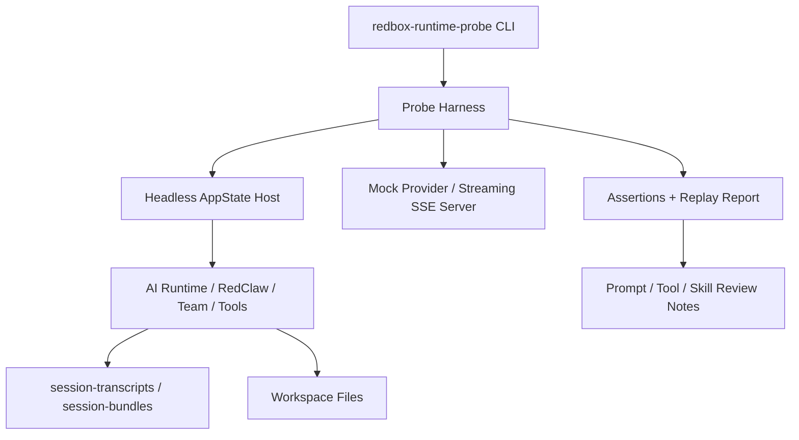

# Headless AI Runtime Test Harness Plan

## 1. Goal

RedConvert 需要新增一套不依赖手动点击 UI 的 AI runtime 自动化测试层。

目标不是替代前端验收，而是让开发者和 agent 能直接从命令行触发可重复流程、读取真实运行日志、复盘执行步骤，并用复盘结果优化 prompt、tool contract、skill activation 和 team orchestration。

这套测试层必须覆盖：

- MCP server 管理、工具发现、资源读取和工具调用。
- CLI runtime 的 resolve / execute / verify。
- 模型可见 tool 的 schema、路由、权限、结果截断和错误恢复。
- 单 agent loop 的 streaming、tool call、保存、最终摘要。
- Team / subagent 的任务派发、成员执行、报告、完成判断。
- Skill 的发现、激活、上下文注入、执行效果和误激活回归。
- RedClaw / Wander 这种跨页面工作流，尤其是“漫步点击 AI 创作 -> 新对话 -> 创作 -> 保存稿件 -> 输出运行总结”。

核心验收标准：以后修 AI loop、team、skill、MCP 或工具调用问题时，不能只靠用户手动点。Codex agent 应该能自己跑 probe、看 transcript、复盘失败步骤、给出根因和修复结果。

## 1.1 Implementation Status

当前已落地第一版可执行测试层：

- `desktop/src-tauri/src/bin/redbox_runtime_probe.rs`
- `desktop/src-tauri/tests/runtime_probe_cli.rs`
- `desktop/docs/development/testing-and-verification.md`

这版采用独立 binary 内的 probe harness，而不是先拆 `src/probe/*` 模块。原因是当前 `AppState` 仍定义在 `main.rs`，仓库还没有 `lib.rs` 可供外部 binary 直接复用完整 Tauri state。为了先让测试底座跑起来，第一版先覆盖确定性 mock-contract probe、本地 HTTP/SSE fixture、stdio MCP fixture、CLI 执行、folder project 写入模拟、transcript / bundle / report / prompt review。`run-scenario` 和 `run-all` 的报告会明确标记 `probeMode: mock-contract`、`workspaceKind: probe-temp`，不能把它解读成真实 UI agent loop 已经执行。

关键 loop 现在会输出 `idealLoop` 和 `loopReview`。测试先声明理想路径、应激活技能、理想/最大工具调用次数，再用实际事件流复盘差距。当前基线包括 `wander-loop` 和 `wander-to-creation`。

`--provider live` 在这版中会显式失败，不会伪装成 mock。后续若要接入真实 provider，需要先把 `AppState` 构建和 AI runtime host 从 `main.rs` 抽到可复用 library 模块。

真实 app 日志复盘已经先接入 `review-real`：

```bash
cargo run --bin redbox_runtime_probe -- review-real --session <real_redbox_session_id>
```

它读取 `~/Library/Application Support/RedBox/session-transcripts/` 和 `session-bundles/`，审计真实会话是否读取档案、读取素材、创建稿件、调用 `Write(path="manuscripts://current")`，并检查旧 `.thrive` / `.redarticle` 自定义扩展名残留。

真实 app loop 触发先接入 `invoke-real-ipc`：

```bash
export REDBOX_TEST_AI_BASE_URL="https://api.example.test/v1"
export REDBOX_TEST_AI_API_KEY="..."
export REDBOX_TEST_AI_MODEL="..."

cargo run --bin redbox_runtime_probe -- invoke-real-ipc \
  --send \
  --start-app \
  --model-config-env \
  --require-model-config \
  --channel chat:send-message \
  --payload-json '{"message":"hi","displayContent":"hi"}'
```

该命令可以先启动 Tauri dev app，再等待桌面 app daemon `http://127.0.0.1:31937/api/ipc/health` 就绪，随后调用 `/api/ipc/send`，进入真实 `commands::chat::handle_send_channel` / `chat:send-message` / provider loop。若不传 `--start-app`，它只连接已有 daemon；连不上时必须失败，不能回退到 mock。真实通过标准是 provider 调用日志出现新增请求，且 `~/Library/Application Support/RedBox/session-transcripts/` 出现对应新会话。app 启动日志写入 `desktop/src-tauri/target/runtime-probe/real-app-*/app.log`。

真实 loop 自动化不依赖当前桌面端登录态。`--model-config-env` 会从 `REDBOX_TEST_AI_BASE_URL`、`REDBOX_TEST_AI_API_KEY`、`REDBOX_TEST_AI_MODEL` 生成 `payload.modelConfig`；`--require-model-config` 会在缺配置时提前失败，避免把测试环境认证问题误判成 agent loop、tool call 或 streaming 稳定性问题。

## 2. What Codex Already Has

本计划参考 `/Users/Jam/LocalDev/GitHub/codex`，但不机械照搬。

Codex 的关键分层：

1. `app-server-test-client`
   - 可以启动或连接 `codex app-server`。
   - 可以通过 CLI 发送 `send-message-v2`、`resume-message-v2`、`thread-list`、`thread-resume`。
   - 可以 `watch` 原始 JSON-RPC 消息。
   - 适合人工和 agent 在命令行跑真实 app-server 流程。

2. `app-server/tests/common/mcp_process.rs`
   - 测试里真实启动 app-server 子进程。
   - 通过 stdin/stdout JSON-RPC 发送 `thread/start`、`turn/start`。
   - 等待 `turn/completed`、`item/started`、approval request 等事件。
   - 这是协议级集成测试，不需要 UI。

3. `core/tests/common/test_codex.rs`
   - 不启动 app-server，直接构建 core runtime。
   - 提交 `Op::UserInput`，等待 runtime event。
   - 适合验证 agent loop、工具调用、权限、streaming 和状态释放。

4. streaming 失败专项测试
   - `stream_no_completed.rs` 验证 SSE 提前关闭后可以重试。
   - `stream_error_allows_next_turn.rs` 验证流式错误后 runtime 会释放当前 turn，下一轮可以继续。

RedConvert 应采用同样思想：UI 点击只做最后一层验收，核心 AI 能力必须有 headless protocol / runtime probe。

## 3. Architecture

新增三层测试入口。



### 3.1 Probe CLI

新增二进制：

```text
desktop/src-tauri/src/bin/redbox_runtime_probe.rs
```

命令形态：

```bash
cargo run --bin redbox_runtime_probe -- smoke
cargo run --bin redbox_runtime_probe -- run-scenario wander-to-creation --repeat 3
cargo run --bin redbox_runtime_probe -- run-scenario redclaw-save-summary --provider mock
cargo run --bin redbox_runtime_probe -- replay --bundle <bundle_path>
cargo run --bin redbox_runtime_probe -- inspect --session <session_id>
cargo run --bin redbox_runtime_probe -- report --session <session_id>
```

CLI 只负责：

- 解析参数。
- 创建 isolated test home / workspace。
- 启动本地 deterministic harness；完整 headless `AppState` host 留给后续 `lib.rs` 拆分。
- 执行 scenario。
- 打印机器可读 JSON 和人类可读摘要。
- 返回稳定 exit code。

CLI 不直接修改生产业务行为。第一版 scenario 放在 binary 内保持原子提交边界；后续如果 `AppState` 抽出到 `lib.rs`，再把 scenario 下沉到 `probe/scenarios/*`，便于 Rust test 复用。

### 3.2 Headless Host

后续完整 live host 需要新增模块：

```text
desktop/src-tauri/src/probe/mod.rs
desktop/src-tauri/src/probe/headless_host.rs
desktop/src-tauri/src/probe/scenario.rs
desktop/src-tauri/src/probe/assertions.rs
desktop/src-tauri/src/probe/report.rs
```

`HeadlessHost` 要能在没有 Tauri window 的情况下创建最小 AppState：

- 使用临时 `CODEX_HOME` / `RED_BOX_HOME` 等测试目录。
- 使用临时 workspace。
- 初始化 settings、store、runtime manager、MCP manager、skills catalog、tool registry。
- 提供事件 sink，替代前端 event emit。
- 提供 command dispatcher，能调用现有 command handler 或等价 service。

关键约束：

- 不在 probe 内复制生产逻辑。
- 生产 command 目前如果强依赖 `AppHandle`，要抽出 service 层，让 UI command 和 probe 共同调用。
- 测试目录必须默认隔离，除非显式传 `--use-real-home`。

### 3.3 Scenario Runner

统一接口：

```rust
pub trait RuntimeScenario {
    fn name(&self) -> &'static str;
    fn default_timeout(&self) -> Duration;
    async fn arrange(&self, host: &mut HeadlessHost) -> Result<ScenarioInput>;
    async fn act(&self, host: &mut HeadlessHost, input: ScenarioInput) -> Result<ScenarioRun>;
    async fn assert(&self, host: &HeadlessHost, run: &ScenarioRun) -> Result<ScenarioReport>;
}
```

每个 scenario 产出：

- `scenario_id`
- `session_id`
- `workspace_root`
- `transcript_path`
- `bundle_path`
- `events`
- `tool_calls`
- `files_written`
- `final_message`
- `assertions`
- `prompt_review_notes`

报告必须既能给人读，也能被 CI/agent 解析：

```json
{
  "scenario": "wander-to-creation",
  "status": "passed",
  "sessionId": "session_redclaw_...",
  "events": 124,
  "toolCalls": [
    {"name": "manuscripts.writeCurrent", "status": "success"}
  ],
  "filesWritten": [
    {"path": "manuscripts/article/demo/manifest.json", "kind": "manifest"},
    {"path": "manuscripts/article/demo/content.md", "kind": "content"}
  ],
  "finalMessageKind": "summary",
  "promptReviewNotes": []
}
```

## 4. Required Scenarios

### 4.1 Smoke

Command:

```bash
cargo run --bin redbox_runtime_probe -- smoke
```

验证：

- host 可以启动。
- settings/store 可以加载。
- tool registry 可以生成。
- skills catalog 可以列出。
- transcript writer 可以写入一条 session meta。
- runtime event sink 可接收 begin/end。

这不是业务测试，是底座健康检查。

### 4.2 Agent Loop Basic Turn

Command:

```bash
cargo run --bin redbox_runtime_probe -- run-scenario agent-basic-turn --provider mock
```

验证：

- 创建新 runtime session。
- 发一条用户消息。
- mock provider 返回 assistant message。
- runtime 收到 `turn_started`、`assistant_delta`、`turn_completed`。
- transcript 中有完整 request / response / final item。
- turn 结束后 session 状态释放，下一轮可以继续。

### 4.3 Streaming Failure Recovery

Command:

```bash
cargo run --bin redbox_runtime_probe -- run-scenario stream-retry --provider mock
cargo run --bin redbox_runtime_probe -- run-scenario stream-error-next-turn --provider mock
```

验证：

- SSE 提前关闭且没有 completed 时，按 provider policy 重试。
- `partial_body` / `error decoding response body` 被归类为 transport retryable。
- 重试失败时，用户看到稳定错误，而不是工具调用乱码。
- 当前 turn 一定释放。
- 下一轮 turn 可以正常执行。

这直接覆盖近期的 `error decoding response body` 问题。

### 4.4 Tool Call Contract

Command:

```bash
cargo run --bin redbox_runtime_probe -- run-scenario tool-call-contract --tool redbox_editor.write
cargo run --bin redbox_runtime_probe -- run-scenario tool-call-contract --tool app_cli
```

验证：

- model-visible schema 和 executor schema 一致。
- JSON 参数解析失败时返回结构化 tool error。
- 权限不足时返回 approval / not allowed，而不是把内部 JSON 原样塞给用户。
- 成功结果必须可序列化、可截断、可写 transcript。
- tool call begin/end 都有事件和 checkpoint。

### 4.5 MCP Tool

Command:

```bash
cargo run --bin redbox_runtime_probe -- run-scenario mcp-list-tools --fixture local-stdio
cargo run --bin redbox_runtime_probe -- run-scenario mcp-call-tool --fixture local-stdio
cargo run --bin redbox_runtime_probe -- run-scenario mcp-resource-read --fixture local-stdio
```

验证：

- MCP server 启动、list tools、list resources、call tool。
- direct/deferred exposure 进入 ToolRegistryPlan。
- qualified tool name 稳定，不泄漏 raw server identity 给模型。
- approval 等待不占用 active tool timeout。
- MCP tool result 进入 transcript 和 session bundle。

必须用现成库：

- MCP 协议继续使用现有 MCP SDK / transport 实现。
- JSON schema 校验使用 `schemars` / `serde_json` / 现有 schema 工具，不自研字符串校验。

需要自研：

- RedConvert 的 effective MCP tool plan snapshot。
- Probe fixture server。
- Transcript assertion。

### 4.6 CLI Runtime

Command:

```bash
cargo run --bin redbox_runtime_probe -- run-scenario cli-runtime-execute --fixture echo-json
cargo run --bin redbox_runtime_probe -- run-scenario cli-runtime-verify --fixture failing-command
```

验证：

- CLI runtime resolve / execute / verify 完整链路。
- stdout/stderr/exit code 结构化保存。
- 长输出截断不破坏 JSON。
- command timeout、权限拒绝、缺少 binary 都能稳定归类。

### 4.7 Skill Activation

Command:

```bash
cargo run --bin redbox_runtime_probe -- run-scenario skill-activation --skill writing-style
cargo run --bin redbox_runtime_probe -- run-scenario skill-no-false-positive --skill remotion-best-practices
```

验证：

- skills catalog 进入 prompt 的方式符合当前 runtime mode。
- skill 不是靠宿主关键词强塞。
- activationHint、当前上下文、tool contract 可以引导模型选择技能。
- 不相关任务不误激活技能。
- 被激活技能的关键规则出现在 transcript context snapshot。

### 4.8 Team Runtime

Command:

```bash
cargo run --bin redbox_runtime_probe -- run-scenario team-single-task --provider mock
cargo run --bin redbox_runtime_probe -- run-scenario team-member-report --provider mock
cargo run --bin redbox_runtime_probe -- run-scenario team-completion-summary --provider mock
```

验证：

- 创建 team session。
- spawn member。
- 派发 task。
- member 执行。
- report 写入。
- owner 汇总。
- final 状态和 Workboard 投影一致。

Team 测试不能只检查 store，要检查 runtime event、collab event、report artifact 和 transcript。

### 4.9 Wander To RedClaw Creation

Command:

```bash
cargo run --bin redbox_runtime_probe -- run-scenario wander-to-creation --repeat 3 --provider mock
```

验证完整链路：

1. 创建 wander session。
2. 注入一条漫步灵感和参考素材。
3. 触发 AI 创作 action。
4. 必须创建新的 RedClaw / authoring session，不能复用旧 chat session。
5. 新 session 第一条用户消息不能残留旧对话里的 `hi` 等历史输入。
6. 参考素材卡片必须进入消息 metadata / transcript，不只在 UI 显示。
7. agent 使用写作技能和素材上下文。
8. 工具写入稿件 folder project。
9. 最终用户消息必须是运行总结 + 稿件链接，不是全文文案。
10. session bundle 可复盘完整步骤。

这是当前最重要的端到端 AI workflow probe。

## 5. Mock Provider And Live Provider

当前完成的是 mock provider + 本地 deterministic fixtures。live provider 不应在未接入真实 headless runtime 前对外声明支持。

### 5.1 Mock Provider

用于 CI 和稳定回归。

能力：

- 返回普通 assistant message。
- 返回 tool call。
- 返回多轮 tool call。
- 返回 SSE delta。
- 模拟 partial body。
- 模拟缺失 completed。
- 模拟 malformed tool call JSON。
- 模拟 provider fallback 失败。

实现：

```text
desktop/src-tauri/src/bin/redbox_runtime_probe.rs
```

第一版已参考 Codex 的 streaming 失败测试思想，用本地 loopback HTTP/SSE fixture 复现 incomplete stream 和 completed stream。

### 5.2 Live Provider

用于本机诊断和用户复现。

命令必须显式传：

```bash
--provider live --model <model> --repeat 3
```

默认保护：

- live probe 不进 CI 默认集。
- 输出自动脱敏 API key。
- 写入独立测试 workspace。
- 失败时保留 transcript / bundle。
- 支持 `--keep-workspace` 方便复盘。

Live provider 的价值是发现 mock 覆盖不到的 provider streaming、网络、fallback、tool call 格式兼容问题。

当前限制：

- `redbox_runtime_probe --provider live` 会显式报错。
- 要实现 live，需要先把 `main.rs` 中的 `AppState` 构建、provider settings、AI runtime host 抽成 `lib.rs` 可复用模块。
- 在这之前，所有自动化回归使用 `--provider mock`，其中 streaming 场景已经通过本地 loopback HTTP/SSE server 验证真实流消费、缺失 `[DONE]`、重试和下一轮释放。

## 6. Transcript Replay And Prompt Review

复盘 agent 执行步骤必须成为一等能力。

### 6.1 Replay Input

Replay 从这些来源读取：

- `~/Library/Application Support/RedBox/session-transcripts/`
- `~/Library/Application Support/RedBox/session-bundles/`
- probe 运行输出目录。
- 用户提供的 session id / bundle id。

命令：

```bash
cargo run --bin redbox_runtime_probe -- replay --session <session_id>
cargo run --bin redbox_runtime_probe -- review-prompt --session <session_id>
```

### 6.2 Execution Step Model

标准化每轮执行步骤：

```json
{
  "step": 7,
  "kind": "tool_call",
  "tool": "manuscripts.writeCurrent",
  "inputSummary": "...",
  "status": "failed",
  "errorCode": "ACTION_NOT_ALLOWED",
  "promptRelevantCause": "tool contract exposed write intent but runtime mode lacked manuscript binding",
  "recommendedFix": "bind current manuscript path in runtime metadata and tighten system prompt final output rule"
}
```

### 6.3 Prompt Review Output

Prompt review 不直接自动改 prompt。它先生成报告：

```text
Prompt Review

Findings:
1. Final answer contract was underspecified. The model printed full article after saving.
2. Tool failure format leaked raw JSON to user.
3. Skill activation evidence missing for writing-style skill.

Recommended prompt changes:
1. In RedClaw authoring system prompt, require final response to be summary + artifact links only after successful save.
2. In tool error handling section, instruct model to summarize user-facing failure without raw JSON unless asked.
3. Add explicit "use active writing skill when available" rule for authoring mode.

Recommended runtime changes:
1. Add final_message_kind assertion.
2. Add transcript marker for selected skills.
```

这样 agent 可以基于真实失败日志优化提示词，而不是靠印象改 prompt。

## 7. Assertions

每个 probe 需要三类断言。

### 7.1 Protocol Assertions

- request / response shape 正确。
- event 顺序正确。
- session id、thread id、runtime mode 一致。
- turn completed 后状态释放。
- approval request 必须被 resolve 或 timeout。

### 7.2 Artifact Assertions

- 应写入的 workspace 文件存在。
- manifest / content / metadata JSON 可解析。
- session transcript 存在。
- session bundle 可读。
- final message 不是全文泄漏。
- tool result 没有未脱敏 secret。

### 7.3 Behavior Assertions

- 新工作流必须创建新 session。
- 不相关旧消息不得污染新 session。
- 参考素材 metadata 不丢失。
- 需要技能时有技能证据。
- 失败时用户看到稳定摘要。
- 重试次数符合 provider policy。

## 8. CI And Local Workflow

### 8.1 Fast Local Commands

开发者常用：

```bash
cd desktop/src-tauri
cargo test probe_smoke
cargo test runtime_probe_
cargo run --bin redbox_runtime_probe -- smoke
cargo run --bin redbox_runtime_probe -- run-scenario wander-to-creation --provider mock
```

### 8.2 CI Matrix

默认 CI：

- `probe_smoke`
- `agent-basic-turn`
- `stream-retry`
- `stream-error-next-turn`
- `tool-call-contract`
- `mcp-list-tools`
- `cli-runtime-execute`
- `skill-activation`
- `team-single-task`

不默认进 CI：

- live provider。
- 真实外部 MCP server。
- 需要真实用户 workspace 的 replay。
- 长耗时多轮 creative generation。

### 8.3 Agent Workflow

以后 Codex agent 处理 AI runtime 问题时，默认流程：

1. 跑对应 probe。
2. 如果没有对应 probe，先补最小 probe。
3. 读取 transcript / bundle。
4. 复盘执行步骤。
5. 定位是 prompt、tool contract、runtime state、provider streaming、workspace artifact 还是 UI projection。
6. 修复。
7. 再跑 probe。
8. 把 probe 输出作为最终验证证据。

## 9. Implementation Plan

### Step 1: Probe Foundation

Files:

- `desktop/src-tauri/src/bin/redbox_runtime_probe.rs`

Deliverables:

- `redbox_runtime_probe --help`
- `redbox_runtime_probe smoke`
- isolated test output root。
- JSON report。
- transcript smoke marker。

### Step 2: Runtime Event And Transcript Assertions

Files:

- `desktop/src-tauri/src/bin/redbox_runtime_probe.rs`

Deliverables:

- 统一读取 session transcript / bundle。
- 标准化 execution step。
- 检查 event order。
- 检查 turn state release。

### Step 3: Mock Provider And Streaming Harness

Files:

- `desktop/src-tauri/src/bin/redbox_runtime_probe.rs`

Deliverables:

- 完整 SSE。
- incomplete SSE。
- partial body。
- malformed JSON tool call。
- provider fallback failure。
- retry / next-turn recovery tests。

### Step 4: Tool / MCP / CLI Runtime Scenarios

Files:

- `desktop/src-tauri/src/bin/redbox_runtime_probe.rs`

Deliverables:

- tool schema/executor contract test。
- MCP local stdio fixture。
- CLI runtime echo/fail fixtures。
- approval / not allowed / timeout classification checks。

### Step 5: Skill And Team Scenarios

Files:

- `desktop/src-tauri/src/bin/redbox_runtime_probe.rs`

Deliverables:

- skill selected / not selected evidence。
- team member task/report/final summary probe。
- transcript 中记录 selected skills 和 team events。

### Step 6: Wander To RedClaw Scenario

Files:

- `desktop/src-tauri/src/bin/redbox_runtime_probe.rs`

Deliverables:

- 可重复跑 `--repeat 3`。
- 断言新 session。
- 断言素材 metadata。
- 断言写作技能证据。
- 断言稿件 folder project 写入。
- 断言最终输出是 summary + links。

### Step 7: Prompt Review Reports

Files:

- `desktop/src-tauri/src/bin/redbox_runtime_probe.rs`
- `desktop/docs/development/testing-and-verification.md`

Deliverables:

- `review-prompt --session <id>`。
- 从 transcript 生成 prompt/tool/runtime findings。
- 输出 Markdown + JSON。
- 不自动改 prompt，但给出精确文件和规则建议。

## 10. Performance Strategy

- Probe host 只初始化必要模块，避免完整 UI hydration。
- Mock provider 使用本地 loopback server，避免真实网络。
- Transcript 读取按 session id 精确定位，不全量扫描日志目录。
- Event capture 使用内存 ring buffer，同时落关键 checkpoint。
- 大输出只保存摘要和 artifact path，原文进入 bundle 文件。
- Live provider repeat 默认串行，避免并发打爆 provider。
- CI probe 默认小样本，每个 scenario 控制在 10-30 秒内。

## 11. Library Vs Self-Build

必须用现成库：

- HTTP / SSE server：使用现有 Rust HTTP 测试库或 workspace 已采用的异步网络库，不手写完整 HTTP 协议。
- JSON schema / serialization：`serde` / `serde_json` / `schemars`。
- Temp workspace：`tempfile`。
- Snapshot / diff：优先采用现有测试生态库。
- MCP protocol：继续复用现有 MCP transport / SDK。

需要自研：

- RedConvert headless AppState host。
- Scenario runner。
- Runtime event assertions。
- Transcript / bundle replay reader。
- Prompt review report rules。
- Wander -> RedClaw workflow probe。

## 12. Risks And Controls

Risk: production command handler 过度绑定 Tauri `AppHandle`。

Control: 抽 service 层，UI command 和 probe 共用，不在 probe 复制逻辑。

Risk: mock provider 让测试过于理想化。

Control: mock 覆盖协议边界，live probe 覆盖真实 provider；两者都保留。

Risk: probe 写坏用户真实数据。

Control: 默认 isolated home/workspace；真实 workspace 必须显式 `--use-real-home --workspace <path>`。

Risk: prompt review 变成主观建议。

Control: 每条 finding 必须引用 transcript step、tool call、event 或 artifact 证据。

Risk: 测试变慢导致没人跑。

Control: fast smoke / scenario regression / live diagnosis 分层。

## 13. Recommended First Atomic Commit

第一颗原子提交已按这个边界实现：只做测试底座，不碰业务行为。

- 新增 `redbox_runtime_probe` CLI。
- 新增 `probe` 模块骨架。
- 实现 `smoke` scenario。
- 输出 JSON report。
- 补 `cargo test probe_smoke`。
- 更新 `desktop/docs/development/testing-and-verification.md` 入口说明。

不要在第一颗提交里同时修 Wander、RedClaw、streaming 或 prompt。

## 14. Definition Of Done

本计划完成时，必须满足：

- Codex agent 可以在命令行跑 RedConvert AI runtime mock-contract probe，并清楚知道它不写真实用户数据。
- Codex agent 可以在命令行审计真实 RedBox session 日志，复盘真实 agent loop 的执行步骤。
- 不打开 UI 也能复现核心 agent loop 的协议/契约边界；真实 AppState loop 可以通过自动拉起 Tauri app daemon 执行，完全 headless host 仍需要后续拆出 reusable runtime host。
- `run-all --provider mock` 输出单个机器可解析 JSON 汇总。
- 每个场景都写入 `session-transcripts`、`session-bundles` 和 `report.json`。
- `inspect` / `review-prompt` 可以按 probe session 或 bundle 复盘执行步骤。
- `review-real` 可以按真实 app session 审计创建工程、保存、旧格式残留和最终摘要。
- `wander-to-creation` 的 mock-contract 场景可以重复执行，并验证新对话、素材卡片、写作技能证据、folder project 写入契约和最终摘要。
- `wander-loop` 和 `wander-to-creation` 都有 ideal loop 目标、技能激活预期、工具调用预算和 gap review。
- streaming 场景使用本地 HTTP/SSE fixture 复现 `partial_body` 类断流、重试和下一轮恢复。
- Wander -> AI 创作的 mock-contract 可以自动跑多次并断言；真实自动执行可先通过 `invoke-real-ipc --start-app --model-config-env --require-model-config` 进入 app daemon，后续再升级为独立 headless AppState host。
- MCP、CLI、tool、team、skill 都有至少一个 headless scenario。
- streaming partial body / incomplete SSE / next turn recovery 有专项测试。
- 每次失败都能关联 session transcript / bundle。
- prompt 优化建议来自 execution step 复盘，而不是主观猜测。
