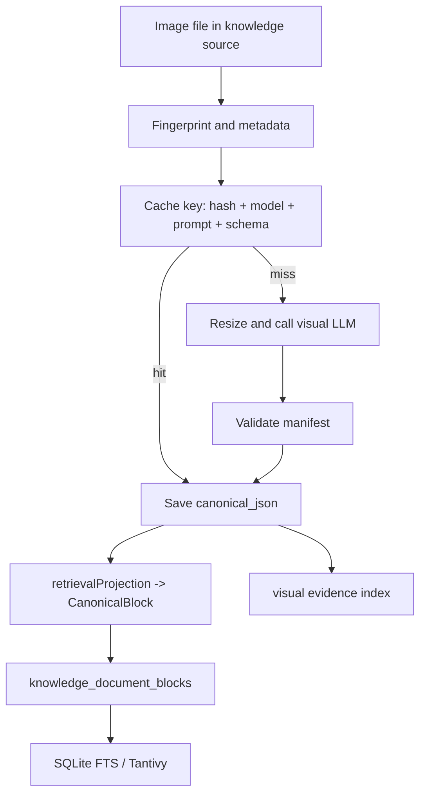
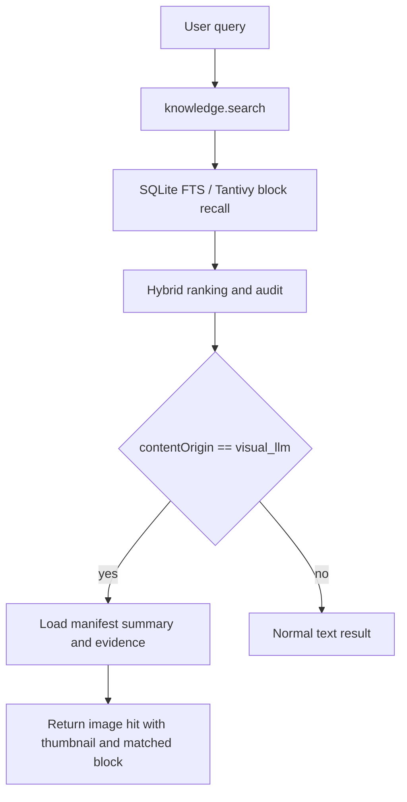

# 图片语义检索架构计划

Status: Completed

## Scope

本计划定义 RedConvert 知识库图片与扫描型 PDF 检索的完整产品架构。目标是彻底放弃 OCR 模型调用，把当前“图片/扫描页只能走 OCR 文本识别”的链路升级为“多模态 LLM 生成标准视觉语义结构，再进入知识库 block 检索”的链路。

本计划覆盖：

- 图片与扫描型 PDF 页的视觉语义 canonical schema
- 多模态 LLM 解析流程
- OCR 设置与 OCR provider 的移除/迁移
- 原始源文件、PDF 页、渲染页图、semantic manifest、检索 block 的一一对应
- manifest 到 `knowledge_document_blocks` 的派生规则
- 搜索、读取、预览、引用的产品行为
- 缓存、性能、迁移和验证策略

本计划不覆盖：

- 重新设计整个知识库 UI
- 立即引入相似图片搜索作为主链路
- 给每一种图片类型建立独立固定 schema
- 继续保留 OCR 模型作为图片或扫描 PDF 的解析路径

## Current Baseline

当前仓库中图片知识检索主要受以下实现约束影响：

- `desktop/src-tauri/src/document_parse/mod.rs` 对 `png/jpg/jpeg/tif/tiff/heic/bmp` 走 `parse_image_ocr`。
- `desktop/src-tauri/src/document_parse/mod.rs` 对 `pdf` 先走 `pdf_extract::extract_text`；原生文本为空或失败时，再走 `ocr::ocr_pdf_to_sections`。
- `desktop/src-tauri/src/document_parse/ocr.rs` 输出 OCR text pages，再映射为 `ParsedSection`。
- `CanonicalDocument` 通过 `blocks[]` 进入 `knowledge_document_blocks`。
- `knowledge_canonical_documents.canonical_json` 保存完整 canonical document。
- `knowledge_document_blocks` 负责 SQLite FTS / Tantivy block 检索。
- `knowledge_citation_anchors` 当前主要围绕文本 quote/char span 构建。
- 设置读取路径中仍存在 `ocr_provider`、`ocr_endpoint`、`ocr_api_key`、`ocr_model`、`ocr_timeout_seconds`、`ocr_local_fallback` 等 OCR 配置。

这意味着当前图片检索的能力上限由 OCR 决定：

- 有文字的图片能被搜到。
- 没有文字的图片，例如风景照、商品照片、人物场景照、设计参考图，很难被搜到。
- OCR 不能稳定描述图片中的物体、风格、构图、场景、用途和视觉细节。
- 复杂图片，例如图表、UI 截图、流程图、海报，只靠 OCR 会丢掉大量语义。
- 扫描型 PDF 的每一页本质上也是图片，但当前 OCR 输出只保留文本，不保留视觉语义，也很难和页图、原 PDF、搜索命中做精确关联。

## Product Goal

图片进入知识库后，应被理解为一种完整知识资产，而不是文字附件。

目标链路：

`Visual Source Unit -> Hash/Mime/Page Mapping -> Multimodal LLM -> Visual Semantic Manifest -> Retrieval Projection -> knowledge_document_blocks -> SQLite FTS/Tantivy -> knowledge.search -> Source Preview + Evidence`

核心目标：

1. 无文字图片也能被检索到。
2. 有文字图片保留原文文本检索能力。
3. 扫描型 PDF 的每一页都能以视觉页为单位进入检索。
4. 搜索命中必须能精准回到原始图片文件或原始 PDF 的具体页码。
5. 风景图、商品图、截图、图表、表格、扫描件、海报、流程图、设计稿进入同一套 schema。
6. 设置页提供独立的“知识库视觉索引模型”配置。
7. 删除 OCR 模型设置，避免用户误以为图片索引仍依赖 OCR。
8. LLM 有足够自由度描述图片，但 RedConvert 保持稳定索引边界。
9. 完整语义结构长期保存在 canonical JSON 中，索引只消费稳定的 retrieval projection。

## Recommended Architecture

推荐采用：

`Visual Source Unit + Visual Semantic Manifest + Fact Blocks + Retrieval Projection + Evidence`

### Why This Architecture

这个方案在三个极端之间取平衡：

| 方案 | 优点 | 缺点 | 结论 |
| --- | --- | --- | --- |
| 单 caption | 实现最快 | 细节少、不可引用、检索弱 | 不推荐 |
| 每种图片独立 schema | 类型字段精准 | 很快失控，迁移成本高 | 不作为主结构 |
| 完整 observation graph | 表达力强 | 初版过重，LLM 输出不稳定 | 暂不推荐 |
| Manifest + blocks + projection | 稳定、可扩展、易接入现有检索 | 需要认真设计 block 派生 | 推荐 |

核心边界：

- LLM 负责“看懂图片”，输出事实层 `factBlocks`。
- RedConvert 负责“把语义变成可检索内容”，输出 `retrievalProjection` 并写入 block index。
- UI 负责“把命中结果重新连接到图片”，通过 `evidence` 显示缩略图和局部区域。
- source mapping 负责“命中结果可以精准回到原始文件”，图片回到文件，扫描 PDF 回到具体页。

## Source Mapping Model

图片和扫描 PDF 必须先被拆成稳定的 `VisualSourceUnit`，再进入 LLM。这样可以保证数据、检索 block 和源文件一一对应。

### VisualSourceUnit

```ts
type VisualSourceUnit = {
  unitId: string;
  unitKind: "image_file" | "pdf_page";
  sourceId: string;
  documentId: string;
  sourceDocumentId: string;
  sourceRelativePath: string;
  sourceAbsolutePath: string;
  sourceMimeType: string;
  sourceContentHash: string;
  pageNumber?: number;
  pageCount?: number;
  renderedImagePath?: string;
  renderedImageHash?: string;
  width?: number;
  height?: number;
};
```

规则：

- 普通图片只有一个 unit：`unitKind=image_file`。
- 扫描型 PDF 每一页一个 unit：`unitKind=pdf_page`。
- `sourceDocumentId` 始终指向原始文件，例如 `source-1:contracts/scan.pdf`。
- `documentId` 对图片等于 `sourceDocumentId`；对 PDF 页等于 `source-1:contracts/scan.pdf#page=3`。
- `unitId` 必须稳定，由 `sourceId + relativePath + pageNumber + sourceContentHash + renderedImageHash` 派生。
- 检索 block、visual evidence、manifest 都必须保存 `unitId` 和 `sourceDocumentId`。
- 搜索结果打开时，图片直接打开原图；PDF 页打开原 PDF 并定位到 `pageNumber`。

### Required Tables

建议新增 `knowledge_visual_units`，作为一一对应关系的 source of truth：

```sql
CREATE TABLE IF NOT EXISTS knowledge_visual_units (
  unit_id TEXT PRIMARY KEY,
  source_id TEXT NOT NULL,
  document_id TEXT NOT NULL,
  source_document_id TEXT NOT NULL,
  unit_kind TEXT NOT NULL,
  source_relative_path TEXT NOT NULL,
  source_absolute_path TEXT NOT NULL,
  source_mime_type TEXT NOT NULL,
  source_content_hash TEXT NOT NULL,
  page_number INTEGER,
  page_count INTEGER,
  rendered_image_path TEXT,
  rendered_image_hash TEXT,
  width INTEGER,
  height INTEGER,
  manifest_hash TEXT,
  updated_at TEXT NOT NULL
);
```

这个表的作用：

- 防止扫描 PDF 页图和原 PDF 脱钩。
- 让 `knowledge.search` 命中 block 后能 O(1) 找到源文件和页码。
- 让缓存、重建、删除传播基于稳定 unit，而不是临时渲染文件路径。
- 让 UI 可以区分“图片文件命中”和“PDF 第 N 页命中”。

## Schema Design Principles

### 1. Schema 固定知识库需要的东西，不固定世界上的所有图片类型

顶层不应该出现大量类型专属字段，例如 `landscapePhoto`、`productPoster`、`mobileScreenshot`、`receiptScan`。

顶层只固定：

- source
- analysis
- summary
- factBlocks
- retrievalProjection
- evidence
- warnings

具体图片类型的差异交给 `factBlocks[].domain` 和 `factBlocks[].data`。

### 2. 事实层和检索层分离

`factBlocks` 是 LLM 对图片的事实描述。

`retrievalProjection` 是面向检索的文本投影。

两者必须分开，原因：

- 事实层要保守，不乱猜。
- 检索层可以适度扩写自然语言查询、同义词、用途词。
- 后续如果要调召回，只迁移 projection，不重写整份 manifest。

### 3. 图片类型只作为辅助，不作为 schema 分叉

`imageTypes` 可以帮助排序和筛选，但不能决定数据结构。

一张图片可以同时是：

- `poster`
- `product_image`
- `social_post`
- `document_screenshot`

所以类型必须允许多标签和低置信候选。

### 4. 每张图都必须覆盖通用视觉维度

为了兼容无文字图片，prompt 和 validator 应要求每张图尽量覆盖：

- scene: 整体场景
- subject: 主体对象、人、商品、建筑、自然元素
- text: 可见文字，只有看见文字才生成
- style: 色彩、光线、氛围、风格
- composition: 构图、视角、空间关系
- usage: 可能的素材用途和搜索意图
- domain: 图表、表格、UI、扫描件、流程图等专门内容

风景图没有文字，也能通过 scene、subject、style、composition、usage 被检索到。

### 5. 结构化字段允许扩展，但索引入口必须稳定

`factBlocks[].data` 可自由承载图表轴、表格列、UI 组件、商品卖点等结构化信息。

但进入索引的字段固定来自 `retrievalProjection[]`。

## Visual Semantic Manifest V1

### TypeScript Shape

```ts
type VisualSemanticManifestV1 = {
  schemaVersion: "redbox.visual_manifest.v1";
  documentKind: "visual_semantic_manifest";
  source: VisualManifestSource;
  analysis: VisualAnalysis;
  summary: VisualSummary;
  visualTypes: VisualTypeCandidate[];
  factBlocks: VisualFactBlock[];
  retrievalProjection: VisualRetrievalProjection[];
  evidence: VisualEvidence[];
  warnings: VisualWarning[];
};

type VisualManifestSource = {
  unitId: string;
  unitKind: "image_file" | "pdf_page";
  documentId: string;
  sourceDocumentId: string;
  sourceId: string;
  relativePath: string;
  absolutePath?: string;
  mimeType: string;
  pageNumber?: number;
  pageCount?: number;
  renderedImageHash?: string;
  width?: number;
  height?: number;
  sizeBytes?: number;
  contentHash: string;
};

type VisualAnalysis = {
  parserName: "redbox-visual-llm-indexer";
  parserVersion: string;
  provider: string;
  model: string;
  promptVersion: string;
  createdAt: string;
  confidence: number;
  processingMode: "visual_llm" | "metadata_only";
};

type VisualSummary = {
  title: string;
  short: string;
  detailed: string;
  languageHints: string[];
};

type VisualTypeCandidate = {
  type: string;
  confidence: number;
};

type VisualFactBlock = {
  id: string;
  kind: "scene" | "subject" | "text" | "style" | "composition" | "domain" | "usage";
  domain?: "chart" | "table" | "ui" | "document" | "diagram" | "product" | "poster" | "map" | "other";
  title: string;
  text: string;
  verbatimText?: string[];
  tags?: string[];
  entities?: VisualEntity[];
  data?: Record<string, unknown>;
  evidenceRefs?: string[];
  confidence: number;
};

type VisualEntity = {
  type: string;
  name: string;
  normalizedName?: string;
  confidence: number;
};

type VisualRetrievalProjection = {
  id: string;
  sourceBlockIds: string[];
  purpose:
    | "summary"
    | "scene"
    | "subject"
    | "visible_text"
    | "style"
    | "composition"
    | "domain"
    | "usage"
    | "query_expansion";
  text: string;
  keywords: string[];
  queryExpansions?: string[];
  weight: number;
  confidence: number;
};

type VisualEvidence = {
  id: string;
  type: "whole_image" | "region" | "text_region";
  bbox?: {
    x: number;
    y: number;
    width: number;
    height: number;
  };
  page?: number;
  note?: string;
};

type VisualWarning = {
  code:
    | "low_confidence"
    | "uncertain_location"
    | "uncertain_identity"
    | "unclear_text"
    | "partial_occlusion"
    | "small_image"
    | "model_limited";
  message: string;
};
```

### Minimal JSON Example: No-text Landscape

```json
{
  "schemaVersion": "redbox.visual_manifest.v1",
  "documentKind": "visual_semantic_manifest",
  "source": {
    "unitId": "source-1:photos/lake.png#image",
    "unitKind": "image_file",
    "documentId": "source-1:photos/lake.png",
    "sourceDocumentId": "source-1:photos/lake.png",
    "sourceId": "source-1",
    "relativePath": "photos/lake.png",
    "mimeType": "image/png",
    "width": 1600,
    "height": 900,
    "contentHash": "sha256:..."
  },
  "analysis": {
    "parserName": "redbox-visual-llm-indexer",
    "parserVersion": "v1",
    "provider": "openai-compatible",
    "model": "visual-small",
    "promptVersion": "visual-manifest-v1",
    "createdAt": "2026-04-28T00:00:00Z",
    "confidence": 0.9,
    "processingMode": "visual_llm"
  },
  "summary": {
    "title": "雪山湖泊风景照",
    "short": "一张雪山、湖泊和森林组成的自然风景图。",
    "detailed": "远处是覆盖积雪的山峰，中间有平静湖面，湖边分布深绿色森林。整体光线柔和，氛围安静、清冷，适合作为自然、旅行、户外或冥想主题素材。",
    "languageHints": ["zh"]
  },
  "visualTypes": [
    { "type": "landscape_photo", "confidence": 0.94 },
    { "type": "wallpaper", "confidence": 0.72 }
  ],
  "factBlocks": [
    {
      "id": "fb_scene_1",
      "kind": "scene",
      "title": "整体场景",
      "text": "自然风景照片，主体是雪山、湖泊和森林，没有明显人物或文字。",
      "tags": ["自然", "风景", "雪山", "湖泊", "森林", "户外"],
      "evidenceRefs": ["ev_whole"],
      "confidence": 0.93
    },
    {
      "id": "fb_style_1",
      "kind": "style",
      "title": "风格与氛围",
      "text": "整体色调偏冷，光线柔和，画面安静、开阔、清新，具有旅行摄影和自然壁纸风格。",
      "tags": ["冷色调", "宁静", "清新", "旅行摄影", "自然壁纸"],
      "evidenceRefs": ["ev_whole"],
      "confidence": 0.86
    },
    {
      "id": "fb_usage_1",
      "kind": "usage",
      "title": "可用场景",
      "text": "适合用于旅行封面、自然主题文章、户外活动配图、冥想背景、桌面壁纸或视频片头素材。",
      "tags": ["旅行封面", "自然配图", "冥想背景", "壁纸"],
      "confidence": 0.78
    }
  ],
  "retrievalProjection": [
    {
      "id": "rp_scene_1",
      "sourceBlockIds": ["fb_scene_1"],
      "purpose": "scene",
      "text": "自然风景照片，包含雪山、湖泊、森林、湖面和山体倒影。",
      "keywords": ["雪山", "湖泊", "森林", "自然风景", "倒影"],
      "weight": 1.0,
      "confidence": 0.92
    },
    {
      "id": "rp_usage_1",
      "sourceBlockIds": ["fb_usage_1"],
      "purpose": "usage",
      "text": "适合作为旅行封面、自然文章配图、户外活动素材、冥想背景和冷色调壁纸。",
      "keywords": ["旅行封面", "自然配图", "户外素材", "冥想背景", "壁纸"],
      "queryExpansions": [
        "雪山湖泊风景图",
        "没有人物的自然风景照片",
        "适合旅行封面的山水图片",
        "冷色调自然壁纸"
      ],
      "weight": 0.72,
      "confidence": 0.78
    }
  ],
  "evidence": [
    {
      "id": "ev_whole",
      "type": "whole_image"
    }
  ],
  "warnings": [
    {
      "code": "uncertain_location",
      "message": "无法确认具体地理位置。"
    }
  ]
}
```

## LLM Prompt Contract

### Required Behavior

多模态 LLM 必须按以下规则输出：

1. 输出必须是 JSON，不输出 markdown。
2. 必须符合 `redbox.visual_manifest.v1`。
3. 不要只写 caption，要覆盖可检索维度。
4. 没有文字的图片也必须描述 scene、subject、style、composition、usage。
5. `text` kind 只在图片中确实有可见文字时生成。
6. `verbatimText` 必须尽量保持原文，不翻译、不润色。
7. 不确定的品牌、地点、人物身份、事件名称不能硬猜，放入 `warnings`。
8. `retrievalProjection` 可以生成用户可能搜索的表达，但必须避免过度泛化。
9. bbox 坐标使用 0 到 1 的归一化坐标。
10. 每张图片默认输出 4 到 12 个 fact blocks；复杂图最多 24 个。

### Prompt Template

```txt
You are generating a Visual Semantic Manifest for a local knowledge base.

Return strict JSON matching schemaVersion redbox.visual_manifest.v1.

Your output must help future search, retrieval, citation, and preview.
Use holistic multimodal visual understanding. If the source unit has no visible text, describe visual content, scene, subjects, style, atmosphere, composition, likely usage, and possible search phrases.

The input may be a standalone image file or a rendered page from a scanned PDF. Preserve the source fields exactly and never invent page numbers or file paths.

Use factBlocks for factual visual understanding.
Use retrievalProjection for search-oriented text derived from factBlocks.
Keep factual claims conservative. Put uncertain guesses in warnings.

Preferred fact block kinds:
- scene
- subject
- text
- style
- composition
- domain
- usage

Use domain only for specialized content such as chart, table, ui, document, diagram, product, poster, map, or other.

Do not identify real people.
Do not invent brand, exact location, event, or date when uncertain.
```

## Parser Integration

### New Module

新增：

- `desktop/src-tauri/src/document_parse/visual_manifest.rs`
- `desktop/src-tauri/src/document_parse/visual_llm.rs`
- `desktop/src-tauri/src/document_parse/pdf_pages.rs`

职责：

- 图片尺寸、mime、hash metadata 收集
- 图片压缩/重采样
- 扫描型 PDF 渲染为稳定页图
- 为图片文件和 PDF 页创建 `VisualSourceUnit`
- 调用多模态 LLM
- 校验并修复 manifest
- manifest -> `ParsedSection` / `CanonicalDocument` 适配
- 模型不可用时生成 `metadata_only` manifest

建议核心函数：

```rust
pub(crate) fn parse_visual_source_unit(
    source_id: &str,
    root_path: &Path,
    unit: &VisualSourceUnit,
    config: &VisualIndexProviderConfig,
) -> Result<Option<CanonicalDocument>, String>
```

### Provider Config And Settings UI

新增设置：

- `visual_index_enabled`
- `visual_index_provider`
- `visual_index_endpoint`
- `visual_index_api_key`
- `visual_index_model`
- `visual_index_prompt_version`
- `visual_index_timeout_seconds`
- `visual_index_max_image_edge`
- `visual_index_skip_small_images`
- `visual_index_pdf_max_pages`
- `visual_index_pdf_render_dpi`
- `visual_index_concurrency`

当前实现把 `visual_index_concurrency` 接入扫描 PDF 页级 visual LLM 调用，按页分批并发，默认 1，运行时上限 4。
当前实现也把 `visual_index_max_image_edge` 接入模型输入负载：超出边界的图片会在内存中按比例缩放并以 JPEG quality 85 发送给多模态模型，源文件不会被改写；无法被 `image` 解码的格式保留原始字节兜底。

兼容规则：

- `visual_index_enabled=false` 时不调用多模态模型，只生成 metadata-only manifest。
- 图片和扫描 PDF 不再读取 `ocr_*` 配置。
- 设置页删除 OCR provider/model/endpoint/local fallback 配置。
- 如历史设置中存在 `ocr_*`，迁移时仅用于显示一次性提示或清理，不再参与解析。
- 视觉索引模型必须在设置页单独配置，不能隐式复用聊天模型，避免聊天模型变更导致知识库索引不可复现。
- 模型下拉可复用现有 provider model fetch 能力，但保存到独立字段 `visual_index_model`。

### `parse_path` Change

当前：

```rust
"png" | "jpg" | "jpeg" | "tif" | "tiff" | "heic" | "bmp" => {
    parse_image_ocr(path, ocr_config)?
}
```

目标：

```rust
"pdf" => {
    parse_pdf_native_or_visual_pages(source_id, root_path, path, visual_config)?
}
"png" | "jpg" | "jpeg" | "webp" | "tif" | "tiff" | "heic" | "bmp" => {
    parse_image_visual_manifest(source_id, root_path, path, visual_config)?
}
```

注意：

- `webp` 应纳入图片知识库支持。
- `gif` 第一版只取首帧或跳过，后续再做动画图解析。
- 原生文本 PDF 仍优先使用 native text parser，不需要走视觉模型。
- 扫描型 PDF 或原生文本为空的 PDF，按页渲染为 visual source units 后走多模态 LLM。
- PDF 页图是缓存产物，不是 source of truth；source of truth 始终是原 PDF 路径、hash 和 page number。

## Canonical Document Mapping

Visual manifest 最终仍要进入现有 `CanonicalDocument`，避免新建第二套索引系统。

### CanonicalDocument

映射规则：

- `document_id`: `source_id:relative_path`
- `source_type`: 图片扩展名
- `title`: `manifest.summary.title`
- `language`: `manifest.summary.languageHints[0]`
- `content_origin`: `visual_llm`
- `ocr_average_confidence`: `None`，不要把视觉置信度塞进 OCR 字段
- `parser_info.parser_name`: `redbox-visual-llm-indexer`
- `parser_info.parser_version`: `v1`
- `parser_info.strategy`: `image-semantic-manifest`
- `canonical_json`: 保存完整 `VisualSemanticManifestV1`

### CanonicalBlock

每个 `retrievalProjection` 派生一个 canonical block。

映射规则：

- `block_type`: `image.` + `purpose`
- `section_path`: `["image", purpose, projection.id]`
- `text`: 由 projection 生成的稳定索引文本
- `content_origin`: `visual_llm`
- `ocr_confidence`: `None`
- `page`: `None`

文本拼接规则：

```txt
{projection.text}

关键词：{keywords joined by " "}
可能搜索：{queryExpansions joined by " "}
来源块：{factBlock titles joined by " "}
```

原则：

- 只把 `retrievalProjection` 进入 block index。
- `factBlocks` 不直接全量入索引，避免 schema 变化污染检索。
- `verbatimText` 必须进入 `visible_text` projection。

## Knowledge Index Changes

### Schema

第一版尽量不改现有 SQLite schema，依赖：

- `knowledge_canonical_documents.canonical_json` 保存 manifest
- `knowledge_document_blocks.block_type` 区分 image block
- `knowledge_document_blocks.content_origin = "visual_llm"`
- `knowledge_document_blocks.section_path_json` 保存 projection path

建议新增的最小兼容字段：

- `knowledge_document_blocks.evidence_refs_json TEXT NOT NULL DEFAULT '[]'`

如果为了控制迁移成本，也可以第一版把 evidence refs 放入 `section_path_json` 或从 canonical manifest 反查。推荐新增字段，因为图片高亮和引用会频繁用到。

### Citation Anchors

当前 anchor 偏文本 char span。图片需要两层处理：

1. 第一版：block anchor 指向 whole image。
2. 增强版：anchor metadata 指向 manifest evidence bbox。

建议新增表：

```sql
CREATE TABLE IF NOT EXISTS knowledge_visual_evidence (
  evidence_id TEXT PRIMARY KEY,
  block_id TEXT NOT NULL,
  document_id TEXT NOT NULL,
  source_id TEXT NOT NULL,
  relative_path TEXT NOT NULL,
  evidence_ref TEXT NOT NULL,
  evidence_json TEXT NOT NULL,
  updated_at TEXT NOT NULL
);
```

原因：

- 不污染文本 citation anchor 的 char span 语义。
- UI 可以通过 blockId 快速取 bbox。
- 后续视频关键帧、截图区域、PDF 图片页也可复用。

如果第一版要更轻，可以先不建表，只通过 `canonical_json` 反查。但长期推荐独立表。

## Search Flow

### Index-time Flow



### Query-time Flow



### Result Shape

Image hit should remain a normal block hit, with optional image metadata:

```json
{
  "blockId": "source:photos/lake.png#image.rp_scene_1",
  "contentOrigin": "visual_llm",
  "blockType": "image.scene",
  "snippet": "自然风景照片，包含雪山、湖泊、森林、湖面和山体倒影。",
  "image": {
    "relativePath": "photos/lake.png",
    "previewUrl": "asset://...",
    "summary": "一张雪山、湖泊和森林组成的自然风景图。",
    "evidenceRefs": ["ev_whole"]
  }
}
```

## UI Behavior

### Knowledge Search Results

图片命中结果应显示：

- 缩略图
- 图片标题
- 命中 snippet
- 命中 block kind，例如 `scene`、`visible_text`、`style`
- 来源路径

### Detail Panel

展开图片结果时显示：

- 原图预览
- `summary.detailed`
- 命中的 fact blocks
- tags / keywords
- warnings

如果有 bbox：

- 在预览图上高亮区域
- 鼠标悬停显示 block title/text

### Stale-while-revalidate

知识库页面刷新不能因为 visual LLM 后台任务未完成而清空已有列表。

状态策略：

- 已有图片先显示 metadata-only 或旧 manifest。
- visual LLM 任务完成后增量刷新该 item。
- visual LLM 失败时保留上一版 manifest 或本次 `metadata_only` manifest，并显示内联错误；不再回退 OCR。

## Provider And Library Choices

### 必须用现成库

| 能力 | 建议 | 原因 |
| --- | --- | --- |
| 图片尺寸/mime/压缩 | Rust `image`/`infer` 类库 | 不自研基础图片处理 |
| JSON schema 校验 | `jsonschema` 类库 | schema-first，避免手写大量校验 |
| LLM HTTP 调用 | 复用现有 OpenAI-compatible transport | 减少 provider 分叉 |
| SQLite/Tantivy | 复用现有 knowledge index | 不新建检索系统 |
| PDF 页渲染 | 复用现有 `pdftoppm` 路径 | 扫描 PDF 和图片页保持一致 |

### 必须自研

| 能力 | 原因 |
| --- | --- |
| `VisualSemanticManifestV1` schema | 这是产品知识资产 contract |
| visual LLM prompt | 决定图片能否被稳定检索 |
| manifest validator/normalizer | LLM 输出必须收敛到稳定结构 |
| retrieval projection 派生规则 | 决定搜索质量和可迁移性 |
| visual evidence 映射 | 关系到图片预览、bbox 和引用 |
| rebuild/migration 策略 | 必须和现有 canonical cache 兼容 |

## Performance Strategy

### Cache Key

Visual manifest cache key：

```txt
contentHash + schemaVersion + parserVersion + provider + model + promptVersion + maxImageEdge
```

只要 key 未变，不重新请求 LLM。

### Image Resize

默认：

- 最长边：`1536`
- 低成本模式：`1024`
- 保留原图用于预览，不把原图直接上传给 LLM

### Skip Rules

可跳过 visual LLM 的图片：

- 小于 `64x64` 的图标
- 小于配置阈值的装饰图
- 透明纯色图
- 重复 hash 图片

跳过后生成 `metadata_only` manifest，避免搜索链路断裂。

### Queueing

Visual LLM 解析必须后台队列执行：

- 不阻塞知识库页面进入。
- 不在全局状态锁中做图片扫描、压缩、HTTP 请求。
- 持锁读取最小快照，锁外完成 I/O 和 API 调用，再短暂持锁写入结果。

### Rate Limit

建议：

- 每个 provider 并发 1-2。
- 每个 source 增量重建优先处理新/变更图片。
- 大批量首次导入展示进度，不强制一次完成。

## Migration Strategy

### Parser Version

新增 parser version：

```txt
redbox-visual-llm-indexer:v1
```

现有 OCR 图片 canonical cache 不自动全量废弃，但不会继续调用 OCR provider。

触发 visual LLM rebuild 的情况：

- 用户显式选择重建图片语义索引。
- 图片 content hash 变化。
- `schemaVersion/parserVersion/promptVersion/model` 变化。
- 原 canonical 是 `content_origin=ocr`，且用户启用新的 visual index。

### Rebuild Planner

需要在 `migration.rs` 增加 visual index 相关版本键：

- `visual_schema_version`
- `visual_prompt_version`
- `visual_projection_version`

当前实现已在 `migration.rs` 写入上述三类版本键。缺失新键时只做 schema-only 标记，prompt/schema 变化触发 canonical reparse，projection 变化只触发 block/anchor/FTS 重建。

版本变化决策：

| 变化 | 需要动作 |
| --- | --- |
| projection 拼接规则变化 | block/FTS rebuild |
| promptVersion 变化 | image canonical reparse，可由用户确认 |
| schemaVersion 变化 | image canonical reparse |
| UI 展示变化 | 不触发索引重建 |

## Residual Cleanup Coverage

这次改造是完全替代 OCR，而不是在 OCR 后面增加一个 visual fallback。实现时必须把“入口、设置、类型、命令、工具输出、文档、测试”全部收口，避免用户界面或后台任务继续出现 OCR 路径。

### Frontend And Settings

| 文件/模块 | 当前残留风险 | 必须改成 |
| --- | --- | --- |
| `desktop/src/pages/settings/SettingsSections.tsx` | 仍显示“文件检索 OCR”、provider、endpoint、local fallback、model | 删除 OCR 设置区，新增“知识库视觉索引模型”设置区，字段只写 `visual_index_*` |
| `desktop/src/pages/Settings.tsx` | 默认值、加载、保存、校验仍包含 `ocr_*` | 删除 `ocr_*` 表单状态和保存 payload；新增 visual index 默认值、读取、保存、endpoint/model 校验 |
| `desktop/src/types.d.ts` | `saveSettings/getSettings` 和 `knowledge.rebuildCatalog` 类型仍暴露 `ocr_*`、`includeOcr` | 类型改为 `visual_index_*`；rebuild payload 改为 `includeVisualIndex` 或专用 `visualReparse` 语义 |
| `desktop/src/bridge/ipcRenderer.ts` | `rebuildCatalog` 仍接受 `includeOcr` | IPC contract 改成 visual index 语义，避免 renderer 继续传 OCR 开关 |
| `desktop/src/pages/Knowledge.tsx` | 搜索结果目前更偏文本文件展示 | 图片/扫描 PDF 页命中要展示缩略图、页码、visual summary、evidence refs |

### Host Parsing And Indexing

| 文件/模块 | 当前残留风险 | 必须改成 |
| --- | --- | --- |
| `desktop/src-tauri/src/document_parse/mod.rs` | `mod ocr`、`OcrProviderConfig`、`parse_image_ocr`、`ocr_pdf_to_sections` 仍在主路径 | 主路径改为 `VisualIndexConfig`；图片走 `parse_image_visual_manifest`；扫描 PDF 走 `parse_pdf_native_or_visual_pages` |
| `desktop/src-tauri/src/document_parse/ocr.rs` | 仍包含远程 OCR、Apple Vision、本地 Swift OCR、OCR tests | 从新解析路径删除引用；实现期可以先隔离为 legacy module，完成迁移后删除或仅保留历史数据兼容测试 |
| `desktop/src-tauri/src/document_parse/visual_manifest.rs` | 新模块不存在 | 定义 `VisualSemanticManifestV1`、JSON schema、normalizer、projection 派生 |
| `desktop/src-tauri/src/document_parse/visual_llm.rs` | 新模块不存在 | 封装 OpenAI-compatible 多模态调用、超时、重试、metadata-only fallback |
| `desktop/src-tauri/src/document_parse/pdf_pages.rs` | PDF 页图渲染能力当前只服务 OCR | 抽成扫描 PDF page renderer，输出 `VisualSourceUnit(unitKind=pdf_page)` |
| `desktop/src-tauri/src/knowledge_index/schema.rs` | 只有 OCR confidence 列，没有 visual unit/evidence 表 | 新增 `knowledge_visual_units`、`knowledge_visual_evidence`、block visual refs；旧 OCR 列只作为 legacy nullable 字段 |
| `desktop/src-tauri/src/knowledge_index/document_blocks.rs` | 解析前仍解析 `resolve_ocr_provider_config`，block scoring 写读 `ocr_confidence` | 改为解析 `resolve_visual_index_config`；visual block 写 `content_origin=visual_llm`、`visual_unit_id`、`evidence_refs_json` |
| `desktop/src-tauri/src/knowledge_index/canonical_store.rs` | canonical 表仍有 `ocr_average_confidence` | 保持 nullable legacy 字段即可，但新 visual canonical 必须写 `None`，不要复用成 visual confidence |
| `desktop/src-tauri/src/knowledge_index/citation_anchors.rs` | anchor 主要围绕文本 span | 增加 visual evidence anchor：图片文件回原图，PDF 页回 `sourceDocumentId + pageNumber`，bbox 可选 |
| `desktop/src-tauri/src/knowledge_index/tantivy_index.rs` | block schema 未必包含 visual metadata | 确保 visual projection text、block_type、source/page/evidence refs 能进入索引和重建 |

### Search, Tools, And API Contract

| 文件/模块 | 当前残留风险 | 必须改成 |
| --- | --- | --- |
| `desktop/src-tauri/src/commands/library.rs` | `KnowledgeRebuildCatalogRequest.include_ocr`、错误文案和返回值仍写 OCR | 改为 visual index reparse 确认；返回 `visualIndexIncluded`、`visualIndexPolicy` |
| `desktop/src-tauri/src/tools/knowledge_search.rs` | 工具输出仍返回 `ocrConfidence` | 新增 `visualSource`、`visualEvidence`、`visualSummary`；`ocrConfidence` 仅在 legacy OCR block 存在时兼容返回 |
| `desktop/src-tauri/src/tools/app_cli.rs` | provider/model summary 只有通用 image model | 设置导出和 CLI summary 要包含 `visual_index_model/provider/endpoint`，并和生图模型区分 |
| `desktop/src-tauri/src/tools/catalog.rs` | catalog/tool 描述可能仍把图片解析描述为 OCR | 更新 tool schema/description，明确图片和扫描 PDF 由 visual index 编制 |
| `desktop/src-tauri/src/tools/compat.rs` | 兼容层可能保留旧字段映射 | 只保留读取 legacy settings 的清理/迁移，不再把旧 OCR 字段映射为运行时配置 |
| `desktop/src-tauri/src/knowledge_index/retrieval_audit.rs` | audit 可能只记录文本/FTS/Tantivy 命中 | audit 增加 visual unit id、projection id、evidence refs，便于复盘“为什么搜到这张图/这一页” |

### Ranking, Migration, And Tests

| 文件/模块 | 当前残留风险 | 必须改成 |
| --- | --- | --- |
| `desktop/src-tauri/src/knowledge_index/hybrid.rs` | `citation_rerank_bonus` 对 `content_origin=ocr` 做 confidence 加减分 | 增加 visual block 的稳定 rerank，不把 visual 结果走 OCR confidence 逻辑 |
| `desktop/src-tauri/src/knowledge_index/evaluation.rs` | fixture 文案仍有 OCR-derived evidence | 新增无文字图片、可见文字图片、扫描 PDF 页 fixture；OCR fixture 仅作为 legacy migration case |
| `desktop/src-tauri/src/knowledge_index/migration.rs` | 版本键只有当前检索重建策略 | 新增 visual schema/prompt/projection 版本键；prompt/schema 变化触发 visual reparse，projection 变化只触发 block/FTS/Tantivy rebuild |
| Rust tests | OCR parser tests 会暗示新主路径仍依赖 OCR | 新增 visual manifest validator、normalizer、projection、PDF page mapping、search hit mapping 测试；OCR tests 移到 legacy 或删除 |
| Frontend tests | 设置页仍可能快照到 OCR 文案 | 更新设置表单、类型、rebuild confirm、图片命中展示测试 |

### Documentation And User-facing Text

| 文件/模块 | 当前残留风险 | 必须改成 |
| --- | --- | --- |
| `desktop/src-tauri/src/knowledge_index/README.md` | 仍描述 `document_parse/ocr.rs`、OCR provider、`includeOcr=true` | 改为 visual index parser、visual rebuild、metadata-only fallback |
| `desktop/docs/retrieval-release-gate-report.md` | release gate 可能仍以 OCR 图片能力为准 | 增加 no-text image recall、scanned PDF page recall、visual source mapping exactness |
| `desktop/docs/ipc-inventory.md` | IPC inventory 可能仍列 OCR rebuild contract | 更新 `knowledge:rebuildCatalog` payload 和设置字段 |
| 设置页文案 | 用户会误以为还有 OCR 模型 | 所有用户可见 OCR 模型/远程 OCR/Apple Vision fallback 文案都删除或标注为历史迁移信息 |

## Validation And Tests

### Unit Tests

必须覆盖：

- manifest JSON schema validation
- malformed LLM response normalization
- no-text landscape manifest -> retrievalProjection
- visible text image -> `visible_text` projection
- chart/table/ui domain block -> stable projection
- cache key stable/changes as expected

### Integration Tests

样例图片集：

- 无文字风景图
- 商品照片
- 商品海报
- UI 截图
- 图表截图
- 表格截图
- 扫描件/票据
- 流程图/架构图
- 含中英混合文字的社交媒体图片

验收查询：

| 图片 | 查询示例 | 预期 |
| --- | --- | --- |
| 风景图 | `雪山湖泊风景` | 命中 scene/subject projection |
| 风景图 | `适合旅行封面的自然图片` | 命中 usage projection |
| 商品海报 | `红色包装促销图` | 命中 subject/style/text projection |
| UI 截图 | `登录页面按钮` | 命中 domain ui projection |
| 图表 | `销售额上升趋势图` | 命中 domain chart projection |
| 表格 | `价格对比表` | 命中 domain table projection |
| 扫描件 | `发票金额` | 命中 text/document projection |

### Release Gate Metrics

建议新增 fixture gate：

- no-text image recall@10 >= 0.85
- visible text recall@10 >= 0.9
- image search precision@10 >= 0.75
- unsupported visual claim rate <= 0.08
- manifest validation success rate >= 0.98 after normalization
- cache hit on unchanged images >= 0.95

## Implementation Plan

### Task 1: Schema, Prompt, And Normalizer

目标：

- 定义 `VisualSemanticManifestV1`
- 定义 JSON schema
- 定义 prompt template
- 定义 validator 和 normalizer

目标文件：

- `desktop/src-tauri/src/document_parse/visual_manifest.rs`
- `desktop/src-tauri/src/document_parse/prompts/visual_manifest_v1.txt`

验收：

- 固定样例 JSON 通过 validator。
- 缺失可修复字段时 normalizer 能补默认值。
- 非法顶层结构会返回明确错误。

### Task 2: Visual Source Unit And PDF Page Mapping

目标：

- 为图片文件生成 `VisualSourceUnit(unitKind=image_file)`。
- 为扫描型 PDF 每页生成 `VisualSourceUnit(unitKind=pdf_page)`。
- 保存 `unitId/sourceDocumentId/documentId/pageNumber/renderedImageHash`。

目标文件：

- `desktop/src-tauri/src/document_parse/mod.rs`
- `desktop/src-tauri/src/document_parse/pdf_pages.rs`
- `desktop/src-tauri/src/knowledge_index/schema.rs`

验收：

- 单张图片命中能回到原图片文件。
- 扫描 PDF 第 3 页命中能回到原 PDF 第 3 页。
- rendered page image hash 变化会触发对应页重建，不影响其他页。

### Task 3: Visual LLM Provider Adapter

目标：

- 复用现有 HTTP/LLM transport。
- 支持 OpenAI-compatible multimodal endpoint。
- 支持超时、API key、model、promptVersion。

目标文件：

- `desktop/src-tauri/src/document_parse/visual_llm.rs`
- `desktop/src-tauri/src/knowledge_index/document_blocks.rs`
- `desktop/src/pages/Settings.tsx`

验收：

- mock provider 能返回 manifest。
- provider 失败时写入 `metadata_only` manifest 和错误状态，不调用 OCR。
- 不配置 visual index 时图片和扫描 PDF 只生成 `metadata_only` manifest。

### Task 4: Parser Integration And OCR Removal

目标：

- 图片格式优先走 visual LLM parser。
- PDF 原生文本为空时按页进入 visual LLM parser。
- manifest 映射为 `CanonicalDocument`。
- `retrievalProjection` 映射为 canonical blocks。
- 删除主路径中的 `OcrProviderConfig`、`parse_image_ocr`、`ocr_pdf_to_sections` 调用。

验收：

- 无文字风景图能生成 `content_origin=visual_llm` blocks。
- 有文字海报保留 `visible_text` projection。
- 扫描型 PDF 每页形成独立 visual unit 和可检索 block。
- `canonical_json` 保存完整 manifest。
- `rg "resolve_ocr_provider_config|parse_image_ocr|ocr_pdf_to_sections|includeOcr"` 在新主路径无命中。

### Task 5: Knowledge Index Projection And Evidence

目标：

- block_type 支持 `image.*`。
- 新增 `knowledge_visual_units` 和 `knowledge_visual_evidence`。
- block 保存 `visual_unit_id/source_document_id/evidence_refs_json`。
- 搜索命中能返回 visual metadata。

验收：

- `knowledge.search("雪山湖泊")` 命中无文字风景图。
- `knowledge.search("立即购买")` 命中图片可见文字。
- 命中结果可以反查 manifest summary。
- PDF 页命中可以反查 `sourceDocumentId + pageNumber`。

### Task 6: Settings, IPC, And Rebuild Contract

目标：

- 设置页删除 OCR provider/model/endpoint/local fallback。
- 新增独立 `visual_index_*` 设置，不复用生图模型字段。
- `knowledge:rebuildCatalog` 删除 `includeOcr`，改成 visual index 重建确认。

目标文件：

- `desktop/src/pages/settings/SettingsSections.tsx`
- `desktop/src/pages/Settings.tsx`
- `desktop/src/types.d.ts`
- `desktop/src/bridge/ipcRenderer.ts`
- `desktop/src-tauri/src/commands/library.rs`

验收：

- 设置页不再出现 OCR 模型、远程 OCR、Apple Vision fallback 文案。
- 保存设置 payload 不再写 `ocr_*`。
- full/canonical reparse 文案提示 visual LLM 可能产生费用，而不是 OCR。

### Task 7: Search Result, Tools, And Audit Output

目标：

- `knowledge.search/read` 返回 `visualSource`、`visualEvidence`、`visualSummary`。
- 工具输出兼容 legacy `ocrConfidence`，但新 visual hit 不写 OCR confidence。
- audit 能记录 visual unit、projection、evidence refs。

目标文件：

- `desktop/src-tauri/src/tools/knowledge_search.rs`
- `desktop/src-tauri/src/tools/app_cli.rs`
- `desktop/src-tauri/src/tools/catalog.rs`
- `desktop/src-tauri/src/tools/compat.rs`
- `desktop/src-tauri/src/knowledge_index/retrieval_audit.rs`

验收：

- agent 使用 `knowledge.search` 能拿到可定位到图片/PDF 页的结构化字段。
- 工具描述不再把图片入库描述为 OCR。
- audit 能解释“为什么这张图被搜到”。

### Task 8: UI Search Result

目标：

- 图片命中显示缩略图和 summary。
- 详情里显示 semantic blocks。
- bbox 可用时高亮区域。

验收：

- 搜索结果不把图片当普通文本文件展示。
- 刷新时已有结果不被 loading 清空。
- visual LLM 失败显示内联状态，不清空旧 manifest。

### Task 9: Migration, Ranking, Docs, And Release Gate

目标：

- 增加 visual index 版本键。
- 更新 hybrid rerank，不用 OCR confidence 处理 visual block。
- 增加 fixture 图片集。
- 增加 no-text image retrieval gate。
- 更新 knowledge README、release gate report、IPC inventory。

验收：

- projection-only 变化不触发 LLM 重跑。
- prompt/schema 变化需要用户确认 canonical reparse。
- fixture gate 可在本地稳定运行。
- `rg "OCR|ocr_|includeOcr"` 只剩 legacy migration/历史兼容/测试说明允许项。

## Recommended First Commit Boundary

Atomic commit 拆分建议：

1. `docs: add image semantic retrieval architecture plan`
2. `feat(knowledge): add visual manifest schema and validator`
3. `feat(knowledge): add visual source unit and pdf page mapping`
4. `feat(knowledge): add visual llm parser adapter`
5. `feat(knowledge): index visual retrieval projections`
6. `feat(settings): replace ocr settings with visual index settings`
7. `feat(knowledge): return visual source metadata in search hits`
8. `feat(ui): render visual knowledge search results`
9. `test(knowledge): add visual semantic retrieval fixtures`
10. `docs(knowledge): update retrieval docs for visual indexing`

每个提交只做一件事，不混入 UI、schema、provider、索引的跨层改动。

## Locked Decisions

本轮方案已经锁定以下执行决策：

1. visual index 模型使用独立设置，不复用聊天模型、生图模型或旧 OCR 模型字段。
2. 第一版直接创建 `knowledge_visual_units` 和 `knowledge_visual_evidence`，不靠临时反查 `canonical_json` 承担 source mapping。
3. 图片和扫描型 PDF 只在知识库 document source 入库链路启用 visual indexing；RedBook note 图片后续可以复用同一 schema，但不混入本次主链路。
4. 首版不引入 visual embedding，主链路仍走 `retrievalProjection -> knowledge_document_blocks -> SQLite FTS/Tantivy`。
5. OCR provider/model 设置从用户可见设置页删除；旧 `ocr_*` 只允许作为历史数据迁移/清理输入，不允许参与新解析流程。

## Final Recommendation

第一版直接落地完整闭环：

`VisualSemanticManifestV1 -> retrievalProjection -> knowledge_document_blocks -> image-aware search result`

不要先做单 caption，也不要上复杂 observation graph。

这个方案能兼顾：

- 风景图等无文字图片检索
- 图片可见文字检索
- 商品、海报、截图、图表、表格、扫描件等多类型兼容
- LLM 的自由表达
- RedConvert 现有知识库索引架构的稳定性

长期演进时，只需要扩展 `factBlocks[].data` 和 projection 生成规则，不需要推翻整个 schema。
