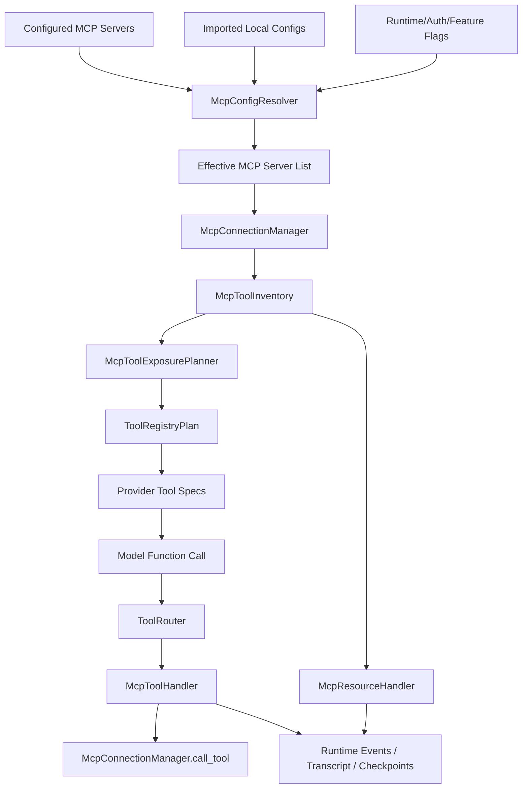

# MCP Codex Alignment Optimization Plan

## 0. Implementation Status

Status: Completed on 2026-04-26.

Completed implementation:

- Added MCP qualified tool naming and collision-safe provider names.
- Added MCP tool inventory snapshots with raw server/tool identity preserved separately from callable names.
- Added direct/deferred MCP exposure inside `ToolRegistryPlan`.
- Added MCP tool schemas to interactive provider tools.
- Added direct MCP tool routing and execution through `McpManager.call_tool`.
- Added MCP search results to `tools.search`.
- Tightened diagnostics `mcp.call` with `serverId` resolution and method whitelist.
- Added dedicated `desktop/src-tauri/src/mcp/config.rs` configured/effective policy resolver.
- Added per-server and per-tool allow/deny, approval mode, required flag, parallel support, startup timeout, tool timeout, and active-time waiting policy.
- Added direct MCP resource tools: `list_mcp_resources`, `list_mcp_resource_templates`, and `read_mcp_resource`.
- Added MCP approval gating through the existing runtime approval queue; approval/elicitation waiting is represented outside active tool timeout.
- Added runtime MCP begin/end and approval-required events plus session transcript/checkpoint markers for MCP tool/resource start/end.
- Added Settings controls for MCP required/enabled/policy/tool timeout/allowlist/denylist/per-tool policy JSON.
- Added local stdio fixture coverage for direct `tools/call`; current verification exercises the same manager path used by the agent runtime.
- Added tests for naming, inventory, exposure, routing, schema generation, resources, per-tool config policy, and manager direct `tools/call`.

## 1. Goal

把 RedConvert desktop 的 MCP 能力从“设置页和 `app_cli` 诊断动作可调用”升级为“和 Codex 高对齐的模型可见工具平面”。

目标不是再新增一批业务顶层工具，而是把外部 MCP server 的工具纳入现有 `ToolRegistryPlan` / `ToolRouter` 体系：

- MCP server 配置、导入、启停、OAuth、probe 仍由 Settings / IPC / `app_cli` 管理。
- MCP tool discovery 由 host runtime 建立结构化 inventory。
- 模型只看到经过 qualification、direct/deferred 策略筛选后的工具。
- 真实执行时保留 raw server/tool identity，不能让模型可见名称成为协议层契约。
- MCP 资源读取与 MCP tool 调用分开处理。
- 权限、超时、日志、transcript、checkpoint、result truncation 进入统一 runtime contract。

本计划延续 [dynamic-tool-exposure-toolrouter-plan.md](/Users/Jam/LocalDev/GitHub/RedConvert/desktop/docs/dynamic-tool-exposure-toolrouter-plan.md) 已完成的底层方向：稳定顶层工具 + turn-scoped plan + deferred discovery。MCP 对齐应该作为这套机制的外部工具扩展，而不是另起一套 agent 调度路径。

## 2. Non Goals

- 不把 MCP 管理动作做成模型常规业务工具。保存配置、导入本机配置、断开 server、OAuth 状态查询应继续是管理/诊断面，不作为默认模型能力。
- 不照搬 Codex 的 `codex_apps` 后端绑定逻辑。RedConvert 可以保留内建能力，但不能把某个账号体系或 connector backend 写死到 MCP effective list 里。
- 不把所有 MCP tool 展开成 `Redbox` action。MCP 是外部协议工具，应该以 MCP tool handler 执行，而不是伪装成 RedBox business action。
- 不依赖 prompt 关键词决定能否调用 MCP。路由必须来自 typed config、tool plan、permission policy、runtime mode 和 session metadata。
- 不在持锁期间做 MCP server 启动、目录扫描、工具列表拉取、resource list 或外部网络请求。

## 3. Current Baseline

### 3.1 RedConvert 已有能力

当前 RedConvert 已经有较完整的 MCP 管理面：

- `desktop/src-tauri/src/commands/mcp_tools.rs`
  - 提供 `mcp:list`、`mcp:call`、`mcp:sessions`、`mcp:list-tools`、`mcp:list-resources`、`mcp:list-resource-templates`、`mcp:save`、`mcp:discover-local`、`mcp:import-local`、`mcp:oauth-status`、`mcp:disconnect`、`mcp:disconnect-all`。
  - `mcp_call_value` 会通过 `invoke_mcp_server` 调用 server，并在有 `session_id` 时写入 `SessionToolResultRecord`。
  - `mcp_import_local_value` 能扫描本机 MCP 配置，合并/覆盖 store 后同步 `McpManager`。
- `desktop/src-tauri/src/mcp/transport.rs`
  - 支持发现 `.mcp.json`、`mcp.json`、`~/.codex/mcp.json` 和 Claude Desktop 配置。
  - 现有 transport 覆盖 stdio、streamable-http、sse，但 http/sse 仍偏手工请求路径。
- `desktop/src-tauri/src/mcp/manager.rs`
  - 已有 `list_tools`、`list_resources`、`list_resource_templates`、`invoke`、`probe`、`sessions`、`session_for_server`、`disconnect` 等管理能力。
- `desktop/src-tauri/src/tools/plan.rs`
  - 已有 session-scoped `ToolRegistryPlan`，能决定 direct/deferred RedBox actions 和 tool plan fingerprint。
- `desktop/src-tauri/src/tools/router.rs`
  - 已把 `InteractiveToolExecutor::prepare_tool_call` 接入 turn-scoped router，用于校验本轮工具可见性和 direct/deferred action。
- `desktop/src-tauri/src/tools/catalog.rs`
  - 目前 MCP 相关 `app_cli` action 主要归在 diagnostics/background-maintenance 语义下。

这说明 RedConvert 缺的不是“能不能连 MCP”，而是“能不能把 MCP server 工具以 Codex 风格进入 agent 工具体系”。

### 3.2 主要缺口

1. MCP tool 没有独立的 model-visible inventory。
   当前只有管理命令能 list/call，缺少每轮可用于 provider schema 的 `McpToolInfo` 列表。

2. raw identity 与 callable identity 没有硬隔离。
   `mcp:call` 直接拿 server + method/payload 执行，更像管理接口，不适合作为模型可见工具执行 contract。

3. MCP tool 还没有进入 `ToolRegistryPlan`。
   RedConvert 已有 direct/deferred RedBox actions，但 MCP tools 还没有 `direct_mcp_tools`、`deferred_mcp_tools`、`mcp_tool_namespaces`。

4. direct call chain 不完整。
   Codex 是 `ResponseItem::FunctionCall` -> `ToolName` -> `ToolPayload::Mcp` -> `McpHandler` -> `handle_mcp_tool_call` -> `McpConnectionManager.call_tool`。RedConvert 当前主要是 `app_cli(action="mcp.call")` 这种间接路径。

5. MCP 资源与 MCP tool 调用混在管理面里。
   Codex 单独提供 resource list/read handler，工具调用 handler 不承担 resource discovery。RedConvert 目前有 list resources IPC，但 agent tool plane 没有明确分层。

6. policy 粒度不足。
   现有权限主要在 ToolRouter / app_cli action 层，不够表达每个 MCP server/tool 的 allow/deny、approval mode、mutating annotation、parallel support、required startup。

7. transport 和 timeout 需要收口。
   当前 stdio 比较接近 persistent session，streamable-http/sse 仍偏 stateless/manual curl；缺少 Codex 式 startup timeout、tool timeout、active-time timeout 和统一 result sanitization。

8. schema/handler 存在边界错位风险。
   现有 `serverId` schema 与 handler 里需要完整 `payload.server` 的实现不完全对齐。管理面可以兼容修正，但模型工具面必须避免这种 contract 漂移。

## 4. Codex Reference Architecture

### 4.1 Configured vs Effective Server List

Codex 不把所有 MCP server 放进一个全局表，而是分层生成 effective list：

1. 用户配置来自 `Config.mcp_servers`。
2. 插件加载结果提供 plugin MCP servers 和 app connectors。
3. `Config::to_mcp_config()` 合并用户配置和 active plugin servers。
4. `effective_mcp_servers()` 在 session runtime 注入或移除内建 server。
5. `McpConnectionManager::new()` 基于最终 effective list 启动连接。

RedConvert 应采用同样边界：

- configured view：用户保存的静态配置，只表达意图。
- imported view：从 Codex/Claude/local project 发现但未必启用的候选配置。
- effective view：结合 workspace、runtime mode、auth、feature flags、enabled 状态后本轮真正参与 agent 的 server。

### 4.2 ToolInfo 双身份

Codex 的 `ToolInfo` 同时保留：

- raw protocol identity：`server_name`、raw `tool.name`。
- model-visible identity：`callable_namespace`、`callable_name`、`canonical_tool_name()`。

这点必须照搬其思想。RedConvert 不能直接把 server id 和 tool method 暴露成模型执行协议，因为：

- server/tool 名可能冲突。
- provider function name 有字符和长度限制。
- 外部 server 原始命名不稳定。
- 模型可见名称需要按 namespace 聚合、去重和安全裁剪。

### 4.3 Tool Qualification

Codex 的 `qualify_tools` 做三件事：

- 对 server/tool/namespace 做 sanitize。
- 用 hash suffix 消解碰撞。
- 保证 provider function name 长度合法。

RedConvert 应新增 `mcp/tool_names.rs`，实现类似规则，但不要机械照搬 Codex 的 64 bytes 常量。RedConvert 需要按当前 provider adapter 的最低公共约束定义 `MAX_MCP_TOOL_NAME_BYTES`，并把这个约束写入测试。

### 4.4 Direct / Deferred Exposure

Codex 不在工具过多时把所有 MCP tool 直接丢给模型。策略是：

- 如果没有 search tool，全部 direct。
- 如果启用了 search tool 且 deferred 候选达到阈值，或 feature flag 强制 defer，则大部分进入 deferred。
- direct 只保留显式启用或当前 connector 关联的少量工具。
- `tool_search` 只有存在 deferred 来源时才注册。

RedConvert 已有 `tools.search` 和 deferred action index，可以把同一策略扩展到 MCP：

- 小工具集：全部 direct。
- 大工具集：只 direct 当前任务相关或用户 pin 的工具，其余进入 deferred MCP index。
- deferred MCP tools 也必须注册 handler，保证搜索后可调用。

### 4.5 Direct MCP Call Chain

Codex 的直接调用链路值得高对齐：

1. Provider 返回 function call。
2. Router 解析 `name/namespace/arguments/call_id`。
3. `resolve_mcp_tool_info()` 反查 callable name 对应的 raw server/tool。
4. Router 构建 `ToolPayload::Mcp { server, tool, raw_arguments }`。
5. Registry dispatch 到 `McpHandler`。
6. `handle_mcp_tool_call()` 做 approval、policy、metadata、begin/end events、sanitization。
7. `McpConnectionManager.call_tool(server, tool, arguments, meta)` 执行协议调用。

RedConvert 现在缺少第 3 到第 6 步的 MCP 专用路径。继续让模型通过 `app_cli mcp.call` 绕过去，会让管理接口、执行接口和权限接口混在一起。

## 5. Architecture Decision

### Option A: Keep MCP As Management Actions

继续保留 `app_cli(action="mcp.call")` 作为模型调用 MCP 的主要方式。

优点：

- 实现成本最低。
- 能复用现有 IPC 和 manager。

缺点：

- 模型需要知道 server/method/payload 细节。
- 无法自然生成 provider function schema。
- direct/deferred、tool search、per-tool policy 都很难做准。
- 管理动作和执行动作边界混乱。

结论：不推荐，仅保留为诊断/兼容入口。

### Option B: Convert MCP Tools Into Redbox Actions

把每个 MCP tool 包装成 `Redbox { resource, operation }` 下的动态 action。

优点：

- 可以复用现有 RedBox action search。
- 模型只看到一个顶层 `Redbox`。

缺点：

- 外部 MCP tool 和内部业务 action 混在同一 namespace。
- raw protocol identity 容易被 action schema 泄漏。
- MCP 资源、OAuth、server policy 会污染 RedBox action contract。
- 未来和外部 MCP 生态对齐困难。

结论：不推荐。

### Option C: Codex-Aligned MCP Tool Plane

新增 MCP 专用 inventory、exposure planner、handler，把 MCP tool 作为 `ToolRegistryPlan` 的一等输入。

优点：

- 和 Codex 调用链路最一致。
- 管理面和执行面清晰分离。
- 能直接支持 provider function schema、tool search、per-tool policy、transcript replay。
- 后续可接入更多 MCP transport 和 OAuth，而不影响 RedBox action。

缺点：

- 需要新增若干 runtime 模块和测试。
- 需要明确模型可见工具名兼容策略。

结论：推荐。后续执行应以 Option C 为唯一目标。

## 6. Target Architecture



核心边界：

- `mcp/*` 负责协议、server、session、inventory、qualification。
- `tools/*` 负责本轮可见性、provider schema、router、handler dispatch。
- `runtime/*` 负责事件、审批、transcript、checkpoint 和模型结果包装。
- `commands/mcp_tools.rs` 只负责 renderer/settings/diagnostics，不再作为 agent 默认 MCP tool execution path。

## 7. Module Implementation Plan

### 7.1 `desktop/src-tauri/src/mcp/config.rs`

新增 RedConvert MCP 配置模型，和现有 store 兼容迁移。

建议结构：

```rust
pub struct RedboxMcpServerConfig {
    pub id: String,
    pub display_name: Option<String>,
    pub transport: RedboxMcpTransportConfig,
    pub enabled: bool,
    pub required: bool,
    pub supports_parallel_tool_calls: bool,
    pub startup_timeout_ms: Option<u64>,
    pub tool_timeout_ms: Option<u64>,
    pub default_tools_approval_mode: McpApprovalMode,
    pub enabled_tools: Option<Vec<String>>,
    pub disabled_tools: Option<Vec<String>>,
    pub per_tool: BTreeMap<String, McpToolPolicy>,
}
```

实现要求：

- `configured_servers()` 只返回用户保存配置。
- `effective_servers(context)` 结合 workspace、runtime mode、feature flag、auth 状态和 enabled 状态。
- import Codex/Claude config 时保持来源 metadata，例如 `source = "codex"`、`source_path`、`imported_at`。
- 禁止把 inline bearer token 写入持久配置。参考 Codex 的 `bearer_token_env_var` / env headers 模式。
- `required = true` 的 server 启动失败时，agent turn 应进入结构化失败；`required = false` 只进入 degraded status。

现成库：

- `serde` / `serde_json` / `toml`。
- 当前 persistence store。

自研：

- RedConvert configured/effective resolver。
- import conflict policy。
- store migration。

### 7.2 `desktop/src-tauri/src/mcp/manager.rs`

把现有 `McpManager` 扩展为 connection manager，而不是只作为 command helper。

新增能力：

- `refresh_effective_servers(effective: BTreeMap<String, RedboxMcpServerConfig>)`。
- `list_all_tools() -> BTreeMap<QualifiedMcpToolName, McpToolInfo>`。
- `resolve_tool_info(name: &ToolName) -> Option<McpToolInfo>`。
- `call_tool(server_id, raw_tool_name, raw_arguments, call_meta)`。
- `read_resource(server_id, uri, call_meta)`。
- `server_status_snapshot()`。

实现要求：

- `list_all_tools` 读取缓存快照；缓存 miss 时异步刷新，不能阻塞持锁状态。
- 每个 server 独立 startup/tool timeout。
- required server 失败必须进入 status snapshot。
- server disconnect / reconnect 必须使 inventory fingerprint 变化。
- stdio、streamable-http、sse 统一成 session trait，不让 handler 知道 transport 细节。

现成库：

- 优先评估 Rust MCP SDK / `rmcp` 能否覆盖 stdio、streamable-http、sse、OAuth 和 elicitation。
- `tokio` timeout / task。

自研：

- manager status snapshot。
- RedConvert transcript metadata。
- cache invalidation 和 fingerprint。

### 7.3 `desktop/src-tauri/src/mcp/tool_names.rs`

新增模型可见工具命名模块。

职责：

- sanitize server namespace。
- sanitize tool name。
- 生成 `mcp__{namespace}__{tool}` 或 provider-compatible 等价形式。
- collision 时追加短 hash。
- 保留 reverse map：qualified name -> raw server id + raw tool name。

测试必须覆盖：

- 同 server 同名 tool 去重。
- 不同 server 同名 tool 去重。
- 非 ASCII、空格、冒号、斜杠、点号。
- 超长名称裁剪后仍唯一。
- provider 最小长度约束。

建议不要把 Codex 的 64 bytes 当常量照搬。RedConvert 应定义自己的 provider adapter 下限，并在 OpenAI-compatible schema 生成处共用。

### 7.4 `desktop/src-tauri/src/mcp/tool_inventory.rs`

新增 MCP inventory 层。

建议结构：

```rust
pub struct McpToolInfo {
    pub server_id: String,
    pub raw_tool_name: String,
    pub callable_namespace: String,
    pub callable_name: String,
    pub canonical_name: String,
    pub title: Option<String>,
    pub description: Option<String>,
    pub input_schema: serde_json::Value,
    pub annotations: McpToolAnnotations,
    pub policy: McpToolPolicy,
    pub source: McpToolSource,
}
```

实现要求：

- raw identity 只用于执行，不写进模型必须遵守的文本协议。
- input schema 原样保留，但 provider schema 生成时需要 sanitize unsupported JSON Schema features。
- annotations 至少表达 `read_only`、`destructive`、`idempotent`、`open_world`。
- inventory snapshot 必须带 fingerprint，写入 `tool_plan` checkpoint。
- inventory 搜索文本包括 canonical name、raw tool name、server display name、title、description、schema property keys、source metadata。

### 7.5 `desktop/src-tauri/src/mcp/tool_exposure.rs`

新增 MCP direct/deferred 策略。

输入：

- `ToolRegistryPlanParams`。
- `RedboxTurnContext`。
- `McpToolInventorySnapshot`。
- session metadata，例如 `enabledMcpServers`、`directMcpTools`、`deferredMcpMode`、`maxDirectMcpTools`。

输出：

- `direct_mcp_tools`。
- `deferred_mcp_tools`。
- `mcp_tool_search_entries`。
- `mcp_tool_namespaces`。

默认策略：

- 无 deferred/search 能力时，所有 enabled MCP tools direct。
- enabled tools 数量小于阈值时，全部 direct。
- 超过阈值时，只 direct 用户 pin、当前 skill/runtime 明确需要、或 session metadata 显式允许的工具。
- 其余进入 deferred MCP index。
- 若没有 deferred MCP 或 deferred RedBox action，不注册 `tools.search`。

阈值建议：

- 首版 `maxDirectMcpTools = 24`。
- `maxDirectMcpServers = 4`。
- 单个 server 超过 `12` 个 tool 时默认 server-level deferred，除非用户 pin。

这些阈值需要作为 config 常量和测试输入，不写死在 prompt。

### 7.6 `desktop/src-tauri/src/tools/plan.rs`

扩展现有 `ToolRegistryPlan`。

新增字段：

```rust
pub direct_mcp_tools: Vec<McpToolInfo>,
pub deferred_mcp_tools: Vec<McpToolInfo>,
pub mcp_tool_namespaces: Vec<String>,
pub mcp_inventory_fingerprint: Option<String>,
pub mcp_exposure_mode: McpExposureMode,
```

要求：

- prompt summary、provider schema、router allowlist 必须来自同一个 plan。
- plan fingerprint 需要包含 MCP inventory fingerprint 和 exposure policy fingerprint。
- checkpoint 记录 direct/deferred MCP 数量、server ids、namespaces，不记录完整敏感 schema。
- `tools.search` 的索引合并 RedBox deferred actions 和 MCP deferred tools，但结果类型要区分 `redbox_action` / `mcp_tool`。

### 7.7 `desktop/src-tauri/src/tools/router.rs`

扩展 router，让 MCP 走独立 payload。

建议增加：

```rust
pub enum PreparedToolCallKind {
    RedboxAction(...),
    InternalTool(...),
    McpTool(McpPreparedToolCall),
    McpResource(McpPreparedResourceCall),
}
```

实现要求：

- 根据 model-visible tool name resolve `McpToolInfo`。
- 保留 `raw_arguments: String`，不要在 router 层过早转成业务结构。
- schema validation 可以在 handler 执行前做，但 validation error 要带 canonical tool name 和 schema path。
- 未 direct 但在 deferred 里的 MCP tool，返回结构化 `TOOL_DEFERRED`，提示用 `tools.search`。
- 不存在的 MCP tool 返回 `TOOL_NOT_AVAILABLE`，附带当前 plan fingerprint。

### 7.8 `desktop/src-tauri/src/tools/registry.rs` And Handlers

新增 MCP handler，不复用 `app_cli` handler。

建议文件：

- `desktop/src-tauri/src/tools/handlers/mcp.rs`
- `desktop/src-tauri/src/tools/handlers/mcp_resource.rs`

`McpToolHandler` 职责：

- policy check。
- approval request。
- mutating/destructive gate。
- request meta 注入。
- begin/end runtime event。
- 调用 `McpManager.call_tool`。
- result sanitization/truncation。
- 写 transcript / tool result record。

`McpResourceHandler` 职责：

- list resources。
- list resource templates。
- read resource。
- resource content truncation 和 MIME handling。

不要把 resource list/read 合并进 generic `mcp.call`。资源是 context acquisition，tool call 是 action execution，风险和结果包装都不同。

### 7.9 `desktop/src-tauri/src/commands/mcp_tools.rs`

保留 Settings / diagnostics / CLI 管理职责，同时收紧边界。

必须修正：

- `serverId` schema 与 handler 所需 `payload.server` 对齐。管理接口允许 `serverId`，内部统一 resolve 成完整 server config。
- `mcp.call` 只允许 diagnostics/test 场景；agent 默认不应通过此 action 调用业务 MCP tool。
- raw method 白名单化，例如只允许 `tools/call`、`tools/list`、`resources/list`、`resources/read` 等协议方法，不允许模型任意传 method。
- `session_id` 缺失时仍返回结构化 execution metadata，但不写 session transcript。
- import local 时区分 `merge`、`overwrite`、`skip_existing`，并记录 import source。

### 7.10 Runtime Events And Transcript

新增事件或扩展现有 tool event：

```json
{
  "type": "mcp_tool_call_begin",
  "callId": "...",
  "serverId": "...",
  "canonicalToolName": "...",
  "rawToolName": "...",
  "argumentsPreview": "...",
  "toolPlanFingerprint": "..."
}
```

结束事件：

```json
{
  "type": "mcp_tool_call_end",
  "callId": "...",
  "serverId": "...",
  "canonicalToolName": "...",
  "success": true,
  "durationMs": 1234,
  "resultTruncated": false,
  "errorCode": null
}
```

要求：

- transcript 记录 canonical name 和 raw execution identity。
- 模型结果只拿 sanitized content。
- 日志可以保存更完整 metadata，但不能保存 secret。
- checkpoint 必须能重建“当轮模型看到了哪些 MCP tools”。

### 7.11 Settings UI

Settings 只做 MCP 管理和观测，不做 ToolRouter 面板。

需要支持：

- server enabled/disabled。
- required 开关。
- per-server startup/tool timeout。
- allow/deny tools 列表。
- per-tool approval mode。
- import source 展示。
- tool inventory refresh/probe。
- OAuth status。

不要新增面向普通用户的 “ToolRegistryPlan 诊断 UI”。故障排查走 logs、checkpoint、session transcript。

### 7.12 AI Prompt And Skills

prompt 不应列出所有 MCP tool 文本说明。正确方式：

- provider schema 直接暴露 direct MCP tool。
- prompt summary 只说明 MCP tool policy 和 deferred discovery 方式。
- 大工具集提示模型先用 `tools.search`，不要手写 server method。
- skill 可以通过 typed metadata 请求某些 MCP server/tool pin 到 direct。

## 8. Libraries vs Self-Built

### 8.1 Must Use Existing Libraries

- MCP protocol client：优先评估 `rmcp` 或成熟 Rust MCP SDK，覆盖 stdio、streamable-http、SSE、OAuth、elicitation。
- JSON Schema handling：用 `serde_json`，必要时引入 schema validation crate；不要手写字符串检查 schema。
- Async runtime：继续用 `tokio`，timeout、spawn、cancellation 走标准能力。
- TOML/JSON config parsing：使用 `toml`、`serde_json`。
- UI icons：Settings 控件继续使用现有 icon/library 体系。

### 8.2 Must Self Build

- RedConvert configured/effective server resolver。
- MCP tool qualification 和 reverse mapping。
- MCP direct/deferred exposure planner。
- `ToolRegistryPlan` 中 MCP 字段和 fingerprint。
- MCP permission policy 与 approval integration。
- runtime event/transcript/checkpoint contract。
- Settings 的 RedConvert-specific MCP 管理体验。

### 8.3 Should Not Build

- 不自研 MCP wire protocol parser。
- 不自研 OAuth flow primitives。
- 不自研通用 JSON parser/schema parser。
- 不自研一套和 `ToolRegistryPlan` 平行的 MCP router。

## 9. Performance Strategy

1. Lazy startup with stale snapshot。
   App 启动时不阻塞 agent 首轮。先使用上次成功 inventory snapshot，后台刷新 server status；如果 required server 缺失，再在 turn validation 给出结构化失败。

2. Per-server parallel refresh。
   server tools/resources list 可以并发，但每个 server 内部按 transport 能力决定是否并行。

3. No lock during I/O。
   manager 持锁只读 server/session snapshot；外部进程、网络、resource list、schema sanitize 全部在锁外完成。

4. Fingerprint-based rebuild。
   server config、enabled 状态、tool inventory、exposure policy 变化才重建 `ToolRegistryPlan`。

5. Direct tool budget。
   控制 provider schema 大小。超过阈值进入 deferred search，不把几百个 MCP tool 每轮塞给模型。

6. Result truncation。
   tool result、resource content、image/blob metadata 走统一 truncation；大结果写文件/引用，模型只拿摘要和 handle。

7. Active-time timeout。
   如果 MCP tool 触发用户确认/elicitation，timeout 应区分 active execution time 和等待用户时间。

8. Startup health cache。
   server 启动失败不要每轮重复拉起；按 backoff 和用户手动 refresh 触发重试。

## 10. Security And Policy

### 10.1 Policy Dimensions

每个 server/tool 至少支持：

- `enabled`。
- `required`。
- `read_only`。
- `destructive`。
- `default_approval_mode`。
- `per_tool_approval_mode`。
- `allow_tools`。
- `deny_tools`。
- `supports_parallel_tool_calls`。
- `tool_timeout_ms`。

### 10.2 Approval Modes

建议枚举：

- `never`：只允许明确 read-only 且低风险工具。
- `on_request`：模型请求时弹出确认。
- `always`：每次调用都确认。
- `trusted`：用户显式信任的本地 server，可按 policy 自动执行。

默认值应保守：

- 外部 HTTP/SSE server 默认 `on_request`。
- 本地 stdio server 默认 `on_request`。
- read-only 且无外部 side effect 的资源读取可 `never`。
- destructive/unknown annotation 必须确认。

### 10.3 Secret Handling

- 不把 token 写入 transcript。
- 不把 inline bearer token 保存到配置文件。
- env var name 可以显示，env var value 不显示。
- MCP request meta 中禁止携带完整 user secret。

### 10.4 Raw Method Boundary

agent 不应该拥有任意 raw MCP method 调用能力。允许的模型执行入口只有：

- qualified MCP tool call。
- resource list/read。
- tool search。

`mcp.call` 保留给 diagnostics，需要显式 runtime/admin 权限。

## 11. Execution Work Packages

这些 work package 是一次完整改造中的原子提交边界。真正执行时不应只做某一个 package 就宣称 MCP 对齐完成；必须在同一轮实施计划中把 direct call、exposure、policy、验证闭环做完。

### WP1: Config And Management Contract

目标：

- 新增 `mcp/config.rs`。
- 保存 configured/effective split。
- 修正 `serverId` 与 full server config resolve。
- 给 `mcp.call` 增加 diagnostics-only guard 和 method whitelist。

主要文件：

- `desktop/src-tauri/src/mcp/config.rs`
- `desktop/src-tauri/src/mcp/mod.rs`
- `desktop/src-tauri/src/commands/mcp_tools.rs`
- `desktop/src/pages/settings/*`

验证：

- 导入 `~/.codex/mcp.json`。
- 保存 enabled/disabled。
- `mcp:list` 返回 configured/effective/status。
- diagnostics `mcp.call` raw method 不在白名单时被拒绝。

### WP2: MCP Inventory And Tool Names

目标：

- 新增 `tool_names.rs` 和 `tool_inventory.rs`。
- `McpManager.list_all_tools()` 返回 qualified inventory。
- 保存 raw identity -> callable identity reverse map。

主要文件：

- `desktop/src-tauri/src/mcp/tool_names.rs`
- `desktop/src-tauri/src/mcp/tool_inventory.rs`
- `desktop/src-tauri/src/mcp/manager.rs`

验证：

- mock server 提供重复工具名。
- qualified name 不冲突。
- 超长/非法字符工具名仍能生成合法 provider name。
- inventory fingerprint 在工具列表变化后变化。

### WP3: MCP Exposure In ToolRegistryPlan

目标：

- 新增 `mcp/tool_exposure.rs`。
- 扩展 `ToolRegistryPlan`，加入 direct/deferred MCP tools。
- 合并 MCP deferred search entries 到 `tools.search`。

主要文件：

- `desktop/src-tauri/src/mcp/tool_exposure.rs`
- `desktop/src-tauri/src/tools/plan.rs`
- `desktop/src-tauri/src/tools/action_search.rs`
- `desktop/src-tauri/src/runtime/turn_context.rs`

验证：

- 小工具集全部 direct。
- 大工具集按阈值 deferred。
- session metadata pin 的工具保持 direct。
- `tools.search` 只在存在 deferred 来源时可见。
- checkpoint 写入 MCP direct/deferred 统计。

### WP4: Direct MCP Tool Router And Handler

目标：

- Router 能把 model-visible MCP tool 转成 raw server/tool execution payload。
- 新增 `McpToolHandler`。
- 不再通过 `app_cli mcp.call` 执行 agent MCP tool。

主要文件：

- `desktop/src-tauri/src/tools/router.rs`
- `desktop/src-tauri/src/tools/registry.rs`
- `desktop/src-tauri/src/tools/handlers/mcp.rs`
- `desktop/src-tauri/src/tools/executor.rs`
- `desktop/src-tauri/src/interactive_runtime_shared.rs`

验证：

- 模型可直接调用 direct MCP tool。
- deferred MCP tool 直接调用会返回 `TOOL_DEFERRED`。
- 不存在的 MCP tool 返回 `TOOL_NOT_AVAILABLE`。
- handler 写 begin/end event 和 transcript record。
- raw arguments 保持字符串，handler 层再 validate。

### WP5: MCP Resource Tools

目标：

- 新增 MCP resource handler。
- `list_mcp_resources`、`list_mcp_resource_templates`、`read_mcp_resource` 与 tool call 分开。

主要文件：

- `desktop/src-tauri/src/tools/handlers/mcp_resource.rs`
- `desktop/src-tauri/src/mcp/resources.rs`
- `desktop/src-tauri/src/tools/plan.rs`

验证：

- resource list 不需要暴露 raw tool call。
- read resource 有 MIME/truncation。
- resource read 失败不会污染 tool inventory。

### WP6: Transport, Timeout, OAuth, Elicitation

目标：

- 评估并迁移/封装 MCP SDK。
- 统一 stdio/http/sse session trait。
- 支持 startup/tool timeout、OAuth 状态、elicitation active-time pause。

主要文件：

- `desktop/src-tauri/src/mcp/session.rs`
- `desktop/src-tauri/src/mcp/transport.rs`
- `desktop/src-tauri/src/mcp/manager.rs`
- `desktop/src-tauri/src/commands/mcp_tools.rs`

验证：

- stdio mock server。
- streamable-http mock server。
- timeout server。
- OAuth required server。
- elicitation/waiting-user 场景不错误计入 active execution timeout。

### WP7: Runtime Events, Transcript, Diagnostics

目标：

- 完成 MCP tool begin/end events。
- tool result envelope 增加 MCP metadata。
- Settings 保持管理面，日志/checkpoint 支持复盘。

主要文件：

- `desktop/src-tauri/src/runtime/*`
- `desktop/src-tauri/src/commands/mcp_tools.rs`
- `desktop/src/runtime/runtimeEventStream.ts`
- `desktop/src/pages/settings/*`

验证：

- session-transcripts 能看到 canonical/raw identity。
- checkpoint 能还原当轮 direct/deferred MCP tools。
- Settings 能显示 server status 和 tool inventory refresh result。

## 12. End-To-End Verification Matrix

| Scenario | Expected Result |
| --- | --- |
| Import Codex MCP config | configured server 被导入，source metadata 正确，secret 不落盘 |
| Disabled server | 不进入 effective list，不出现在 tool inventory |
| Required server startup failure | agent turn 给结构化 failure，Settings 显示失败状态 |
| Small tool set | MCP tools 直接出现在 provider schema |
| Large tool set | direct 工具受预算限制，其余进入 `tools.search` |
| Direct MCP call | Router resolve callable name，Handler 调 raw server/tool |
| Deferred MCP direct call | 返回 `TOOL_DEFERRED`，提示 search |
| Resource read | resource handler 执行，不走 generic tool call |
| Approval reject | MCP tool 不执行，transcript 记录 rejected |
| Timeout | handler 返回 structured timeout，server status 可观测 |
| Large result | 模型结果被截断，完整结果落 handle/log |
| Session replay | checkpoint 能解释当轮工具可见性 |

## 13. Recommended Implementation Order

推荐顺序：

1. WP1 + WP2。
   先修配置和 inventory，因为后续 plan/router 都依赖稳定 identity。

2. WP3。
   把 MCP tool 纳入 `ToolRegistryPlan`，让 provider schema、prompt summary、router allowlist 同源。

3. WP4 + WP5。
   接 direct tool handler 和 resource handler，完成 Codex 式调用链路。

4. WP6。
   transport、timeout、OAuth、elicitation 收口；如果 SDK 迁移风险高，可以先用 trait 包住现有实现，再逐步替换内部 transport。

5. WP7。
   补齐 runtime event、transcript、Settings status 和验证证据。

不推荐先做 UI。MCP 对齐的核心风险在 identity、exposure、handler、policy；UI 只能展示状态，不能替代底层 contract。

## 14. Definition Of Done

这项改造完成必须同时满足：

- agent 能直接调用 enabled MCP tool，不经过 `app_cli mcp.call`。
- MCP tool 有 qualified model-visible name 和 raw execution identity。
- MCP tools 进入 `ToolRegistryPlan`，并支持 direct/deferred。
- `tools.search` 能发现 deferred MCP tools，并且搜索后可调用。
- MCP resources 有独立 list/read handler。
- Settings 仍能管理、导入、probe、disconnect server。
- 每轮 checkpoint 记录 MCP exposure snapshot。
- transcript 记录 MCP tool call begin/end/result。
- per-server/per-tool policy 能拒绝未授权调用。
- cargo tests 覆盖 naming、exposure、router、handler、policy。
- 至少跑过一个真实 stdio MCP server 的 agent call。

Completion evidence:

- Direct MCP tool execution uses `InteractiveToolExecutor::dispatch_mcp_tool` and `McpManager::call_tool`; diagnostics `mcp.call` remains guarded and separate.
- `tool_plan` checkpoint is written whenever interactive provider tools are generated and includes MCP inventory fingerprint, exposure mode, namespaces, direct tools, deferred count, and resource tool availability.
- MCP tool/resource start, end, and approval-required markers are written to runtime events, session checkpoints, and session transcripts when a session id is present.
- Per-server and per-tool policy is resolved from `oauth.redbox`, including allow/deny, approval mode, `perTool`, tool timeout, parallel support, and active-time waiting behavior.
- The local stdio MCP fixture used by `mcp::manager::tests::manager_resolves_and_calls_qualified_mcp_tool` exercises the same direct manager `tools/call` path used by agent execution.
