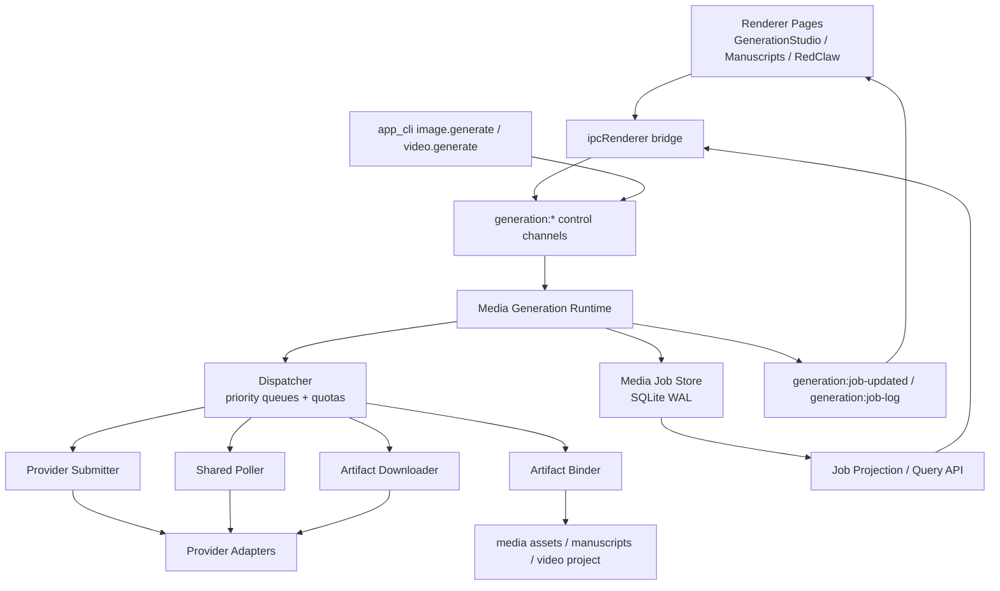

# 独立 Media Generation Runtime 升级计划

## 1. 目标

把当前分散在页面、`image-gen:generate` / `video-gen:generate` channel、`media_generation.rs` 里的生图/生视频执行逻辑，升级为一个独立的 `Media Generation Runtime`。

最终必须满足：

1. 再创作页面、稿件内生成、RedClaw 生图/生视频，全部共享同一个底座。
2. 任务一旦进入 runtime，就不因后续任务变多而失败。
3. 同时大量发布任务时，不出现“一个长任务把后面全部堵死”的结构性阻塞。
4. 应用刷新、页面切换、进程重启后，任务能恢复，不丢状态，不丢 provider task id。
5. UI 与 AI tool 只负责“提交任务”和“消费任务状态”，不再直接承担执行生命周期。

这不是现有 `image-gen:generate` / `video-gen:generate` 的修补，而是底座替换。

## 2. 当前问题判定

当前实现的核心问题不是单点 bug，而是执行模型选错了：

- 页面直接等待 `invoke('image-gen:generate')` / `invoke('video-gen:generate')` 返回最终结果。
- host 在一次 IPC 生命周期里完成：
  - 提交 provider
  - 轮询状态
  - 下载结果
  - 落盘
  - 写媒体库
- 多图批处理只是局部 `thread::spawn`，不是全局调度。
- 视频轮询是“每个任务自己睡眠 + 自己轮询”，天然浪费线程。
- RedClaw 的 scheduler 可以恢复自动化任务，但并不是为高并发媒体任务设计的 runtime。
- `AppStore` 当前适合业务快照，不适合承担高频任务状态存储。

所以现状天然无法同时做到：

- 高并发提交
- 公平调度
- 强恢复
- 低阻塞
- UI 状态一致性

## 3. 方案对比

### 方案 A：在现有 channel 外面补 semaphore

做法：

- 保留 `image-gen:generate` / `video-gen:generate`
- 外围加全局并发限制

优点：

- 代码改动最小
- 短期可降一部分爆炸风险

缺点：

- 任务仍然没有 durable `job_id`
- 进程重启后无法继续接管
- 轮询仍然阻塞 worker
- 交互任务与批任务仍然抢同一条执行链

结论：

- 只能算热修，不满足目标。

### 方案 B：直接复用 RedClaw 现有 scheduler

做法：

- 把图片/视频生成改造成 RedClaw job definition / execution
- 复用 lease / retry / heartbeat

优点：

- 有恢复与执行状态机基础
- 能较快拿到 job lifecycle

缺点：

- 现有 runner 偏顺序执行，不适合高并发媒体任务
- 文本自动化与媒体执行耦合，会把两个域都复杂化
- 视频轮询、下载、结果绑定不适合继续放在 RedClaw runner 内

结论：

- 可借鉴机制，不应直接承载媒体 runtime。

### 方案 C：独立 Media Generation Runtime

做法：

- 新建独立 runtime，复用 RedClaw 的 lease / retry / checkpoint 思想
- 不复用它的执行循环
- 所有生图/生视频入口统一提交到新 runtime

优点：

- 架构边界正确
- 适合高并发与长轮询任务
- 可针对 provider 差异做专门适配
- 最容易做到 UI、AI、媒体库三方统一

缺点：

- 改动面最大
- 需要一次性收口入口和持久化模型

结论：

- 这是唯一满足目标的最优解。

## 4. 最终推荐架构

## 5. 模块设计

## 5.1 Renderer / UI 层

目标：页面只提交任务和显示任务，不再等待最终媒体结果。

### 页面改造范围

- `desktop/src/pages/GenerationStudio.tsx`
- `desktop/src/pages/Manuscripts.tsx`
- `desktop/src/pages/RedClaw.tsx`
- 新增 `desktop/src/features/media-jobs/*`

### UI 实现方式

新增统一任务模型：

- `submitImageJob(request) -> { jobId }`
- `submitVideoJob(request) -> { jobId }`
- `listJobs(filter)`
- `getJob(jobId)`
- `cancelJob(jobId)`
- `retryJob(jobId)`
- `subscribeJobEvents()`

页面改造原则：

- 点击“开始生图/生视频”后只拿 `jobId` 和即时 accepted 状态。
- feed / 卡片显示来自 job projection，而不是本地 `isGenerating` 布尔状态。
- 刷新时先展示最近一次成功的 job 列表，再后台刷新。
- 页面切换不能清空任务列表。
- 稿件页在任务完成后通过 binder 回写素材列表，不自己拼结果。

### 必须自研

- `useMediaJobsStore`
- `useMediaJobSubscription`
- job projection 到页面卡片状态映射

### 必须用现成机制

- React 现有页面结构与状态管理习惯
- `window.ipcRenderer`

## 5.2 Bridge 层

位置：

- `desktop/src/bridge/ipcRenderer.ts`

新增 canonical channel：

- `generation:submit-image`
- `generation:submit-video`
- `generation:list-jobs`
- `generation:get-job`
- `generation:cancel-job`
- `generation:retry-job`
- `generation:get-job-artifacts`

兼容策略：

- 旧 `image-gen:generate` / `video-gen:generate` 暂时保留
- 但内部实现改成：
  - 提交 job
  - 等待该 job 完成
  - 仅为兼容旧页面/旧 tool 返回 legacy envelope

这样可以平滑切换，不强制一次性删光旧入口。

## 5.3 Host Control Plane

位置：

- 新增 `desktop/src-tauri/src/commands/media_jobs.rs`

职责：

- 参数校验
- 创建 job
- 查询 job
- 取消/重试
- 事件装配

明确不承担：

- provider 调用
- 轮询
- 下载
- 结果绑定

`main.rs` 只负责接线，不写业务逻辑。

## 5.4 Media Runtime Core

位置建议：

- `desktop/src-tauri/src/media_runtime/mod.rs`
- `desktop/src-tauri/src/media_runtime/types.rs`
- `desktop/src-tauri/src/media_runtime/store.rs`
- `desktop/src-tauri/src/media_runtime/dispatcher.rs`
- `desktop/src-tauri/src/media_runtime/submitter.rs`
- `desktop/src-tauri/src/media_runtime/poller.rs`
- `desktop/src-tauri/src/media_runtime/downloader.rs`
- `desktop/src-tauri/src/media_runtime/binder.rs`
- `desktop/src-tauri/src/media_runtime/recovery.rs`
- `desktop/src-tauri/src/media_runtime/events.rs`

### 状态机

统一 job 状态：

- `accepted`
- `queued`
- `submitting`
- `submitted`
- `polling`
- `downloading`
- `persisting`
- `binding`
- `completed`
- `failed`
- `cancel_requested`
- `cancelled`
- `dead_lettered`

attempt 状态：

- `running`
- `failed_retryable`
- `failed_terminal`
- `completed`

关键原则：

- `submit`、`poll`、`download`、`bind` 是分段状态，不允许一个 worker 长时间霸占任务。
- 视频任务提交后应尽快释放 submit worker，转交共享 poller。
- 图片任务如果 provider 直接回图，也仍然走统一状态机，只是跳过 `polling`。

## 5.5 持久化层

推荐：继续使用仓库已存在的 `rusqlite`，不新增第二套数据库技术栈。

原因：

- 仓库已经依赖 `rusqlite`
- 本地 durable queue 对 SQLite 非常适合
- 需求重点是强恢复和简单部署，不是跨进程分布式

数据库模式：

### `media_jobs`

- `job_id`
- `kind` (`image` / `video`)
- `source` (`generation_studio` / `manuscripts` / `redclaw` / `tool`)
- `priority` (`interactive` / `batch` / `background`)
- `status`
- `provider_key`
- `provider_model`
- `request_json`
- `result_json`
- `project_id`
- `manuscript_path`
- `video_project_path`
- `owner_session_id`
- `created_at`
- `updated_at`
- `completed_at`
- `cancel_reason`

### `media_job_attempts`

- `attempt_id`
- `job_id`
- `attempt_no`
- `status`
- `provider_task_id`
- `provider_status_url`
- `idempotency_key`
- `lease_owner`
- `lease_expires_at`
- `next_poll_at`
- `retry_not_before_at`
- `last_error`
- `created_at`
- `updated_at`

### `media_job_artifacts`

- `artifact_id`
- `job_id`
- `kind`
- `relative_path`
- `absolute_path`
- `mime_type`
- `preview_url`
- `metadata_json`
- `created_at`

### `media_job_events`

- `event_id`
- `job_id`
- `attempt_id`
- `event_type`
- `message`
- `payload_json`
- `created_at`

### 存储策略

- SQLite 开启 WAL。
- runtime 高频状态写入全部走 SQLite。
- `AppStore` 只保留最终业务产物，不承担任务运行日志。

## 5.6 Dispatcher 与并发策略

这是本次升级的核心。

### 队列模型

按三维拆队列：

- `kind`: image / video
- `provider`: openai / gemini / redbox / dashscope / jimeng ...
- `priority`: interactive / batch / background

推荐算法：

- `Weighted Fair Queue`

权重：

- interactive = 5
- batch = 2
- background = 1

效果：

- 用户手动点的单任务不会被 RedClaw 批量图任务压死。
- 批量任务可以持续推进，但不能长期霸占资源。

### 全局并发配额

建议默认：

- 图片 submit：每 provider 8
- 图片 download：每 provider 8
- 视频 submit：每 provider 4
- 视频 poll：共享 128 个 polling slot
- 视频 download：每 provider 3
- binder：全局 4

注意：

- `poll` 不是“线程数”，而是共享 async timer 里的活跃轮询槽位。
- 任何一个 job 只占自己当前阶段的配额。

### 为什么不会排队阻塞

因为任务不再从头到尾独占一个执行线程，而是：

1. submit 成功后立即释放 submit 配额
2. 进入 `submitted/polling`
3. 到 `next_poll_at` 才被共享 poller 再次拿起
4. 结果 ready 后才占 download 配额
5. binder 完成后结束

这会把“长视频任务堵死队列”的问题拆开。

## 5.7 Provider Adapter 层

位置建议：

- `desktop/src-tauri/src/media_runtime/providers/mod.rs`
- `.../providers/openai_images.rs`
- `.../providers/gemini_images.rs`
- `.../providers/redbox_video.rs`
- `.../providers/dashscope.rs`
- `.../providers/jimeng.rs`

### 现成库必须使用

- `reqwest::Client`

原因：

- 现有仓库已依赖 `reqwest`
- 可以统一连接池、超时、重试、header、中断
- 适合 async poller

### 当前 `media_generation.rs` 的处理原则

- 保留：
  - payload 标准化
  - provider-specific request body 组装
  - response 解析辅助函数
- 下沉：
  - 提交、轮询、下载，不再由 `commands/generation.rs` 直接驱动

### Provider contract

统一 trait：

- `submit(job_request) -> SubmitResult`
- `poll(attempt) -> PollResult`
- `download_ready_artifact(attempt) -> DownloadResult`
- `cancel(attempt) -> CancelResult`

其中：

- `SubmitResult` 必须返回 `provider_task_id` 或“直接结果”
- `PollResult` 只返回结构化状态，不直接写文件
- 任何 provider 差异都不允许泄漏到 UI/dispatcher

## 5.8 视频处理层

视频生成不是视频编辑。

本次 runtime 只负责：

- provider 视频生成任务提交
- 状态轮询
- 成果下载
- 绑定到媒体库 / 稿件 / video project

明确不负责：

- ffmpeg 剪辑
- remotion 合成
- timeline 编辑

### 与视频编辑器的边界

- runtime 成功产出视频文件后，由 binder 调 `manuscripts:add-package-clip`
- 编辑器继续通过现有 `manuscripts:*` / `video project` 能力消费这个素材
- runtime 不直接改 timeline 结构

这能保证媒体生成底座稳定，不把视频编辑复杂性带进来。

## 5.9 Artifact Binder

位置：

- `desktop/src-tauri/src/media_runtime/binder.rs`

职责：

- 原子写文件：`tmp -> fsync -> rename`
- 生成 `MediaAssetRecord`
- 写入媒体库
- 根据任务来源执行后处理：
  - `generation_studio`: 只写媒体库
  - `manuscripts`: 写媒体库 + 可选绑定稿件
  - `tool`: 写媒体库 + 返回 tool envelope
  - `redclaw`: 写媒体库 + 发 runner 事件 + 写 artifact 摘要

关键规则：

- 文件落盘与业务绑定分两步，不在同一个巨大锁里完成。
- 即使 binder 崩溃，只要文件已安全落盘，恢复时也能根据 artifact 记录补绑定。

## 5.10 Recovery / Lease / Retry

独立 runtime 复用 RedClaw 的思想，但为媒体任务定制。

### Lease

- 每个 attempt 在当前执行阶段持有短租约
- `submit`、`download`、`bind` 阶段用 lease
- `polling` 不长期持租约，只记录 `next_poll_at`

### 恢复

启动时：

1. 扫描 `submitting/downloading/persisting/binding`
2. 回收过期 lease
3. 对已有 `provider_task_id` 的任务继续 poll
4. 对已经下载但未绑定的任务重新 bind

### 重试

- `submit` 失败：指数退避，最多 3 次
- `poll` 失败：轻量重试，最多 20 次网络失败，不重建 provider task
- `download` 失败：最多 5 次
- `bind` 失败：最多 5 次

### dead letter

满足任一条件进入 dead letter：

- provider 明确返回 terminal failed
- 超过最大重试次数
- 数据不一致，且自动修复失败

## 5.11 AI / Tool 集成

### 工具层调整

`app_cli` 里的：

- `image.generate`
- `video.generate`

不再直接调用最终生成 channel，而是提交 job。

建议输出改成：

- `ok`
- `action`
- `data.jobId`
- `data.status`
- `data.acceptedAt`
- `data.legacyAssets` 可选

对于需要同步兼容的调用：

- 增加 `waitForCompletion=true`
- 仅兼容旧链路，不作为默认模式

### Tool catalog

当前 `concurrency_safe: false` 的 `image.generate` / `video.generate`，在 runtime 完成后应改为 `true`。

原因：

- 并发安全不应依赖“工具少调用”
- 应由 runtime 保证

### Prompt / Skill 边界

- prompt、skills、subject reference、storyboard prompt 编译，仍留在 AI/tool 层
- runtime 只接收 typed payload
- runtime 不做基于文本关键词的路由判断

## 6. 现成库与自研边界

## 6.1 必须使用现成库

- `reqwest`
  - HTTP 客户端、连接池、multipart、取消、超时
- `rusqlite`
  - SQLite WAL、durable queue、索引与恢复
- `tokio`
  - async timer、Semaphore、mpsc、任务调度
- `tracing`
  - job/attempt/provider 分层日志与指标

## 6.2 必须自研

- 多队列公平调度器
- provider capability contract
- 媒体任务状态机
- recovery / lease / retry 规则
- artifact binder
- UI projection store
- RedClaw / 页面 / 稿件 三类来源的统一绑定协议

## 6.3 明确不推荐

- 继续用 shell `curl` 作为主执行链
- 继续把任务过程状态塞进 `AppStore`
- 继续让页面自己等待最终结果
- 继续让视频轮询按任务独占线程

## 7. 性能优化策略

### 提交链

- accepted 响应必须在 job 入库后立即返回
- provider submit 与 UI 返回解耦

### 轮询链

- 改成 shared async poller
- 不再 `thread::sleep` per task
- `next_poll_at` 用最小堆或时间轮组织

### 下载链

- 同 provider 连接复用
- 大文件流式下载到临时文件
- 成功后 rename

### 引用素材链

- 参考图 / 首尾帧做 content-addressed cache
- 避免同图重复 base64/上传

### UI 链

- 事件做 100-200ms 合并
- 首屏只拉 summary
- 详情按需获取

### 存储链

- 高频状态入 SQLite
- 最终资产再同步到媒体库
- 避免每次 job 状态变化都 clone 整个 store

## 8. 兼容与迁移策略

### 第一原则

- 新 runtime 上线前，不中断现有页面能力。

### 兼容阶段

1. 新增 `generation:submit-*` 与 query API
2. 旧 `image-gen:generate` / `video-gen:generate` 改为 compat wrapper
3. 页面逐个改成 job 模式
4. AI tool 改成 job-first
5. 最后再把旧 synchronous 路径收缩为内部兼容层

### 数据迁移

- 不迁移旧 work item 为新 job
- 只从新版本开始写 media_jobs 表
- 旧产物仍保留在媒体库

## 9. 验证矩阵

### 功能验证

- GenerationStudio 生图、生视频提交
- 稿件内生图、生视频提交
- RedClaw 发起 image/video 任务
- 任务完成后媒体库可见
- 视频任务完成后可绑定到 video project

### 稳定性验证

- 同时 100 个图片任务
- 同时 20 个视频任务
- 提交后立刻刷新页面
- 提交后切换页面再回来
- 执行中强杀进程再重启
- provider 返回 task id 但轮询期间网络抖动

### 性能验证

- accepted 响应延迟
- 活跃 poll 数
- submit worker 饱和度
- download throughput
- binder 队列长度

### 回归验证

- 旧 `image-gen:generate` / `video-gen:generate` compat 行为
- 旧媒体库读写
- 稿件素材绑定
- RedClaw runner 状态页

## 10. Atomic Commit 计划

严格按一个提交只做一件事：

1. 新增 `media_runtime` 基础类型、SQLite schema、store 读写。
2. 新增 `commands/media_jobs.rs` 和 `generation:*` 提交/查询/取消 IPC。
3. 实现 dispatcher、lease、retry、recovery，不接 provider。
4. 实现图片 provider adapter 与图片 artifact binder。
5. 实现视频 provider adapter、shared poller、下载器。
6. 把旧 `image-gen:generate` / `video-gen:generate` 改为 compat wrapper。
7. 改 `ipcRenderer` 与 `GenerationStudio` 到 job 模式。
8. 改 `Manuscripts` 到 job 模式，并补素材绑定。
9. 改 `app_cli` / `tool catalog` / RedClaw 接入新 runtime。
10. 补 diagnostics、测试、文档和验证脚本。

## 11. 最终裁决

最优解不是继续修补 `commands/generation.rs`，也不是把媒体任务直接塞进 RedClaw runner。

最优解是：

- 用现有 `reqwest + rusqlite + tokio + tracing`
- 新建独立 `Media Generation Runtime`
- 统一所有生图/生视频入口
- 用多队列公平调度 + 分段状态机 + durable store + shared poller
- 让 UI、AI、媒体库都只面向 job，而不是面向一次性同步执行

这条路线改动大，但方向正确，而且是唯一能同时满足“稳固”“可恢复”“高并发不堵塞”的方案。
