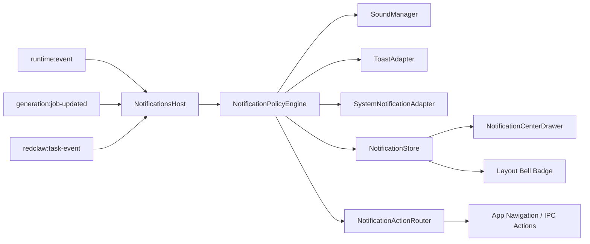

# RedBox Notification Center Architecture Plan

## Goal

为 `desktop/` 主产品增加一套统一通知中心，满足以下目标：

1. 关键任务完成时可以发出声音提醒。
2. 应用内可以出现统一风格的弹窗提醒，而不是页面各自实现。
3. 后台运行的 AI / 媒体 / RedClaw 任务都能复用同一套通知策略。
4. 通知规则可配置，可扩展，可去重，可观测，不依赖页面局部状态硬编码。

本方案不做“某个页面顺手 `toast + Audio`”的零散实现，而是建立正式通知架构。

## Final Decision

推荐采用三层式方案：

1. Host 继续负责发业务事件，不直接负责最终通知策略。
2. Renderer 新增统一 `NotificationsHost`，集中做事件归一化、策略判断、声音播放、应用内弹窗、系统通知调用。
3. 设置统一走现有 `getSettings/saveSettings`，通过 `notifications_json` 管理通知配置。

这是当前仓库里最稳妥、侵入最小、后续扩展成本最低的方案。

## Why This Design

对比三种可选方案：

### 方案 A：页面内分散实现

- 做法：在 `Chat`、`GenerationStudio`、`RedClaw`、`Workboard` 里各自监听事件并播放声音。
- 优点：实现快。
- 缺点：
  - 逻辑分散，后续很难统一规则。
  - 同一事件容易被多个页面重复提醒。
  - 无法统一静默时段、去重、合并、全局未读数。
  - 页面卸载、切换时容易丢通知。

结论：不推荐。

### 方案 B：Rust Host 统一负责全部通知

- 做法：所有通知策略都下沉到 Tauri Rust 层。
- 优点：系统通知、后台态通知更稳定。
- 缺点：
  - Host 不容易拿到“当前用户正在看哪个页面 / 哪个 session”的前端上下文。
  - 应用内弹窗最终仍要回到前端。
  - 声音策略与页面活跃态耦合，Host 难以做出准确判断。

结论：不推荐做主方案。

### 方案 C：Host 发业务事件，Renderer 统一通知中心

- 做法：保持现有事件来源，新增 renderer 侧通知中心作为统一消费层。
- 优点：
  - 符合当前 `window.ipcRenderer` + `runtime:event` 架构。
  - 可以读取当前页面、当前 session、窗口焦点、静默配置。
  - 应用内 toast、声音、系统通知可统一编排。
  - 后续再加通知中心抽屉、未读数、历史记录都自然。

结论：推荐采用。

## Current Architecture Baseline

当前仓库可直接复用的基础设施：

- Host -> renderer 事件桥：[`desktop/src/bridge/ipcRenderer.ts`](/Users/Jam/LocalDev/GitHub/RedConvert/desktop/src/bridge/ipcRenderer.ts)
- 统一 runtime 事件流：[`desktop/src/runtime/runtimeEventStream.ts`](/Users/Jam/LocalDev/GitHub/RedConvert/desktop/src/runtime/runtimeEventStream.ts)
- 媒体任务事件：[`desktop/src-tauri/src/media_runtime/mod.rs`](/Users/Jam/LocalDev/GitHub/RedConvert/desktop/src-tauri/src/media_runtime/mod.rs)
- RedClaw 运行态事件：[`desktop/src-tauri/src/commands/redclaw.rs`](/Users/Jam/LocalDev/GitHub/RedConvert/desktop/src-tauri/src/commands/redclaw.rs)
- 应用顶层容器：[`desktop/src/App.tsx`](/Users/Jam/LocalDev/GitHub/RedConvert/desktop/src/App.tsx)
- 顶层布局：[`desktop/src/components/Layout.tsx`](/Users/Jam/LocalDev/GitHub/RedConvert/desktop/src/components/Layout.tsx)
- 现有全局弹窗 host：[`desktop/src/components/AppDialogsHost.tsx`](/Users/Jam/LocalDev/GitHub/RedConvert/desktop/src/components/AppDialogsHost.tsx)
- 设置页：[`desktop/src/pages/Settings.tsx`](/Users/Jam/LocalDev/GitHub/RedConvert/desktop/src/pages/Settings.tsx)
- 设置 section：[`desktop/src/pages/settings/SettingsSections.tsx`](/Users/Jam/LocalDev/GitHub/RedConvert/desktop/src/pages/settings/SettingsSections.tsx)
- 现成 toast 库：`sonner`

当前缺失点：

1. 没有统一通知事件模型。
2. 没有通知策略层。
3. 没有统一声音管理器。
4. 没有通知历史与未读状态。
5. RedClaw 只有 `runner-status` 快照，不适合直接做通知。
6. 尚未接入系统通知插件。

## Target Architecture



通知中心不是新的业务系统，而是业务事件之上的统一 UX / orchestration 层。

## Module Boundaries

### Renderer Modules

新增目录：`desktop/src/notifications/`

建议文件划分：

- `types.ts`
- `NotificationsHost.tsx`
- `policy.ts`
- `store.ts`
- `audio.ts`
- `toastAdapter.tsx`
- `systemAdapter.ts`
- `actionRouter.ts`
- `dedupe.ts`

新增组件：

- `desktop/src/components/NotificationCenterDrawer.tsx`

### Host Modules

新增：

- `desktop/src-tauri/src/commands/notifications.rs`

修改：

- `desktop/src-tauri/src/commands/redclaw.rs`
- `desktop/src-tauri/src/main.rs`

## Notification Event Model

前端内部统一模型如下：

```ts
export type NotificationSource = 'runtime' | 'generation' | 'redclaw';
export type NotificationLevel = 'success' | 'error' | 'attention' | 'info';
export type NotificationSound = 'success' | 'failure' | 'attention' | 'none';

export interface NotificationAction {
  id: string;
  label: string;
  action: string;
  payload?: unknown;
}

export interface NotificationEnvelope {
  id: string;
  source: NotificationSource;
  entityId: string;
  eventKey: string;
  level: NotificationLevel;
  title: string;
  body: string;
  sound: NotificationSound;
  sticky: boolean;
  createdAt: number;
  actions: NotificationAction[];
  meta?: Record<string, unknown>;
}
```

设计原则：

- `entityId` 用于同一任务维度去重。
- `eventKey` 用于区分同一实体的不同阶段事件。
- `sound` 与 `level` 分离，允许 `info` 也不发声。
- `actions` 必须结构化，不允许 toast 文案里硬编码跳转逻辑。

## Event Sources And Mapping

### 1. Runtime / Agent

来源：`runtime:event`

接入方式：复用 [`runtimeEventStream.ts`](/Users/Jam/LocalDev/GitHub/RedConvert/desktop/src/runtime/runtimeEventStream.ts)

映射规则：

- `runtime:done`
  - 若是后台执行，映射为 `success`
  - 若是当前活跃会话且用户正在看该页面，默认不发成功声，只可入历史
- `runtime:task-node-changed` + `failed`
  - 映射为 `error`
- `chat.tool_confirm_request`
  - 映射为 `attention`
- `chat.error`
  - 映射为 `error`
- `runtime:cli-escalation-requested`
  - 映射为 `attention`

推荐标题：

- `AI 任务已完成`
- `AI 任务失败`
- `需要你确认一个操作`

### 2. Media Generation

来源：`generation:job-updated`

接入方式：直接监听 `window.ipcRenderer.generation.onJobUpdated`

映射规则：

- `completed` -> `success`
- `failed` -> `error`
- `cancelled` -> 默认不出声，只写历史

推荐动作：

- `查看结果`
- `打开文件夹`
- `重试`

### 3. RedClaw

当前问题：

- `redclaw:runner-status` 是快照，不是增量事件。
- 前端对快照做 diff 容易在刷新、重连、初始化 hydration 时误报。

必须新增 Host 事件：

- `redclaw:task-event`

推荐 schema：

```json
{
  "eventType": "task_completed",
  "taskId": "scheduled:abc",
  "taskName": "晚间复盘",
  "taskKind": "scheduled",
  "result": "success",
  "summary": "已生成复盘稿",
  "artifactCount": 2,
  "sessionId": "context-session:redclaw:default",
  "createdAt": "2026-04-24T21:30:00+08:00"
}
```

推荐事件枚举：

- `task_started`
- `task_completed`
- `task_failed`
- `task_waiting_confirmation`
- `task_cancelled`

映射规则：

- `task_completed` -> `success`
- `task_failed` -> `error`
- `task_waiting_confirmation` -> `attention`
- `task_cancelled` -> 默认不出声

## Policy Engine

`NotificationPolicyEngine` 是整个模块的核心，必须自研。

职责：

1. 原始事件归一化。
2. 读取设置。
3. 判断是否需要应用内提醒。
4. 判断是否需要声音提醒。
5. 判断是否需要系统通知。
6. 去重、合并、节流。
7. 入历史队列。

核心判断逻辑：

### 是否显示成功通知

- 当前页面就是对应页面，且用户正盯着同一任务结果：
  - 默认不弹成功 toast，最多只入历史。
- 任务是后台提交并且持续时间超过阈值：
  - 弹 success toast。
- 任务虽在前台发起，但用户已经切到别处：
  - 弹 success toast。

### 是否播放声音

- `error`、`attention` 默认播放。
- `success` 仅对后台任务播放。
- 静默时段内默认禁止 success sound。
- `attention` 可配置为静默时段依然播放。

### 去重规则

建议指纹：

```ts
fingerprint = `${source}:${entityId}:${eventKey}`
```

附加规则：

- 3 秒内同指纹只投递一次。
- 同一任务若先后收到重复 `completed` 快照，只保留第一次。
- `failed` 永远不能被 `info` 事件覆盖。

### 合并规则

- 同类型 success 在 1500ms 内批量到达时可合并。
- 例如：
  - `3 个媒体任务已完成`
  - `2 个 RedClaw 定时任务已完成`

合并只适用于 success，不适用于 error 或 attention。

## UI Design

### 1. App-level Toast

使用现成 `sonner`，不自研 toast。

要求：

- success：自动关闭，持续 4 到 5 秒
- error：更高对比度，持续更长
- attention：sticky，必须手动处理
- 每条通知最多两个动作按钮

toast 不承担通知中心历史的存储职责，显示完毕后状态仍保留在 store。

### 2. Notification Center Drawer

入口位置：

- 放在 [`Layout.tsx`](/Users/Jam/LocalDev/GitHub/RedConvert/desktop/src/components/Layout.tsx) 顶部操作区
- icon 使用 bell，带未读 badge

抽屉能力：

- 最近通知列表
- 未读标记
- 类型筛选：all / success / error / attention
- 快捷动作入口
- 标记全部已读
- 清空已读

### 3. Root Host

在 [`App.tsx`](/Users/Jam/LocalDev/GitHub/RedConvert/desktop/src/App.tsx) 根部新增：

- `<NotificationsHost />`
- `<Toaster />`

位置上与 `AppDialogsHost` 同级，不与具体页面耦合。

## Sound Design

声音是本模块主通道，优先级高于系统通知。

### Recommended Implementation

Renderer 内实现 `SoundManager`，用 `HTMLAudioElement`。

原因：

- 足够满足提示音需求
- 不需要引入复杂音频依赖
- 容易感知页面焦点与用户设置
- 与 toast 协作更直接

### Sound Assets

建议只保留三类短音：

- `success.wav`
- `failure.wav`
- `attention.wav`

约束：

- 单文件时长不超过 1.2 秒
- 文件体积尽量小
- 不用长铃声，不用循环音

### Playback Rules

- 启动时预加载三段音频
- 同一时刻若已有同类音效播放，短时间内不叠加
- 连续完成 5 个 success 任务时最多播放一次合并音效

### Why Not Use A Full Audio Library

- 目前只是提示音，不是音乐编辑或时间轴音频系统
- 引入额外库只会增加复杂度和包体

结论：这里不需要自研底层音频引擎，也不需要引入 Howler 一类库。

## System Notification Design

系统通知是补充通道，不是主通道。

### Required Library

必须用现成能力：

- `tauri-plugin-notification`

不建议自己分别调用 macOS / Windows / Linux 原生 API。

### Usage Rules

- 默认关闭，用户开启后才使用
- 仅在以下情况触发：
  - 后台任务完成
  - 后台任务失败
  - 需要用户确认，但应用窗口当前不聚焦

### Host Command Surface

新增 `notifications.rs`，暴露：

- `notifications:show-system`
- `notifications:is-supported`
- `notifications:request-permission`
- `notifications:test-sound`

注意：

- 系统通知 command 只做能力执行
- 不在 host 内复制前端策略引擎

## Settings Design

现有设置统一经由 `db:get-settings` / `db:save-settings` 管理，通知配置应直接接入同一体系。

推荐新增字段：

- `notifications_json`

推荐 schema：

```json
{
  "enabled": true,
  "inApp": {
    "enabled": true,
    "maxVisible": 3,
    "autoCloseMs": 5000
  },
  "sound": {
    "enabled": true,
    "volume": 0.7,
    "muteWhenFocused": false,
    "success": true,
    "failure": true,
    "attention": true
  },
  "system": {
    "enabled": false
  },
  "quietHours": {
    "enabled": true,
    "start": "23:00",
    "end": "08:00"
  },
  "rules": {
    "runtimeBackgroundDone": true,
    "runtimeFailed": true,
    "runtimeNeedsApproval": true,
    "generationCompleted": true,
    "generationFailed": true,
    "redclawCompleted": true,
    "redclawFailed": true
  }
}
```

设置页建议展示：

- 总开关
- 应用内弹窗开关
- 声音开关与音量 slider
- 系统通知开关
- 静默时间
- 规则细项
- 测试通知按钮
- 测试声音按钮

## File-level Implementation Plan

### Renderer

#### `desktop/src/notifications/types.ts`

定义：

- `NotificationEnvelope`
- `NotificationAction`
- `NotificationLevel`
- `NotificationSource`
- `NotificationSettings`

#### `desktop/src/notifications/store.ts`

实现：

- `items`
- `unreadCount`
- `visibleQueue`
- `pushNotification`
- `markRead`
- `markAllRead`
- `clearRead`
- `dequeueVisible`

建议只保留最近 100 条。

#### `desktop/src/notifications/audio.ts`

实现：

- 预加载音频
- `play(kind, options)`
- 音量控制
- 最小播放间隔

#### `desktop/src/notifications/policy.ts`

实现：

- `mapRuntimeEventToNotification`
- `mapGenerationEventToNotification`
- `mapRedclawEventToNotification`
- `shouldEmitToast`
- `shouldPlaySound`
- `shouldShowSystemNotification`
- `buildFingerprint`

#### `desktop/src/notifications/actionRouter.ts`

统一处理：

- 跳转页面
- 打开文件夹
- 打开文件
- 重试任务
- 返回会话

#### `desktop/src/notifications/NotificationsHost.tsx`

职责：

- 加载设置
- 监听 `settings:updated`
- 订阅三类事件
- 调用 policy
- 调用 store / audio / toast / system adapter

#### `desktop/src/components/NotificationCenterDrawer.tsx`

职责：

- 渲染通知列表
- 提供操作按钮
- 显示未读状态

### Host

#### `desktop/src-tauri/src/commands/notifications.rs`

职责：

- 能力探测
- 发送系统通知
- 测试音效

#### `desktop/src-tauri/src/commands/redclaw.rs`

职责：

- 在真正发生任务状态迁移时发 `redclaw:task-event`
- 禁止只靠快照推断

#### `desktop/src-tauri/src/main.rs`

职责：

- 注册 notifications command
- 接入 plugin / handler

## What Must Use Existing Libraries

以下部分必须用现成库：

- 应用内 toast：`sonner`
- 系统通知：`tauri-plugin-notification`

理由：

- 这些属于成熟基础设施，不值得自研。
- 自研只会增加平台兼容和样式维护成本。

## What Must Be Custom-built

以下部分必须自研：

- 通知事件模型
- 事件归一化映射
- 策略引擎
- 去重与合并逻辑
- 通知历史与未读状态
- 通知动作路由
- RedClaw delta 事件补全
- 设置 schema 与 UI

理由：

- 这些是 RedBox 的产品逻辑，不是通用组件可以替代的。

## Performance Strategy

### Event Volume Control

- 不消费所有日志事件，只消费终态和 attention 事件。
- `generation:job-log` 默认不参与通知，仅供详情页使用。

### Dedupe

- 同指纹 3 秒内只通知一次。
- 重连、刷新、重新 hydration 后不回放旧终态通知。

### Queue Control

- 同屏最多 3 条 toast。
- 其余排队或只入通知中心。

### Sound Control

- 三段音频仅初始化一次。
- 连续 success 批量事件合并播放。
- 声音播放失败不影响 toast 与历史入队。

### Store Size

- 内存只保留最近 100 条。
- 初期不需要持久化数据库。

### Locking And Host Safety

- Host 若补 `redclaw:task-event`，必须在状态变更点发事件。
- 不要在持锁范围内做慢 I/O、序列化和目录扫描。

## Verification Plan

最低验收矩阵：

### Runtime / AI

- 后台 AI 任务完成后出现 success toast
- AI 任务失败后出现 error toast 与 failure sound
- 需要确认时出现 sticky attention toast

### Media

- 图片生成完成后出现 success toast，可跳转结果
- 视频生成失败后出现 error toast，可重试

### RedClaw

- 定时任务完成时出现 success sound + toast
- 长周期任务失败时出现 error toast
- 刷新页面后不重复弹旧通知

### Settings

- 修改通知设置后无需重启即可生效
- 静默时间生效
- 声音音量 slider 生效
- 关闭 success sound 后，success 仅弹不响

### Focus / Visibility

- 当前就在目标页面时，success 默认不扰民
- 窗口失焦时，系统通知按设置生效

## Atomic Commit Plan

严格执行 atomic commits，建议拆分如下：

1. `docs(notification): add notification center architecture plan`
   - 只提交本方案文档

2. `feat(desktop): add notification domain model and renderer store`
   - `desktop/src/notifications/types.ts`
   - `desktop/src/notifications/store.ts`

3. `feat(desktop): add notification policy and sound manager`
   - `policy.ts`
   - `audio.ts`

4. `feat(desktop): add notifications host and toast integration`
   - `NotificationsHost.tsx`
   - `App.tsx`
   - `Toaster` 挂载

5. `feat(desktop): add layout bell and notification center drawer`
   - `Layout.tsx`
   - `NotificationCenterDrawer.tsx`

6. `feat(desktop): add notification settings schema and settings UI`
   - `types.d.ts`
   - `ipcRenderer.ts`
   - `Settings.tsx`
   - `SettingsSections.tsx`

7. `feat(host): add system notification commands`
   - `notifications.rs`
   - `main.rs`

8. `feat(redclaw): emit structured redclaw task notification events`
   - `redclaw.rs`

9. `test(desktop): verify notification routing and non-duplicate behavior`
   - 测试与回归验证

## Risks

### Risk 1: RedClaw 快照误报

如果继续直接消费 `redclaw:runner-status`，刷新页面时极易误判为“任务刚完成”。

解决方案：

- 必须补 `redclaw:task-event`

### Risk 2: 多入口重复提醒

如果页面本地继续各自弹 toast，会与通知中心重复。

解决方案：

- 通知提醒只允许 `NotificationsHost` 发起

### Risk 3: 成功事件轰炸

后台批量任务完成时，用户可能被连续声音和 toast 打断。

解决方案：

- success 合并
- success 限流
- 当前页面命中时静默

### Risk 4: 系统通知权限差异

不同系统对通知权限与展示行为不同。

解决方案：

- 用 `tauri-plugin-notification`
- 提供 `is-supported` 与权限探测

## Recommendation Summary

最终推荐方案如下：

1. Renderer 统一通知中心是主架构。
2. 声音提醒是主通道，系统通知是辅助通道。
3. 应用内 toast 必须统一走 `sonner`。
4. RedClaw 必须补增量通知事件，不再依赖快照推断。
5. 设置、策略、动作、历史都统一收敛到通知中心，而不是散在各页面。

这套方案在当前 RedBox 仓库结构下成本最低、边界最清晰，也最适合后续继续扩展成：

- 通知中心抽屉
- 通知历史回看
- 通知规则自定义
- 高优先级任务提醒
- 任务完成后带动作入口的可执行通知
