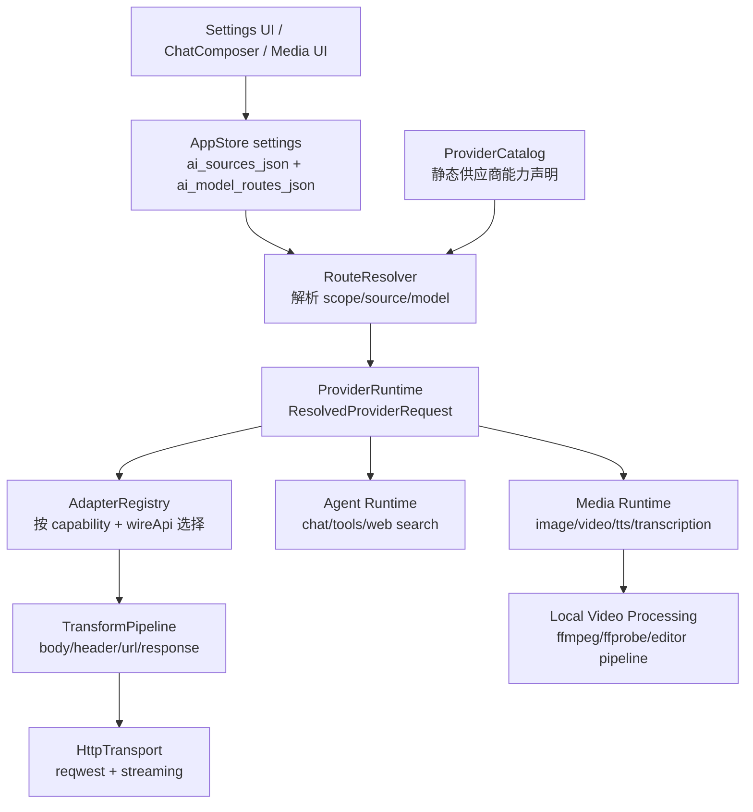

# 自定义供应商适配器运行时优化方案

## 结论

当前“高级：自定义供应商”的产品逻辑可以理解为：用户维护一组 AI 供应商实例，再把聊天、转录、Embedding、视觉、图片、语音、视频等能力路由到这些实例。这个方向是对的，但现在的主要问题是“供应商实例、模型选择、协议推断、URL 补全、能力路由、媒体生成模板”混在 Settings 页面和多个后端模块里，导致新增一家供应商或修一个协议细节时容易牵动 UI、运行时和兼容推断。

`cc-switch` 值得学习的不是把它的本地代理产品完整搬进 RedConvert，而是它的模块化内核：

- 供应商声明和用户配置分离。
- URL 构建、认证头、请求/响应转换由 Provider Adapter 承担。
- 模型列表端点通过候选 URL 推导，而不是散落字符串拼接。
- 协议格式转换是纯函数，有明确输入输出和测试。
- 路由、熔断、日志、模型映射是独立运行时治理能力，而不是 UI 逻辑。

RedConvert 推荐落地为一个轻量的 `provider_runtime` 内核：让所有 AI 能力先解析成统一的 `ResolvedProviderRequest`，再交给对应能力的 adapter 执行。UI 仍保持现在的高级设置入口，不新增复杂代理控制台。

## 落地状态

2026-07-03 已完成第一轮实现：

- 新增 `provider_runtime` 的 catalog、endpoint policy、resolver、model fetch、diagnostics 和 adapter descriptor 合同。
- `AiModelManager::resolve` 已改为调用统一 resolver，外部 `AiResolvedRoute` 保持兼容，并额外暴露 `providerKey` / `adapterKey` 用于诊断。
- 新增 `ai-providers:fetch-models` IPC 和 renderer bridge，模型列表拉取支持候选 URL、兼容后缀剥离、override URL、命中 URL 诊断。
- Settings 的供应商模型区新增刷新图标按钮，成功后合并模型列表，失败复用现有状态提示。
- Embedding 和 Transcription 的 endpoint 拼接已改为使用 `EndpointPolicy`，旧拼接逻辑只作为无效 URL 兜底。
- 图片、视频、语音仍保留现有 provider template 执行面，但统一 resolver 已能为这些能力给出 route/source/model/provider metadata，后续新增供应商应优先接入 catalog/adapter，而不是继续扩 UI 分支。

## cc-switch 功能拆解

### 1. Provider Adapter 边界清晰

`cc-switch` 在 `/Users/Jam/LocalDev/GitHub/cc-switch/src-tauri/src/proxy/providers/adapter.rs` 定义了统一 trait：

- `extract_base_url`
- `extract_auth`
- `build_url`
- `get_auth_headers`
- `needs_transform`
- `transform_request`
- `transform_response`

这说明它把“这个供应商怎么接”收敛到 adapter，而不是让调用方自己判断 URL、认证、协议转换。尤其是认证头构造会把非法 header value 转成可控错误，避免用户粘贴异常 key 后 worker panic。

RedConvert 应学习这条边界，但不要照搬 `ProxyService` 的产品形态。RedConvert 不需要先把所有请求打到本地代理再转发；它需要的是“请求发出前的 adapter kernel”。

### 2. URL 自动补全是候选解析器，不是单点拼接

`cc-switch` 的 `/Users/Jam/LocalDev/GitHub/cc-switch/src-tauri/src/services/model_fetch.rs` 把模型列表获取做成候选 URL 解析：

- `models_url_override` 非空时只用用户指定 URL。
- baseURL 已经是 `/v1`、`/v4` 这类版本段时，优先补 `/models`。
- baseURL 不是版本段时补 `/v1/models`。
- 命中 `/api/anthropic`、`/apps/anthropic`、`/api/coding`、`/claude` 等兼容后缀时，再剥离后缀补 `/v1/models` 和 `/models`。
- 404/405 才继续尝试下一候选；其他错误直接返回。
- 候选去重并保留顺序。

这个思路比在每个能力里手写 `if endpoint.endsWith(...)` 更稳。RedConvert 当前有 `desktop_io.rs::normalize_transcription_url`、`media_generation.rs::normalize_embedding_url`、`ai_model_manager::normalize_base_url`、`provider_compat::registry` 等多处推断，应该收敛成一个 endpoint policy。

### 3. 协议转换是独立纯函数

`cc-switch` 把 Anthropic、OpenAI Chat Completions、OpenAI Responses、Gemini Native 等格式转换放在 provider transform 模块：

- Anthropic messages 到 OpenAI Chat / Responses。
- `thinking` / `output_config.effort` 到 OpenAI reasoning effort。
- tools、tool choice、system message、stream 等字段转换。
- 针对 Codex OAuth、GitHub Copilot、Gemini Native 做 provider-specific 处理。

这类转换不应该存在 UI 或路由层。RedConvert 也不应该继续靠 `protocol + base_url + model` 的多处推断来决定请求形状，而应该把“客户端内部请求形状”和“上游 wire api”显式拆开。

### 4. 模型映射和路由治理独立

`cc-switch` 的 `/Users/Jam/LocalDev/GitHub/cc-switch/src-tauri/src/proxy/model_mapper.rs` 把 `haiku`、`sonnet`、`opus` 等模型别名映射抽离出来。`provider_router.rs` 则把 provider 选择、失败队列和熔断器独立出来。

RedConvert 可以学习模型映射与诊断治理，但第一版不建议上完整故障转移队列。RedConvert 的主场景是内容创作桌面端，不是多客户端 AI 代理开关。过早加入本地代理、熔断队列和代理 UI，会把产品复杂度带偏。

### 5. 前端配置工具可测试

`cc-switch` 的前端把不同 app 的供应商 preset、通用 provider preset、TOML/JSON config 修改工具、request overrides 拆成独立文件，并配套单测。尤其是 Codex TOML 修改测试覆盖了：

- active provider section 读取/写入。
- 重复 `base_url` 折叠。
- 忽略 `mcp_servers` 下的 `base_url`。
- 保留整数 metadata。

RedConvert 的 Settings 页面现在承载过多状态和同步逻辑，应把供应商 catalog、route state、模型候选、保存规范化拆成可测的 frontend model 层。

## RedConvert 当前问题

### 1. 真值已经有了，但投影太多

当前真实路由应该以 `ai_model_routes_json` 为准。`default_ai_source_id`、`transcription_endpoint`、`embedding_endpoint`、`image_provider_template` 等字段更像 legacy projection 或兼容投影。

风险是：一处修 route，一处旧字段仍然把供应商、模型、协议“复活”。这会造成 UI 看到 A，运行时实际用 B。

### 2. Settings 页面耦合过重

`desktop/src/pages/Settings.tsx` 同时处理：

- 自定义供应商列表。
- 各能力 source/model 选择。
- 旧字段投影。
- 模型能力过滤。
- 默认模型推断。
- 官方 / custom / local 模式归一化。
- 保存前 normalization。

这些逻辑应该被拆到 `features/settings` 或新的 `features/ai-providers`，页面只负责渲染和触发 action。

### 3. 后端 URL 与协议推断散落

当前相关逻辑分布在：

- `desktop/src-tauri/src/ai_model_manager/mod.rs`
- `desktop/src-tauri/src/provider_compat/registry.rs`
- `desktop/src-tauri/src/agent/provider.rs`
- `desktop/src-tauri/src/media_generation.rs`
- `desktop/src-tauri/src/desktop_io.rs`

这些模块有的负责聊天，有的负责图片/Embedding，有的负责转录；它们都在各自处理 endpoint、protocol、wire api 或 provider template。后续新增 DashScope、OpenRouter、Gemini Native、OpenAI Responses、Anthropic Messages 等兼容差异时，容易形成重复分支。

### 4. 能力与供应商协议没有显式建模

一个 source 可能同时支持：

- chat
- vision chat
- embedding
- transcription
- image generation
- video generation
- TTS
- web search passthrough

但每个能力的 wire api 可能不同。例如同样是 Qwen/DashScope，聊天、Responses 搜索、Chat Completions 搜索、Embedding、图片生成的合同不一样，不能只按 provider family 分流。

## 目标架构

推荐新增一个轻量内核：`provider_runtime`。它不替代现有 `ai_model_manager`，而是把 `ai_model_manager` 从“解析 + 推断 + 兼容分支”升级为“路由解析入口”，并把 endpoint、adapter、transform、diagnostics 下沉。



### 模块 1：ProviderCatalog

职责：声明供应商“是什么”，不保存用户密钥。

建议位置：

- Rust：`desktop/src-tauri/src/provider_runtime/catalog.rs`
- TS：`desktop/src/features/ai-providers/catalog.ts`

核心字段：

```ts
type ProviderCatalogEntry = {
  providerKey: string;
  displayName: string;
  family: 'openai' | 'anthropic' | 'gemini' | 'dashscope' | 'volcengine' | 'minimax' | 'openrouter' | 'custom';
  defaultBaseUrl?: string;
  endpointPolicy: EndpointPolicy;
  authStrategy: 'bearer' | 'x-api-key' | 'query-key' | 'custom';
  capabilities: CapabilityDeclaration[];
  quirks?: ProviderQuirk[];
};
```

能力声明示例：

```ts
type CapabilityDeclaration = {
  scope: 'chat' | 'transcription' | 'embedding' | 'vision' | 'image' | 'voice' | 'video' | 'videoAnalysis';
  adapterKey: string;
  wireApi: 'responses' | 'chatCompat' | 'anthropic' | 'gemini' | 'openaiImages' | 'dashscopeImage' | 'providerTemplate';
  defaultModel?: string;
  modelPatterns?: string[];
  supportsStreaming?: boolean;
  supportsTools?: boolean;
  supportsImages?: boolean;
  supportsReasoningEffort?: boolean;
};
```

治理原则：

- provider family 只表示供应商族，不直接决定 wire contract。
- wire contract 必须由 `capability + adapterKey + wireApi` 决定。
- 供应商特殊行为写成 `quirks`，例如 `requiresUserAgent`、`stripAnthropicCompatSuffixForModelList`、`geminiBasePathV1Beta`，不要散落到 UI 判断。

### 模块 2：UserAiSource

职责：保存用户创建的供应商实例。

继续兼容当前 `ai_sources_json`，但内部规范化成：

```ts
type UserAiSource = {
  id: string;
  providerKey: string;
  name: string;
  baseURL: string;
  apiKey?: string;
  credentialRef?: string;
  models: SourceModel[];
  endpointOverrides?: Partial<Record<CapabilityScope, string>>;
  modelListOverrideUrl?: string;
  metadata?: Record<string, unknown>;
};
```

短期可以继续存 `apiKey`，但中长期应该把 `credentialRef` 接到系统安全存储。产品层不需要因为这个改造新增密钥管理 UI。

### 模块 3：CapabilityRoutes

职责：保存“哪个能力用哪个 source/model/adapter”。

继续以 `ai_model_routes_json` 为真值。建议扩展但保持向后兼容：

```ts
type CapabilityRoute = {
  mode: 'official' | 'custom' | 'local' | 'disabled';
  sourceId: string;
  model: string;
  adapterKey?: string;
  wireApi?: string;
};
```

保存时生成 legacy projection：

- `default_ai_source_id`
- `transcription_endpoint`
- `transcription_key`
- `transcription_model`
- `embedding_endpoint`
- `embedding_key`
- `embedding_model`
- 现有图片 / 视频 provider template 字段

但运行时读取优先级必须是：

1. request override
2. `ai_model_routes_json[scope]`
3. source instance
4. catalog default
5. legacy projection fallback

不要让 legacy projection 反向覆盖 route 真值。

### 模块 4：RouteResolver

职责：把 settings + scope + override 解析为稳定结构，不发网络请求。

建议位置：

- Rust：`desktop/src-tauri/src/provider_runtime/resolver.rs`
- 逐步替换 `desktop/src-tauri/src/ai_model_manager/mod.rs` 中的推断逻辑。

输出：

```rust
pub struct ResolvedProviderRequest {
    pub scope: CapabilityScope,
    pub mode: RouteMode,
    pub source_id: String,
    pub source_name: String,
    pub provider_key: String,
    pub base_url: String,
    pub api_key: Option<String>,
    pub model: String,
    pub adapter_key: String,
    pub wire_api: ProviderWireApi,
    pub endpoint_policy: EndpointPolicy,
    pub auth_strategy: AuthStrategy,
    pub quirks: Vec<ProviderQuirk>,
    pub is_official: bool,
    pub is_local: bool,
}
```

性能边界：

- 只读取 settings snapshot。
- 不持锁做网络、文件、模型列表刷新。
- 不在 resolver 内调用 LLM、ffmpeg、MCP、模型 fetch。

### 模块 5：EndpointPolicy

职责：统一 URL 拼接、模型列表候选、完整 URL 反推 base。

建议位置：

- Rust：`desktop/src-tauri/src/provider_runtime/endpoint.rs`
- TS：`desktop/src/features/ai-providers/endpointPolicy.ts`

核心 API：

```rust
pub fn resolve_endpoint(base_url: &str, policy: &EndpointPolicy, capability: CapabilityScope) -> Result<Url>;
pub fn model_list_candidates(base_url: &str, policy: &EndpointPolicy, override_url: Option<&str>) -> Result<Vec<Url>>;
pub fn infer_base_from_full_url(full_url: &str, policy: &EndpointPolicy) -> Option<String>;
```

候选规则参考 `cc-switch`，但做成声明式 policy：

```ts
type EndpointPolicy = {
  baseKind: 'openaiCompatible' | 'anthropic' | 'geminiNative' | 'providerTemplate';
  versionPath?: '/v1' | '/v1beta' | '/v4';
  capabilityPaths: Partial<Record<CapabilityScope, string>>;
  modelList?: {
    defaultPath: string;
    versionAware: boolean;
    stripSuffixes?: string[];
    allowFullUrlDerive?: boolean;
  };
};
```

落地收益：

- 转录不再只知道 `/audio/transcriptions`。
- Embedding 不再只知道 `/embeddings`。
- Gemini 不再靠多个模块各自 trim `/v1beta`。
- 供应商兼容子路径剥离只影响模型列表，不污染真实请求 baseURL。

### 模块 6：AdapterRegistry

职责：按能力和 wire api 选择 adapter。

建议位置：

- Rust：`desktop/src-tauri/src/provider_runtime/adapters/mod.rs`

第一批 adapter：

- `OpenAiChatAdapter`：聊天、视觉聊天、工具调用，走 `/chat/completions`。
- `OpenAiResponsesAdapter`：聊天、工具、web search passthrough，走 `/responses`。
- `AnthropicMessagesAdapter`：Anthropic Messages。
- `GeminiGenerateContentAdapter`：Gemini Native `generateContent` / `streamGenerateContent`。
- `OpenAiEmbeddingAdapter`：Embedding。
- `OpenAiTranscriptionAdapter`：转录。
- `OpenAiImagesAdapter`：OpenAI image generation。
- `ProviderTemplateMediaAdapter`：保留现有图片/视频供应商模板，包括即梦、火山、DashScope 等。

不要第一版做成泛型 God Adapter。每个 adapter 只处理一种 wire contract。

Rust trait 建议：

```rust
pub trait ProviderAdapter: Send + Sync {
    fn key(&self) -> &'static str;
    fn capability(&self) -> CapabilityScope;
    fn build_endpoint(&self, request: &ResolvedProviderRequest) -> Result<Url>;
    fn auth_headers(&self, request: &ResolvedProviderRequest) -> Result<Vec<(HeaderName, HeaderValue)>>;
    fn transform_request(&self, request: CanonicalProviderRequest) -> Result<WireProviderRequest>;
    fn normalize_response(&self, response: WireProviderResponse) -> Result<CanonicalProviderResponse>;
}
```

### 模块 7：TransformPipeline

职责：格式转换必须纯函数化并有 golden tests。

建议位置：

- `desktop/src-tauri/src/provider_runtime/transforms/chat.rs`
- `desktop/src-tauri/src/provider_runtime/transforms/media.rs`
- `desktop/src-tauri/src/provider_runtime/transforms/search.rs`

转换对象：

- `CanonicalChatRequest` -> OpenAI Chat / OpenAI Responses / Anthropic / Gemini。
- `CanonicalMediaRequest` -> OpenAI Images / provider template / Gemini image / DashScope image / video generation。
- `CanonicalTranscriptionRequest` -> multipart transcription request。
- `CanonicalEmbeddingRequest` -> embedding request。

关键约束：

- tool call、tool choice、reasoning effort、image block、system message 都必须有字段级转换测试。
- web search 不能只按 provider family 分流。Qwen/DashScope 的 Chat Completions `enable_search/search_options` 和 Responses `tools: [{ type: "web_search" }]` 应是两个 adapter contract。
- response usage、tool calls、citations、image/video task id 要统一 normalize 回内部结构，方便日志和后续诊断。

### 模块 8：Transport 和 Diagnostics

职责：执行网络请求、超时、重试、事件记录。

建议位置：

- `desktop/src-tauri/src/provider_runtime/transport.rs`
- `desktop/src-tauri/src/provider_runtime/diagnostics.rs`

第一版只做轻量诊断：

- last used provider/source/model。
- last resolved endpoint。
- model fetch 候选和命中 URL。
- request error 分类：auth、network、timeout、shape、provider。
- streaming first byte / completed / aborted。

不建议第一版引入完整 failover UI。可以预留：

```rust
pub struct ProviderHealthSnapshot {
    pub source_id: String,
    pub scope: CapabilityScope,
    pub last_success_at: Option<String>,
    pub last_error_at: Option<String>,
    pub last_error_kind: Option<String>,
    pub consecutive_failures: u32,
}
```

如果未来要做自动故障转移，应先把 health snapshot 和 error taxonomy 做稳，再加 route policy。

## AI、媒体、视频处理的接入方式

### AI Chat / Agent Runtime

当前聊天运行时应从 `ai_model_manager` 迁移到：

1. `RouteResolver::resolve(scope = chat)`
2. `AdapterRegistry::get(chat, wire_api)`
3. `TransformPipeline::to_wire_chat`
4. `Transport::send_chat`
5. `CanonicalChatResponse` 回传 agent runtime

Prompt、skills、tools 不应该知道具体供应商。它们只通过 capability metadata 知道当前模型是否支持：

- tools
- vision
- streaming
- reasoning effort
- web search passthrough

### Embedding / Knowledge

Embedding 应从 `media_generation.rs::compute_embedding_with_settings` 迁移到专用 adapter：

- endpoint 由 `EndpointPolicy` 生成。
- request body 由 `OpenAiEmbeddingAdapter` 生成。
- response shape 统一读取 `data[0].embedding`，失败时给出 provider error shape。
- 本地 fallback `compute_local_embedding` 可以保留，但必须是显式 fallback，不要掩盖远端配置错误。

### Transcription

转录应从 `desktop_io.rs` 里的 curl 路径逐步切到 reqwest multipart adapter：

- 端点由 `EndpointPolicy` 生成。
- response parser 保留现有对 `json`、`srt`、`text` 的兼容。
- curl 可以作为短期 fallback，但不应继续承担新供应商兼容逻辑。

### Image / Voice / Video Generation

媒体生成的重点不是把所有供应商强行变成 OpenAI 形状，而是把“内部媒体请求”和“供应商任务合同”拆开。

建议内部结构：

```rust
pub enum MediaCapability {
    Image,
    Voice,
    Video,
    VideoAnalysis,
}

pub struct CanonicalMediaRequest {
    pub capability: MediaCapability,
    pub prompt: String,
    pub negative_prompt: Option<String>,
    pub input_assets: Vec<MediaAssetRef>,
    pub model: String,
    pub size: Option<String>,
    pub duration_seconds: Option<u32>,
    pub seed: Option<u64>,
    pub options: serde_json::Value,
}
```

视频生成 adapter 负责：

- 提交任务。
- 轮询任务。
- 下载结果。
- 统一任务状态：queued、running、succeeded、failed、cancelled。

本地视频处理仍由现有 media runtime / ffmpeg / ffprobe 管线负责，不能把转码、剪辑、封装、字幕烧录等 codec 级逻辑塞进 provider adapter。adapter 只处理“远端 AI 视频生成合同”。

### UI

UI 不建议增加大面板。保持当前高级设置区域，只做结构拆分和少量可见能力：

- 供应商卡片仍展示名称、默认模型、模型数量、登录/密钥状态。
- 能力表仍按聊天、转录、Embedding、视觉、图片、语音、视频选择 source/model。
- 模型下拉旁边可以有一个小型刷新/测试图标，结果以内联状态显示。
- 诊断只展示必要信息：最后命中 endpoint、模型拉取失败原因、认证错误，不加长说明文案。

页面代码应拆成：

- `desktop/src/features/ai-providers/AiProviderPanel.tsx`
- `desktop/src/features/ai-providers/ProviderSourceList.tsx`
- `desktop/src/features/ai-providers/CapabilityRouteTable.tsx`
- `desktop/src/features/ai-providers/useAiProviderSettings.ts`
- `desktop/src/features/ai-providers/providerSettingsModel.ts`

Settings 页面只组合组件，不再直接持有所有供应商规则。

## 必须用现成库与需要自研的边界

### 必须用现成库

- HTTP：继续用 Rust `reqwest`，复用现有 `rustls-tls`、`multipart`、`stream`。
- URL：继续用 Rust `url` crate 做解析、path join、query merge，不手写复杂 URL parser。
- JSON：继续用 `serde` / `serde_json`，跨模块边界优先 typed struct。
- SQLite：继续用现有 `rusqlite` 和 store 方案，短期不要为了 provider catalog 新增数据库迁移。
- 视频本地处理：继续使用 ffmpeg / ffprobe 或现有媒体处理链路，不自研 codec、转码器、封装器。
- 前端状态：沿用当前 React/TS 模式，不为这个改造引入新的全局状态库。

### 需要自研

- `ProviderCatalog` 声明。
- `EndpointPolicy` 候选 URL 生成。
- `RouteResolver`。
- `AdapterRegistry`。
- Chat / media / search 的字段级 transform。
- provider diagnostics 的错误分类。
- Settings 中供应商和能力路由的 frontend model 层。

这些是 RedConvert 的产品合同，不能依赖外部通用库解决。

## 方案对比

| 方案 | 做法 | 优点 | 问题 | 结论 |
| --- | --- | --- | --- | --- |
| A. 继续在 Settings 和各 runtime 里补判断 | 哪里出问题改哪里 | 改动小 | 耦合继续上升，供应商越多越难维护 | 不推荐 |
| B. 完整复制 cc-switch 本地代理 | RedConvert 内置 proxy、failover、circuit breaker、代理 UI | 能力完整 | 产品复杂度大，偏离创作工具主线，新增安全和运维面 | 不推荐第一版 |
| C. 建 provider_runtime 内核 | 学 cc-switch 的 adapter/endpoint/transform 思路，但不复制代理产品 | 低耦合、可测试、贴合当前能力路由 | 需要一次结构化重构 | 推荐 |

推荐 C。它保留 RedConvert 当前“能力路由到供应商”的产品形态，但把实现从 UI/运行时散点判断升级成共享内核。

## 一次性落地清单

按 Atomic Commits 拆提交，但每个提交都应保持可编译、可验证。

### Commit 1：新增 provider_runtime 类型和 endpoint policy

文件：

- `desktop/src-tauri/src/provider_runtime/mod.rs`
- `desktop/src-tauri/src/provider_runtime/types.rs`
- `desktop/src-tauri/src/provider_runtime/endpoint.rs`
- `desktop/src-tauri/src/provider_runtime/catalog.rs`

内容：

- 定义 `CapabilityScope`、`RouteMode`、`ProviderWireApi` 复用或迁移。
- 定义 `ProviderCatalogEntry`、`EndpointPolicy`、`ResolvedProviderRequest`。
- 实现 `model_list_candidates`。
- 加单测覆盖 `/v1`、`/v4`、`/api/anthropic`、`/apps/anthropic`、`/api/coding`、full URL derive、override URL。

### Commit 2：RouteResolver 接入 ai_model_manager

文件：

- `desktop/src-tauri/src/ai_model_manager/mod.rs`
- `desktop/src-tauri/src/ai_model_manager/routes.rs`
- `desktop/src-tauri/src/provider_runtime/resolver.rs`

内容：

- `AiModelManager::resolve` 内部调用 `RouteResolver`。
- 保持返回 `AiResolvedRoute` 兼容旧调用方。
- 明确 route 真值优先于 legacy projection。
- 增加回归测试：custom source 不被 `default_ai_source_id` 复活；disabled route 返回 None；request override 优先。

### Commit 3：前端拆出 ai-providers model

文件：

- `desktop/src/features/ai-providers/providerSettingsModel.ts`
- `desktop/src/features/ai-providers/endpointPolicy.ts`
- `desktop/src/features/ai-providers/useAiProviderSettings.ts`
- `desktop/src/pages/Settings.tsx`

内容：

- 把 source/model/filter/route normalization 从 Settings 页面抽出。
- 页面 UI 不改或只做极小拆分。
- 保持 stale-while-revalidate：刷新失败不清空已有供应商和模型列表。

### Commit 4：模型列表拉取改为 endpoint candidate

文件：

- `desktop/src-tauri/src/commands/system/settings_ops.rs` 或新增 `commands/ai_providers.rs`
- `desktop/src-tauri/src/provider_runtime/model_fetch.rs`
- `desktop/src/bridge/domains/aiProvidersBridge.ts`

内容：

- 新增 `aiProviders:fetchModels` IPC。
- 输入：`sourceId` 或 `{ baseURL, apiKey, providerKey, modelListOverrideUrl }`。
- 输出：候选 URL、命中 URL、模型列表、错误分类。
- UI 只显示模型列表和简短 inline error。

### Commit 5：Chat adapter contract

文件：

- `desktop/src-tauri/src/provider_runtime/adapters/chat_openai.rs`
- `desktop/src-tauri/src/provider_runtime/adapters/chat_responses.rs`
- `desktop/src-tauri/src/provider_runtime/adapters/chat_anthropic.rs`
- `desktop/src-tauri/src/provider_runtime/adapters/chat_gemini.rs`
- `desktop/src-tauri/src/provider_runtime/transforms/chat.rs`
- `desktop/src-tauri/src/agent/provider.rs`

内容：

- 把聊天 wire api 选择移到 adapter registry。
- agent runtime 消费 canonical response。
- web search passthrough 按 adapter contract 处理，不按 provider family 粗分。

### Commit 6：Embedding 和 Transcription adapter

文件：

- `desktop/src-tauri/src/provider_runtime/adapters/embedding_openai.rs`
- `desktop/src-tauri/src/provider_runtime/adapters/transcription_openai.rs`
- `desktop/src-tauri/src/media_generation.rs`
- `desktop/src-tauri/src/desktop_io.rs`

内容：

- Embedding endpoint 和 request shape 走 adapter。
- Transcription multipart 走 reqwest adapter。
- 保留现有 parser 和 local fallback，但 fallback 必须可诊断。

### Commit 7：Media provider adapter

文件：

- `desktop/src-tauri/src/provider_runtime/adapters/media_openai_images.rs`
- `desktop/src-tauri/src/provider_runtime/adapters/media_provider_template.rs`
- `desktop/src-tauri/src/media_generation.rs`

内容：

- 图片、语音、视频生成统一使用 `CanonicalMediaRequest`。
- provider template 只负责远端任务合同。
- 本地 ffmpeg/ffprobe 处理保持在 media runtime，不进入 provider adapter。

### Commit 8：Diagnostics 和文档

文件：

- `desktop/src-tauri/src/provider_runtime/diagnostics.rs`
- `desktop/docs/provider-adapter-runtime.md`
- `desktop/docs/development/testing-and-verification.md`

内容：

- 增加 provider diagnostics snapshot。
- 文档说明新增模块职责、测试命令、常见供应商接入方式。

## 性能优化策略

- Settings 读取供应商时使用 stale data，后台刷新模型列表；失败不清空旧模型。
- 模型列表按 `sourceId + baseURL + modelListOverrideUrl` 缓存，设置短 TTL；手动刷新绕过 TTL。
- Resolver 只做纯内存解析，不能 await，不能持锁网络请求。
- HTTP 复用 reqwest client，按 provider/source 做并发限制和超时。
- Streaming 请求不做整包 response transform；需要转换时做 event-level normalize。
- 图片/视频生成任务轮询使用 backoff，不在 UI 线程或 store lock 内等待。
- provider catalog 是静态数据，启动时加载一次；用户 source 只存差异。
- Settings 大页面拆组件后，source/model option 用 memoized selector，避免每次输入 key 都重算所有能力候选。
- 诊断日志做截断，错误响应体保留短摘要，避免 HTML 错页进入状态库。

## 测试矩阵

### Rust 单测

- `provider_runtime::endpoint`：
  - `https://api.example.com/v1` -> `/models`
  - `https://api.example.com/v4` -> `/models` then `/v1/models`
  - `https://api.example.com/api/anthropic` -> stripped root candidates
  - full chat URL -> root `/v1/models`
  - override URL -> single candidate
- `provider_runtime::resolver`：
  - route disabled。
  - request override 优先。
  - `ai_model_routes_json.chat` 优先于 `default_ai_source_id`。
  - legacy projection 只 fallback，不反向覆盖 route。
- `provider_runtime::transforms`：
  - tool calls。
  - reasoning effort。
  - vision image blocks。
  - web search Responses / Chat Completions 双合同。

### TypeScript 检查

- `providerSettingsModel`：
  - source 删除后 route 归一化。
  - source 切换后模型选择不残留不支持能力的模型。
  - custom source 不污染 official route。
  - stale model list 保留。

### 集成验证

- 聊天：官方、OpenAI compatible、Anthropic、Gemini 各跑一次真实请求。
- 转录：上传短音频，验证 endpoint、multipart、response parser。
- Embedding：知识库索引跑一次远端 embedding，再验证本地 fallback 开关。
- 图片生成：官方与一个第三方模板各跑一次。
- 视频生成：仅验证远端任务 submit/poll/download，不触碰本地剪辑管线。
- UI：Settings 页面切换供应商、刷新、保存、重开后 route 保持一致。

## 风险和约束

- 不要把自然语言关键词写进 runtime 路由。供应商能力由 catalog、route、adapter contract 决定。
- 不要为了兼容某家供应商把 `provider_compat::registry` 继续扩大成 heuristic 黑洞。
- 不要在持锁范围内 fetch models、发 LLM、跑 ffmpeg、轮询视频任务。
- 不要让 UI 直接拼 endpoint；UI 只能展示 source、route、model 和诊断。
- 不要第一版做本地代理 UI、熔断队列、全局代理开关；这些属于后续治理能力，不是当前低耦合重构的必要条件。
- 不要把视频处理和视频生成 adapter 混成一层。远端 AI 任务合同归 adapter，本地素材处理归 media runtime。

## 推荐最终形态

RedConvert 应保留现在用户看到的心智模型：

> 我有一组供应商，每个能力选择供应商和模型。

但内部实现应变成：

> 供应商实例只是配置；能力路由是真值；adapter contract 决定 wire api；endpoint policy 决定 URL；transform pipeline 决定格式；transport/diagnostics 负责执行和证据。

这样以后新增供应商时，理想改动只需要：

1. 在 catalog 声明供应商和能力。
2. 如有新协议，新增一个 adapter。
3. 如只有 URL 差异，更新 endpoint policy。
4. 补 endpoint 和 transform 测试。
5. UI 自动获得可选 source/model，不需要为供应商写页面分支。
