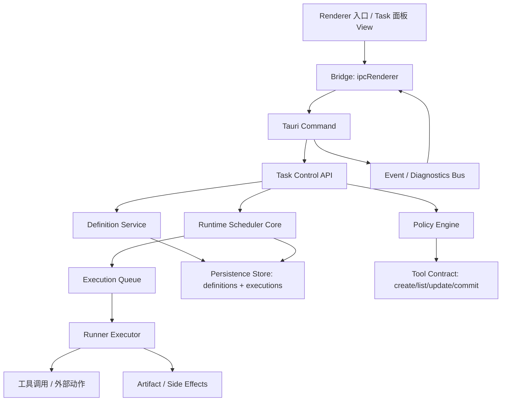

## 执行结果（2026-04-24）

- 已落地 `redclaw:task-preview/create/confirm/update/cancel/list/stats` 控制面，并补到 `app_cli`、bridge 与 IPC inventory。
- 已新增 `scheduler/task_policy.rs`，实现 preview token、会话阈值、重复检测、高风险动作确认与最小频率限制。
- 已把旧 `runner-add-scheduled` / `runner-add-long-cycle` 收口为兼容壳，统一复用 `preview -> create -> confirm` 主链，不再绕过策略层。
- 已增强 scheduler/runtime 执行记录，补齐 `runId`、`scheduledForAt`、`idempotencyKey`、`retryBucket`，并用 `definition_id + scheduledForAt` 避免重复入队。
- 已实现 `timezone + DST` 感知调度、`drop/single/catchup` missed-window reconcile，以及连续失败 `cooldown` 与手动恢复。
- 已为 `task.previewed / task.created / task.confirmed / task.updated / task.cancelled / task.enqueued / task.start / task.finish` 输出 checkpoint 事件，并把 RedClaw 任务链路纳入 diagnostics summary。
- 已保留现有 `RedClaw` 页面与导航入口，不改现有 UI 结构；旧 `runner-*` 路径继续可用并与新的定义元数据兼容。
- 已把 `redclaw.runner.status/start/stop/setConfig` 从模型可见面收敛到兼容层，仅保留 `redclaw.task.*` 作为任务合同入口。

# RedConvert 定时任务面板（任务管理机制）统一化实施计划

## 1. 目标

在不改 UI 的前提下，完成任务管理机制的统一落地，保证三件事：

1. 任务面板功能不再“名存实亡”，能持续可访问。
2. 定时任务触发“真正发生”，覆盖系统唤醒、进程重启、时区变化、卡顿恢复场景。
3. Agent 使用任务工具时必须可控：明确“什么时候能建任务、谁能建、建什么、怎么建”，避免“每句对话都建新任务”。

本计划采用 `RedConvert 执行内核 + AionUi 行为治理` 的融合路线。

## 2. 参考学习结论

### 2.1 RedConvert 当前底座（现成的可靠核心）

- 调度与执行分离清晰：
  - `desktop/src-tauri/src/scheduler/mod.rs`：tick + 定义同步 + 入队。
  - `desktop/src-tauri/src/scheduler/job_runtime.rs`：执行队列与状态机。
- 具备恢复与租约机制：
  - `recover_stale_job_executions`, `start_execution_heartbeat`, `mark_execution_failed/succeeded`。
- 工具暴露为能力而非页面硬编码：
  - `desktop/src-tauri/src/tools/catalog.rs` 与 `desktop/src-tauri/src/tools/packs.rs`。

**优点**：执行可靠性高、状态可追踪、并发安全意识明确。
**问题**：AI 在工具端仍缺少“是否该创建任务”的行为约束。

### 2.2 AionUi 的治理策略（值得借鉴）

- 显式命令协议（`[CRON_CREATE]` / `[CRON_UPDATE]` / `[CRON_LIST]`）抑制误触。
- 会话级约束，避免单对话重复创建。
- 任务执行链存在 `missed job recover` 与并发保护。
- Skill 文档中对调用流程有明确规则。

**优点**：对“Agent 是否该建任务”有强行为约束；误触发概率低。
**问题**：执行可靠性与重试链不如 RedConvert 的队列/lease 体系完整。

### 2.3 结论

采用**统一任务运行时 + 外层治理**：

- 用 RedConvert 的 job runtime 做真实触发。
- 用 AionUi 的命令语义和约束思想做 Agent tool policy。

## 3. 产品架构（完整）

## 3.1 目标架构图

## 3.2 模块边界（核心）

### A. 控制层：Task Control API

- 位置：新增 `desktop/src-tauri/src/commands/redclaw_task_control.rs`（或在现有 redclaw command 按模块切分）。
- 只做：参数校验、权限校验、路由到工具 service。
- 暴露动作：
  - `redclaw.task.preview`
  - `redclaw.task.create`
  - `redclaw.task.confirm`
  - `redclaw.task.update`
  - `redclaw.task.cancel`
  - `redclaw.task.list`
  - `redclaw.task.stats`

### B. 策略层：TaskPolicy Engine

- 位置：新增 `desktop/src-tauri/src/scheduler/task_policy.rs`。
- 职责：
  - 校验会话级并发阈值。
  - 去重（同 cron + payload + owner）。
  - 风险评分（动作类型、频率、时区、执行范围）。
  - 决策：`ALLOW` / `REQUIRE_CONFIRM` / `REJECT`。
- 输出：`policy_decision` 附带失败原因与可替代建议。

### C. 定义层：TaskDefinition Service

- 位置：基于现有 `desktop/src-tauri/src/scheduler/mod.rs`、`persistence`。
- 职责：
  - 在 `redclaw_job_definitions` 上提供统一 schema。
  - 维护版本化字段（`taskContract.version`, `agent_intent_ref`, `policy_signature`）。
  - 幂等主键：`definition_fingerprint`（name+cron+action_hash）。

### D. 调度层：Scheduler Core

- 位置：增强 `desktop/src-tauri/src/scheduler/mod.rs` + 现有 heartbeat/lease/retry。
- 职责：
  - 任务入列。
  - 到期扫描。
  - 本地时间+时区修正。
  - 失联恢复：`recover_stale_job_executions` 强化为 `missed-run replay`。
  - 执行器限速。

### E. 执行层：Runner Executor

- 位置：`desktop/src-tauri/src/scheduler/job_runtime.rs`、`desktop/src-tauri/src/commands/redclaw.rs`。
- 职责：
  - 统一 lease + heartbeats + 结果落库。
  - 将外部执行封装为 `ExecutionEnvelope`。
  - 幂等执行键：`run_id` / `idempotency_key`。

### F. 工具层：Tool Gateway

- 位置：`desktop/src-tauri/src/tools/catalog.rs`、`desktop/src-tauri/src/tools/packs.rs`。
- 职责：
  - 向模型暴露受限 action。
  - schema-first（必须结构化参数）。
  - 隔离危险动作工具组，按 runtime mode 赋权。

### G. 回放与观测层：Task Telemetry

- 位置：现有 diagnostics 事件总线扩展（`desktop/src-tauri/src/diagnostics.rs`、scheduler 与 events）。
- 输出：
  - definition 变更链。
  - execution 生命周期。
  - retry/skip/dead-letter 计数与原因。

### H. 持久化层

- 位置：`desktop/src-tauri/src/persistence/*` + AppStore。
- 建议新增字段（在兼容性前提下）：
  - definition: `policy_sig`, `creator_mode`, `owner_scope`, `created_by`, `requires_confirmation`, `draft_id`
  - execution: `run_id`, `attempt_no`, `last_heartbeat_at`, `retry_bucket`, `idempotency_key`

## 4. AI 调用机制（确保“不乱建任务”）

## 4.1 Tool contract（结构化动作）

1. `redclaw.task.preview`
   - 输入：`intent`, `name`, `cron`, `goal`, `actionType`, `ownerScope`, `window`。
   - 输出：
     - `decision`: `ok|conflict|reject`
     - `conflictTasks`: 相似任务列表
     - `previewRunAt`: 下一次触发时间
     - `policyWarnings`: 风险说明

2. `redclaw.task.create`
   - 输入：必须携带 `previewToken`。
   - 输出：`draftId` 与完整定义。

3. `redclaw.task.confirm`
   - 输入：`draftId`, `confirm=true/false`。
   - 输出：`jobDefinitionId` 或取消原因。

4. `redclaw.task.update`
   - 强制 `jobDefinitionId + patch + reason`。

5. `redclaw.task.list`
   - 按 conversation/owner/filter 返回标准字段。

## 4.2 行为防误用规则（高优先级）

- 一步到位创建禁止：必须 preview 先于 create。
- 同对话任务创建阈值：`MAX_PENDING_PER_CONVERSATION = 2`。
- 同 owner + 同 cron + 同 action 高相似度去重。
- 高风险类型（写文件、删除、外发）需要 `confirm`，并强制附带 `risk_rationale`。
- 调度频率下限：不允许 `< 5分钟`（除非管理员角色）。
- 连续失败保护：失败连续超过阈值自动进入 `cooldown`，直到人工确认。

## 4.3 与 prompt/Skill 协同

- 在 `tools` schema 与 `runtime mode` 里直接限定字段，不在自然语言层靠关键字路由。
- 统一 `task intent` schema 到 prompt 与 tool 描述（避免“看到'提醒'就建任务”）。
- 若必须保留自由指令入口，必须要求参数齐全后再进 tool。

## 5. “任务真的会触发”技术保障

## 5.1 触发链关键控制

- 启动时自检：
  - 恢复未完成执行。
  - 回收超时 lease。
  - 重建 due queue。
- Tick 两阶段机制：
  - `tick-sync`：同步定义 + stale 恢复 + 重试。
  - `tick-run`：拉取 due execution。 
- 时区处理：
  - 存储 `timezone`，显示层转成本地时间。
  - cron 解析统一用带时区引擎，避免 DST 误差。
- 严格唯一执行：
  - `definition_id + scheduled_at` 形成执行主键。
  - 即使并发扫描也不能重复 execute。

## 5.2 宕机/休眠策略

- 若应用长期休眠：
  - `missedWindow` 计算并输出策略：`drop` / `single` / `catchup`。
  - 需明确默认：`single`（执行一次，避免雪崩）。
- 超时执行重试：
  - 以 `retryPolicy` 为准（固定、指数退避、max_attempts）。
  - 区分系统异常与业务可预期失败。

## 5.3 执行链路统一幂等

- 每次执行分配 `run_id`。
- 工具/外部动作支持 `idempotencyKey`。
- 成功后写入固定 `artifactId` 与结果摘要。

## 6. 任务面板“恢复与保留”的底层前提（不改 UI）

- 保留页面存在性检查：在 `desktop/src/App.tsx` 与 `desktop/src/components/Layout.tsx` 维持 redclaw 路由。
- 暂时不改 UI 时，不允许删除/重建页面；只改后台命令与事件返回。
- 诊断能力增强后，面板可在不改结构前提下直接读到：
  - definition 列表
  - execution 最近状态
  - reason/detail/policyDecision

## 7. 与视频处理与 UI 的接口说明（边界不越界）

- 视频处理继续保持独立能力边界：
  - 任务系统只调用 `media` 侧 `media:*` 入口，不直接操作媒体底层状态。
  - 视频任务动作通过封装 tool action 进入已验证执行器。
- UI 边界：
  - 本阶段不改 layout/页面。
  - 所有新增能力通过现有 diagnostics 与当前任务面板可视字段加载。

## 8. 必须现成库 vs 自研

## 8.1 必须现成库/已有基础

- 现有 RedConvert scheduler/runner/heartbeat 代码。
- Rust 侧时间处理库（chrono 相关）。
- 已有 app-state 持久化与序列化基础。
- Tauri IPC 与事件发布机制。
- AionUi 的命令治理思想（可复用为设计约束，不直接嵌入库）。

## 8.2 自研部分

- policy engine 的策略模型（防误触、幂等、会话阈值）。
- task contract 的 schema 版本演化与鉴权。
- 两阶段创建（preview→create→confirm）闭环。
- 扩展诊断事件与 `policy_decision` 日志字段。

## 9. 方案对比与推荐

## 9.1 方案 A：仅增强 RedConvert
- 描述：仅加少量治理 flag，沿用现有 tools。
- 优点：改动少，速度快。
- 风险：缺少强约束，依赖模型行为导致误建风险。

## 9.2 方案 B：仅迁移 AionUi 风格队列
- 描述：复用 AionUi 的命令协议，替换执行核心。
- 优点：治理清晰。
- 风险：与 RedConvert `redclaw` 现有执行链兼容成本高、可靠性回退。

## 9.3 方案 C（推荐）：执行核心 + 治理层融合
- 描述：保留 RedConvert scheduler/runner，叠加 AionUi 治理闭环。
- 优点：
  - 保留稳定执行链。
  - 强化 Agent 侧行为约束。
  - 与现有 redclaw 定时任务平滑兼容。
- 风险：新增 module 较多，需要分阶段验收。

> 推荐：**方案 C**。

## 10. 分阶段实施计划（全程保留页面，不改 UI）

## Phase 0：问题边界确认（1 天）

- 目标：确认任务页“被隐藏”源自入口/状态而非代码丢失。
- 步骤：
  - 检查 `NAV_ITEMS` 与路由 view 是否始终可选中。
  - 确认 `redclaw` 命令通道仍可被 invoke。
- 交付：`diagnostic check` 日志与一页式说明。

## Phase 1：任务治理 schema 落地（2 天）

- 增加 task policy service（Rust）
  - `TaskIntentSchema`, `TaskPolicyDecision`, `TaskPreviewResult`。
- 增加两阶段动作的 command 接口。
- `tools/catalog.rs` 改造只暴露 `preview/create/confirm/list`。
- 更新 runtime mode 下发工具集合。
- 输出：`Policy` 与 `Tool` 可独立单元验证。

## Phase 2：触发可靠性增强（2 天）

- scheduler 加入 missed-window reconcile。
- heartbeat 超时恢复与 retry 指标分桶。
- 增加 `definition_id + scheduled_at` 去重锚点。
- Runner 对同任务执行增加幂等键检查。
- 输出：多次重启/休眠测试中的触发一致性改善。

## Phase 3：执行控制闭环（2 天）

- 完善 `run_id`、`attempt_no`、`idempotency_key`。
- 增加任务执行事件（`TASK_PREVIEWED`, `TASK_CREATED`, `TASK_ENQUEUED`, `TASK_START`, `TASK_FINISH`）。
- 增加人工审批路径可回放。
- 输出：一条任务执行链在事件总线上可全链路查回放。

## Phase 4：与现有 redclaw 兼容（1 天）

- 保留已有 redclaw 功能行为不变。
- 兼容 `runner-run-scheduled-now` 与长期周期任务。
- 为历史任务定义补齐 `policy` 字段默认值（向下兼容）。
- 输出：`golden path` 覆盖：已有任务定义仍可运行。

## Phase 5：压测与上线前校验（1 天）

- 指标：触发率、误触发率、平均延迟、重试率。
- 任务场景：`每分钟/每小时/日报` 各一组。
- 校验失败场景：时区变化、系统重启、卡顿 2 分钟、故障任务。
- 输出：验收报告（给任务面板恢复开 UI 打底）。

## 11. 性能优化策略（重点）

- 读写分离：
  - 触发扫描只读快照，不做长 I/O。
  - 锁内仅保留最小字段更新，持久化在锁外批量提交。
- 调度扫描优化：
  - 使用索引排序字段替代全量过滤（如 `nextTickAt` 与 `state`）
  - 队列拉取支持限流（当前 `max_automation_per_tick` 继续保留）。
- 热路径低成本：
  - 命令入口前先快速 policy 预检，失败直接拒绝。
  - 事件 payload 采用精简摘要，详情懒加载。
- 失败控制：
  - 分类重试（可重试/不可重试）。
  - 失败熔断：短时间大量失败任务自动进入冷却。

## 12. 文档与兼容要求（执行约束）

- 所有新增/变更的 IPC/tool schema 必须更新对应 docs。
- 所有计划类文档保持 frontmatter。
- 避免一次改动多件事（每个提交尽量只做一个可回归点）。

## 13. 风险与回退策略

- 风险 1：policy 过严导致合法任务被拒。
  - 兜底：`admin override` 与 `confirm with context`。
- 风险 2：过渡期 schema 不兼容。
  - 兜底：向后兼容默认值 + 运行时迁移。
- 风险 3：误报超时重试导致重复执行。
  - 兜底：`idempotency_key` + 幂等执行边界。

回退策略：
- 只回退 Tool layer：保留 redclaw 内核不动。
- 紧急情况下恢复 `direct create` 兼容旧入口。

## 14. 立刻执行清单（本周）

1. 写 `TaskPolicy` 与 `TaskPreview/Confirm` tool 合同。
2. 在 Command 层加 preview->create 的强制校验。
3. 在 scheduler 增加 due-range reconcile 与 missed-window 策略。
4. 在 diagnostics 加 `task_policy` 与执行生命周期事件。
5. 完成一次 `no-ui` 验收记录（页面可见性 + 任务触发真实性）。
