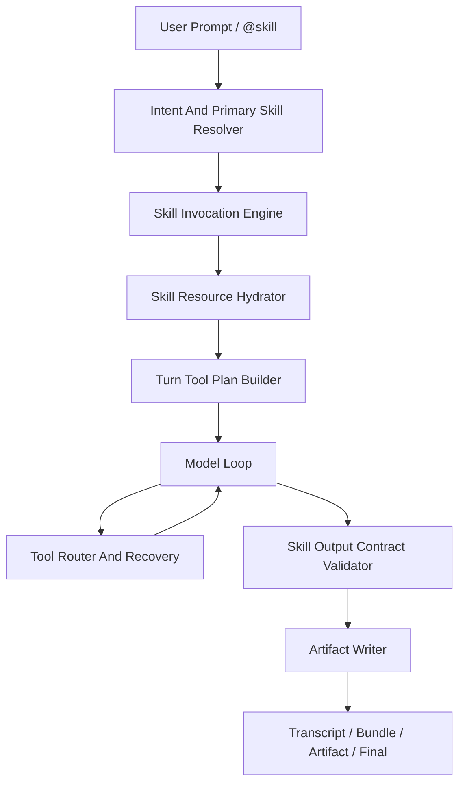

# Skill Loop Governance Optimization Plan

## 1. Goal

这份计划把 Beav / RedConvert 的 skill 执行链从“模型读到 skill 文本后自行发挥”升级为“显式 skill 选择、资源 hydration、工具可用性、输出 contract、失败恢复、回放验证”一条闭环。

目标不是只优化 `high-retention-video-script` 这一个技能，而是修掉同一类 runtime 问题：

1. 用户明确点名 skill 后，模型只调用 `skills.inspect` / `Read` 查看内容，却没有把 skill 激活为当前任务的 primary skill。
2. 模型读到部分规则后没有遵守完整资源要求，例如漏读 template 或漏读 references。
3. 泛视频规则把“写视频脚本包”错误升级成 `video-director` / `image.generate` / `video.generate`。
4. 独立 HTML / Markdown 脚本包误用 `Write(manuscripts://current)`，在没有绑定稿件工程时失败。
5. `Operate {}` 空调用进入 tool router，产生 `LEGACY_COMMAND_DISABLED`，用户看到“处理失败”。
6. `workspace.write` 的恢复建议可能要等多轮后才被模型执行，用户已经看到“处理失败 / 稿件处理失败”。
7. 大段 HTML 写入期间缺少稳定的进度和验证反馈，用户感知为卡住、失败或恢复很慢。

最终目标是让同样的提示词：

```text
@high-retention-video-script 使用这个skill，帮我做一个介绍beav这个app的视频脚本
```

稳定产生一个使用 skill 模板的单文件 HTML 脚本包，而不是生成图片、启动视频流程、创建稿件工程、或卡在工具错误里。

## 1.1 Execution Update

2026-07-09 已落地第一批 loop 治理优化：

- `Write` 工具定义已收紧：它只表示当前绑定的 `manuscripts://current` / `editor://current/script` 写入，不再被描述成普通文件保存工具。
- `Operate` 工具定义已补充：必须提供非空 `resource` 和 `operation`，不能用空对象当 help 或 planning probe。
- runtime tool note 已追加 workspace artifact override：独立脚本、文章、HTML、Markdown 等用户可见内容产物默认保存到 `manuscripts/`，并通过 `Operate(resource="workspace", operation="write")` 写入。
- redclaw 视频规则已追加 script-package boundary：写视频脚本、AV script、storyboard table、HTML script package 不等于视频生成，不能因此触发 `video-director` 或媒体生成工具。
- ToolRouter 已对空 `Operate {}` 返回专门的 `EMPTY_OPERATE_CALL`，避免继续表现成 legacy workflow help 错误。
- ToolRouter 已对“无绑定稿件 + 完整 HTML artifact 的 `Write`”做窄自动恢复：直接改写为内部 `workspace.write`，保存到 `manuscripts/<title>.html`，并记录 `writeRecoveryDecision`。
- `skills.readResource` 已增加唯一资源 fallback：当模型读取 `assets/...`、`references/...` 等相对 skill 资源但没有带 skill name/package 时，若只有一个已安装 skill 命中该资源，直接读取并标记 `activeSkillResourceFallback`。
- ToolRouter 已对 `Operate(resource="manuscript", operation="create", input={"path":"manuscripts://current"})` 这类独立脚本包误用返回专门错误 `MANUSCRIPT_PROJECT_NOT_NEEDED_FOR_STANDALONE_ARTIFACT`，直接提示 `workspace.write manuscripts/<name>.html`，不再建议 `tool_search manuscript create`。
- 已修复当前 `interactive_runtime_shared.rs` 中 video-analysis prompt 条件化改动遗留的 tuple/`Option<&str>` 编译断点。
- 已补聚焦测试覆盖 unbound HTML `Write` 自动转 `workspace.write`、空 `Operate` 拒绝、以及 `Operate -> workspace.write` 路由；完整 `tools::router::tests` 已恢复通过。
- 已撤回对 `.codex/skills/high-retention-video-script` 的本机 skill 修改：优化目标不是改某个 skill，而是让 RedConvert/Beav 对任意外部 skill 都能稳定激活、读取资源、遵循模板和选择正确工具。

关键修正：

- 不把修改 skill 当成产品方案。skill 是跨 AI 工具的通用资产；同一份 skill 在 Codex 可用、在 Beav 表现差，说明问题在 app 的 skill activation、runtime prompt、tool schema、tool routing 和 continuation contract。
- app 侧要提供“如何使用 skill”的稳定元规则：显式点名 skill 时必须优先读取 SKILL.md；遇到 `references/`、`assets/`、`templates/` 等相对资源时必须用 `skill://...` 或 `skills.readResource`；产物保存必须遵循 app 的 workspace/manuscripts 工具契约。
- app 侧要避免泛视频规则污染脚本任务：脚本、AV script、storyboard table、HTML script package 是写作产物，不应因为 skill 描述里出现 video 就自动触发视频/图像生成工具。

尚未完成：

- primary skill 状态机和 `skills.invoke` 强约束。
- required resources hydration contract 的运行时强制注入。
- skill output contract validator。
- session replay harness。
- Codex-style typed context fragment 架构迁移。
- `WRITE_TARGET_NOT_BOUND` 执行器级自动 fallback，减少先失败再续跑的 loop。
- tool_search 结果的意图感知排序：当当前任务是 standalone artifact/script package 时，deferred manuscript create/write 不应排在 workspace.write 纠偏之前。

## 2. Evidence Summary

### 2.1 Codex Thread `019f4246-9179-77b3-8c49-cb7649a6e915`

可观察记录显示，这个 Codex 线程是单 turn 交付型流程：

1. 用户显式要求使用 `high-retention-video-script`。
2. agent 先读取本地 skill 说明。
3. 选择更完整的 `/Users/Jam/.agents/skills/high-retention-video-script` 版本。
4. 声明会按 `12 点刺激钟`、`HKRR`、HTML 交付包执行。
5. 生成 `outputs/video-script-package.html`。
6. 检查没有模板占位符残留。
7. final 直接交付文件链接。

Codex 记录不暴露隐藏 chain-of-thought；这里对比的是可观察 loop、工具调用、状态更新和交付物。

关键差异：

- Codex 没有把“视频脚本”误判成媒体生成任务。
- Codex 没有激活泛视频 skill。
- Codex 的 loop 很短：确定 skill -> 生成 artifact -> 检查 -> final。
- Codex 的失败面很小：没有进入稿件工程、图片生成、视频生成、空工具调用。

### 2.2 Beav Session `session-1783526013341`

这轮是第一类严重失败链：

1. 读取 `high-retention-video-script`，但只是 `skills.inspect`。
2. 只读取了 `references/clock-theory.md`。
3. 没有读取 `assets/video-script-package-template.html`。
4. 错误 invoke `video-director`。
5. 生成 storyboard contact sheet 图片。
6. 等待图片任务。
7. 手写 HTML 脚本包，不使用模板。
8. 尝试 `Operate(resource="workspace", operation="write")`。
9. 路由成内部 `resource` 后被 visible tool gate 拦截，报 `TOOL_NOT_AVAILABLE`。
10. 后续又绕到 `Write(manuscripts://current)`，因没有绑定稿件工程失败。

这轮的本质不是“模型写得不好”，而是 runtime 没把显式 skill 请求升级成可执行 contract，导致模型可以看过 skill 后偏航。

### 2.3 Beav Session `session-1783560790548`

这轮已经改善了部分问题：

1. 读取了 `context-intake-and-source-use.md`。
2. 读取了 `clock-theory.md`。
3. 读取了 `product-script-taxonomy.md`。
4. 读取了 `assets/video-script-package-template.html`。
5. 没有再触发 `video-director`。
6. 生成的 HTML 保留了模板 signature：
   - `--paper`
   - `#0f766e`
   - `clock-card`
   - `timeline-content`
   - `id="context"`
   - `id="strategy"`
   - `id="hkrr"`
   - `id="clock"`
   - `id="timeline"`
   - `id="capture"`
   - `id="qc"`
7. 没有残留 `{{PLACEHOLDER}}`。

但仍然暴露出工具链恢复质量问题：

1. 模型发出 `Operate {}` 空调用。
2. router 返回 `LEGACY_COMMAND_DISABLED`。
3. 模型改用 `Write` 保存完整 HTML。
4. `Write` 默认落到 `manuscripts://current`。
5. 当前没有绑定稿件工程，返回 `WRITE_TARGET_NOT_BOUND`。
6. 错误里建议 `workspace.write`。
7. 模型最后才通过 `Operate -> workspace.write` 写入成功。

最终成功记录：

```json
{
  "action": "workspace.write",
  "data": {
    "bytes": 44116,
    "path": "/Users/Jam/.redbox/spaces/测试初始化-space-1783518886446/manuscripts/beav-intro-video-script.html",
    "success": true
  },
  "ok": true,
  "tool": "resource"
}
```

这说明最新问题已经从“skill 没执行”推进到“工具合约和失败恢复不稳定”。这轮不是缺写入能力，而是前两次工具选择无效，第三次才走对 `workspace.write`。优化目标应是把最终成功路径前置，避免用户先看到两次失败。

### 2.4 Beav Session `session-1783564871122`

这轮说明第一批优化已经压住了视频链路误触发，但 skill 资源读取和写入恢复仍然不稳定。

可观察执行链：

1. 用户显式点名 `high-retention-video-script`。
2. 首个工具调用是 `skills.invoke`，返回 `hydrationStatus.hydrated=true`、`bodyIncluded=true`、`referencedResourceCount=6`、`resourceErrorCount=0`。
3. 模型随后错误尝试 `Read(path="/Users/Jam/.agents/skills/high-retention-video-script/references/clock-theory.md")`，被 workspace sandbox 拒绝。
4. 模型又尝试 `Operate(resource="skills", operation="readResource", input={...}, id="skill_2b61f9380659beaa")`，后端返回“技能名称不能为空”。
5. 模型最终改用 `Read(path="skill://high-retention-video-script/references/clock-theory.md")` 成功读取资源。
6. 后续读取 template 成功，没有触发 `video-director`。
7. 最终仍然尝试 `Write(path="manuscripts://current")`，由于没有绑定当前稿件工程返回 `WRITE_TARGET_NOT_BOUND`，需要 continuation 再引导到 `workspace.write`。

这轮的结论：

- `skills.invoke` 主激活已经正常。
- `skillContextPack` 已经包含 SKILL.md 和引用资源，但 continuation 仍没有让模型充分信任已 hydration 的资源，导致重复读资源。
- skill 资源读取工具的参数兼容性不足；模型拿到了 package `id`，但 `skills.readResource` 后端此前只接受 `name/package/skillPackage/packageId`。
- `Read` 工具的 workspace 语义和 skill 资源语义仍有混淆；绝对 skill 路径应被明确提示改用 `skill://` 或 `skills.readResource`。
- 保存失败恢复仍是“报错后让模型下一轮修正”，不是“执行器直接执行建议 payload”。

### 2.5 Codex Code And Prompt Comparison

对照 `/Users/Jam/LocalDev/GitHub/codex`，Codex 的优势不是某个具体 skill 更好，而是 skill 上下文和工具边界更工程化。

关键差异：

1. Codex 把 model-visible context 当成严格受控接口：不改写历史、避免频繁 cache miss、所有注入内容有硬上限、单项不超过 10K tokens、大于 1K tokens 的新增 fragment 需要额外审查，且注入片段必须是 `core/context` 下实现 `ContextualUserFragment` 的结构体。
2. Codex 的可用 skill 列表是 developer fragment，显式选中的 skill 是独立 `<skill>` user fragment，包含 `<name>`、`<path>` 和完整 `SKILL.md`。Beav 当前更多依赖 `skills.invoke` 的工具返回和后续 continuation 文本，边界更弱。
3. Codex 的 skill 使用提示明确区分 filesystem-backed skill、environment resource、orchestrator resource 和 custom resource；相对资源必须沿用同一访问机制，不能把 `skill://` 当普通文件路径。Beav 当前提示有类似规则，但工具形态仍让模型容易在 `Read`、`Operate(skills.readResource)`、绝对路径之间摇摆。
4. Codex 的 skill read 工具是专门的 `skills.read`，schema 要求 `authority/package/resource`，并强调 package/resource 是 opaque handle。Beav 的 `Operate(resource="skills", operation="readResource")` 叠在通用 `Operate` 里，失败时更容易出现字段名误用。
5. Codex 的交付路径是普通 workspace artifact，例如 `outputs/video-script-package.html`。Beav 同一任务会受 `manuscripts://current`、稿件工程绑定、workspace.write 三套写入语义影响。
6. Codex 可观察 loop 更短：选择 skill -> 读必要规则 -> 写 artifact -> 检查 -> final。Beav 的 loop 仍包含多次工具失败、资源重读和保存恢复。

需要迁移到 Beav 的不是 Codex 的内部实现，而是这些原则：

- skill catalog、active skill、hydrated skill body、resource index、tool affordance、write target 都要变成 typed context fragment，而不是堆在一段通用提示词里。
- `skills.invoke` 输出的 package `id/identifier/authority/mainResource/resources` 要成为后续工具可直接消费的 handle。
- 对用户可见 artifact 写入，应有单一首选路径：无绑定稿件时直接 `workspace.write manuscripts/<name>.html`；只有当前稿件工程真实绑定时才暴露或鼓励 `Write(manuscripts://current)`。
- 对 product-specific 脚本，source sufficiency 必须是 contract：知识库、workspace、profile 都为空时，可以带假设写草案，但必须降低主张强度、标出证据缺口，不能把未经验证的产品功能当事实。

### 2.6 Beav Session `session-1783566402545`

这轮出现了更明确的“口头理解正确、工具动作错误”问题。

可观察执行链：

1. 用户提示仍是 `@high-retention-video-script 做一个视频脚本，来介绍beav这个app`，metadata 仍带 `taskIntent=video`。
2. 首个工具调用正确：`skills.invoke` 成功，`skillContextPack` 已包含 SKILL.md 和 6 个引用资源。
3. 模型同时读取 `profiles://creator_profile`、`profiles://user` 和 `assets/video-script-package-template.html`。
4. 前两个 profile 读取成功；第三个相对模板路径被兼容成 `skills.readResource`，但 payload 只有 `path`，没有 `name/package/id`，后端返回“技能名称不能为空”。
5. 模型随后改用 `Read(path="skill://high-retention-video-script/assets/video-script-package-template.html")` 成功读取模板。
6. 模型口头说“应该直接输出 HTML 脚本包文件到 workspace”，但实际下一步调用 `Operate(resource="manuscript", operation="create", input={"path":"manuscripts://current","source":"ai"})`。
7. Router 把它转成 `manuscripts.createProject`，由于该 action 在当前 turn 是 deferred，返回 `ACTION_DEFERRED` 并建议 `tool_search`。
8. 模型按建议搜索 `manuscript create`，结果仍把 `manuscripts.createProject` 排第一，进入错误方向；该 session 没有 `workspace.write`、没有成功落盘、没有 final 交付。

这轮暴露的新增问题：

- `skills.invoke` hydration 已经足够，但相对资源路径没有从 active skill 自动归属，导致一次可避免的失败。
- prompt/状态文案能让模型说出“workspace 是正确方向”，但工具错误恢复仍把它推回 manuscript deferred 路径。
- `tool_search` 对 deferred action 只按 query 匹配，不理解当前任务是 standalone HTML script package，因此搜索结果会强化错误动作。
- 这类任务需要“负向硬边界”：独立脚本包不得创建 manuscript project；只有用户明确要求继续当前稿件或已经绑定稿件时，才允许走 `manuscripts://current`。

对应修正：

- 对相对 skill 资源读取增加唯一资源 fallback，减少 `skill://...` 拼写依赖。
- 对 `manuscript.create + manuscripts://current` 增加 router 级纠偏，直接指向 `workspace.write manuscripts/<short-title>.html`，并明确 `doNotUse`。
- 后续还要做 tool_search 意图感知排序，避免它在 standalone artifact 场景继续推荐 deferred manuscript actions。

## 3. Product Architecture

优化后的架构分成七层。



### 3.1 Intent And Primary Skill Resolver

职责：

- 从用户输入和 typed metadata 中识别任务类别。
- 把显式 `@skill` 转成 `primarySkill`。
- 区分脚本任务和媒体生成任务。

新增 typed intent：

- `script_package`: 写脚本、AV script、视频脚本包、宣传脚本、HTML package。
- `storyboard_asset`: 生成分镜图、keyframe、contact sheet。
- `video_generation`: 真正生成、编辑、延长、分析视频资产。
- `manuscript_edit`: 当前已有绑定稿件时的内容写入。

规则：

- 用户显式 `@high-retention-video-script` 时，`primarySkill=high-retention-video-script`。
- `script_package` 不得自动激活 `video-director`。
- 只有 `storyboard_asset` / `video_generation` 才允许进入媒体生成链。

实现位置：

- `desktop/src-tauri/src/runtime/turn_context.rs`
- `desktop/src-tauri/src/tools/plan.rs`
- `desktop/src-tauri/src/interactive_runtime_shared.rs`
- `desktop/src-tauri/src/skills/state.rs`

### 3.2 Skill Invocation Engine

职责：

- 区分 `skills.inspect` 和 `skills.invoke`。
- 显式 skill 必须进入 invoke 状态。
- 输出 typed `activationTransition`、`hydrationStatus`、`skillContextPack`。

正确语义：

- `skills.inspect`: 查看目录、读说明、审计安装包，不代表已经按 skill 执行。
- `skills.invoke`: 选择当前任务 skill，并把规则注入当前 turn。

优化点：

- 显式 `@skill` 首轮优先建议或自动触发 `skills.invoke`，而不是只允许模型自由选择 `skills.inspect`。
- continuation 文本必须明确：
  - 当前 primary skill 是什么。
  - skill 是否已经 hydrated。
  - 是否还有 required resources 未读。
  - 不允许把“已选择 skill”当成“已完成输出”。

实现位置：

- `desktop/src-tauri/src/skills/executor.rs`
- `desktop/src-tauri/src/skills/runtime.rs`
- `desktop/src-tauri/src/runtime/session_runtime/history.rs`
- `desktop/src-tauri/src/tools/catalog.rs`

### 3.3 Skill Resource Hydrator

职责：

- 解析 `SKILL.md` 中的 `references/`、`assets/`、`templates/`。
- 按 skill 声明和正文规则把必读资源放入 `skillContextPack` 或标成 `mustReadBeforeDraft`。
- 记录已读资源，防止模型漏读 template 就写最终 artifact。

对 `high-retention-video-script` 的 required resources：

- `references/context-intake-and-source-use.md`
- `references/clock-theory.md`
- `references/creator-production-system.md`
- `references/product-script-taxonomy.md`
- `references/output-specs-and-qc.md`
- `assets/video-script-package-template.html`

实现策略：

- 第一阶段不新增复杂依赖，使用现有 `serde_json` + skill resource resolver + 小型 typed struct。
- 不在 prompt 中塞完整大模板多次。hydrator 只在需要时返回模板内容或摘要，并记录 resource digest。
- 对模板文件返回：
  - `uri`
  - `sha256`
  - `byteSize`
  - `requiredPlaceholders`
  - `structuralMarkers`
  - `content` 或截断内容

实现位置：

- `desktop/src-tauri/src/skills/resources.rs`
- `desktop/src-tauri/src/skills/prompt.rs`
- `desktop/src-tauri/src/tools/app_cli.rs`

### 3.4 Turn Tool Plan Builder

职责：

- 根据 intent、primary skill、active skills、bound authoring target 计算本轮工具。
- 避免脚本任务暴露不必要的媒体生成工具。
- 避免无绑定稿件时把 `Write` 伪装成普通文件写入工具。

规则：

- `primarySkill=high-retention-video-script` + `intent=script_package`:
  - 允许：`Read`、`Search`、`Operate(workspace.write)`、必要的 `skills.readResource`。
  - 禁止或延迟：`image.generate`、`video.generate`、`voice.speech`。
  - 不应自动激活 `video-director`。
- 没有 `manuscripts://current` 时：
  - `Write` 不应作为保存独立 HTML 文件的首选工具。
  - prompt 和 schema 都应把保存建议指向 `Operate(resource="workspace", operation="write")`。
  - 如果模型仍然调用 `Write` 且 payload 是完整独立 artifact，router/recovery 应能在同一恢复循环内转成 `workspace.write`，不让用户看到一轮死结。

实现位置：

- `desktop/src-tauri/src/tools/plan.rs`
- `desktop/src-tauri/src/tools/packs.rs`
- `desktop/src-tauri/src/tools/catalog.rs`
- `desktop/src-tauri/src/tools/router.rs`

### 3.5 Tool Router And Recovery

职责：

- 拒绝非法工具调用。
- 给出可执行、不会继续绕错的恢复建议。
- 对可自动恢复的场景自动续跑或注入 continuation。

必须修复的错误链：

#### Empty Operate

当前：

```json
Operate {}
```

会被兼容层变成 legacy `help`，最后报：

```text
LEGACY_COMMAND_DISABLED
```

优化：

- schema 层尽量让 `resource` / `operation` 必填。
- router 层对空 `Operate` 返回 `EMPTY_OPERATE_CALL`，不要伪装成 legacy command。
- continuation 明确要求模型不要再调用空 Operate，直接继续当前写作或调用具体 action。

#### Unbound Write

当前：

```json
Write({
  "content": "<html...>"
})
```

会落到 `manuscripts.writeCurrent`，无绑定稿件时失败。

优化：

- 对没有 `path` 的 `Write`，如果当前没有 bound authoring target，router 应提前拒绝，并建议 `workspace.write`。
- 如果失败 payload 里有完整 content，恢复 continuation 必须复用原 content。
- 对明确是独立 artifact 的 HTML / Markdown / CSV / JSON 文本，允许 router 直接把 unbound `Write` 自动降级为 `workspace.write`，路径由 artifact title 或 suggested filename 生成。
- 自动降级必须记录 `writeRecoveryDecision`，包含原始工具、目标路径、content digest 和是否用户显式要求稿件工程。
- 不要引导 `manuscripts.createProject`，除非用户明确要求创建稿件工程。

推荐恢复顺序：

1. 如果当前有 `manuscripts://current` 或 `editor://current/script`，`Write` 按绑定目标执行。
2. 如果没有绑定目标，且 payload 有 `path` 并且是 workspace-like path，提示或改用 `workspace.write`。
3. 如果没有绑定目标，payload 是完整独立 artifact，自动生成 workspace path 并执行 `workspace.write`。
4. 如果没有绑定目标，payload 只是片段或 patch，返回 blocking error，要求模型先生成完整 artifact 或询问用户。

#### Workspace Write Routing

当前部分链路里：

```json
Operate({
  "resource": "workspace",
  "operation": "write",
  "input": {...}
})
```

被 normalize 成内部 `resource` 后，可能因 visible tool gate 报 `TOOL_NOT_AVAILABLE`。

优化：

- 模型可见工具是 `Operate` 时，合法 app action 可以路由到内部 executor。
- visible tool gate 不应再拿内部 canonical tool name 反查用户可见工具。

实现位置：

- `desktop/src-tauri/src/tools/router.rs`
- `desktop/src-tauri/src/tools/compat.rs`
- `desktop/src-tauri/src/tools/app_cli.rs`
- `desktop/src-tauri/src/runtime/interactive_recovery.rs`

### 3.6 Skill Output Contract Validator

职责：

- 在 final 或 artifact write 前验证输出是否真的符合 skill。
- 失败时给模型结构化修复指令，而不是让不合格 HTML 保存或 final。

对 `high-retention-video-script` 的验证规则：

- 必须读过模板，或 `skillContextPack` 已携带模板。
- HTML 必须没有 `{{PLACEHOLDER}}`。
- HTML 必须保留模板结构 marker：
  - `id="context"`
  - `id="strategy"`
  - `id="hkrr"`
  - `id="clock"`
  - `id="timeline"`
  - `id="capture"`
  - `id="qc"`
- 必须包含生产可用 sections：
  - context report
  - source ledger
  - evidence inventory
  - strategy brief
  - HKRR design map
  - stimulus clock map
  - AV script
  - capture list
  - edit map
  - QC scorecard
  - final HKRR scorecard
- 如果缺真实产品素材，必须标明 `context_status: partial` 或等价说明。
- 不得声称真实数据、真实用户案例、真实完播率，除非来源已验证。

第一阶段不引入 HTML parser。使用 deterministic marker checks + placeholder checks + required phrase checks 即可覆盖当前失败。

第二阶段如果需要更严格 DOM 验证，再评估引入 HTML parser；不要一开始为了单个 skill 增加大依赖。

实现位置：

- `desktop/src-tauri/src/skills/output_contract.rs` 新增
- `desktop/src-tauri/src/tools/app_cli.rs` 写入前调用
- `desktop/src-tauri/src/runtime/session_runtime/history.rs` final 前可选调用

### 3.7 Runtime Loop Telemetry

职责：

- 让每个 loop 的意图、skill、工具计划、失败恢复可复盘。
- 不把内部术语塞进用户界面。

每个 turn 记录：

- `intentKind`
- `primarySkill`
- `secondarySkillBlockedReason`
- `hydratedResourceUris`
- `toolPlanFingerprint`
- `forbiddenToolAttempts`
- `outputContractValidation`
- `writeRecoveryDecision`
- `failedToolCallCountBeforeFinalArtifact`
- `firstValidArtifactWriteAction`

输出位置：

- `session-transcripts/*.jsonl`
- `session-bundles/*.json`
- `session-artifacts/*.json`
- `host.ndjson`

UI 原则：

- 普通用户只看到“正在读取技能资源”“正在生成脚本包”“正在保存文件”等短状态。
- 不显示 `ToolRouter`、`fingerprint`、`hydrationStatus` 等内部名词。

## 4. AI / Video / UI Implementation Details

### 4.1 AI Runtime

实现要点：

- 构造 `RedboxTurnContext` 时解析显式 `@skill`。
- `primarySkill` 写入 turn-local state，不长期污染 session，除非用户明确持续使用。
- prompt 中区分：
  - visible skills
  - inspected skills
  - invoked primary skill
  - hydrated resources
- 当 primary skill 需要输出 artifact，model loop 结束前必须经过 output contract validator。

不要做的事：

- 不要用自然语言关键词硬编码“看到 high-retention 就强制 activeSkills”。
- 不要把“电商套图 / 文章卡片 / 视频脚本”等业务短语写进宿主层路由。
- 不要让 host 替模型写具体内容；host 只提供 contract、资源和校验。

### 4.2 Video Processing

这次不改 ffmpeg、视频生成、媒体 runtime。

必须改的是视频任务边界：

- “写视频脚本”不是视频生成。
- “生成分镜图”才是图片生成。
- “生成最终视频”才是视频生成。

`video-director` 只在以下场景激活：

- 用户明确要求生成视频。
- 用户明确要求分镜预览图、keyframes、storyboard contact sheet。
- 用户提供视频/图片并要求转视频、剪辑、分析。

`high-retention-video-script` 的默认产物是 HTML 脚本包，不是媒体资产。

### 4.3 UI

不新增复杂 UI。

只做低噪声状态优化：

- 大 HTML 写入时显示“正在保存脚本包”，不要让用户以为卡住。
- 工具失败时显示人类可读原因：
  - “当前没有绑定稿件工程，已改为保存到工作区。”
  - “工具调用缺少 resource/operation，正在继续任务。”
- 对最终 artifact 给出文件路径或打开入口。

不做：

- 不新增 tool debug 面板。
- 不在聊天消息里显示内部 JSON。
- 不把 contract validation 的每条规则暴露给普通用户。

## 5. Build Vs Buy

必须自研：

- primary skill 状态机。
- skill resource hydration contract。
- task intent 到 tool plan 的边界判断。
- output contract validator。
- tool failure recovery continuation。
- session replay regression harness。

继续使用现有能力：

- `serde_json`: typed payload、tool result、contract report。
- 现有 skill resource resolver: `skill://...` / `skills.readResource`。
- 现有 ToolRouter / ToolRegistryPlan。
- 现有 session transcript / bundle / artifact 存储。
- 现有 runtime event 流和 large payload preview。
- 现有 `Read` / `Operate` / `Write` 顶层工具模型。

暂不引入：

- 新 HTML parser。
- 新工作流引擎。
- 新可视化调试 UI。
- 新媒体生成库。

原因：

- 当前失败可以通过 typed state、router、validator、replay tests 覆盖。
- 引入重依赖会扩大 Rust 编译风险和发布风险。
- 这是 runtime contract 问题，不是 HTML 解析问题或视频处理问题。

## 6. Options

### Option A: 只补 prompt

做法：

- 在 `high-retention-video-script` 和 video rules 里加更多文字提醒。

优点：

- 最快。
- 改动小。

缺点：

- 不稳定。
- 模型仍可能空 `Operate`、误用 `Write`、漏做恢复。
- 不能防止未来 skill 出现同类问题。

结论：不推荐作为主方案，只能作为辅助。

### Option B: 只修保存链路

做法：

- 修 `Write` 未绑定时的恢复。
- 修 `workspace.write` routing。

优点：

- 能把 `session-1783560790548` 里最终才成功的 `workspace.write` 路径前置，减少两次无效失败。

缺点：

- 不能解决 `session-1783526013341` 的 skill 偏航和模板漏读。
- 不能保证脚本真的符合 skill。

结论：必须做，但不是完整方案。

### Option C: Skill Contract Runtime

做法：

- 显式 skill -> primary invoke。
- required resources hydration。
- script package intent 边界。
- output contract validation。
- tool recovery。
- replay harness。

优点：

- 同时覆盖 Codex 对齐、skill 质量、工具 loop、保存失败。
- 可复用到其他高价值 skill。
- 可通过本地 session replay 验证。

缺点：

- 改动跨 `skills`、`tools`、`runtime`，需要 atomic commits。

结论：推荐。

## 7. Recommended Execution Plan

严格按 atomic commits 执行，每个提交只做一件事。

### Commit 1: Explicit Skill Primary Activation

目标：

- 显式 `@skill` 转成 `primarySkill`。
- `skills.inspect` 不再等价于“已使用 skill”。
- `skills.invoke` 返回清晰 hydration 状态。

涉及文件：

- `desktop/src-tauri/src/skills/state.rs`
- `desktop/src-tauri/src/skills/executor.rs`
- `desktop/src-tauri/src/runtime/turn_context.rs`
- `desktop/src-tauri/src/runtime/session_runtime/history.rs`

验证：

- 同样 prompt 下，turn context 有 `primarySkill=high-retention-video-script`。
- `video-director` 不会覆盖 primary skill。

### Commit 2: Required Skill Resource Hydration

目标：

- 读取并记录 `high-retention-video-script` 必需 references 和 template。
- `skillContextPack` 包含资源 digest 和 required status。

涉及文件：

- `desktop/src-tauri/src/skills/resources.rs`
- `desktop/src-tauri/src/skills/prompt.rs`
- `.codex/skills/high-retention-video-script/SKILL.md`

验证：

- `session-1783560790548` 这类 prompt 读取 template。
- 漏读 required resource 时不能直接 final。

### Commit 3: Script Package Intent Tool Boundary

目标：

- `script_package` 不触发 `video-director`。
- 不暴露 `image.generate` / `video.generate`，除非用户明确要求媒体资产。

涉及文件：

- `desktop/src-tauri/src/interactive_runtime_shared.rs`
- `desktop/src-tauri/src/tools/plan.rs`
- `desktop/src-tauri/src/tools/catalog.rs`

验证：

- `session-1783526013341` replay 不再出现 `skills.invoke video-director`。
- 不再出现 `image.generate`。

### Commit 4: Tool Router Recovery For Empty Operate And Unbound Write

目标：

- 空 `Operate` 返回 `EMPTY_OPERATE_CALL`。
- `Write` 在无 bound target 且 payload 是完整独立 artifact 时，自动恢复为 `workspace.write`。
- 不满足自动恢复条件时，给出更直接的 `workspace.write` 恢复指令，且 continuation 必须复用原 content。
- `Operate(resource="workspace", operation="write")` 不再被内部 `resource` 可见性拦截。

涉及文件：

- `desktop/src-tauri/src/tools/router.rs`
- `desktop/src-tauri/src/tools/compat.rs`
- `desktop/src-tauri/src/tools/app_cli.rs`
- `desktop/src-tauri/src/runtime/interactive_recovery.rs`

验证：

- `Operate {}` 不产生 legacy command。
- `Write` 未绑定且内容是完整 HTML 时，不产生用户可见失败，直接保存到 `workspace.write`。
- `Write` 未绑定且内容不可判定为完整 artifact 时，最多一轮恢复到 `workspace.write`，不丢 content。
- `workspace.write` 可成功保存独立 HTML。

### Commit 5: Skill Output Contract Validator

目标：

- HTML 写入或 final 前检查模板 marker、placeholder、required sections、证据声明边界。

涉及文件：

- `desktop/src-tauri/src/skills/output_contract.rs`
- `desktop/src-tauri/src/tools/app_cli.rs`
- `desktop/src-tauri/src/skills/mod.rs`

验证：

- 手写非模板 HTML 被拒绝并要求修正。
- 使用模板、无 placeholder、含必要 section 的 HTML 通过。

### Commit 6: Replay Regression Harness

目标：

- 固化三条 replay：
  - Codex 对照线程的可观察成功路径。
  - `session-1783526013341` 偏航链。
  - `session-1783560790548` 工具失败链。

涉及文件：

- `desktop/src-tauri/src/bin/redbox_runtime_probe.rs`
- `desktop/src-tauri/src/runtime/session_runtime/history.rs`
- `desktop/src-tauri/src/tools/router.rs` tests
- `desktop/src-tauri/src/skills/*` tests

验证断言：

- no `video-director`
- no `image.generate`
- template read
- required resources read
- no `Operate {}`
- no `Write manuscripts://current` when unbound
- no user-visible tool failure before final artifact for the latest Beav replay
- successful `workspace.write`

## 8. Performance Strategy

### 8.1 Context Size

- 不把完整 skill asset 每轮重复塞进 system prompt。
- `skillContextPack` 使用 resource digest + required marker + 按需正文。
- 大模板只在写作 turn 注入一次，后续用 digest 和 short summary 引用。

### 8.2 Resource Loading

- skill resources 按 skill root 读取，不扫描整个工作区。
- resource metadata 可以缓存：
  - path
  - byte size
  - sha256
  - modifiedAt
- 缓存失效只看文件 mtime/hash，不做全文 diff。

### 8.3 Tool Plan

- tool plan 只消费 typed turn context，不全文搜索用户历史。
- script package 场景减少 direct media actions，降低模型误选概率和 token 成本。

### 8.4 Large Writes

- 大 HTML payload 在 UI 里显示摘要，不渲染完整参数。
- runtime event 保留 content length、path、digest、preview。
- transcript 中保留完整或可恢复 payload，避免失败后丢内容。

### 8.5 Validation

- 第一阶段 validator 使用 marker checks，复杂度线性。
- 不引入 HTML parser，避免编译和运行成本。
- 只对声明了 output contract 的 skill 启用，不影响普通聊天。

## 9. Verification Matrix

| Case | Input | Expected |
| --- | --- | --- |
| Explicit skill script | `@high-retention-video-script 使用这个skill，帮我做一个介绍beav这个app的视频脚本` | primary skill invoked, template read, workspace HTML written |
| Skill promo script | `@high-retention-video-script 使用这个技能，帮我写一个介绍这个skill的视频脚本` | no video-director, no image.generate, one HTML package |
| Media explicit | `用这个脚本生成分镜预览图` | storyboard/image tools allowed after user explicitly asks |
| Video explicit | `按这个脚本生成 60 秒视频` | video-director allowed, video.generate path active |
| Empty Operate | model emits `Operate {}` | structured recoverable error, no legacy command |
| Unbound Write complete artifact | model emits `Write` with full standalone HTML and no current manuscript | auto-save or one-step recover to workspace.write, no manuscript project creation |
| Unbound Write ambiguous content | model emits `Write` with fragmentary content and no current manuscript | blocking recoverable error with exact suggested workspace.write shape |
| Latest Beav replay | `session-1783560790548` path | no empty Operate, no unbound Write failure, first valid save is workspace.write |
| Non-template HTML | model writes hand-rolled HTML | contract validator fails |
| Template HTML | model writes template-based HTML without placeholders | contract validator passes |

Minimum local checks:

- `cargo test --bin redbox skills::`
- `cargo test --bin redbox authoring`
- focused router tests for `Operate` / `Write`
- runtime probe replay for the three sessions above

Do not run full `cargo check` by default unless implementation touches async runtime state, Tauri commands, shared locks, or cross-thread lifecycle.

## 10. Rollout And Risk

### Rollout Order

1. Land primary skill and intent boundary.
2. Land resource hydration.
3. Land tool router recovery.
4. Land output validator.
5. Land replay tests.
6. Re-run the same Beav prompt in the app and inspect session logs.

### Risks

- Over-blocking media tools could prevent legitimate video generation.
  Mitigation: media tools remain available when user explicitly asks for storyboard/image/video output.
- Validator could reject creative variants.
  Mitigation: validate structural contract, not exact copy.
- Resource hydration could increase prompt size.
  Mitigation: digest + marker summary + one-time template injection.
- Auto-recovery could write files when user expected inline answer.
  Mitigation: only auto-write when model already attempted to save or skill output rule requires file artifact.

## 11. Definition Of Done

This optimization is complete only when all are true:

1. The original Codex comparison remains reproducible as a short artifact-first loop.
2. `session-1783526013341` replay no longer activates `video-director` or `image.generate`.
3. `session-1783526013341` replay reads the template before writing.
4. `session-1783560790548` replay no longer emits empty `Operate`.
5. `session-1783560790548` replay saves standalone HTML via `workspace.write` as the first valid write path, not only after two failed attempts.
6. `Write` without a bound target no longer produces a user-visible failure when the payload is a complete standalone artifact.
7. HTML output passes template marker and placeholder validation.
8. The final user-visible answer is concise and includes the artifact path.
9. Session logs show primary skill, hydrated resources, tool plan fingerprint, write recovery decision, and validation result.
10. No new UI surface is added beyond concise progress/failure text.
