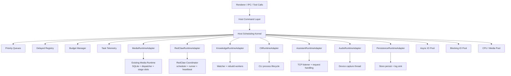

# RedConvert 线程管理升级计划 v2

## 0. 执行记录

### 2026-04-25

线程优化计划已按兼容优先策略完成，当前完成范围：

1. 新增 Phase 0 后台 worker 观测基线。
   - `debug:get-runtime-summary` 的 `phase0.backgroundWorkers` 现在包含 Media Runtime、RedClaw、Knowledge、CLI、Assistant、Persistence 的只读快照。
   - `background-workers:get-pool-state` 不再返回空数组，改为返回同一份后台 worker 汇总。
   - Media Runtime 暴露 job status、due poll、leased job 和 stage limit 快照。

2. 将低风险短任务从裸 `thread::spawn` 迁移到 Tauri blocking pool。
   - chat title
   - RedClaw chat postprocess
   - post-exchange maintenance
   - startup migration
   - note transcription
   - YouTube subtitle/audio fallback

3. 将 RedClaw execution heartbeat 从 OS thread 迁移到 async runtime task。
   - 保留 `start_execution_heartbeat` / `ExecutionHeartbeat::stop` API。
   - 不改变 execution lease、heartbeat 字段、runner 状态机。

4. 将 RedClaw scheduler / runner 两个长期 sleep-loop 迁移到 async runtime。
   - 外层 tick 使用 `tokio::time::interval`。
   - 实际 store I/O、due scan、maintenance、job execution dispatch 仍通过 `spawn_blocking` 进入 blocking pool。
   - `redclaw:stop` 改为 abort async task，避免 UI 因等待长期 loop join 被阻塞。

5. 将 CLI background reaper 从每个后台进程一个 OS thread 迁移到 async runtime task。
   - 保留 stdout/stderr reader 线程，避免破坏当前管道读取和日志实时输出兼容性。
   - reaper 仍按 100ms 刷新进程状态，但不再占用独立常驻 OS thread。

6. 将旧版 `runtimeBypass` 图片批量生成和 subagent fanout 从裸 `thread::spawn` 迁移到 Tauri blocking pool。
   - 保留原并发上限、同步返回、结果排序和错误传播语义。
   - 避免兼容路径绕过统一 runtime pool。

保留范围：

1. CLI stdout/stderr reader、assistant listener、knowledge watcher、audio capture、log sink 保留专属线程。
   - 这些属于有明确生命周期的 reader/listener/device/sink worker。
   - 它们不是“小任务线程”，不参与合并，后续只纳入 diagnostics / telemetry。

2. `main.rs` 中外部命令 stderr reader 保留专用 reader 线程。
   - 当前逻辑依赖阻塞式 stderr pipe drain，贸然改成 async process 会影响流式下载和错误收集。
   - 若后续要继续压缩 reader 线程，应单独做 `tokio::process` 迁移，不能混入本轮线程管理合并。

## 1. 背景

App 功能已经发生变化：图片/视频生成不再只是 `image-gen:generate` / `video-gen:generate` 的同步式 IPC，而是已经升级为独立 `Media Generation Runtime`。这个变化会直接改变线程优化策略。

旧计划的核心假设是“媒体 runtime 正在建设，线程治理后续接入”。现在应调整为：

1. Media Runtime 是现有核心后台 runtime。
2. 线程优化不能再绕开 Media Runtime 自己的 dispatcher、slots、poller、download、bind 结构。
3. 更高效的方案不是再建一个平行调度器，而是在 host 层建立统一调度内核，把各业务 runtime 作为 domain adapter 接入。

本计划目标是构建一个兼容旧业务、可渐进落地、具备强调度能力的 `Host Scheduling Kernel`。

## 2. 当前功能域

当前桌面端后台工作可以按业务域划分：

1. Media Generation Runtime
   - 位置：`desktop/src-tauri/src/media_runtime/*`
   - 任务：图片提交、视频提交、视频轮询、结果下载、素材绑定、聊天 followup 回传
   - 当前已有：SQLite job store、dispatcher tick、stage slots、provider polling、retry/dead-letter 思想

2. RedClaw Runtime
   - 位置：`desktop/src-tauri/src/scheduler/*`、`commands/redclaw*.rs`
   - 任务：定时任务、长期任务、自动化执行、heartbeat、retry、maintenance
   - 当前状态：scheduler/runner 已迁入 async runtime，heartbeat 已迁入 async runtime task

3. Knowledge Runtime
   - 位置：`knowledge_index/*`、`knowledge.rs`
   - 任务：文件 watcher、catalog rebuild、转写、YouTube 字幕/音频 fallback
   - 当前状态：watcher 合理保留，转写/字幕等一次性任务已迁入 Tauri blocking pool

4. CLI Runtime
   - 位置：`cli_runtime/*`
   - 任务：后台命令、stdout/stderr reader、reaper、verification
   - 当前状态：reader 作为管道生命周期线程保留，reaper 已迁入 async runtime

5. Assistant Runtime
   - 位置：`assistant_core.rs`
   - 任务：本地 TCP listener、webhook、knowledge API、外部消息触发 agent
   - 当前策略：listener 独占线程保留，请求处理后续接入统一预算

6. Audio Runtime
   - 位置：`commands/audio.rs`
   - 任务：麦克风录音、音频采样、WAV encode
   - 当前策略：录音采集线程属于设备生命周期线程，不能和普通后台池混用

7. Persistence / Logging / Startup
   - 位置：`persistence/*`、`logging/*`、`main.rs`
   - 任务：store persist、日志写盘、startup housekeeping、official refresh、yt-dlp check
   - 当前问题：persist 已有 debounce，但仍应纳入统一可观测面

## 3. 设计目标

本轮线程优化的目标不是把线程数压到最低，而是让线程“有归属、有预算、有优先级、有可观测性、有回滚”。

必须满足：

1. 高兼容性
   - 不改旧 IPC 名称
   - 不改旧页面调用方式
   - 不破坏 Media Runtime 已完成的 job contract
   - 不破坏 RedClaw 旧任务定义和执行记录

2. 高调度能力
   - 支持 priority queue
   - 支持 delayed task
   - 支持 domain budget
   - 支持 cancellation token
   - 支持 backpressure
   - 支持 source fairness
   - 支持 telemetry

3. 高效率
   - 不再为小任务裸开线程
   - 不再让 polling / heartbeat / reaper 随任务数量线性增长线程
   - CPU/Media 重任务与普通 I/O 隔离
   - 启动阶段任务分批、限流、可推迟

4. 可渐进落地
   - 先观测，再接管
   - 先纳管短任务，再纳管循环 worker
   - 每个 domain 可独立 feature flag 回滚

## 4. 推荐架构

目标架构是 `Host Scheduling Kernel + Domain Runtime Adapters`。

核心原则：

1. Media Runtime 保留自己的业务 runtime，不拆掉。
2. Host Scheduling Kernel 负责跨域预算、优先级、观测和背压。
3. 各 runtime 通过 adapter 暴露任务状态、预算需求、取消能力和健康状态。
4. 真正的线程执行仍然用成熟库：Tokio/Tauri runtime、spawn_blocking、notify、tracing、SQLite WAL。

## 5. 线程分类

## 5.1 必须保留的专属线程

这些线程有明确设备、文件、socket 或串行写入生命周期，不追求合并：

1. `LogSinkWorker`
   - 串行写日志、rotate、archive
   - 保留单 worker，纳入 telemetry

2. `KnowledgeWatchWorker`
   - 文件系统 watcher
   - 保留 watcher 线程，rebuild 投递给调度内核

3. `AssistantListenerWorker`
   - 本地 TCP listener
   - 保留 listener 线程，请求处理接入预算

4. `AudioCaptureWorker`
   - 麦克风采集线程
   - 保留设备采集线程，encode/transcribe 后处理接入 CPU/Media Pool

## 5.2 应合并为 coordinator 的长期工作

这些工作当前或未来不应各自 sleep-loop：

1. `HostHousekeeper`
   - official bootstrap
   - official refresh
   - yt-dlp check
   - delayed warmup

2. `RedClawCoordinator`
   - due scan
   - retry scan
   - stale recovery
   - runner dispatch

3. `HeartbeatCoordinator`
   - 批量维护 RedClaw execution heartbeat
   - 替代每 execution 一个 heartbeat thread

4. `CliExecutionCoordinator`
   - 后台 process reaper
   - 状态刷新
   - verification 排队

5. `MediaDomainCoordinator`
   - 不替换现有 Media Runtime dispatcher
   - 负责把 Media Runtime 的 stage slots 接到全局 budget
   - 负责暴露 media queue depth / stage usage / provider pressure

## 5.3 必须进入共享池的短任务

以下任务禁止继续裸 `thread::spawn`：

1. auth cache persist
2. store persist snapshot serialization
3. official cached data refresh
4. knowledge catalog rebuild
5. note transcription
6. YouTube subtitle/audio fallback
7. media followup notification
8. media artifact bind 后处理
9. chat title / post exchange maintenance
10. startup migration
11. CLI verification

## 6. 调度模型

## 6.1 Priority

定义四档优先级：

1. `critical`
   - cancellation
   - lease recovery
   - store integrity
   - shutdown flush

2. `user_visible`
   - 用户刚点击的生成、录音、提交、取消
   - 页面正在等待 accepted 或状态刷新

3. `background`
   - media polling
   - knowledge rebuild
   - RedClaw 自动执行
   - CLI reaper / verification

4. `maintenance`
   - archive prune
   - delayed warmup
   - yt-dlp auto update check
   - memory maintenance

## 6.2 Domain Budget

默认预算建议：

| Domain | critical | user_visible | background | maintenance | Notes |
| --- | ---: | ---: | ---: | ---: | --- |
| media.image | 1 | 4 | 2 | 0 | image submit 响应要快 |
| media.video | 1 | 2 | 2 | 0 | poll/download 限流 |
| redclaw | 1 | 1 | 2 | 1 | 自动化不能压过交互 |
| knowledge | 0 | 1 | 1 | 1 | rebuild 合并请求 |
| cli_runtime | 1 | 2 | 2 | 0 | reader 保留，reaper 合并 |
| assistant | 1 | 2 | 1 | 0 | listener 独立，请求处理限流 |
| audio | 1 | 1 | 1 | 0 | capture 独立，后处理限流 |
| persistence | 1 | 1 | 1 | 1 | flush 可抢占 |

预算不是硬编码常量，应进入 runtime config，并根据设备能力做上限裁剪。

## 6.3 Backpressure

当系统压力升高时按顺序处理：

1. 合并重复任务
   - knowledge rebuild
   - official refresh
   - media followup notification

2. 延后 maintenance
   - archive prune
   - warmup
   - auto update check

3. 降低 background 并发
   - video poll
   - RedClaw long-cycle
   - CLI verification

4. 保护 user-visible
   - submit accepted
   - cancel accepted
   - status query

5. 拒绝或延迟新 background 任务
   - 返回 `deferred` / `backpressured` / `coalesced`

## 6.4 Fairness

调度器按 `priority + domain + source_key` 进行加权轮转。

规则：

1. 单个 domain 不能吃满全部 blocking pool。
2. Media video polling 不能压住 image submit。
3. RedClaw 自动化不能压住用户交互任务。
4. Knowledge rebuild 必须可被合并，不能排队堆积。
5. Persistence flush 和 cancellation 拥有短时抢占能力。

## 7. Media Runtime 接入策略

Media Runtime 已经有自己的 dispatcher，这是优势，不应拆掉重做。

需要做的是加一层 adapter：

1. 暴露 stage pressure
   - image-submit active / queued
   - video-submit active / queued
   - video-poll active / due
   - video-download active / queued

2. 接收全局 budget
   - 全局调度器告诉 media runtime 当前各 stage 可用预算
   - media runtime 保留本地 slots，但 slots 上限由全局预算裁剪

3. 上报 telemetry
   - job accepted latency
   - queue delay
   - stage duration
   - provider poll interval
   - retry/dead-letter reason

4. 保护兼容性
   - `generation:*` channel 不变
   - legacy `image-gen:*` / `video-gen:*` envelope 不变
   - job projection 不变
   - binder 不变

不要做：

1. 不把 media job 直接塞进 RedClaw scheduler。
2. 不让 Host Scheduling Kernel 直接操作 provider task id。
3. 不重写 media job store。
4. 不让每个 video job 持有独占 polling thread。

## 8. RedClaw 接入策略

RedClaw 是下一阶段线程收益最大的 domain。

改造目标：

1. `run_redclaw_scheduler` 从专属 sleep-loop 改为 coordinator tick。
2. `run_redclaw_job_runner` 从专属 sleep-loop 改为 budgeted dispatch。
3. `start_execution_heartbeat` 从每 execution 一个 thread 改为 `HeartbeatCoordinator`。
4. execution 执行继续保留现有 lease/retry/checkpoint 语义。

兼容策略：

1. `redclaw:*` IPC 不变。
2. 旧 `redclaw_job_definitions` / `redclaw_job_executions` 不迁移。
3. 新 coordinator 先 shadow 旧 scheduler 计算结果。
4. takeover 后保留旧路径 feature flag 回滚。

## 9. Knowledge 接入策略

保留 watcher，收口执行。

改造目标：

1. watcher 只发出 `KnowledgeRebuildRequested`。
2. rebuild 请求按 workspace/source coalesce。
3. rebuild 执行进入 blocking pool。
4. transcription / subtitle fallback 进入 CPU/Media Pool。

兼容策略：

1. `knowledge:*` IPC 不变。
2. catalog schema 不变。
3. index status payload 不变。

## 10. CLI 接入策略

CLI 的 reader 线程短期可以保留，reaper 必须合并。

改造目标：

1. stdout/stderr reader 先保留，避免破坏日志实时性。
2. per-process reaper 改为 `CliExecutionCoordinator` 批量 poll。
3. verification 进入 blocking pool。
4. 后续再评估 `tokio::process`。

兼容策略：

1. CLI execution record 不变。
2. CLI event 不变。
3. cancel 行为不变。

## 11. Assistant 和 Audio 接入策略

Assistant：

1. TCP listener 保留专属线程。
2. 请求读取保持现状。
3. agent execution / knowledge API / relay 后处理接入预算。
4. 外部 webhook 暴增时，按 assistant domain 限流。

Audio：

1. capture thread 保留专属线程。
2. WAV encode、转写、保存、后处理接入 CPU/Media Pool。
3. 录音停止和取消属于 `critical`。

## 12. 第三方库选择

必须使用成熟库：

1. Tokio / Tauri async runtime
   - async task、timer、spawn_blocking、semaphore

2. tokio-util
   - `CancellationToken`
   - coordinator lifecycle

3. tracing
   - task span、queue delay、domain pressure、error chain

4. notify
   - 文件系统 watcher

5. rusqlite + SQLite WAL
   - media job store、durable queue

6. reqwest
   - async provider polling / download

7. cpal / hound
   - audio capture / WAV encode，保留现有成熟库路线

推荐引入：

1. parking_lot
   - 替换高频 Mutex 场景，降低锁开销

2. dashmap
   - execution registry / pressure registry 如果需要并发读写

不自研：

1. async runtime
2. filesystem watcher
3. timer wheel
4. semaphore
5. structured tracing
6. media provider HTTP client

必须自研：

1. `HostSchedulingKernel`
2. `DomainRuntimeAdapter`
3. `BudgetManager`
4. `DelayedTaskRegistry`
5. `TaskTelemetrySchema`
6. `LegacySpawnAdapter`
7. `HeartbeatCoordinator`

## 13. 实施顺序

## 13.1 Phase 0：基线观测

目标：

- 不改行为，只建立线程和任务观测基线

工作：

1. 输出业务 worker inventory。
2. 记录 domain queue depth。
3. 记录 spawn 来源。
4. 记录 media stage pressure。
5. 记录 RedClaw execution / heartbeat 数量。

验收：

- diagnostics 能展示每个 domain 的 active / queued / delayed / failed。

## 13.2 Phase 1：调度内核骨架

目标：

- 建立 Host Scheduling Kernel，但先不接管执行

工作：

1. 新增 `runtime/task_scheduler.rs`。
2. 新增 `runtime/task_budget.rs`。
3. 新增 `runtime/task_telemetry.rs`。
4. 新增 feature flags。

验收：

- shadow mode 下不影响任何旧业务。

## 13.3 Phase 2：接入 Media Runtime Adapter

目标：

- 把已完成的 Media Runtime 纳入全局观测和预算

工作：

1. 暴露 media stage pressure。
2. 让 media dispatcher 接收全局 budget snapshot。
3. media followup notification 进入调度内核。
4. video poll / download 记录 queue delay 和 stage duration。

验收：

- 100 个图片 job、20 个视频 job 场景下，media stage 不会挤压 persistence、cancel、status query。

## 13.4 Phase 3：短任务收口

目标：

- 消除裸 `thread::spawn` 的短任务来源

工作：

1. auth cache persist 接入 dispatcher。
2. store persist 接入 dispatcher telemetry。
3. official refresh 接入 dispatcher。
4. chat title / post exchange maintenance 接入 dispatcher。
5. startup migration 接入 dispatcher。

验收：

- 小任务不再直接创建独立 OS thread。

## 13.5 Phase 4：RedClaw coordinator

目标：

- 合并 RedClaw scheduler / runner / heartbeat

工作：

1. 建 `RedClawCoordinator` shadow mode。
2. 建 `HeartbeatCoordinator`。
3. execution heartbeat registry 批量 tick。
4. runner dispatch 按 budget 执行。

验收：

- 并发 execution 增长时，heartbeat 线程不增长。

## 13.6 Phase 5：Knowledge / CLI / Assistant / Audio

目标：

- 把剩余 domain 纳入统一预算

工作：

1. Knowledge rebuild coalesce。
2. CLI reaper 合并。
3. Assistant request handling 限流。
4. Audio 后处理进入 CPU/Media Pool。

验收：

- 多 domain 并发时 user-visible 任务不被 background 任务拖慢。

## 13.7 Phase 6：Takeover 与回滚

目标：

- 从 shadow 切到 takeover，同时保留回滚能力

工作：

1. domain 级 feature flag。
2. old path fallback。
3. diagnostics 对比 old/new 决策。
4. 压测后逐域开启。

验收：

- 任一 domain 可独立回滚，不影响其他 domain。

## 14. 风险与约束

1. 不要一开始就全局替换所有 spawn。
   - 先建观测，再分 domain 接管。

2. 不要拆掉 Media Runtime 已完成的 dispatcher。
   - 只做 adapter 和 budget 接入。

3. 不要把所有任务塞进 RedClaw。
   - RedClaw 是自动化 runtime，不是通用线程池。

4. 不要把 audio capture 放进 shared pool。
   - 设备采集生命周期独立。

5. 不要用单一全局 semaphore 解决所有问题。
   - 必须是 domain budget + priority + source fairness。

6. 不要持锁执行 I/O。
   - 继续保持“锁内状态切换，锁外执行重活”。

## 15. 最终形态

最终线程管理应呈现为：

1. 少量专属 worker 处理设备、socket、watcher、日志。
2. Host Scheduling Kernel 管理跨域预算、优先级、延迟任务和观测。
3. Media Runtime 保留独立业务 runtime，但接受全局预算。
4. RedClaw 从多线程 sleep-loop 改为 coordinator。
5. Knowledge / CLI / Assistant / Audio / Persistence 都通过 adapter 接入。
6. 所有短任务进入共享池，所有长轮询进入 coordinator。

这版方案追求的是可控和高效，不追求机械减少线程数。线程可以存在，但必须有清晰职责、生命周期、预算和观测。
