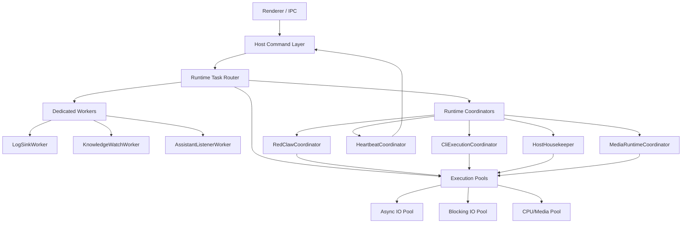

# RedConvert 线程管理升级计划

## 1. 目标

本计划的目标不是单纯压低线程数量，而是把线程从“分散、按任务临时生长、难观测”的状态，升级为“分层、可调度、可观测、兼容旧业务”的运行时体系。

目标标准：

1. 保持旧业务 100% 可用，不改变现有 IPC、命令、事件、工具、页面行为。
2. 后台 worker 的数量、职责和生命周期必须可解释，避免“小任务独占线程”。
3. 调度能力要达到浏览器内核级原则，具体是：
   - 分级优先级队列
   - 延迟任务与周期任务统一调度
   - 公平性与预算控制
   - 背压与并发上限
   - 任务取消、超时、降级、重试
   - 可观测、可追踪、可回放
4. 不追求线程绝对最少，追求线程管理高效、吞吐稳定、调度可控。
5. 线程管理升级必须吸收 `desktop/docs/media-generation-runtime-upgrade-plan.md` 的正在进行中的变更，避免媒体 runtime 先升级、线程治理后返工。

这里的“Chrome 级别”指调度设计原则与工程能力对齐浏览器 runtime，而不是复制 Chrome 的源码或实现一个完整 OS scheduler。

## 2. 当前线程现状

按当前业务代码，而不是按 Tauri/WebView/Tokio/系统线程统计，长期驻守 worker 基线如下：

### 2.1 固定常驻

1. `logging/file_sink.rs`
   - 1 个日志写盘 worker
   - 作用：串行写日志、rotate、压缩

2. `knowledge_index/watcher.rs`
   - 1 个知识库目录 watcher worker
   - 作用：接收文件系统事件、debounce、触发重建

3. `main.rs`
   - 1 个 startup housekeeping async coordinator
   - 作用：official auth bootstrap、cache refresh、yt-dlp 检查

### 2.2 按功能启用的常驻

1. `assistant_core.rs`
   - 1 个 assistant 本地 TCP listener

2. `scheduler/mod.rs`
   - 1 个 RedClaw scheduler
   - 1 个 RedClaw runner

### 2.3 动态放大的线程来源

1. `scheduler/heartbeat.rs`
   - 每个 execution 启一个 heartbeat 线程
   - 这是当前最明显的线性增长点

2. `cli_runtime/executor.rs`
   - 每个后台 CLI 执行会有 stdout/stderr reader、reaper 等线程

3. `knowledge.rs` / `startup_migration.rs` / `agent/*`
   - 转写、字幕、migration、postprocess 等一次性线程

结论：

- 业务侧真正的长期 worker 数量并不夸张
- 问题核心不是“常驻线程太多”
- 问题核心是“线程模型不统一”，尤其是：
  - 周期任务各自常驻
  - 小任务直接 `thread::spawn`
  - execution heartbeat 线性扩张
  - CLI 背景任务附带额外 reader/reaper 线程

## 2.4 Media Generation Runtime 前置依赖

`desktop/docs/media-generation-runtime-upgrade-plan.md` 正在把图片/视频生成升级为独立 runtime。线程管理计划必须把它当成前置依赖，而不是并行忽略。

原因：

1. 媒体生成是当前最典型的长生命周期后台任务域之一，天然涉及 submit、poll、download、bind 四段链路。
2. 该计划已经明确要求：
   - provider polling 不再按任务独占阻塞线程
   - 页面和 AI tool 只提交 job，不直接承载执行生命周期
   - 图片/视频共享同一个 runtime 底座
3. 如果线程治理不吸收这部分变更，后续很容易出现：
   - 媒体 runtime 自己一套 dispatcher
   - host 线程治理再做一套 dispatcher
   - 两套路由互不感知预算，最后还是互相抢资源

因此本计划的强制执行顺序是：

1. 先完成 Media Generation Runtime 升级。
2. 再把该 runtime 接入统一线程/调度框架。
3. 线程治理阶段不重写媒体业务状态机，只接管其调度、预算、轮询、下载与观测边界。

## 3. 设计原则

## 3.1 兼容性原则

升级后必须满足：

1. 不改现有 IPC channel 语义。
2. 不改现有 renderer 调用方式。
3. 不改现有 AppState 的业务含义。
4. 不要求旧任务、旧 store、旧 runtime session 做破坏性迁移。
5. 所有旧业务入口继续可用，线程模型变化只发生在 host/runtime 内部。
6. Media Generation Runtime 已经定义的 `job_id`、provider task id、projection、binder 语义必须保持稳定，不允许线程治理反向破坏这些 contract。

## 3.2 调度原则

新线程管理必须具备以下调度特性：

1. Priority
   - 任务至少分为 `critical`、`user-visible`、`background`、`maintenance`

2. Isolation
   - 网络 I/O、文件 I/O、CPU 重活、长期 listener 不能混在一个线程模型里

3. Fairness
   - 单一业务模块不能霸占全部 worker

4. Backpressure
   - 队列满时要限流、拒绝、延迟或降级，而不是继续起线程

5. Budget
   - 每类任务有并发预算和时间预算

6. Cancellation
   - 旧任务不能长期占住资源，必须支持取消、过期与忽略结果

7. Observability
   - 所有后台任务必须可以看到来源、优先级、排队时间、执行时间、失败原因

8. Cross-Domain Scheduling
   - 文本自动化、媒体生成、知识库、CLI 后台任务必须共享同一套预算和抢占规则，不能各自为政

## 3.3 实现原则

1. 必须优先使用成熟库。
2. 只在“调度策略、任务编排、兼容层”上自研。
3. 所有阻塞重活统一进入共享执行池。
4. 只有真正需要独占生命周期的 worker 才保留专属线程。
5. Media Generation Runtime 保留独立业务边界，但其线程、poll、download、bind 必须接入统一调度内核。

## 4. 目标架构

## 4.1 总体架构

升级后线程管理采用四层模型：

1. Dedicated Workers
   - 少量必须独占的专属线程

2. Runtime Coordinators
   - 少量 async 协调器，负责任务路由、延迟调度、预算分配

3. Shared Execution Pools
   - 共享 blocking / async 执行池，承接短命工作

4. Compatibility Adapters
   - 兼容旧 command / old channel / old task model，不让旧业务感知底层调度变化

## 4.2 目标拓扑

## 5. 各模块实现方案

## 5.1 Dedicated Workers

### A. LogSinkWorker

职责：

- 串行写日志
- rotate
- 压缩
- archive 清理

实现策略：

- 保留单线程模型
- 不并入共享线程池
- 原因是日志落盘要求有序、低锁竞争、低碎片化

结论：

- 继续使用现有实现
- 不做线程合并

### B. KnowledgeWatchWorker

职责：

- watch 文件系统变化
- debounce
- 触发 index rebuild 请求

实现策略：

- 保留独占 watcher 线程
- 但 watcher 不再直接承担重建
- watcher 只发出 `RebuildRequested` 到统一调度器

结论：

- watcher 保留
- rebuild 执行迁到共享 blocking pool

### C. AssistantListenerWorker

职责：

- 绑定本地 TCP 端口
- 接入 webhook / local relay / knowledge API

实现策略：

- 第一阶段保持现有 listener 专属线程
- 第二阶段可评估迁移到 `tokio::net::TcpListener`
- 但在本次升级计划中不要求强制 async 化

结论：

- listener 保留专属 worker
- request handling 逐步下沉到 shared execution pools

## 5.2 Runtime Coordinators

### A. HostHousekeeper

职责：

- startup official auth bootstrap
- official cache refresh
- yt-dlp auto update check
- 后续 memory maintenance trigger
- 后续 delayed warmup jobs

实现：

- 1 个 async coordinator
- 内部使用 `tokio::time::interval`
- 阻塞工作投递到 blocking pool
- 每类 housekeeping job 有优先级和预算

为什么这样做：

- 避免每个周期性任务单开常驻线程
- 统一 startup 背景任务
- 避免启动瞬间多个小任务并发争抢线程

### B. RedClawCoordinator

职责：

- 扫描 due task
- stale execution recover
- retry 计算
- enqueue execution
- execution budget 分配

实现：

- 替代当前 `scheduler + runner` 双线程 sleep-loop 模型
- 改为 1 个 async coordinator
- coordinator 只负责：
  - 扫描
  - 决策
  - 入队
- 真正执行由共享 execution pool 承担

为什么这样做：

- 调度逻辑与执行逻辑解耦
- coordinator 本身轻量，不会被长任务拖死
- 更接近 Chrome 的 sequence manager 设计思想

### C. HeartbeatCoordinator

职责：

- 维护运行中 execution 的 heartbeat
- 批量更新 lease / last_heartbeat_at
- 处理 heartbeat timeout

实现：

- 禁止“每个 execution 一个线程”
- 改为 1 个 async coordinator + execution registry
- registry 存：
  - execution_id
  - state
  - lease_deadline
  - heartbeat_interval
  - next_due_at

- coordinator 每个 tick 扫一遍 due execution，批量更新

为什么这样做：

- 从 `N 个 execution = N 个 heartbeat 线程` 变成 `1 个 heartbeat coordinator`
- 这是本次升级中收益最大的线程收口点

### D. CliExecutionCoordinator

职责：

- 管理后台 CLI execution 生命周期
- 负责 reaper、polling、状态刷新
- 路由日志读取与结果回收

实现：

- 每个 CLI 进程的 stdout/stderr 读取允许保留 reader 任务
- 但 reaper 和轮询状态统一进 coordinator
- 第二阶段再评估 `tokio::process`

为什么这样做：

- 风险小，兼容性高
- 先把“per-process reaper thread”收掉
- 后续再逐步 async 化

### E. MediaRuntimeCoordinator

职责：

- 承接 `Media Generation Runtime` 的统一调度入口
- 管理图片/视频 job 的 submit、poll、download、bind 四段生命周期
- 让媒体 job 与 RedClaw、knowledge、official refresh 共享预算与优先级框架

实现：

- 不替代 `media-generation-runtime-upgrade-plan.md` 中的业务 runtime
- 而是在其外层提供统一调度接入面
- `MediaRuntimeCoordinator` 至少管理以下子阶段：
  - `submitter`
  - `shared poller`
  - `artifact downloader`
  - `artifact binder`
- 所有阶段都统一进入 shared pools，不允许出现：
  - 每个视频 job 一个 polling 线程
  - 每个下载任务一个独占线程
  - 每个 binder 一个裸 `thread::spawn`

为什么这样做：

- 媒体任务天然是线程治理的大户
- 如果不把媒体 runtime 纳入统一预算，媒体域会成为新的线程膨胀源
- 这也是“Chrome 级调度能力”必须覆盖的重点场景

## 5.3 Shared Execution Pools

### A. Async IO Pool

职责：

- 网络请求
- timer
- channel dispatch
- 非阻塞状态更新

实现：

- 基于 Tauri 提供的 async runtime
- 不新建自定义 runtime
- 所有 async 调度统一走这一层

### B. Blocking IO Pool

职责：

- 文件读写
- store 持久化
- auth cache persist
- official refresh 中的阻塞 I/O
- knowledge rebuild 中的磁盘工作
- migration

实现：

- 基于 `tauri::async_runtime::spawn_blocking`
- 外层加自研的 `TaskDispatcher + Semaphore`
- 控制最大并发和优先级

### C. CPU / Media Pool

职责：

- OCR
- 转写后处理
- 视频/图片处理
- 大文件解析
- 媒体 artifact bind 前后的重 CPU / 重 I/O 阶段

实现：

- 单独配置一类执行池
- 与普通 blocking I/O 隔离
- 避免媒体任务把 store persist / auth refresh 饿死
- 作为 `MediaRuntimeCoordinator` 的默认重任务执行面

## 6. 调度能力设计

## 6.1 优先级模型

所有后台任务统一分为四档：

1. `critical`
   - cancellation
   - lease/heartbeat timeout recovery
   - store integrity 操作

2. `user_visible`
   - 页面直接触发的后台任务
   - 用户正在等待结果的 command

3. `background`
   - official refresh
   - knowledge rebuild
   - CLI background reaper
   - media poll / media artifact download / media bind

4. `maintenance`
   - archive prune
   - delayed warmup
   - auto update check

规则：

- 高优先级可抢占低优先级的预算
- 低优先级不能阻塞高优先级
- 同优先级采用 FIFO + aging，避免饿死

## 6.2 Budget 模型

每类工作有独立预算：

- `critical`: 小数量、立即执行
- `user_visible`: 中等并发，优先保障
- `background`: 有上限，避免打满
- `maintenance`: 空闲时执行，必要时暂停

建议默认值：

- critical: 2
- user_visible: 4
- background: 2
- maintenance: 1
- media/cpu heavy: 1 到 2

这些值必须配置化，并允许按机器能力动态调整。

## 6.3 公平性与背压

实现策略：

1. 每个任务源设置 `source_key`
   - `redclaw`
   - `knowledge`
   - `assistant`
   - `official`
   - `cli_runtime`
   - `media_generation`

2. 调度器按 `priority + source_key` 做加权轮转

3. 当队列超过阈值时：
   - maintenance 任务延后
   - background 任务合并
   - 重复 rebuild / refresh 请求去重
   - 新任务收到 `deferred` / `coalesced` / `backpressured` 状态

4. 当 blocking 池繁忙时：
   - 不允许继续裸开线程
   - 只能排队或合并

## 6.4 延迟任务与周期任务

周期性工作统一走 `DelayedTaskRegistry`：

- 注册任务 ID
- 记录 next_due_at
- 记录 interval / one-shot
- 记录 jitter 策略
- 记录 priority

这样可以让：

- startup housekeeping
- periodic refresh
- heartbeat
- stale recovery
- redclaw tick

都由统一调度器驱动，而不是各自 sleep-loop。

其中媒体生成域必须额外满足：

- `submit` 可高并发快速返回 accepted
- `poll` 必须共享轮询器，不得按 job 独占线程
- `download` 与 `bind` 必须可限流
- `video` 任务默认预算低于 `image submit`，避免长视频轮询拖垮交互生图

## 7. Chrome 级调度能力的落地定义

本计划要求达到的“Chrome 级”能力，不是内核实现一致，而是具备以下运行时品质：

1. Task Queue 分层
   - 不同优先级、不同来源的任务进入不同队列

2. Delayed Queue
   - 延迟任务和周期任务统一管理

3. Sequence / Affinity
   - 某些任务要求串行、有状态、同源顺序执行

4. Cooperative Scheduling
   - 长任务必须拆分为阶段，提供 yield 点

5. Budgeting
   - 后台任务不能无限制占用执行器

6. Cancellation / Expiration
   - 旧任务过期时可取消或丢弃结果

7. Instrumentation
   - 每个任务都可看到 enqueue/start/finish/duration/queue_delay/outcome

对 RedConvert 而言，等价实现方式是：

- `TaskDispatcher`
- `PriorityQueues`
- `DelayedTaskRegistry`
- `HeartbeatCoordinator`
- `BudgetManager`
- `TaskTelemetry`
- `MediaRuntimeCoordinator`

## 8. 第三方库选型

## 8.1 必须使用成熟库

### A. Tokio / Tauri Async Runtime

用途：

- async task 调度
- timer/interval
- spawn_blocking
- JoinSet / cancellation / semaphore

结论：

- 必用
- 不自研 async runtime

### B. notify

用途：

- 文件系统监听

结论：

- 保留使用
- 不自研 watcher

### C. tracing

用途：

- 调度事件、队列时延、任务生命周期、错误链路追踪

结论：

- 必须深化使用
- 不用自研日志协议替代 tracing

### D. tokio-util

用途：

- `CancellationToken`
- 更标准的异步取消语义

结论：

- 推荐引入
- 用于 coordinator 和 execution 生命周期管理

### E. dashmap 或 parking_lot

用途：

- 高频 registry / task table / execution registry 的低争用访问

结论：

- 推荐二选一
- 如果保持当前风格，优先 `parking_lot`
- 如果需要高并发 registry，优先 `DashMap`

### F. crossbeam-channel

用途：

- 若某些 dedicated worker 仍需同步通道

结论：

- 可选
- 如果 `tokio::mpsc` 足够，则不必强引入

## 8.2 不建议自研

以下内容禁止自研替代：

- async runtime
- timer wheel
- semaphore
- filesystem watcher
- structured tracing

## 8.3 需要自研的部分

以下内容必须自研，因为它们是 RedConvert 业务语义：

1. `TaskDispatcher`
2. `BudgetManager`
3. `DelayedTaskRegistry`
4. `HeartbeatRegistry`
5. `LegacyCompatibilityAdapter`
6. `TaskTelemetrySchema`
7. `MediaRuntimeCoordinatorAdapter`

## 9. 兼容性方案

## 9.1 核心兼容原则

升级必须是“内部替换、外部不变”：

- IPC 名称不变
- 事件名称不变
- store 主字段不变
- 旧页面不需要联动修改
- 旧任务定义可继续执行

## 9.2 兼容层设计

新增 `LegacyCompatibilityAdapter`，职责如下：

1. 接住旧入口发来的后台任务请求
2. 把旧的 `spawn` 类调用映射为 dispatcher 投递
3. 保持旧返回值与旧事件完全一致
4. 保持旧错误文本兼容

## 9.3 灰度切换策略

调度内核升级不能一次性硬切，必须分 3 层灰度：

1. `shadow mode`
   - 新调度器只观测、不真正接管
   - 输出 telemetry，与旧逻辑结果对比

2. `dual-write mode`
   - 旧逻辑仍执行
   - 新调度器同步记录决策与任务状态

3. `takeover mode`
   - 新调度器真正接管执行
   - 旧逻辑仅保留 fallback

所有模式都必须由配置开关控制。

## 9.4 回滚能力

必须支持快速回滚：

- coordinator 级 feature flag
- heartbeat coordinator 独立开关
- redclaw coordinator 独立开关
- cli execution coordinator 独立开关

回滚要求：

- 不需要数据迁移回退
- 只切回旧调度路径即可

## 10. 各业务模块的改造边界

## 10.1 RedClaw

必须改：

- scheduler 双线程模型
- per-execution heartbeat 线程
- execution budget

不改：

- 现有 `redclaw:*` channel
- 当前任务数据结构的核心业务字段

## 10.2 Knowledge

必须改：

- rebuild 触发后的执行路径统一进入 blocking dispatcher

不改：

- watcher 行为
- index schema

## 10.3 Assistant

必须改：

- listener 收到请求后的后续重活分发方式

不改：

- listener 入口
- webhook 协议

## 10.4 CLI Runtime

必须改：

- per-process reaper thread

可暂缓：

- stdout/stderr reader 全量 async 化

## 10.5 Persistence

必须改：

- 所有异步 persist 统一进入 dispatcher

不改：

- store schema
- 持久化格式

## 10.6 Media Generation Runtime

必须改：

- 线程管理计划要显式吸收 `media-generation-runtime-upgrade-plan.md` 的运行时结构
- provider polling、artifact download、artifact bind 必须进入统一调度体系
- 媒体 job 必须成为一级 `task source`
- 媒体域的 submit / poll / download / bind 要有独立 budget，但仍受全局 budget manager 约束

不改：

- 媒体 runtime 已定义的业务状态机
- 既有 `job_id`、provider task id、projection、binder 语义
- 页面提交任务与消费状态的产品形态

## 11. 性能优化策略

## 11.1 降线程增长

重点不是“减少 1~2 条常驻线程”，而是消除线性增长模型：

- heartbeat 线程从 `N` 降到 `1`
- reaper 线程从 `N` 降到 `1`
- 小任务裸 spawn 改为共享 pool

## 11.2 降锁竞争

- registry 读写改为低争用结构
- 锁内只做状态切换
- 真正 I/O 在锁外执行

## 11.3 降 wakeup 成本

- 延迟任务统一调度，减少多个 sleep-loop
- 周期任务批量 tick
- 合并重复 rebuild / refresh

## 11.4 降启动尖峰

- startup housekeeping 串行或受预算执行
- warmup、refresh、update check 不并发打满机器

## 11.5 提升高负载稳定性

- media/cpu heavy 与普通 I/O 隔离
- background/maintenance 有硬预算
- user-visible 任务始终优先

## 12. 实施步骤

## 12.1 步骤一：建立统一调度基础设施

新增：

- `runtime/task_dispatcher.rs`
- `runtime/budget_manager.rs`
- `runtime/delayed_registry.rs`
- `runtime/task_telemetry.rs`

产出：

- 统一任务投递接口
- 优先级队列
- budget 控制
- 事件追踪

## 12.2 步骤二：完成 Media Generation Runtime 前置升级

范围：

- 以 `desktop/docs/media-generation-runtime-upgrade-plan.md` 为准
- 完成独立媒体 runtime、job store、shared poller、binder/projection 体系

目标：

- 先让媒体域完成业务边界收口
- 后续线程治理只接管调度与预算，不重写媒体业务语义

## 12.3 步骤三：接入媒体 runtime 到统一调度框架

范围：

- media submit
- shared poller
- artifact download
- artifact bind

目标：

- 媒体 runtime 成为统一调度内核中的一级任务源
- 视频/图片任务不再游离于 host 线程治理之外

## 12.4 步骤四：接管 startup housekeeping

范围：

- official bootstrap
- official refresh
- yt-dlp update check

目标：

- 周期任务不再各自独立线程

## 12.5 步骤五：接管 persistence / auth / knowledge 的短命任务

范围：

- auth cache persist
- store persist
- official refresh blocking work
- knowledge rebuild

目标：

- 所有一次性后台任务不再裸 `thread::spawn`

## 12.6 步骤六：重构 RedClaw

范围：

- scheduler
- runner
- heartbeat

目标：

- 1 个 coordinator + 1 个 heartbeat coordinator + shared execution pool

## 12.7 步骤七：接管 CLI background execution

范围：

- reaper
- polling
- 状态刷新

目标：

- 去掉 per-process reaper thread

## 12.8 步骤八：灰度与验收

范围：

- shadow mode
- dual-write mode
- takeover mode

目标：

- 旧业务零回退

## 13. 验收标准

必须同时满足：

1. 旧业务入口全部可用。
2. 页面无新增白屏、卡死、刷新回退。
3. 启动线程结构可解释，业务侧专属线程数量稳定。
4. RedClaw 多 execution 并发时，不再出现 heartbeat 线程线性增长。
5. Media Generation Runtime 升级完成后，图片/视频 job 的 polling、download、bind 不再按 job 线性增长线程。
6. 在高负载下：
   - user-visible 任务仍可及时调度
   - maintenance 不抢核心资源
   - queue delay 可观测
7. 所有后台任务都能看到：
   - source
   - priority
   - enqueue_at
   - start_at
   - finish_at
   - queue_delay_ms
   - run_duration_ms
   - timeout / cancel / retry / failure reason

## 14. 推荐最终方案

综合兼容性、调度能力、落地成本，推荐采用以下最优解：

### 必保留的专属 worker

1. `LogSinkWorker`
2. `KnowledgeWatchWorker`
3. `AssistantListenerWorker`

### 必建设的共享协调器

1. `HostHousekeeper`
2. `RedClawCoordinator`
3. `HeartbeatCoordinator`
4. `CliExecutionCoordinator`
5. `MediaRuntimeCoordinator`

### 必建设的共享执行池

1. `Async IO Pool`
2. `Blocking IO Pool`
3. `CPU / Media Pool`

### 必建设的兼容层

1. `LegacyCompatibilityAdapter`
2. `TaskTelemetry`
3. `Feature-Flagged Rollout`
4. `MediaRuntimeCoordinatorAdapter`

这套方案的优点是：

- 兼容性最高
- 对旧业务侵入最小
- 调度能力显著增强
- 线程数量不会随 execution 或小任务线性爆炸
- 符合浏览器级 runtime 的任务管理原则

这套方案的结论不是“线程一定很少”，而是“线程面小、职责清晰、调度集中、执行受控、兼容旧业务、可以持续演进”。
