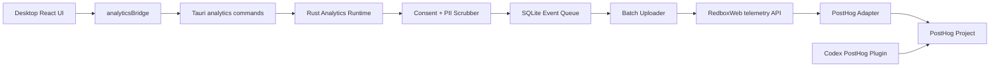

# RedBox Usage Analytics And PostHog Plan

## Decision

RedBox should use PostHog for product analytics, but the desktop app should not embed PostHog as a direct dependency and should not call PostHog from scattered UI code.

The recommended architecture is:

- RedBox desktop records typed usage events through a local analytics bridge.
- The Rust host owns consent, privacy filtering, durable local queueing, retry, and batching.
- The real website and ingestion service live in `/Users/Jam/LocalDev/GitHub/ArtiSalesBackend/websites/RedboxWeb`.
- `RedboxWeb` forwards approved telemetry to PostHog through server-side environment variables.
- The Codex PostHog plugin is used after ingestion to inspect events, write HogQL, create dashboards, and manage feature flags.
- `/Users/Jam/LocalDev/GitHub/RedConvert/RedBoxweb` is not an active website surface and should stay removed.

This keeps the product runtime independent of a specific analytics vendor while still using PostHog as the analysis backend.

## Current Project Boundaries

### RedConvert Repository

Root: `/Users/Jam/LocalDev/GitHub/RedConvert`

Active product surfaces:

- `desktop/`: Tauri v2 + React desktop app.
- `private/scripts/hybrid-release/`: release tooling.
- `desktop/docs/`: closest location for this app telemetry plan.

Removed surface:

- `RedBoxweb/`: old website copy under the RedConvert repository. It should not receive new analytics work.

### Active Redbox Website

Root: `/Users/Jam/LocalDev/GitHub/ArtiSalesBackend/websites/RedboxWeb`

Important facts:

- Next.js website, Node `>=22 <23`, `pnpm@10`.
- Existing API routes already include account, downloads, updates, and client diagnostics.
- Existing diagnostics endpoint: `app/api/v1/client-diagnostics/reports/route.ts`.
- Production module tag pattern: `websites/RedboxWeb/v<version>`.
- Coolify app: `RedBoxWeb`, UUID `y80ss0gw4gckksc8kg88g008`, domain `redbox.ziz.hk`.
- Module image repository pattern: `<ACR_REGISTRY>/artisalesbackend-websites-redboxweb:<tag>`.

Telemetry ingestion belongs here, not in the removed RedConvert website copy.

### Codex PostHog Plugin

The installed Codex PostHog plugin is an operator and analysis tool. It can:

- Verify event arrival.
- Query events with HogQL.
- Build dashboards and insights.
- Inspect funnels, retention, paths, and feature flags.
- Manage experiments and flags after the product event model exists.

It cannot replace product-side capture code inside RedBox.

## Architecture



Key rule: app code emits business events; only the analytics runtime decides whether, when, and how they leave the device.

## Why Not Direct PostHog In Desktop

Direct desktop-to-PostHog is possible because the PostHog project token is write-only for capture endpoints. It is still not the best fit for RedBox.

Reasons:

- RedBox needs stronger privacy controls than a generic SDK default.
- Desktop clients can be offline for long periods and need durable queueing.
- Vendor switching should not require a desktop app release.
- RedboxWeb can enforce schema, payload size, rate limits, version rules, and server-side redaction.
- Future self-hosted PostHog can be adopted by changing `POSTHOG_HOST` in RedboxWeb, not by shipping a new desktop binary.
- Feature flag evaluation can be routed through RedboxWeb later without exposing private API keys.

## Provider Choice

### Recommended

Use PostHog Cloud or EU Cloud first, with RedboxWeb as the fixed ingestion boundary.

This is the fastest way to validate:

- Which events are useful.
- Whether event volume is manageable.
- Which dashboards drive product decisions.
- Whether self-hosting is worth the operational cost.

### Self-hosted PostHog Later

Self-hosting remains compatible with this plan. The implementation must only depend on:

- `POSTHOG_HOST`
- `POSTHOG_PROJECT_API_KEY`

When self-hosting is chosen, RedboxWeb changes those environment variables and the desktop app remains unchanged.

### Alternatives

| Option | Fit | Tradeoff | Recommendation |
| --- | --- | --- | --- |
| PostHog Cloud through RedboxWeb | Product analytics, funnels, retention, AI workflow analysis | Data hosted by PostHog | Best first version |
| Self-hosted PostHog through RedboxWeb | Data ownership, long-term cost control | Requires VM, upgrades, backups, monitoring | Adopt after taxonomy is stable |
| Aptabase | Lightweight desktop app analytics | Less powerful for funnels, AI workflow, feature flags | Not primary |
| Umami | Website traffic and outbound link analytics | Weak fit for product workflow analysis | Use only for website if needed |
| Fully custom analytics DB | Maximum control | Rebuild dashboards, funnels, retention, querying | Not worth it now |

## Data Model

### Event Envelope

All product events should use one canonical envelope before provider conversion.

```json
{
  "schemaVersion": "redbox.analytics.event.v1",
  "eventId": "evt_01J...",
  "event": "ai_turn_completed",
  "distinctId": "anon_device_01J...",
  "timestamp": "2026-06-23T12:00:00.000Z",
  "source": {
    "kind": "desktop",
    "surface": "redclaw",
    "origin": "renderer"
  },
  "app": {
    "name": "RedBox",
    "version": "2.4.0",
    "channel": "release",
    "platform": "macos",
    "arch": "aarch64",
    "locale": "zh-CN",
    "timezone": "Asia/Shanghai"
  },
  "session": {
    "appSessionId": "session_01J..."
  },
  "properties": {
    "runtimeMode": "redclaw",
    "durationMs": 12400,
    "success": true
  }
}
```

### PostHog Mapping

RedboxWeb maps the envelope into PostHog capture format:

```json
{
  "api_key": "<POSTHOG_PROJECT_API_KEY>",
  "distinct_id": "anon_device_01J...",
  "event": "ai_turn_completed",
  "timestamp": "2026-06-23T12:00:00.000Z",
  "properties": {
    "schema_version": "redbox.analytics.event.v1",
    "source_kind": "desktop",
    "surface": "redclaw",
    "app_version": "2.4.0",
    "app_channel": "release",
    "platform": "macos",
    "arch": "aarch64",
    "locale": "zh-CN",
    "timezone": "Asia/Shanghai",
    "runtime_mode": "redclaw",
    "duration_ms": 12400,
    "success": true
  }
}
```

Provider-specific names stay in the RedboxWeb adapter. Desktop code should not know PostHog field conventions beyond the canonical RedBox event schema.

## Privacy Rules

### Never Capture

The analytics system must never capture:

- User prompts or generated content.
- Manuscript text.
- Knowledge base text.
- File contents.
- Full file names.
- Absolute or relative local paths.
- Full URLs containing user content, query strings, or tokens.
- API keys, access tokens, cookies, auth headers, or session tokens.
- Raw model request or response bodies.
- Browser DOM text from captured pages.
- Crash bundles or logs. Those stay in the diagnostics system.

### Allowed With Normalization

Allowed fields:

- App version, build channel, OS, arch, locale, timezone.
- Surface name, feature name, operation name.
- Duration, count, success, error code.
- Provider kind, model family, route id, runtime mode.
- Content type category such as `image`, `video`, `article`, `note`, `web_page`.
- Source platform category such as `xiaohongshu`, `youtube`, `website`, `unknown`.
- Bucketed sizes such as `small`, `medium`, `large`, not exact file names.

### Distinct ID

Use an anonymous installation id:

- Generate once in the Rust host.
- Store in app local state, not in the renderer.
- Prefix with `anon_device_`.
- Do not use account email, phone, user name, machine name, or OS username.

When account login exists and analytics consent is approved:

- Keep anonymous id as the primary distinct id for early versions.
- Add an optional hashed account id only if product questions require cross-device analysis.
- Do not send raw user id until there is a clear policy and user-facing disclosure.

## Consent Model

Add a separate analytics consent setting. Do not reuse diagnostics consent.

Setting:

```ts
analytics_consent: 'none' | 'prompt' | 'approved'
analytics_last_prompted_at?: string | null
```

Behavior:

- `none`: do not enqueue and do not upload.
- `prompt`: allow only local non-uploaded state needed to ask once; do not upload.
- `approved`: enqueue and upload sanitized events.

Default:

- New installs: `prompt`.
- Existing installs after upgrade: `prompt`.

UI:

- Add one low-disruption setting in Settings.
- Do not add explanatory marketing text.
- Suggested label: `Share anonymous usage analytics`.
- Suggested description: `Help improve RedBox by sending anonymous feature usage and reliability events. Content is never included.`

The user should be able to disable analytics at any time. Disabling should stop future capture and clear queued unsent events.

## Desktop Implementation

### Renderer API

Add:

- `desktop/src/bridge/domains/analyticsBridge.ts`
- Register it from `desktop/src/bridge/ipcRenderer.ts`.

Renderer API:

```ts
window.ipcRenderer.analytics.track(event, properties)
window.ipcRenderer.analytics.flush()
window.ipcRenderer.analytics.getStatus()
window.ipcRenderer.analytics.setConsent(consent)
```

Typed helper:

```ts
type AnalyticsEventName =
  | 'app_launched'
  | 'surface_viewed'
  | 'ai_turn_started'
  | 'ai_turn_completed'
  | 'ai_turn_failed'
  | 'media_job_completed'
  | 'media_job_failed';
```

Rules:

- Pages should call typed helpers, not raw IPC strings.
- No component should import PostHog or provider code.
- High-frequency UI events should not be tracked directly.
- Route or surface view tracking should be deduped and throttled.

### Host Commands

Add:

- `desktop/src-tauri/src/commands/analytics.rs`
- Register in `desktop/src-tauri/src/commands/mod.rs`.
- Wire channel routing from existing command/bridge patterns.

Channels:

- `analytics:status`
- `analytics:set-consent`
- `analytics:track`
- `analytics:flush`
- `analytics:clear-queue`

Command responsibilities:

- Validate event name.
- Validate payload size.
- Read a small settings snapshot.
- Return quickly.
- Delegate queue writes and network upload to analytics runtime helpers.

Commands must not:

- Hold `AppStore` locks during network calls.
- Do file I/O while holding global state locks.
- Upload synchronously from UI-triggered paths.
- Accept arbitrary unbounded JSON from renderer.

### Rust Analytics Runtime

Add module:

- `desktop/src-tauri/src/analytics/mod.rs`
- `desktop/src-tauri/src/analytics/event.rs`
- `desktop/src-tauri/src/analytics/privacy.rs`
- `desktop/src-tauri/src/analytics/queue.rs`
- `desktop/src-tauri/src/analytics/uploader.rs`
- `desktop/src-tauri/src/analytics/settings.rs`

Use existing dependencies:

- `rusqlite` for local queue.
- `reqwest` for RedboxWeb upload.
- `serde` / `serde_json` for schema.
- `chrono` or existing `now_iso()` for timestamps.

No desktop PostHog SDK is required.

### Queue Schema

SQLite table:

```sql
CREATE TABLE IF NOT EXISTS analytics_events (
  id TEXT PRIMARY KEY,
  event TEXT NOT NULL,
  distinct_id TEXT NOT NULL,
  payload_json TEXT NOT NULL,
  created_at TEXT NOT NULL,
  attempt_count INTEGER NOT NULL DEFAULT 0,
  last_attempt_at TEXT,
  last_error TEXT
);

CREATE INDEX IF NOT EXISTS idx_analytics_events_created_at
ON analytics_events(created_at);
```

Queue policy:

- Maximum unsent events: 5000.
- Maximum event payload: 8 KB.
- Batch size: 20 to 50 events.
- Flush interval: 30 seconds when online and consent is approved.
- Retry: exponential backoff with jitter.
- Drop policy: oldest events first when queue is full.
- Disable policy: clear queue when consent becomes `none`.

### Upload Endpoint Setting

Desktop should use a RedboxWeb telemetry endpoint, not a PostHog endpoint.

Build-time or settings fallback:

```text
https://redbox.ziz.hk/api/v1/telemetry/capture
```

Development override:

```text
http://localhost:<redboxweb-port>/api/v1/telemetry/capture
```

Avoid hardcoding private hosts or secrets. A public ingestion endpoint is acceptable only if it enforces schema, size limits, and rate controls.

## RedboxWeb Implementation

Location:

`/Users/Jam/LocalDev/GitHub/ArtiSalesBackend/websites/RedboxWeb`

### New Files

Add:

- `app/api/v1/telemetry/capture/route.ts`
- `app/lib/telemetry/schema.ts`
- `app/lib/telemetry/posthog.ts`
- `app/lib/telemetry/rate-limit.ts`
- `tests/telemetry-capture.test.ts`

### Environment

Extend `app/lib/env.ts`:

```ts
export interface TelemetryEnv {
  POSTHOG_HOST: string;
  POSTHOG_PROJECT_API_KEY: string;
  TELEMETRY_INGEST_ENABLED: boolean;
  TELEMETRY_MAX_EVENTS_PER_REQUEST: number;
}
```

Recommended env:

```env
POSTHOG_HOST=https://us.i.posthog.com
POSTHOG_PROJECT_API_KEY=phc_xxx
TELEMETRY_INGEST_ENABLED=true
TELEMETRY_MAX_EVENTS_PER_REQUEST=50
```

If later self-hosting:

```env
POSTHOG_HOST=https://posthog.example.com
POSTHOG_PROJECT_API_KEY=phc_xxx
```

Do not commit real values.

### Route Contract

Request:

```json
{
  "schemaVersion": "redbox.analytics.batch.v1",
  "sentAt": "2026-06-23T12:00:00.000Z",
  "events": [
    {
      "schemaVersion": "redbox.analytics.event.v1",
      "eventId": "evt_01J...",
      "event": "app_launched",
      "distinctId": "anon_device_01J...",
      "timestamp": "2026-06-23T12:00:00.000Z",
      "source": { "kind": "desktop", "surface": "app-shell" },
      "app": { "version": "2.4.0", "platform": "macos" },
      "properties": {}
    }
  ]
}
```

Response:

```json
{
  "success": true,
  "accepted": 1,
  "rejected": 0
}
```

Validation:

- Only allow known `schemaVersion`.
- Require `event`, `eventId`, `distinctId`, `timestamp`.
- Limit event name length.
- Limit batch length.
- Limit total request bytes.
- Reject any `source.kind` other than `desktop` in v1.
- Strip or reject disallowed property keys.
- Never forward raw request body without validation.

Failure behavior:

- 400 for malformed payload.
- 413 for oversized payload.
- 429 for obvious abuse.
- 503 if telemetry is disabled.
- 202 or 200 if accepted into provider forwarding.

### PostHog Adapter

Use either:

- Direct `fetch` to PostHog batch/capture API, or
- `posthog-node` if added to `RedboxWeb`.

Recommendation:

- Use direct `fetch` first if the adapter is small and tests are straightforward.
- Use `posthog-node` later if server-side batching, feature flags, or richer SDK behavior becomes useful.

The adapter should be isolated so switching to self-hosted PostHog or another provider does not affect the API route.

## AI Runtime Events

The AI runtime is the most important analytics surface. The goal is to understand reliability and feature usage, not inspect user content.

Events:

- `ai_turn_started`
- `ai_turn_completed`
- `ai_turn_failed`
- `runtime_tool_call_completed`
- `runtime_tool_call_failed`
- `skill_invoked`
- `model_route_selected`

Allowed properties:

- `runtimeMode`: `chat`, `redclaw`, `wander`, `knowledge`, `image-generation`, etc.
- `surface`.
- `modelFamily`.
- `providerKind`.
- `durationMs`.
- `toolName`.
- `skillId`.
- `errorCode`.
- `retryable`.
- `tokenInputBucket`.
- `tokenOutputBucket`.

Disallowed:

- Prompt.
- Assistant output.
- Tool arguments containing user data.
- Search query text.
- File path.
- Knowledge snippets.

Implementation detail:

- Use existing runtime event boundaries where possible.
- Do not add keyword routing or LLM behavior changes for analytics.
- Analytics must observe runtime state; it must not alter agent decisions.

## Media And Video Events

Media workflows need performance and reliability data.

Events:

- `image_generation_started`
- `image_generation_completed`
- `image_generation_failed`
- `video_generation_started`
- `video_generation_completed`
- `video_generation_failed`
- `media_export_started`
- `media_export_completed`
- `media_export_failed`

Allowed properties:

- `mediaType`: `image`, `video`, `audio`.
- `workflow`: normalized product workflow id.
- `providerKind`.
- `modelFamily`.
- `durationMs`.
- `outputFormat`.
- `resolutionBucket`.
- `assetCount`.
- `errorCode`.

Disallowed:

- Prompt text.
- Source file names.
- Generated asset paths.
- Signed media URLs.
- External provider raw response.

Performance:

- Long-running media jobs should emit at lifecycle boundaries, not every progress tick.
- Progress events should stay local unless sampled and summarized.

## UI Events

Do not track every click.

Track:

- `app_launched`
- `surface_viewed`
- `settings_changed`
- `onboarding_completed`
- `auth_login_completed`
- `export_completed`
- `plan_limit_hit`

Surface ids:

- `app-shell`
- `redclaw`
- `wander`
- `knowledge`
- `media-library`
- `manuscripts`
- `settings`
- `team`

Settings:

- Track only setting key categories, not values that might contain secrets.
- Example: `settings_changed` with `{ settingKey: "analytics_consent", valueKind: "approved" }`.
- Never send API endpoints, keys, model endpoint URLs, proxy URLs, or workspace paths.

## Out Of Scope

The first implementation is app-only.

Do not add capture code to:

- Browser plugin files under `Plugin/`.
- The website UI in `/Users/Jam/LocalDev/GitHub/ArtiSalesBackend/websites/RedboxWeb`.
- The removed website copy under `RedBoxweb/`.

`RedboxWeb` is only the ingestion boundary for desktop app telemetry in v1. Website traffic analytics can remain in Umami or be planned separately later.

## Feature Flags

Feature flags should not be part of the first analytics capture implementation unless needed for a rollout.

Future model:

- Codex PostHog plugin or PostHog UI creates flags.
- RedboxWeb evaluates or proxies flag state.
- Desktop fetches a sanitized feature config from RedboxWeb.
- Desktop never stores PostHog personal API keys.

Use cases:

- Gradual rollout of analytics event groups.
- Toggle high-volume runtime events.
- Enable experiments on onboarding or default workspace flows.

## Dashboard Plan

Create a PostHog dashboard named:

`RedBox Product Usage`

Core cards:

- DAU / WAU / MAU from `app_launched`.
- Activation funnel: `app_launched` -> `surface_viewed` -> `ai_turn_completed`.
- Core workflow funnel: `app_launched` -> `ai_turn_completed` -> `media_job_completed`.
- AI success rate by `runtime_mode` and `model_family`.
- Media job success rate and P95 duration by `media_type`.
- Most used surfaces from `surface_viewed`.
- Error distribution from `*_failed` by `error_code`.
- Retention after first `ai_turn_completed`.

Use Codex PostHog plugin to:

- Verify event names and properties.
- Create the dashboard.
- Run HogQL checks during rollout.
- Build follow-up funnels after real usage appears.

## Verification Plan

### Desktop

Run from `desktop/`:

```bash
pnpm exec tsc --noEmit
cd src-tauri && cargo fmt --check && cargo check
pnpm ipc:inventory
```

Manual checks:

- Consent `none` prevents enqueue and upload.
- Consent `approved` enqueues sanitized events.
- Disabling consent clears pending events.
- Offline upload failure does not affect UI.
- Queue retries after endpoint becomes available.
- App launch and one AI runtime action produce expected local queue entries.

### RedboxWeb

Run from `/Users/Jam/LocalDev/GitHub/ArtiSalesBackend/websites/RedboxWeb`:

```bash
pnpm test
pnpm build
```

Note: ArtiSalesBackend instructions say the user normally runs builds manually for web page changes. For API telemetry work, tests are still required; build should be run when preparing release.

API checks:

- Valid batch returns accepted count.
- Oversized request returns 413.
- Missing fields return 400.
- Disallowed properties are stripped or rejected.
- `TELEMETRY_INGEST_ENABLED=false` returns 503.
- PostHog adapter receives normalized payload only.

### PostHog

Use the Codex PostHog plugin after test events are sent:

- Verify recent event names exist.
- Inspect property schema.
- Confirm no disallowed fields appear.
- Build the first dashboard.
- Save one validation HogQL query for event counts by version and platform.

## Release Plan

Because the implementation crosses two repositories, keep commits atomic.

Recommended commit sequence:

1. RedConvert: remove obsolete `RedBoxweb/` copy.
2. RedConvert: add analytics plan document.
3. RedConvert: add desktop analytics bridge, settings, queue, and uploader.
4. RedConvert: instrument core app, AI, and media events.
5. ArtiSalesBackend: add RedboxWeb telemetry API, env parsing, schema validation, tests.
6. ArtiSalesBackend: add PostHog adapter and deployment env documentation.
7. ArtiSalesBackend: release `websites/RedboxWeb/v<version>` after tests pass.
8. RedConvert: release desktop app after telemetry endpoint is live.

If the user asks to execute the implementation, complete the whole telemetry slice in one pass rather than leaving only partial instrumentation.

## Operational Plan

Production RedboxWeb deployment:

- Module tag: `websites/RedboxWeb/v<version>`.
- Coolify app: `RedBoxWeb`.
- Application UUID: `y80ss0gw4gckksc8kg88g008`.
- Domain: `redbox.ziz.hk`.

Before deploying:

- Confirm env vars are configured in Coolify.
- Confirm no secrets are committed.
- Confirm `POSTHOG_HOST` points to the intended Cloud or self-hosted instance.
- Confirm telemetry endpoint can receive a synthetic event.

After deploying:

- Trigger a synthetic event from local desktop or curl.
- Use Codex PostHog plugin to verify arrival.
- Check RedboxWeb logs for validation errors.
- Keep ingestion disabled by env if unexpected payload issues appear.

## Performance Strategy

Desktop:

- Tracking calls must be fire-and-forget.
- Renderer never waits for network upload.
- Host command returns after validation and queue write.
- Network upload runs in background.
- No event capture inside high-frequency render loops.
- Runtime token/thought/progress streams should be summarized, not mirrored.

RedboxWeb:

- Validate payload before provider forwarding.
- Cap request size and batch size.
- Avoid database writes in the first telemetry route unless required.
- Keep provider adapter isolated.
- Avoid on-request heavy aggregation.

PostHog:

- Keep event taxonomy stable.
- Avoid property cardinality explosions.
- Bucket high-cardinality values.
- Do not send raw ids unless needed for product questions.

## Open Questions Before Implementation

- Which PostHog region should production use: US, EU, or self-hosted later?
- Should analytics default to prompt-only or opt-in from Settings only?
- Should logged-in account ids ever be linked to anonymous device ids?
- What is the first dashboard decision question: activation, retention, AI reliability, or media conversion?
- Should later website analytics stay in Umami or move into PostHog after the app event model stabilizes?

Recommended defaults:

- Use PostHog Cloud first.
- Keep desktop analytics opt-in via `prompt`.
- Do not link account ids in v1.
- Start with activation, AI reliability, and media reliability dashboards.
- Keep browser plugin and website UI analytics out of v1.
