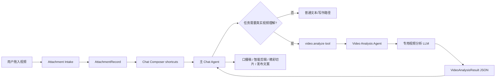

# 视频分析专用 LLM 与 Agent 架构计划

## 1. 结论

视频分析 LLM 不应该作为默认主聊天模型。

推荐架构是：

1. 主聊天模型继续负责对话、写作、规划、工具编排。
2. 视频文件通过 Attachment Intake 进入 app 可控暂存区。
3. 当任务需要理解视频真实内容时，主 agent 调用 `video.analyze`。
4. `video.analyze` 由锁定模型的 `Video Analysis Agent` 执行。
5. Video Analysis Agent 只输出结构化视频理解结果，不直接写最终稿件。
6. 主 agent 再基于结构化结果生成剪辑方案、口播稿、短文、脚本或 RedClaw 任务。

这条路径比“用户把当前聊天模型切到视频模型”更稳定。视频模型通常成本高、延迟高、上下文行为和写作能力也不一定适合作为主力模型；把它做成专用 worker 可以保持主对话快、便宜、可控。

## 2. 当前基础

当前附件链路已经具备以下基础：

- `chat:create-path-attachment` / `chat:create-inline-attachment` 能创建聊天附件。
- 附件会带 `kind`、`mimeType`、`workspaceRelativePath`、`toolPath`、`capabilities`、`deliveryPlan`。
- 前端快捷按钮已经可以根据 `capabilities` 判断是否显示视频相关动作。
- `main.rs` 的 interactive runtime 会根据 provider/model 能力决定是否直接嵌入附件。
- `workspace.read` 只适合文本文件；视频不能靠它兜底。

因此视频分析不应该继续塞进通用 `workspace.read` 说明里，而要成为明确的工具能力。

## 3. 方案对比

### 方案 A：让用户手动切换到视频模型

做法：

- 设置页里把支持视频输入的模型暴露为普通聊天模型。
- 用户需要分析视频时手动切换模型。

优点：

- 改动最小。
- 不需要新增 agent 或工具。

缺点：

- 用户必须知道哪个模型能看视频。
- 普通聊天也会被视频模型的成本和延迟拖慢。
- 主模型承担视频理解、写作、规划，职责混杂。
- 不适合 RedClaw/team 执行时自动选择视频分析能力。

结论：

- 只适合作为调试入口，不推荐作为正式产品路径。

### 方案 B：主 agent 直接上传视频给当前模型

做法：

- 如果当前模型支持视频输入，直接把视频作为 `input_attachment` 发给主 agent。

优点：

- 单轮链路短。
- 对支持 Gemini / Qwen-VL 等视频输入模型的用户体验直接。

缺点：

- 当前模型不支持视频时仍然需要 fallback。
- 主 agent prompt 会同时承担视频理解和最终产出，输出难以结构化复用。
- 大视频重复上传，成本不可控。
- 不适合后台任务缓存、复用和团队成员协作。

结论：

- 可以作为 `video.analyze` 内部的 fast path，不应作为唯一架构。

### 方案 C：专用 Video Analysis Agent

做法：

- 设置页单独配置视频分析模型。
- 主 agent 不直接消费视频二进制。
- 主 agent 只调用 `video.analyze`。
- `video.analyze` 调用锁定模型的 Video Analysis Agent。
- Video Analysis Agent 输出结构化 `VideoAnalysisResult`。

优点：

- 主聊天模型和视频模型职责分离。
- 可缓存分析结果，避免重复上传。
- 可在 RedClaw/team/subagent 中复用。
- 可按任务选择 `summary`、`shot_breakdown`、`highlight_clips`、`speech_extract`。
- 后续可扩展到图像分析、音频分析、文档解析的同构 worker。

缺点：

- 需要新增配置、工具、runtime 执行路径和结果缓存。

结论：

- 推荐作为正式方案。

## 4. 产品架构



### 4.1 Attachment Intake

入口：

- `desktop/src/pages/chat/useChatAttachments.ts`
- `desktop/src-tauri/src/commands/chat_sessions_wander.rs`

职责：

1. 接收拖入、文件选择、HTML5 fallback 上传。
2. 把视频文件放入 app 可控路径。
3. 生成稳定 `attachmentId`。
4. 生成 `toolPath`。
5. 标记 `capabilities.videoAnalyze = true`。
6. 标记 `capabilities.videoEdit = true`，但只有在后端存在真实视频处理工具时才展示剪辑类动作。

附件事实结构：

```ts
type AttachmentRecord = {
  attachmentId: string;
  type: "uploaded-file";
  name: string;
  kind: "video";
  mimeType: string;
  size: number;
  workspaceRelativePath: string;
  toolPath: string;
  localUrl?: string;
  originalAbsolutePath?: string;
  intakeStatus: "ready" | "unsupported" | "failed";
  capabilities: {
    directInput: boolean;
    workspaceRead: boolean;
    videoAnalyze: boolean;
    videoEdit: boolean;
    audioTranscribe: boolean;
  };
  deliveryPlan: {
    mode: "direct-input" | "media-tool" | "unsupported";
    toolPath?: string;
    requiresTool: boolean;
    reason?: string;
  };
};
```

### 4.2 设置页

新增一个独立设置区，放在 AI 设置里，不放到主聊天模型选择控件里。

字段：

```ts
type VideoAnalysisModelSettings = {
  enabled: boolean;
  sourceId: string;
  modelName: string;
  supportsDirectVideoInput: boolean;
  maxDirectVideoBytes: number;
  maxDirectVideoSeconds?: number;
  fallbackMode: "extract-frames-and-transcribe" | "reject";
};
```

UI 原则：

- 只显示必要字段。
- 默认关闭高级项。
- 不在聊天框里增加解释性文字。
- 如果没有配置视频分析模型，视频快捷按钮仍可出现，但点击后应提示需要配置视频分析模型，而不是让主 agent 假装分析。

### 4.3 主 Chat Agent

主 agent 的职责：

- 判断用户目标是否需要真实视频内容。
- 调用 `video.analyze`。
- 消费结构化结果。
- 生成最终面向用户的内容。

主 agent 不应该：

- 直接猜测视频内容。
- 直接读取视频二进制。
- 直接把视频当文本文件 `workspace.read`。
- 把视频分析模型临时当成主聊天模型。

主 agent prompt / runtime note 应增加约束：

```text
如果附件 deliveryPlan.mode 为 media-tool 且 kind 为 video，任务依赖视频真实内容时，必须调用 video.analyze。不能在未调用 video.analyze 或未获得 direct video input 结果前声称已经看过视频。
```

### 4.4 video.analyze 工具

新增 action：

```ts
type VideoAnalyzeInput = {
  attachmentId?: string;
  path: string;
  mode:
    | "summary"
    | "shot_breakdown"
    | "speech_extract"
    | "highlight_clips"
    | "talking_head_cut"
    | "smart_edit";
  instruction?: string;
  outputLanguage?: "zh-CN" | "en";
  maxClips?: number;
};
```

输出：

```ts
type VideoAnalysisResult = {
  success: boolean;
  analysisId: string;
  source: {
    attachmentId?: string;
    path: string;
    mimeType?: string;
    durationSec?: number;
  };
  summary: string;
  transcript?: string;
  scenes: Array<{
    startSec?: number;
    endSec?: number;
    title?: string;
    description: string;
    visualNotes?: string;
    speechNotes?: string;
    importance: number;
  }>;
  highlights: Array<{
    startSec?: number;
    endSec?: number;
    reason: string;
    suggestedUse: string;
  }>;
  editingSuggestions: string[];
  warnings: string[];
};
```

工具实现位置：

- `desktop/src-tauri/src/tools/catalog.rs`：注册 `video.analyze`。
- `desktop/src-tauri/src/tools/router.rs`：按 runtime mode 暴露。
- `desktop/src-tauri/src/tools/app_cli.rs` 或独立 `video_analysis.rs`：执行入口。
- `desktop/src-tauri/src/main.rs`：interactive runtime 工具分发接线。

### 4.5 Video Analysis Agent

这个 agent 是内部 worker，不需要先做成完整 UI 成员。

最小实现：

- `video.analyze` 内部调用一个专用 runtime 函数。
- runtime 使用设置页锁定的 provider/model。
- prompt 固定为视频分析员。
- 输出必须是 JSON。

后续扩展：

- RedClaw/team 需要时，把同一能力包装为 `Video Analyst` member。
- team member 只接任务，不直接控制 UI。

系统提示词边界：

```text
你是视频分析 worker。你只负责根据提供的视频和指令输出结构化分析结果。
不要写最终发布文案。
不要生成完整剪辑脚本，除非 mode 明确要求 smart_edit 或 talking_head_cut。
不要假设未看到的画面、声音或时间戳。
如果模型无法读取视频，必须输出 warnings。
输出严格 JSON，符合 VideoAnalysisResult。
```

## 5. 执行策略

### 5.1 Fast Path：模型支持视频直传

条件：

- 设置页启用了视频分析模型。
- 模型 profile 标记 `inputCapabilities` 包含 `video`。
- 文件大小 <= `maxDirectVideoBytes`。
- provider transport 支持视频附件。

执行：

1. `video.analyze` 读取 `toolPath`。
2. 构造 direct video input。
3. 调用视频分析模型。
4. 校验 JSON。
5. 写入 analysis cache。
6. 返回结构化结果给主 agent。

### 5.2 Fallback：抽帧 + 转写

条件：

- 视频模型未配置。
- 视频过大。
- provider 不支持视频直传。
- 用户仍然希望分析。

必须使用现成库：

- 视频元数据、抽帧、音轨抽取：`ffmpeg` / `ffprobe`。
- 音频转写：现有 transcription provider。
- PDF/Office 不走这里，继续走 document parse。

自研部分：

- frame sampling 策略。
- transcript + keyframes 合并 schema。
- VideoAnalysisResult normalizer。
- analysis cache。

fallback 流程：

1. `ffprobe` 获取 duration、fps、resolution。
2. 按时长抽关键帧：
   - <= 60s：每 5s 一帧，上限 16 帧。
   - 60s - 10min：按 scene/interval 混合抽帧，上限 32 帧。
   - > 10min：先转写，再按语义段落抽帧，上限 48 帧。
3. 抽音轨并走 transcription。
4. 将 transcript + frames 发给支持图片输入的模型分析。
5. 归一化成 `VideoAnalysisResult`。

## 6. 缓存与性能

缓存键：

```ts
type VideoAnalysisCacheKey = {
  fileHash: string;
  fileSize: number;
  mtimeMs?: number;
  mode: string;
  modelName: string;
  instructionHash: string;
};
```

缓存内容：

- `analysisId`
- `VideoAnalysisResult`
- provider request metadata
- warnings
- createdAt / updatedAt

性能策略：

1. 大文件不重复复制，优先 hard link，失败再 copy。
2. 同一个视频重复点击“智能剪辑”时复用缓存。
3. 抽帧产物放到 `.redbox/video-analysis-cache/`。
4. frame 上限和分辨率要可控，默认长边不超过 768px。
5. direct video input 设置大小上限，避免一次请求把 provider 打爆。
6. 分析任务用后台 job 状态，UI 不阻塞主聊天输入。
7. 失败结果短缓存 5 分钟，避免同一错误重复重试。

## 7. UI 行为

聊天框快捷按钮：

- 图片：继续走图片路线。
- 视频：
  - `剪口播`
  - `智能剪辑`
  - `提取精彩切片`
- 文件：
  - `变成口播稿`
  - `变成讲解漫画`
  - `做成AI视频`
  - `改写成短文`

视频快捷按钮的显示条件：

```ts
attachment.capabilities.videoAnalyze === true
```

`剪口播` / `智能剪辑` 的可执行条件：

```ts
attachment.capabilities.videoEdit === true
```

如果视频分析模型未配置：

- 不把一大段解释塞到输入框。
- 点击快捷按钮后给一个轻量错误提示：

```text
需要先配置视频分析模型。
```

如果视频已经分析过：

- 主 agent 应复用 analysis cache。
- UI 不需要额外暴露“缓存命中”，除非进入诊断模式。

## 8. Team / RedClaw 集成

第一阶段不直接做复杂 team member UI。

先落地：

```text
主 agent -> video.analyze -> Video Analysis Agent -> 结构化结果
```

RedClaw/team 后续接入：

- `Video Analyst` 作为内置成员。
- 成员能力声明：

```ts
type TeamMemberCapability = {
  id: "video-analysis";
  actions: ["video.analyze"];
  inputKinds: ["video"];
  outputKinds: ["video-analysis-result"];
};
```

RedClaw 任务拆解规则：

- 如果任务目标包含视频剪辑、视频复盘、视频切片，且附件包含 video，先分配 `Video Analyst`。
- `Video Analyst` 只产出分析结果。
- Writer / Editor / Director 再消费结果完成最终交付。

## 9. 安全与失败边界

必须阻止的行为：

- 模型未获得视频内容时声称已看过。
- 只有 `absolutePath` 没有 `toolPath` 时继续执行视频分析。
- 视频分析失败后主 agent 自动编造画面内容。
- 把超大视频无上限直接 base64 发给 provider。

失败输出：

```ts
type VideoAnalyzeFailure = {
  success: false;
  error: string;
  category:
    | "missing_video_model"
    | "unsupported_provider"
    | "file_unavailable"
    | "file_too_large"
    | "provider_error"
    | "invalid_json"
    | "fallback_failed";
  retryable: boolean;
};
```

## 10. 实施步骤

### Step 1：模型设置与 capability

文件：

- `desktop/shared/modelCapabilities.ts`
- `desktop/src/pages/settings/shared.tsx`
- `desktop/src/bridge/ipcRenderer.ts`
- `desktop/src-tauri/src/persistence/*`

内容：

- 增加 `videoAnalysisModelConfig`。
- 设置页增加视频分析模型选择。
- 模型 profile 支持 `inputCapabilities: ["video"]`。
- 保存设置后 runtime 可读取。

### Step 2：video.analyze action

文件：

- `desktop/src-tauri/src/tools/catalog.rs`
- `desktop/src-tauri/src/tools/router.rs`
- `desktop/src-tauri/src/tools/app_cli.rs`
- `desktop/src-tauri/src/main.rs`

内容：

- 注册 `video.analyze`。
- 输入输出 schema 严格定义。
- 工具只接受 app 可控路径。
- 工具输出 `VideoAnalysisResult` 或 `VideoAnalyzeFailure`。

### Step 3：Video Analysis Agent runtime

文件：

- `desktop/src-tauri/src/agent/*`
- `desktop/src-tauri/src/runtime/*`
- 可新增 `desktop/src-tauri/src/video_analysis/*`

内容：

- 锁定视频分析模型。
- 构造 direct video input。
- 校验 JSON 输出。
- 写入 cache。

### Step 4：fallback pipeline

文件：

- 可新增 `desktop/src-tauri/src/video_analysis/ffmpeg.rs`
- 可新增 `desktop/src-tauri/src/video_analysis/cache.rs`
- 复用现有 transcription 设置与调用。

内容：

- `ffprobe` 元数据读取。
- `ffmpeg` 抽帧和抽音轨。
- transcript + frames 分析。
- 输出归一化。

### Step 5：前端行为接入

文件：

- `desktop/src/pages/Chat.tsx`
- `desktop/src/components/ChatComposer.tsx`
- `desktop/src/pages/chat/useChatAttachments.ts`

内容：

- 快捷按钮触发的 prompt 指向 `video.analyze` 能力。
- 未配置视频模型时轻量提示。
- 已有 analysis cache 时无需额外 UI。

### Step 6：RedClaw/team 接入

文件：

- `desktop/src-tauri/src/subagents/*`
- `desktop/src-tauri/src/commands/chat_state.rs`
- `desktop/src-tauri/src/tools/router.rs`

内容：

- 将 `Video Analyst` 作为内置能力成员。
- RedClaw 任务带视频附件时优先调用 `video.analyze`。
- 不让 Video Analyst 直接写稿件或视频工程。

## 11. 验证矩阵

基础附件：

- 拖入 10MB mp4，生成 `toolPath` 和 `capabilities.videoAnalyze = true`。
- 拖入 600MB mp4，显示结构化失败，不发送给 LLM。
- 拖入视频后刷新页面，附件 draft 不丢失关键路径。

直传模型：

- 配置支持视频输入的 Gemini/Qwen-VL 类模型。
- 点击“智能剪辑”，确认 `video.analyze` 使用视频模型。
- 主聊天模型不切换。
- 返回 JSON 后主 agent 能生成剪辑方案。

不支持视频模型：

- 主模型不支持视频输入。
- 未配置视频分析模型。
- 点击视频快捷按钮时提示配置模型，不编造视频内容。

fallback：

- 禁用 direct video input。
- 有 `ffmpeg/ffprobe` 时走抽帧 + 转写。
- 无 `ffmpeg/ffprobe` 时返回 `fallback_failed`，主 agent 不编造结果。

缓存：

- 同一视频同一 mode 连续分析两次，第二次命中 cache。
- 修改 instruction 后重新分析。
- 换模型后重新分析。

Team：

- RedClaw 输入带视频附件和“提取精彩切片”目标。
- 先产出 `VideoAnalysisResult`。
- 后续 writer/editor 使用该结果生成交付。

## 12. 推荐落地顺序

优先做最小可用闭环：

1. `videoAnalysisModelConfig`
2. `video.analyze`
3. direct video input
4. JSON schema 校验
5. Chat 快捷按钮接入

随后补：

1. cache
2. fallback 抽帧 + 转写
3. RedClaw/team member 包装

不要一开始就把完整 team UI、长任务面板和视频编辑工程全部接入。先把“主 agent 能稳定调用专用视频模型并拿到结构化结果”跑通，这是整个架构的最小稳定内核。

## 13. 当前落地状态

已完成最小可用闭环：

- 设置页增加视频分析专用模型配置，可单独启用、选择来源和模型。
- 工具目录注册 `video.analyze`，主 agent 通过 `Operate(resource="video", operation="analyze", input=...)` 调用。
- `video.analyze` 锁定调用内部 `Video Analysis Agent`，不使用当前主聊天模型。
- 系统提示词明确要求：涉及视频真实内容时必须调用 `video.analyze`，由 `Video Analysis Agent` 专用角色 / subagent 执行分析。
- 视频附件的 runtime note 和聊天快捷按钮已经指向 `video.analyze`。
- `video.analyze` 已增加文件哈希 + mode + model + instruction 维度的本地结果缓存，避免同一视频同一分析重复上传。
- 当前直传 provider 先支持 Gemini 协议，后续再补 OpenAI 兼容视频输入和抽帧转写 fallback。

尚未完成：

- `ffmpeg` / `ffprobe` fallback。
- RedClaw/team 成员 UI 包装。
