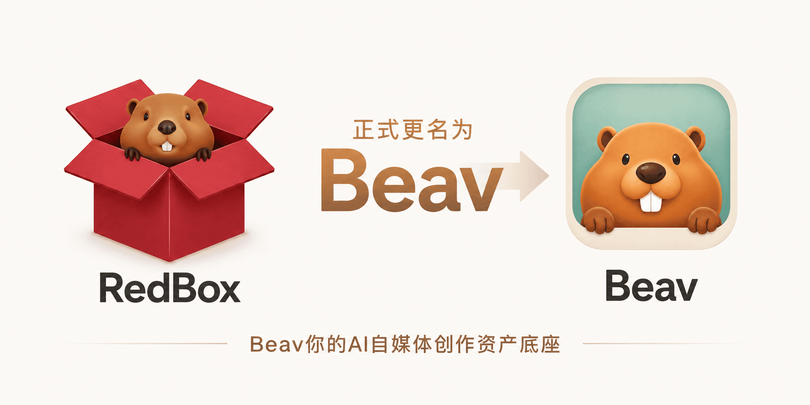

  

  <a href="./README.md">简体中文</a> · <strong>English</strong>

<h1 align="center">Beav</h1>

  <strong>An all-in-one AI content operations workspace, from trend capture to scheduled creation.</strong>

Local-first · Reusable sources · Bring your own model · macOS / Windows / Linux

  
  
  
  
  
  

  

  <a href="https://www.bilibili.com/video/BV12LNn6nEem/">Video Tutorial</a>

  

> RedBox is now **Beav**. Existing local data and workspaces are unaffected.

<strong>Join the discussion group</strong>

  

## Why this project?

- **Content work gets buried in sources:** operators review large volumes of material, track trends, and search for inspiration every day. AI can accelerate this work, but creators still need one purpose-built tool connecting capture, topic discovery, and creation.
- **General AI does not understand content assets:** tools such as Codex and Workbody focus on programming or general office work. They are not designed to serve as both a long-term source library and an ongoing creation workspace for content creators.

That is why Beav exists: to turn AI into a sustainable source library and operations workspace built for content creators.

## Workflow

| Operator workflow | Where to use it |
| --- | --- |
| **① Capture winners:** collect high-performing posts, videos, sources, and comments | Chrome / Edge extension |
| **② Discover topics with AI:** analyze comments, previous content, and related sources to generate the next topic list | Topic Center / Comment Insights |
| **③ Create automatically:** turn a topic into a brief, social post, short-video script, or voice-over script | RedClaw / Manuscripts |
| **④ Produce visuals:** generate covers, illustrations, product images, video, and audio | Generation Studio / Media Library |
| **⑤ Plan the calendar:** schedule work once, daily, on workdays, weekly, or at fixed intervals | Automation / Content Calendar |
| **⑥ Produce on schedule:** automatically advance topics, drafts, and visuals while preserving every output | Automation / RedClaw |

## Typical benefits

Based on real creator workflows; results vary by content type and depth of use.

| Benefit | Typical improvement | Why |
| --- | --- | --- |
| Source organization | Save about **2–3 hours per day** | Browser saves, screenshots, and scattered notes enter one structured library |
| Topic discovery | About **3–5× faster** | Comments, previous content, and related sources replace blank-page ideation |
| Content production cycle | About **50%–90% shorter** | Automation removes repetitive work between topics, scripts, sources, and final drafts |

## Feature matrix

Every capability below is implemented today.

| Capture & data | Insight & topics | Content creation | Visuals & media | Scheduling & automation |
| --- | --- | --- | --- | --- |
| ✅ High-performing video capture | ✅ Comment insights | ✅ Structured briefs | ✅ AI illustrations | ✅ Content calendar |
| ✅ Post / profile capture | ✅ Intelligent topics | ✅ Social posts / long-form | ✅ Product image sets | ✅ Once / daily / workdays |
| ✅ Batch / keyword capture | ✅ Topic Center | ✅ Short-video scripts | ✅ Social covers | ✅ Weekly / fixed intervals |
| ✅ Comment capture | ✅ Video transcription & summaries | ✅ Voice-over scripts / shots | ✅ Video clips | ✅ Scheduled creation |
| ✅ Web / WeChat / selections | ✅ Knowledge search | ✅ Titles / tags / CTAs | ✅ Digital human / audio | ✅ Execution status & outputs |
| ✅ Local files / folders | ✅ Account-specific context | ✅ Multi-platform publishing copy | ✅ Reusable people / products | ✅ Curated creator Skills with one-click install |
| ✅ Images / video / asset archives | ✅ Source-backed references | ✅ Editable manuscript projects | ✅ Reusable media library | ✅ External agent access |

## Screenshots

### Browser capture

### Knowledge

### Comment insights

## Quick start

1. Install Beav from the [download page](https://redbox.ziz.hk/download).
2. Create one workspace for an account or brand.
3. Open `Settings → AI` to use the official AI service or configure your own endpoint, API key, and model.
4. For browser capture, get the Chrome / Edge extension from the [latest Release](https://github.com/Jamailar/Beav/releases/latest).

## Trust and boundaries

- **Local-first:** sources, manuscripts, and projects are organized around local workspaces.
- **Model choice:** use the official AI service or an OpenAI-compatible provider.
- **Transparent releases:** installers, extensions, updater assets, and signatures are published through GitHub Releases.
- **Public boundaries:** review the license, [changelog](./CHANGELOG.md), [roadmap](./ROADMAP.md), and [Issues](https://github.com/Jamailar/Beav/issues).

## Agent integration

External agents such as Codex, Hermes, and OpenClaw can use the local ACP Agent Gateway to reuse Beav sessions, sources, task status, and manuscript references.

## Community

- [Website and downloads](https://beav.me/)
- [GitHub Releases](https://github.com/Jamailar/Beav/releases)
- [Issues](https://github.com/Jamailar/Beav/issues)
- [Bilibili video tutorial](https://www.bilibili.com/video/BV12LNn6nEem/)

Beav is independently developed and maintained by [JambaHailar](https://x.com/JambaHailar).

## License

[MIT License – Non-Commercial Use Only](./LICENSE). Commercial use requires prior written permission from the author.
